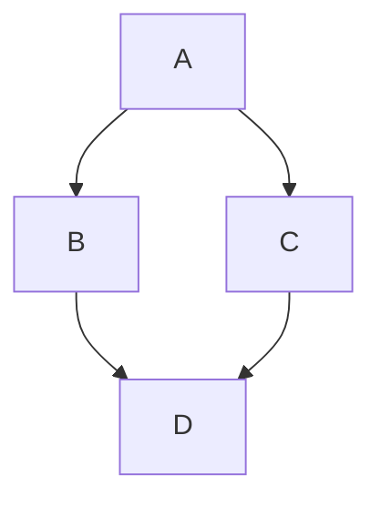

# Mermaid diagrams

GitHub renders Mermaid diagrams natively from a fenced code block tagged
`mermaid`. Works in issues, PRs, discussions, wikis, and `.md` files.

## High-level overview

- **Syntax:** Mermaid is a text-to-diagram language (flowcharts, sequence
  diagrams, class diagrams, Gantt charts, and 25+ more types).
- **On GitHub:** wrap the diagram source in a ```mermaid fence.
- **Not a GFM spec feature** — rendering is GitHub.com-only (and a few other
  forges support it too).

## Minimal example

````markdown
Here is a simple flow chart:


````

## Check GitHub's Mermaid version

Mermaid syntax drifts between versions; GitHub pins a specific Mermaid release.
Query the active version with an `info` diagram:

````markdown
```mermaid
  info
```
````

The response lists the version GitHub is currently running. Only use syntax
supported by that version — newer diagram types may fail to parse.

## This skill defers to `mermaid-diagram-generator`

This reference intentionally stays a **high-level overview**. For actually
authoring diagrams, load the **`mermaid-diagram-generator`** skill:

- It keeps a decision table mapping intent ("show relationships between teams",
  "project schedule", "root-cause analysis") to the right diagram type.
- It has **per-type reference files** with verified, version-gated syntax and
  pitfalls (escaping, reserved words, indentation-sensitive types).
- It ships a **validator** (`tools/validate-mermaid.mjs`) for checking diagrams
  before delivery.

**Workflow:** pick the type via that skill's decision table → read its matching
`references/<slug>.md` → write the diagram → validate if the tool is available
→ paste into the ```mermaid fence.

## Caveats

- Third-party Mermaid browser plugins can conflict with GitHub's rendering —
  prefer the built-in renderer.
- Beta/experimental diagram types may not parse on GitHub's pinned version;
  check the `info` output above first.
- GitHub renders the diagram only in rendered views — the raw source is what
  commit diffs and plain-text viewers show.