# mermaid-diagram-generator

Generates any Mermaid diagram type - flowchart through the newest beta and experimental
types - as markdown-embedded ` ```mermaid ` blocks or standalone `.mmd` / `.mermaid` files.
It writes for **Mermaid v12.0.0**, carries Mermaid 11 fallbacks for renderers that have not
caught up, and converts existing diagrams between the two.

## Contents

- [Quick start](#quick-start)
- [Renderers and Mermaid versions](#renderers-and-mermaid-versions)
- [Converting existing diagrams](#converting-existing-diagrams)
- [Updating](#updating)
- [Structure](#structure)
  - [Diagram type coverage (33)](#diagram-type-coverage-33)
- [Diagram glossary](#diagram-glossary)
- [Verification](#verification)

## Quick start

Ask, in the host conversation, for a diagram - the skill activates on requests like "draw a
flowchart for...", "sequence diagram of...", or "make a Mermaid diagram showing...". It will:

1. Match the request against the decision table in `SKILL.md` to pick a diagram type (asking
   first if 2-3 types plausibly fit).
2. Settle the target Mermaid version: from the renderer you name, or Mermaid 12 with the
   minimum version stated when you name none.
3. Read that type's `references/<slug>.md`, including its "v11 fallback" section, before writing
   any syntax.
4. Produce the diagram as a ` ```mermaid ` fenced block (the default when the target is a
   markdown document), a `.mmd` file (the default for standalone output), or a `.mermaid`
   file (when you name that extension).
5. State when the chosen type is beta or experimental, with its minimum Mermaid version.
6. Check the result against the self-check in
   [`references/general/authoring-rules.md`](references/general/authoring-rules.md).

## Renderers and Mermaid versions

Markdown renderers ship different Mermaid versions - GitLab 11.16.1, Obsidian 11.13.0, VS Code's
preview 11.17.0, GitHub and Azure DevOps unstated. The skill looks the version up in
[`references/general/renderers.md`](references/general/renderers.md) (dated, with the source for
each row) and compares it with the minimum version in the type's "v11 fallback" section. Two
types, use case and agentflow, exist only from Mermaid 12; for older renderers the skill delivers
the flowchart equivalent. What differs between the two majors is in
[`references/general/v11-compatibility.md`](references/general/v11-compatibility.md).

## Converting existing diagrams

Ask to upgrade or downgrade diagrams you already have, naming the files and the target ("convert
the diagrams in `docs/` to work on GitLab"). The skill converts each fenced block in place using
the per-type fallbacks, parse-checks every converted block against the target version, leaves
conversions that would lose meaning untouched, and reports each block as converted, unchanged, or
not converted with the reason. The procedure is
[`references/general/converting-diagrams.md`](references/general/converting-diagrams.md).

## Updating

Mermaid's documentation shifts between releases. To move the pinned version (`SKILL.md`
frontmatter):

1. Re-fetch each changed diagram's page and compare it with its `references/<slug>.md` - watch
   `keyword` (beta types add and drop the `-beta` suffix) and version gates called out mid-file.
2. Set `mermaid_version_verified` and `last_verified` in every file actually re-checked; do not
   bulk-update files you did not inspect.
3. Refresh the renderer table in `references/general/renderers.md` from its cited sources (the sources are collected in `research/mermaid-markdown-renderers-research.md`).
4. Re-run the verification below.

## Structure

```text
mermaid-diagram-generator/
├── SKILL.md                       # Entry point: steps, decision table, output patterns,
│                                  #   pointers to the general references
├── README.md                      # This file
├── tools/
│   ├── validate-mermaid.mjs       # Replayable validator (see tools/README.md)
│   ├── escaping-cases.mjs         # Escaping matrix data for --escaping
│   ├── escaping-baseline.json     # Recorded outcomes per Mermaid major version
│   └── README.md
├── research/                      # Dated primary-source notes behind the v12 update
│   ├── mermaid-v12-research.md    #   what changed in Mermaid 12, per type
│   └── mermaid-markdown-renderers-research.md  # Mermaid version per markdown renderer
└── references/
    ├── <slug>.md                  # One file per diagram type (33), each with frontmatter
    │                              #   (status, versions, keyword, source) and the same
    │                              #   11-section template, including "v11 fallback"
    └── general/
        ├── authoring-rules.md     # Escaping rules and the pre-delivery self-check
        ├── renderers.md           # Mermaid version per markdown renderer
        ├── v11-compatibility.md   # What differs between Mermaid 11 and 12
        ├── converting-diagrams.md # Batch upgrade / downgrade of existing diagrams
        ├── configuration.md       # Global config resolution order
        ├── directives.md          # %%{init: {...}}%% syntax
        ├── theming.md             # Themes, looks, themeVariables, restoring the v11 look
        ├── layout.md              # Layout engines (ELK, dagre, ...)
        ├── math.md                # KaTeX-based math rendering
        └── accessibility.md       # accTitle/accDescr, generated ARIA output
```

### Diagram type coverage (33)

| Status | Count | Types |
| --- | --- | --- |
| 🟢 Stable | 13 | flowchart, sequence, class, state, gitgraph, user-journey, gantt, pie, quadrant, requirement, mindmap, timeline, zenuml |
| 🟡 Beta | 17 | sankey, treemap, xy-chart, block, packet, kanban, architecture, radar, venn, ishikawa, wardley, cynefin, treeview, swimlanes, usecase, agentflow, railroad |
| 🔴 Experimental | 3 | entity-relationship, c4, event-modeling |

Every `references/<slug>.md` carries its own `status`, `mermaid_version_introduced`,
`mermaid_version_verified` and verified `keyword`. Statuses and keywords were confirmed against
the raw Mermaid documentation source and by parsing, so do not assume a type's `-beta` suffix
convention without checking its file (`sankey`, `xychart` and `block` dropped the suffix;
`venn-beta`, `ishikawa-beta`, `wardley-beta`, `usecase-beta`, `agentflow-beta` and every
`railroad-*-beta` keep it). Entity Relationship and Event Modeling carry no experimental banner
in the Mermaid documentation; the skill keeps them in the experimental tier deliberately, for
planning, and says so in their files.

## Diagram glossary

One example per diagram type, copied from that type's `references/<slug>.md` "Simple example"
section and validated with the rest of the skill (the validator scans this file too). Every block
parses under `--mode parse` against Mermaid 12.0.0; the v12-only blocks are gated out when the
validator runs against Mermaid 11.

### Stable

#### 🟢 Flowchart

**Use for:** Documenting a process, algorithm, or decision tree step by step. See [`references/flowchart.md`](references/flowchart.md) for full syntax, pitfalls, and a more complex example.

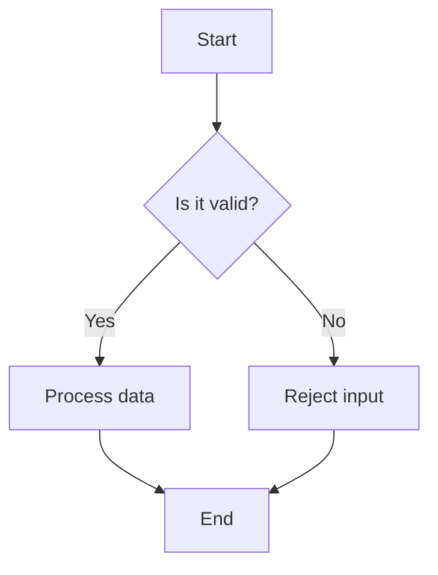

#### 🟢 Sequence

**Use for:** Documenting the order of calls or messages between services or actors. See [`references/sequence.md`](references/sequence.md) for full syntax, pitfalls, and a more complex example.

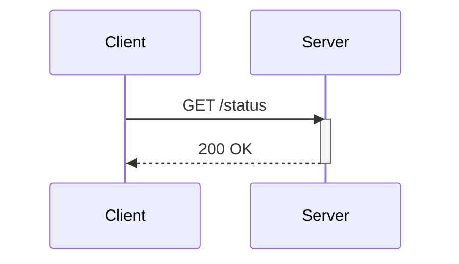

#### 🟢 Class

**Use for:** Documenting object-oriented type hierarchies and relationships between classes. See [`references/class.md`](references/class.md) for full syntax, pitfalls, and a more complex example.

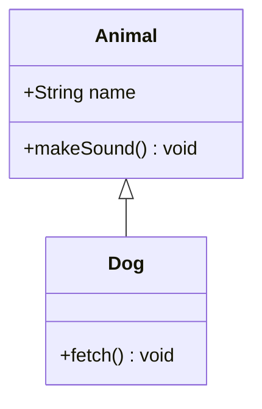

#### 🟢 State

**Use for:** Modeling a finite state machine's states and valid transitions. See [`references/state.md`](references/state.md) for full syntax, pitfalls, and a more complex example.

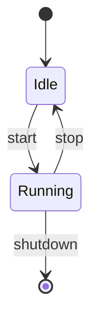

#### 🟢 GitGraph

**Use for:** Visualizing a repository's branching, merge, and commit history. See [`references/gitgraph.md`](references/gitgraph.md) for full syntax, pitfalls, and a more complex example.

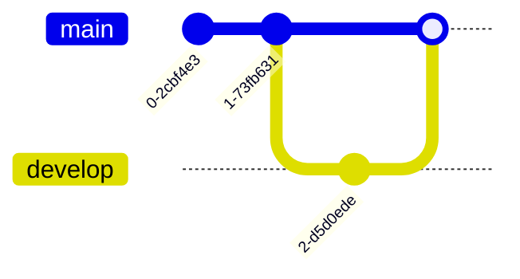

#### 🟢 User Journey

**Use for:** Visualizing satisfaction highs and lows across a user's path through a product. See [`references/user-journey.md`](references/user-journey.md) for full syntax, pitfalls, and a more complex example.

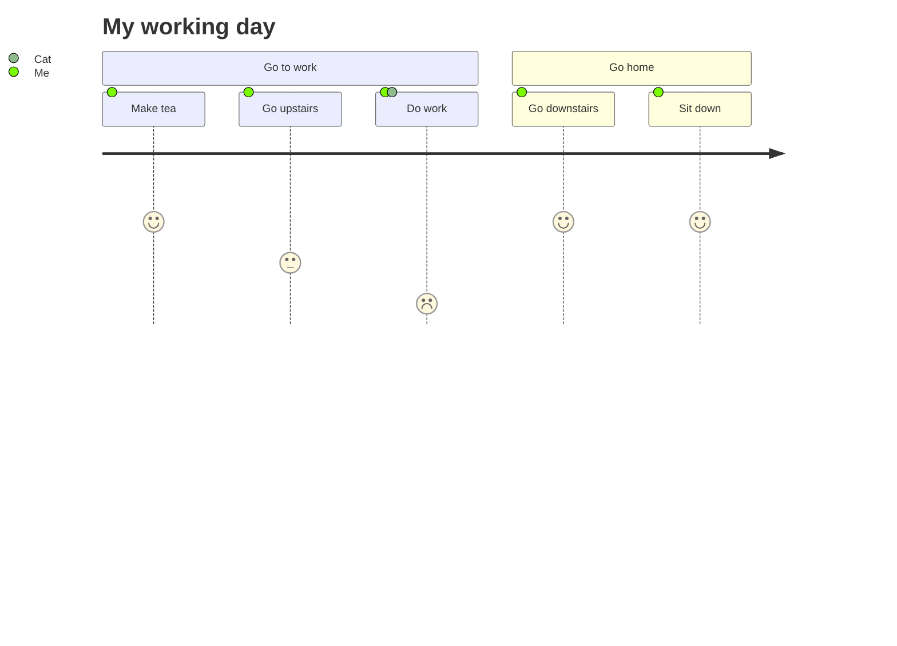

#### 🟢 Gantt

**Use for:** Project schedules where tasks have real dates/durations and dependencies. See [`references/gantt.md`](references/gantt.md) for full syntax, pitfalls, and a more complex example.

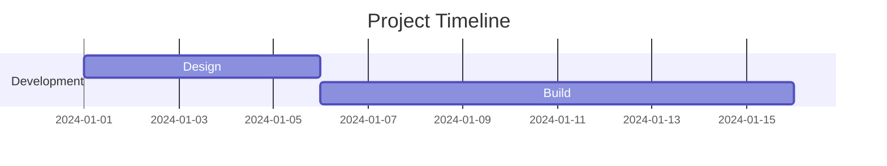

#### 🟢 Pie Chart

**Use for:** Showing relative share of a single total across a handful of categories. See [`references/pie.md`](references/pie.md) for full syntax, pitfalls, and a more complex example.

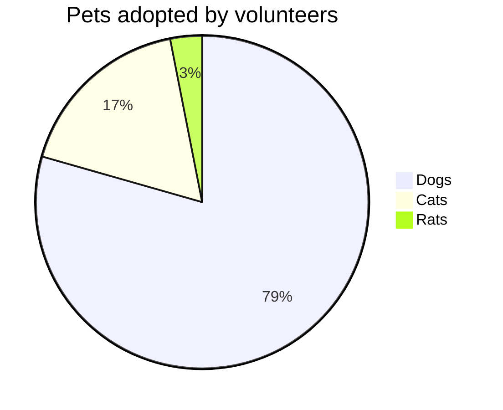

#### 🟢 Quadrant Chart

**Use for:** Prioritization matrices (Eisenhower grid, effort-vs-impact). See [`references/quadrant.md`](references/quadrant.md) for full syntax, pitfalls, and a more complex example.

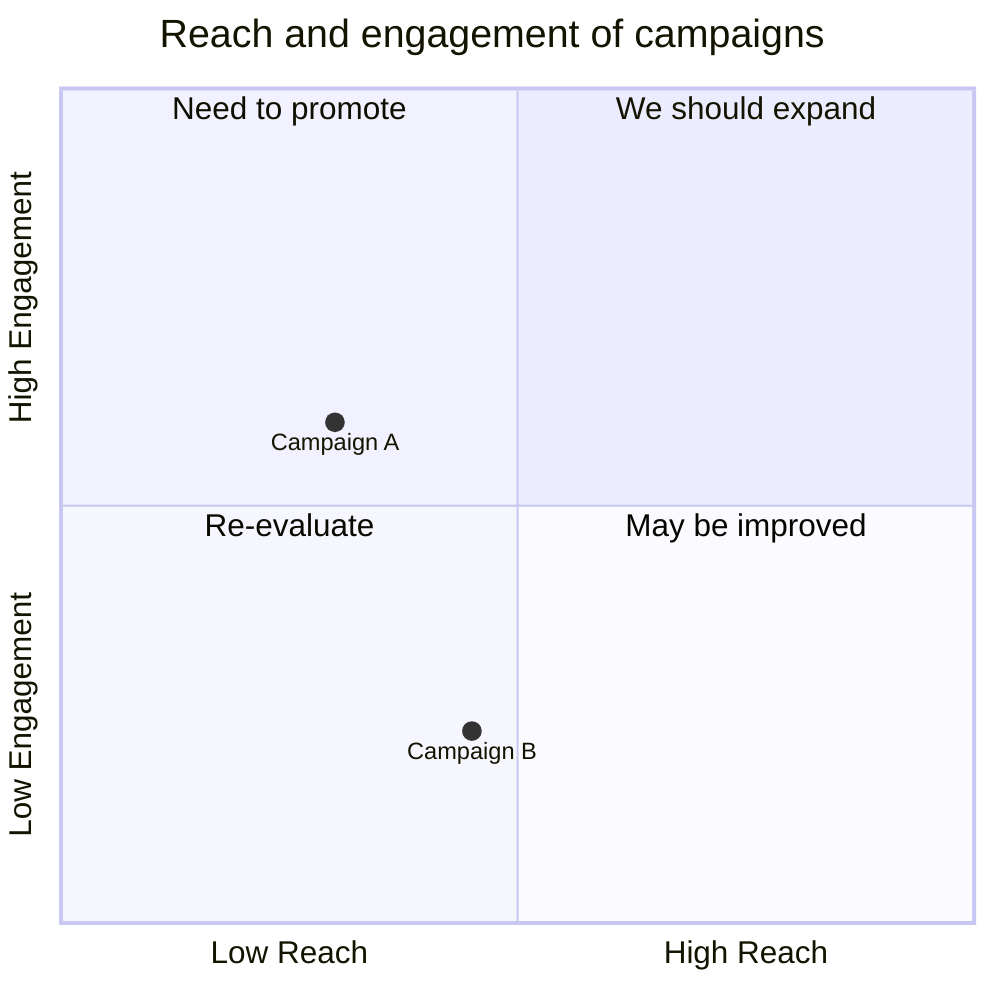

#### 🟢 Requirement

**Use for:** Tracing formal requirements to elements that satisfy or verify them. See [`references/requirement.md`](references/requirement.md) for full syntax, pitfalls, and a more complex example.

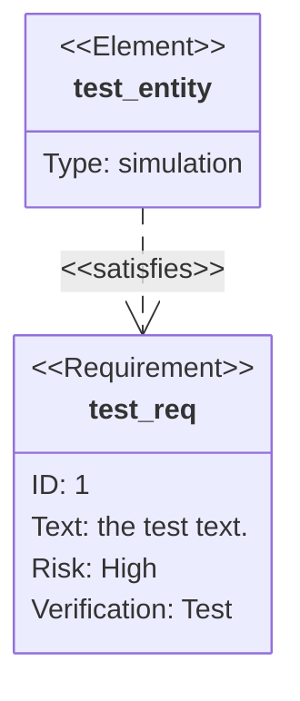

#### 🟢 Mindmap

**Use for:** Brainstorming or outlining ideas radiating from one central topic. See [`references/mindmap.md`](references/mindmap.md) for full syntax, pitfalls, and a more complex example.

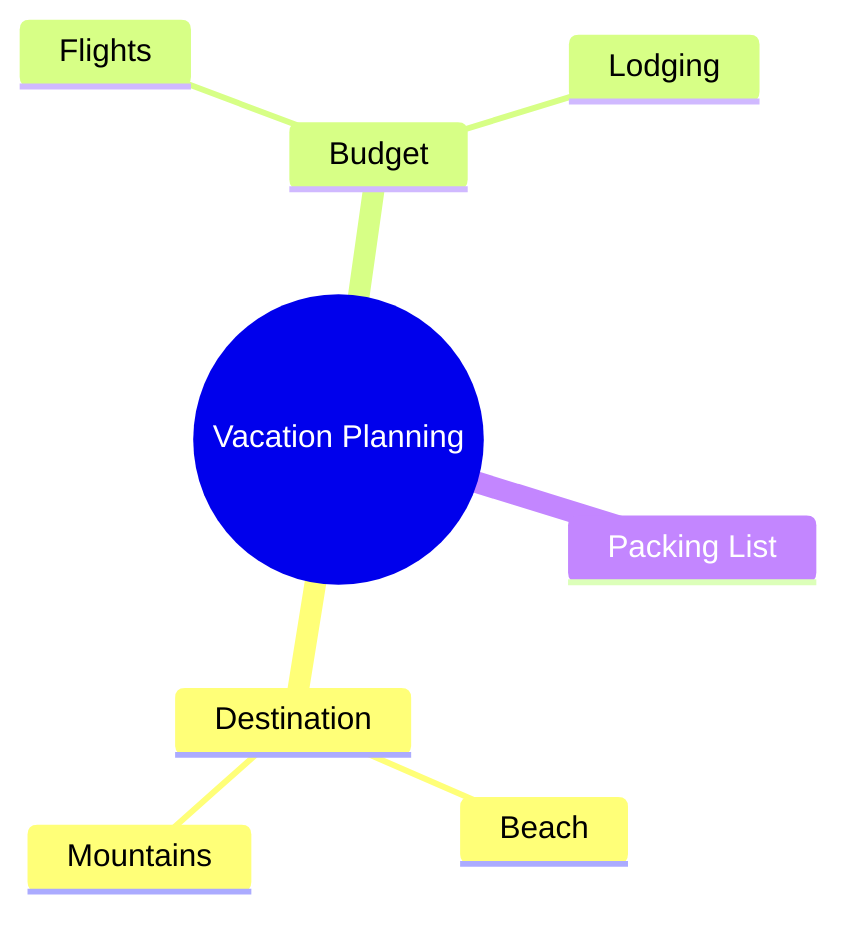

#### 🟢 Timeline

**Use for:** Telling a chronological story - history, milestones, eras. See [`references/timeline.md`](references/timeline.md) for full syntax, pitfalls, and a more complex example.

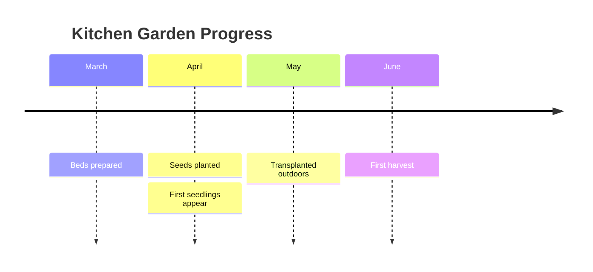

#### 🟢 ZenUML

**Use for:** Sequence diagrams where nested calls read like code (requires plugin). See [`references/zenuml.md`](references/zenuml.md) for full syntax, pitfalls, and a more complex example.

<!-- mermaid-validate: parse-only reason="the plugin is registered for --mode parse only" -->
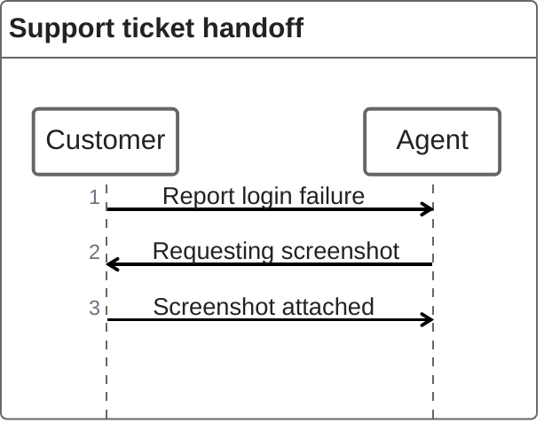

> ⚠️ Requires the `@mermaid-js/mermaid-zenuml` plugin to be registered before rendering - core Mermaid cannot parse this type at all otherwise. `tools/validate-mermaid.mjs` registers the plugin (1.0.1 for Mermaid 12, 0.2.3 for Mermaid 11) and confirms this example parses under `--mode parse`; `--mode render` (real browser) does not register it, so full SVG rendering is unverified by this skill's tooling. Any *other* consuming tool (GitHub, a docs site, etc.) needs to register the plugin itself too - see `references/zenuml.md` for that caveat.

### Beta

#### 🟡 Sankey

**Use for:** How a quantity splits, merges, or drains across stages (funnels, budgets, energy). See [`references/sankey.md`](references/sankey.md) for full syntax, pitfalls, and a more complex example.

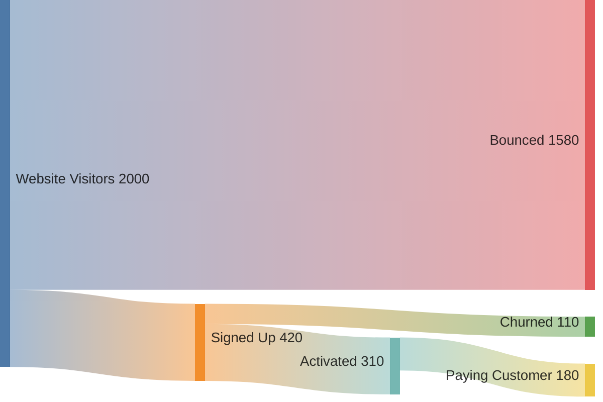

#### 🟡 Treemap

**Use for:** Part-to-whole proportions across a hierarchy. See [`references/treemap.md`](references/treemap.md) for full syntax, pitfalls, and a more complex example.

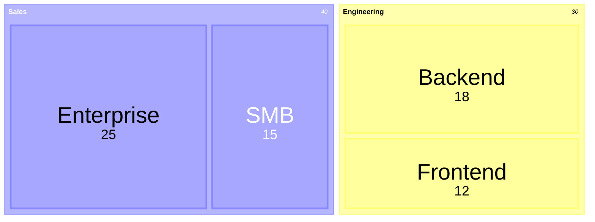

#### 🟡 XY Chart

**Use for:** Trends over time/ordered categories, line/bar/combo. See [`references/xy-chart.md`](references/xy-chart.md) for full syntax, pitfalls, and a more complex example.

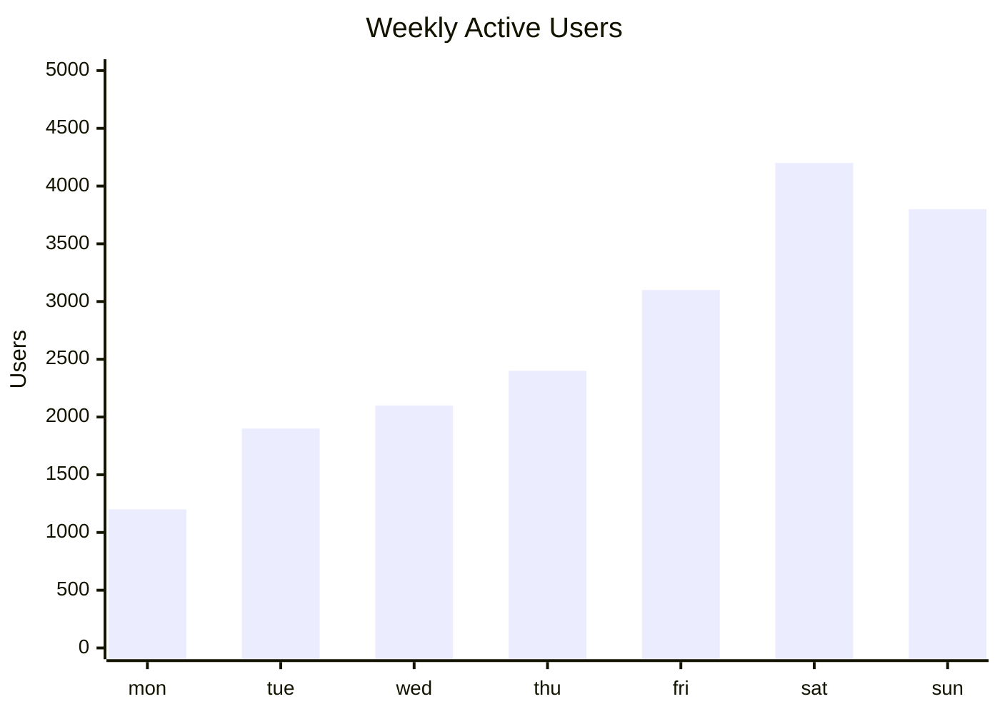

#### 🟡 Block

**Use for:** High-level architecture sketch where box position/grouping is intentional. See [`references/block.md`](references/block.md) for full syntax, pitfalls, and a more complex example.

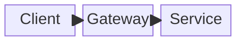

#### 🟡 Packet

**Use for:** Network protocol header layout, field-by-field, bit-accurate. See [`references/packet.md`](references/packet.md) for full syntax, pitfalls, and a more complex example.

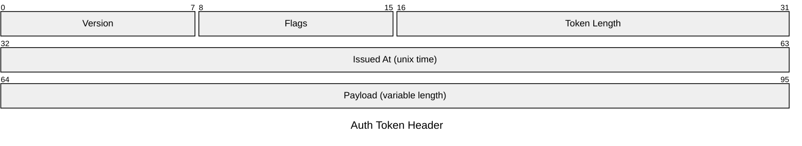

#### 🟡 Kanban

**Use for:** Snapshotting a team's current workflow state (Todo/In Progress/Done). See [`references/kanban.md`](references/kanban.md) for full syntax, pitfalls, and a more complex example.

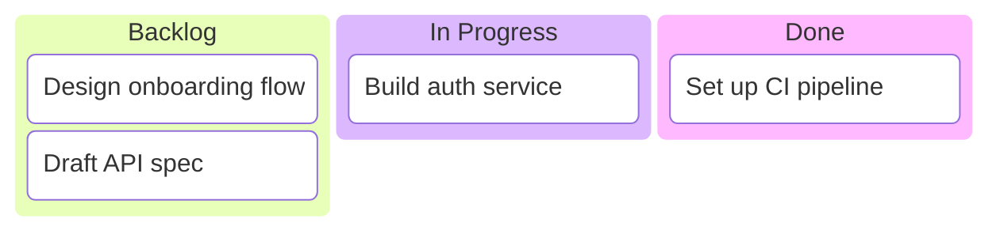

#### 🟡 Architecture

**Use for:** Cloud/CI-CD deployment topology - services, storage, connections. See [`references/architecture.md`](references/architecture.md) for full syntax, pitfalls, and a more complex example.

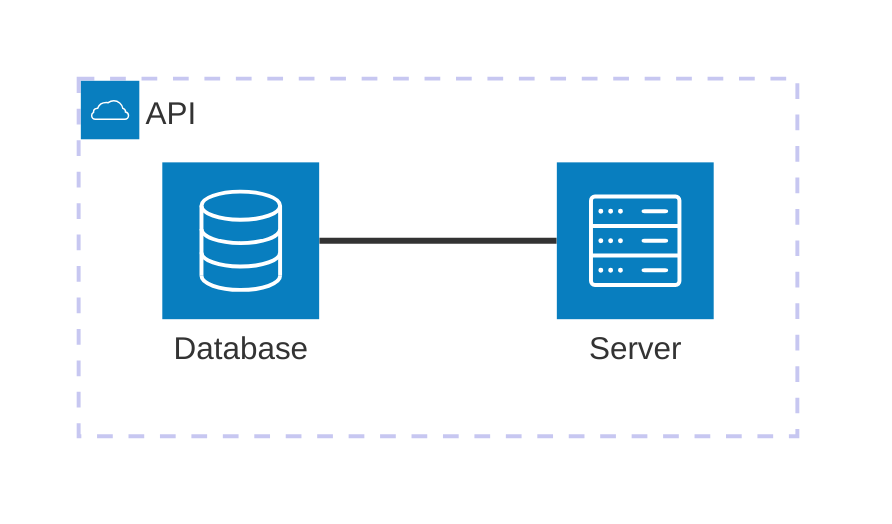

#### 🟡 Radar

**Use for:** Comparing multiple items across 3+ shared criteria. See [`references/radar.md`](references/radar.md) for full syntax, pitfalls, and a more complex example.

```mermaid
radar-beta
  title Skill Comparison
  axis speed["Speed"], power["Power"], defense["Defense"]
  axis stamina["Stamina"]

  curve hero["Hero"]{8, 6, 7, 9}
  curve rival["Rival"]{6, 9, 5, 6}

  max 10
```

#### 🟡 Venn

**Use for:** Showing which categories/groups share members. See [`references/venn.md`](references/venn.md) for full syntax, pitfalls, and a more complex example.

```mermaid
venn-beta
  title "Team overlap"
  set Frontend
  set Backend
  union Frontend,Backend["APIs"]
```

#### 🟡 Ishikawa

**Use for:** Root-cause analysis of a single defined problem or incident. See [`references/ishikawa.md`](references/ishikawa.md) for full syntax, pitfalls, and a more complex example.

```mermaid
ishikawa-beta
    Late Deployment
    Process
        No staging environment
        Manual approval bottleneck
    People
        Key reviewer on leave
```

#### 🟡 Wardley

**Use for:** Strategic value-chain mapping for build/buy/outsource reasoning. See [`references/wardley.md`](references/wardley.md) for full syntax, pitfalls, and a more complex example.

```mermaid
wardley-beta
title Coffee Shop Value Chain

anchor Customer [0.90, 0.90]
component Cup of Coffee [0.75, 0.65]
component Beans [0.55, 0.40]
component Roaster [0.35, 0.20]

Customer -> Cup of Coffee
Cup of Coffee -> Beans
Beans -> Roaster
```

#### 🟡 Cynefin

**Use for:** Classifying problems by how well-understood their cause-and-effect is. See [`references/cynefin.md`](references/cynefin.md) for full syntax, pitfalls, and a more complex example.

```mermaid
cynefin-beta
  title Incident Triage

  clear
    "Restart the service"
    "Apply documented fix"

  complicated
    "Escalate to on-call expert"

  complex
    "Run a small experiment"

  chaotic
    "Stop the bleeding first"
```

#### 🟡 TreeView

**Use for:** Rendering a file/folder structure or codebase layout. See [`references/treeview.md`](references/treeview.md) for full syntax, pitfalls, and a more complex example.

```mermaid
treeView-beta
    "my-project/"
        "src/"
            "index.js"
            "utils.js"
        "package.json"
        "README.md"
```

#### 🟡 Swimlanes

**Use for:** A process where step ownership matters as much as sequence. See [`references/swimlanes.md`](references/swimlanes.md) for full syntax, pitfalls, and a more complex example.

```mermaid
swimlane-beta LR
  subgraph Customer
    request[Request service]
    receive[Receive update]
  end

  subgraph Support
    triage[Triage request]
    answer[Send answer]
  end

  request --> triage
  triage -->|Known issue| answer
  answer --> receive
```

#### 🟡 Use Case

**Use for:** Showing which actors interact with a system's use cases, with system boundaries and include/extend relationships (Mermaid 12+). See [`references/usecase.md`](references/usecase.md) for full syntax, pitfalls, the flowchart fallback, and a more complex example.

<!-- mermaid-validate: since="12.0.0" -->
```mermaid
usecase-beta
direction LR
actor Customer("Customer")
systemBoundary "Order system"
  Checkout("Place order")
end
Customer --> Checkout
```

> ⚠️ Requires Mermaid 12.0.0 or later; older renderers fail with `No diagram type detected`. `references/usecase.md` gives the flowchart fallback.

#### 🟡 Agentflow

**Use for:** Documenting an agentic workflow - agents, the tasks and tools inside them, and how control and data move (Mermaid 12+). See [`references/agentflow.md`](references/agentflow.md) for full syntax, pitfalls, the flowchart fallback, and a more complex example.

<!-- mermaid-validate: since="12.0.0" -->
```mermaid
agentflow-beta TB
  flow reviewer["Review Agent"]
    changes["Gather changes"]@{ shape: input }
    analyse["Analyse diff"]@{ shape: task }
    lint["run_linter"]@{ shape: tool }
    ok["Clean?"]@{ shape: decision }

    changes --> analyse --> lint --> ok
  end
```

> ⚠️ Requires Mermaid 12.0.0 or later; older renderers fail with `No diagram type detected`. `references/agentflow.md` gives the flowchart fallback.

#### 🟡 Railroad

**Use for:** Drawing a language or protocol grammar (EBNF, ABNF, PEG) as railroad tracks (Mermaid 11.16+). See [`references/railroad.md`](references/railroad.md) for full syntax, pitfalls, and a more complex example.

```mermaid
railroad-ebnf-beta
title "Optional Sign"

sign = "+" | "-" ;
number = sign? digit+ ;
digit = "0" | "1" | "2" | "3" | "4" | "5" | "6" | "7" | "8" | "9" ;
```

### Experimental

#### 🔴 Entity Relationship

**Use for:** Sketching a database schema with tables and cardinalities. See [`references/entity-relationship.md`](references/entity-relationship.md) for full syntax, pitfalls, and a more complex example.

```mermaid
erDiagram
    CUSTOMER ||--o{ ORDER : places
    ORDER ||--|{ LINE-ITEM : contains
```

#### 🔴 C4

**Use for:** System architecture at context/container/component zoom using C4 vocabulary. See [`references/c4.md`](references/c4.md) for full syntax, pitfalls, and a more complex example.

```mermaid
C4Context
    title System Context for Internet Banking System

    Person(customer, "Customer", "A user of the bank's services")
    System(banking, "Internet Banking System", "Lets customers view balances and make payments")
    System_Ext(email, "E-mail System", "Sends transaction notifications")

    Rel(customer, banking, "Uses")
    Rel(banking, email, "Sends e-mail using")
```

#### 🔴 Event Modeling

**Use for:** Narrating a use case: user action → command → event(s) → read model. See [`references/event-modeling.md`](references/event-modeling.md) for full syntax, pitfalls, and a more complex example.

```mermaid
eventmodeling
tf 01 ui CartUI {select item}
tf 02 cmd AddItem {item id, quantity}
tf 03 evt ItemAdded {item id, quantity, cart id}
```

> ⚠️ Experimental - Mermaid's newest diagram type (v11.15.0+), so its syntax is more likely than stable types to change in a future release. It parses cleanly under `--mode parse` against the pinned version.

## Verification

```bash
# Structure + keyword + version checks (no dependencies; ~1s)
node tools/validate-mermaid.mjs --mode none

# Parse-only check (mermaid + jsdom; ~2-5s)
node tools/validate-mermaid.mjs --mode parse

# Full render validation (mermaid + puppeteer; ~15-25s)
node tools/validate-mermaid.mjs

# The same blocks against Mermaid 11, to check the fallbacks
node tools/validate-mermaid.mjs --mode parse --mermaid-version 11.16.1

# Replay the escaping matrix; reports drift from the recorded baseline
node tools/validate-mermaid.mjs --escaping
```

Needs Node 22.12 or later. All blocks pass under Mermaid 12.0.0 in parse and render modes, and under
11.16.1 with the six v12-only use case and agentflow blocks gated out; ZenUML's blocks are parse-only. See
[`tools/README.md`](tools/README.md) for usage, manual validation, per-block annotations and CI
integration.
