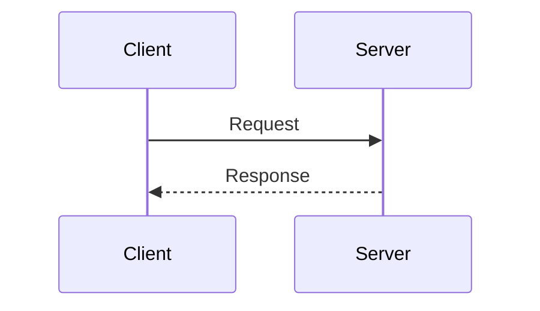

# Mermaid Diagram Generator

Generates any Mermaid diagram type against **Mermaid v12.0.0** syntax, with Mermaid 11 fallbacks for renderers that have not caught up. Cardinal rule: **read the matching `references/<slug>.md` before writing that diagram type's syntax** - never generate beta or experimental syntax from memory, since those are the types most likely to have drifted.

## Steps

1. **Resolve the diagram type** with the table below. If 2-3 types plausibly fit, name the candidates and ask the user to pick.
2. **Resolve the output format** (see "Output formats"); ask if the target isn't clear from context.
3. **Resolve the target Mermaid version.** If the user names where the diagram will display (GitHub, GitLab, Obsidian, ...), look its version up in `references/general/renderers.md`. If unnamed, write for Mermaid 12 and state the minimum version in the reply.
4. **Read `references/<slug>.md`**, including its "v11 fallback" section. If the target is older than a feature you need, use the fallback instead.
5. **Deliver only after** reading `references/general/authoring-rules.md` and answering yes to every item of its self-check (escaping, reserved words, closed blocks, version gates, validator run). This step is complete when each self-check item has an answer.

Always state when the chosen type is beta or experimental, with its minimum Mermaid version, before delivering it.

## Choosing a diagram type

Status: 🟢 stable · 🟡 beta (syntax may evolve) · 🔴 experimental (syntax and support may change more than beta).

| User says something like...                                                            | Type                                    | Reference                       |
| -------------------------------------------------------------------------------------- | --------------------------------------- | ------------------------------- |
| "brainstorm", "nested idea breakdown from one topic"                                   | 🟢 Mindmap                              | `mindmap.md`                    |
| "chronological history of events/eras"                                                 | 🟢 Timeline                             | `timeline.md`                   |
| "class structure", "OOP relationships", "interfaces/inheritance"                       | 🟢 Class                                | `class.md`                      |
| "classify a problem by how well-understood it is" (simple/complicated/complex/chaotic) | 🟡 Cynefin                              | `cynefin.md`                    |
| "cloud/CI-CD/service architecture, boxes + connections"                                | 🟡 Architecture                         | `architecture.md`               |
| "compare items across 3+ shared criteria", "spider/skills comparison"                  | 🟡 Radar                                | `radar.md`                      |
| "compare items on two axes", "prioritization/effort-vs-impact matrix"                  | 🟢 Quadrant                             | `quadrant.md`                   |
| "database schema", "tables and relationships"                                          | 🔴 Entity Relationship                  | `entity-relationship.md`        |
| "file/folder structure", "directory listing", "codebase layout"                        | 🟡 TreeView                             | `treeview.md`                   |
| "formal requirements traceability"                                                     | 🟢 Requirement                          | `requirement.md`                |
| "generic boxes-and-arrows infra sketch, position matters"                              | 🟡 Block                                | `block.md`                      |
| "git branch/commit/merge history"                                                      | 🟢 GitGraph                             | `gitgraph.md`                   |
| "grammar", "syntax diagram", "EBNF/ABNF/PEG rules"                                     | 🟡 Railroad                             | `railroad.md`                   |
| "how a quantity splits/merges/drains across stages" (funnels, budget, energy)          | 🟡 Sankey                               | `sankey.md`                     |
| "LLM/agent workflow", "agents, tools and tasks", "multi-agent pipeline"                | 🟡 Agentflow                            | `agentflow.md`                  |
| "narrate a use case as action → command → event → read model"                          | 🔴 Event Modeling                       | `event-modeling.md`             |
| "network packet/byte/header layout"                                                    | 🟡 Packet                               | `packet.md`                     |
| "numeric trend over time/categories", "bar+line combo chart"                           | 🟡 XY Chart                             | `xy-chart.md`                   |
| "part-to-whole across a hierarchy" (budget by dept by item, disk usage)                | 🟡 Treemap                              | `treemap.md`                    |
| "process where ownership/team/role matters per step"                                   | 🟡 Swimlanes (or Flowchart subgraphs)   | `swimlanes.md` / `flowchart.md` |
| "project schedule", "tasks over time with dependencies"                                | 🟢 Gantt                                | `gantt.md`                      |
| "proportion of a whole", "percentage breakdown"                                        | 🟢 Pie                                  | `pie.md`                        |
| "root-cause analysis", "fishbone diagram"                                              | 🟡 Ishikawa                             | `ishikawa.md`                   |
| "satisfaction/happiness across steps of an experience"                                 | 🟢 User Journey                         | `user-journey.md`               |
| "sequence diagram but nested calls read like code"                                     | 🟢 ZenUML (needs plugin)                | `zenuml.md`                     |
| "states a thing moves through", "state machine"                                        | 🟢 State                                | `state.md`                      |
| "steps in a process", "workflow", "decision logic", "algorithm"                        | 🟢 Flowchart                            | `flowchart.md`                  |
| "strategic value-chain / build-buy-outsource mapping"                                  | 🟡 Wardley                              | `wardley.md`                    |
| "system context/container/component diagram (C4-style)"                                | 🔴 C4                                   | `c4.md`                         |
| "task board", "Todo/In Progress/Done"                                                  | 🟡 Kanban                               | `kanban.md`                     |
| "UML use cases", "which actors can do what in a system"                                | 🟡 Use Case (Mermaid 12+)               | `usecase.md`                    |
| "which groups/categories share members"                                                | 🟡 Venn                                 | `venn.md`                       |
| "who calls whom, in order", "API call sequence", "message exchange"                    | 🟢 Sequence                             | `sequence.md`                   |

If a request plausibly matches 2-3 rows (e.g. "show relationships between teams" could be Flowchart with subgraphs, Swimlanes, or Class), name the candidates briefly and ask rather than picking silently.

## Output formats

**Pattern A - standalone `.mermaid` file.** Raw diagram source, starting directly with the diagram keyword, no code fence, no frontmatter of the markdown kind (a `---` config block belongs to the diagram itself). Use when the user names this extension or the project already uses it.

```
flowchart TD
    A[Start] --> B{Decision}
    B -->|Yes| C[Do thing]
    B -->|No| D[Skip]
```

**Pattern B - standalone `.mmd` file.** Byte-identical to Pattern A with a different extension - the common one for `mmdc` (mermaid-cli) and VS Code Mermaid tooling. **Default to `.mmd`** when the user wants a diagram as its own file and names no extension.

**Pattern C - markdown-embedded fenced block.** Inside a `.md` file, wrap with a ` ```mermaid ` fence. **Default to Pattern C** when the target is an existing or new markdown document. If the diagram must display a literal triple-backtick sequence, bump the _outer_ fence to four backticks.

````

````

## General references

Load only when the request calls for them; ordinary generation needs none of them except `authoring-rules.md` (step 5).

- `references/general/authoring-rules.md` - **every diagram, before delivery:** escaping rules and the self-check.
- `references/general/renderers.md` - the user names a display target, or a feature's minimum version matters: which Mermaid version each markdown renderer ships.
- `references/general/v11-compatibility.md` - the target runs Mermaid 11, or a diagram must work on both: what differs between 11 and 12, and the minimum-version index.
- `references/general/converting-diagrams.md` - the user asks to convert, upgrade or downgrade existing diagrams (batch workflow, with verification).
- `references/general/theming.md` - colors, themes, the neo/classic look, restoring the Mermaid 11 appearance, `themeVariables`.
- `references/general/layout.md` - layout engines (ELK, dagre, and others) and per-type applicability.
- `references/general/configuration.md`, `references/general/directives.md` - config resolution, site versus diagram-level overrides, `%%{init}%%` directives.
- `references/general/math.md`, `references/general/accessibility.md` - KaTeX math; `accTitle` / `accDescr`.
