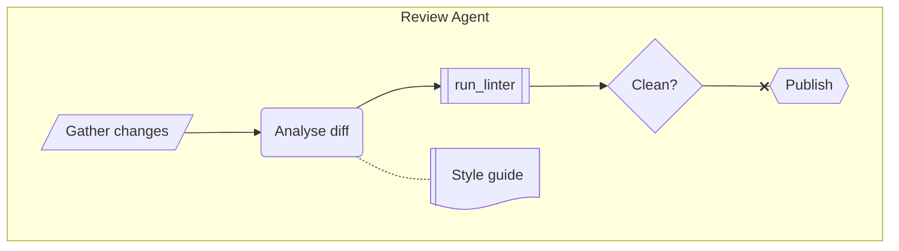

# Agentflow

> **Status:** Beta - introduced v12.0.0. The docs warn the syntax may change in a backwards-incompatible way before it is declared stable.

## Overview
An agentflow describes an agentic workflow: the agents that do the work, the flows they run, the tasks and tools inside those flows, and how control and data move between them. It keeps a flowchart's nodes, arrows and containers but adds meaning: a `task` is not a `tool` is not a `decision`, and an edge is a sequence, a reference, or a failure path. Non-visual detail (model, instruction, parameter and return types, connector) rides in `@{ ... }` metadata.

## Best-fit uses
- Documenting a multi-agent or tool-using LLM workflow: who does what, with which tool, under what contract
- Showing containers of work (a team, an agent) nested to any depth, with shared resources declared once

## When NOT to use this
- A plain process or algorithm with no agent/tool vocabulary - use `flowchart.md`
- The order of calls between services matters - use `sequence.md`
- The reader's renderer is older than Mermaid 12 - none of the markdown renderers in `general/renderers.md` is known to ship it - see "v11 fallback" below

## Basic syntax
Start with `agentflow-beta`, optionally followed by a direction (`TB`, `TD`, `BT`, `LR`, `RL`).

- **Node:** `id["Label"]`, shape chosen with `@{ shape: ... }`. Aliases: `task` (unit of work), `tool` (callable capability), `input` (data entering), `decision` (branch), `refdoc` (reference material), `action` (side-effecting step). Any canonical Mermaid shape name also works.
- **Edges:** `-->` sequence (control or data flows on), `-.-` reference (the source consults the target), `--x` failure (the failure path out of the source). Labels go mid-arrow: `check -- yes --> ship`. Chains work: `a --> b --> c`.
- **Container:** `flow id["Title"]` ... `end`; nests to any depth. A node referenced inside a container belongs to it.
- **`global` ... `end`:** declares nodes that stay top-level however they are referenced. Takes no id, label or metadata.
- **Collapse:** `containerId@{ view: "collapsed" }` folds a container to one summary node and keeps its boundary-crossing edges.
- **Metadata:** `id@{ key: value }` or a multi-line YAML block. Mermaid acts on `shape`, `label`, `labelType`, `view`, `algorithm` (per-container ELK), and for edges `curve`, `animate`, `animation`. Other keys (`description`, `instruction`, `model`, `params`, `returns`, `value`, `example`, `connectorRef`) are carried through untouched.
- **Connector:** `connector github["GitHub API"]`, configured with `github@{ protocol: "http", endpoint: "..." }`; a tool points at it with `connectorRef: "github.create_issue"`.
- **Config namespace:** `config: agentflow: { nodeSpacing, rankSpacing, diagramPadding, titleTopMargin, useMaxWidth }`.

## Simple example
<!-- mermaid-validate: since="12.0.0" -->
```mermaid
agentflow-beta TB
  flow reviewer["Review Agent"]
    changes["Gather changes"]@{ shape: input }
    analyse["Analyse diff"]@{ shape: task }
    lint["run_linter"]@{ shape: tool }
    ok["Clean?"]@{ shape: decision }

    changes --> analyse --> lint --> ok
  end
```
One agent container holding an input, a task, a tool call and a decision, chained in order.

## Complex example
<!-- mermaid-validate: since="12.0.0" -->
```mermaid
agentflow-beta TB
  connector llm["LLM API"]
  llm@{ protocol: "http", endpoint: "https://api.example.com/chat" }

  global
    style_guide["Style guide"]@{ shape: refdoc }
  end

  flow coffee_team["Coffee Team"]
    city["city"]@{ shape: input, value: "Stockholm" }

    flow researcher["Researcher"]
      research["research_location"]@{ shape: tool, params: "city :: String", returns: "Report" }
      write["write_copy"]@{ shape: tool, connectorRef: "llm.chat", returns: "CoffeeCopy" }
      city --> research --> write
      write -.- style_guide
    end
    researcher@{ instruction: "Research the city and draft English coffee copy citing sources." }

    flow designer["Designer"]
      render["generate_html"]@{ shape: tool, connectorRef: "llm.chat", returns: "String" }
      render -.- style_guide
    end

    researcher --> designer
  end
```
A connector, a shared `global` reference document, two nested agent containers with typed tools, agent-level instruction metadata, and reference edges into the shared document.

## Escaping & special characters
- Node labels are quoted strings (`["..."]`); YAML metadata values follow YAML quoting, so quote any value containing `:` or `#` - `params: "city :: String"`.
- `__proto__`, `constructor` and `prototype` metadata keys are stripped at every nesting level.
- Unknown metadata keys are preserved, never rejected, so a typo in a key name does not error - check spelling of `shape`, `view`, `connectorRef`.
- A `connectorRef` may be a bare node id, a dotted `connector.capability`, or a URL; the dotted and URL forms are opaque.
- **Tested (Mermaid 12.0.0):** Quote node labels (`a["text"]`); the only character that still needs an escape inside the quotes is `"`, written `#34;`.

## Common pitfalls
- [ ] Is every `flow` closed with `end`, and every `global` closed with `end`?
- [ ] Is a shared node declared inside `global` so it is not pulled into the first flow that mentions it?
- [ ] Is each edge the right operator: `-->` sequence, `-.-` reference, `--x` failure? A reference edge passes no control.
- [ ] Does a `connectorRef` name a declared connector (dotted form `connector.capability`)?
- [ ] Is `view: "collapsed"` applied to a container id, not a plain node?
- [ ] Does the target renderer know `agentflow-beta`? If not, deliver the flowchart form.

## v11 fallback
The type does not exist below v12.0.0; older renderers fail with `No diagram type detected`. Deliver a `flowchart.md` diagram instead:

| Agentflow element | Flowchart equivalent |
| --- | --- |
| `flow id["T"]` ... `end` | `subgraph id ["T"]` ... `end` |
| `task` | `id("Label")` |
| `tool` | `id[["Label"]]` |
| `input` | `id[/"Label"/]` |
| `decision` | `id{"Label"}` |
| `refdoc` | `id@{ shape: lin-doc, label: "Label" }` |
| `action` | `id{{"Label"}}` |
| `-->` sequence | `-->` |
| `-.-` reference | `-.-` |
| `--x` failure | `--x` |

<!-- mermaid-validate: keyword-exempt reason="v11 fallback: a flowchart, not an agentflow-beta diagram" -->


Metadata (`model`, `instruction`, `params`, `returns`, `connectorRef`) has no flowchart equivalent; put it in node labels or in prose beside the diagram. Default appearance: `neo` look, `redux-color` theme and ELK layout in v12.

## Beta/experimental caveats
Agentflow is beta as of v12.0.0 and the docs warn of backwards-incompatible changes. Tell the user the diagram requires Mermaid 12.0.0 or later, that none of the markdown renderers in `general/renderers.md` is known to ship it yet, and offer the flowchart form for anything older.

## Further reading
- https://mermaid.js.org/syntax/agentflow.html
