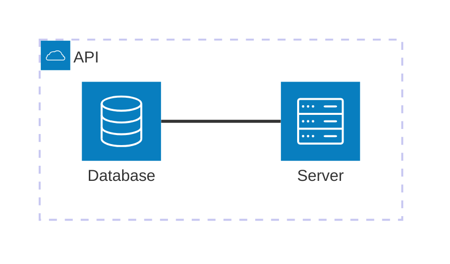
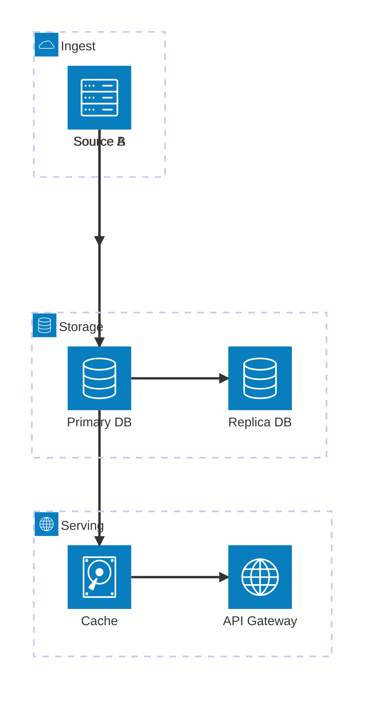

# Architecture

> **Status:** Beta - introduced v11.1.0. Syntax may evolve; treat generated diagrams of this type as more likely to need adjustment than stable types.

## Overview
An architecture diagram shows how services and resources (databases, servers, storage, cloud endpoints) connect to each other, optionally clustered into groups that mirror how a system is organized - a VPC, an API layer, a subnet. Nodes are drawn as icon-labeled boxes and edges attach to a specific side (top/bottom/left/right) of each node, so the layout reads like a real infrastructure or deployment diagram rather than an abstract graph.

## Best-fit uses
- Cloud/CI-CD deployment topology: services, storage, and their connections
- Grouping related infrastructure components (e.g. everything inside one VPC or one API group)
- Diagrams where icon identity (database vs. server vs. cloud) carries meaning at a glance

## When NOT to use this
- You need generic boxes-and-arrows process flow without a physical/infra framing - use `flowchart.md`
- You're documenting software structure (classes, containers, code modules) rather than deployed infrastructure - use `c4.md` or `class.md`
- Node icons and side-based edges aren't relevant to what you're showing - a plain `flowchart.md` is simpler to read

## Basic syntax
Start with `architecture-beta`. Three building blocks - groups, services, edges - plus optional junctions, and each identifier must be declared before it's referenced by an edge or nesting.

- **Group:** `group <id>(<icon>)[<Title>]` - optionally `in <parentGroupId>` to nest inside another group.
- **Service:** `service <id>(<icon>)[<Title>]` - optionally `in <groupId>` to place it inside a group.
- **Edge:** `<idA>:<Side> <connector> <Side>:<idB>` - a side letter (`T`op/`B`ottom/`L`eft/`R`ight) is glued to each id with a colon, joined by `--` (plain line) or `-->` (arrow). Example: `db:L -- R:server`.
- **Junction:** `junction <id>` - a passthrough point that lets more than two edges meet at one spot (a 4-way split), optionally `in <groupId>`.
- **Alignment (v11.16.0+):** `align row <id> <id> ...` / `align column <id> <id> ...` - forces the listed services to share a row or column coordinate, useful when edge routing alone doesn't produce the layout you want.

Built-in icons: `cloud`, `database`, `disk`, `internet`, `server`. Custom icons come from iconify.design, referenced as `<prefix>:<icon-name>` (e.g. `logos:aws-lambda`) in place of a built-in icon name.

## Simple example

A group labeled "API" contains a database and a server; a plain (non-arrowed) edge connects the database's right side to the server's left side.

## Complex example

Two ingest sources fan into a junction before reaching a primary database, which replicates and also feeds a cache in front of an API gateway. The junction acts as a 4-way split point where multiple edges can converge or diverge. For fine-grained control over node positioning (v11.16.0+), the `align row` / `align column` directives can be appended to pin services to the same horizontal or vertical coordinate line; see "Basic syntax" and "Common pitfalls" for guidance on using them.

## Escaping & special characters
- Titles inside `[...]` support plain text; avoid unescaped `]` inside the label since it closes the bracket.
- Identifiers (the part before `(...)`) should stay alphanumeric/underscore - keep spaces and punctuation inside the `[Title]` portion, not the id.
- Iconify icon references use a literal colon (`prefix:icon-name`) - don't quote it, and don't confuse it with the `id:` side syntax used in edges.
- Inside a ```mermaid fence, no extra escaping is needed beyond avoiding literal triple backticks in titles.
- **Tested (Mermaid 12.0.0 and 11.16.1):** Write labels as `service id(icon)["text"]`; the unquoted `[text]` form cannot contain `[` or `]`. Named codes (`#quot;`) are not decoded here; use numeric ones.

## Common pitfalls
- [ ] Is every group/service/junction declared before it's referenced by `in` or by an edge?
- [ ] Does each edge specify a side (`T`/`B`/`L`/`R`) on both ends, not just one?
- [ ] Did you use `--` for a plain connector and `-->` only where you actually want an arrowhead?
- [ ] Are nested groups using `in <parentId>` rather than indentation alone (indentation is cosmetic, not structural)?
- [ ] If a layout looks wrong, have you tried `align row`/`align column` (v11.16.0+) rather than fighting edge order? Note: syntax is `align row id1 id2 id3` (space-separated), not keyword arguments - the docs' `{idA}` notation is just a template placeholder.
- [ ] Are custom icon names valid `prefix:name` iconify references, not bare icon names?

## v11 fallback

- **`align row|column`** needs v11.16.0+. On older renderers drop the `align` lines and steer layout with edge order.

## Beta/experimental caveats
Architecture diagrams are beta as of v11.1.0; the `align` statement is newer still (v11.16.0+) and may see further layout-affecting changes. When delivering this diagram type, note it requires Mermaid v11.1.0 or later (v11.16.0+ if `align` is used), and that edge-routing/layout behavior is more likely to shift between releases than in stable diagram types.

## Further reading
- https://mermaid.js.org/syntax/architecture.html
