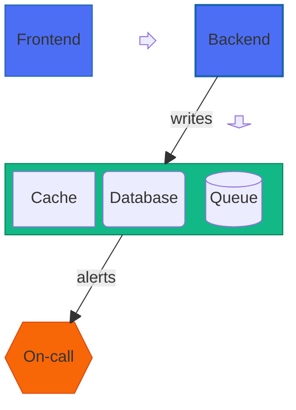

# Block

> **Status:** Beta - introduced v10.8.0. Syntax may evolve; treat generated diagrams of this type as more likely to need adjustment than stable types.

## Overview
A block diagram lays out labeled boxes on an explicit grid the author controls directly, rather than letting an auto-layout engine decide positions the way a flowchart does. Blocks can span multiple columns, nest inside each other to form composite boxes, and connect with simple arrows - making it well suited to hand-placed system sketches where the layout itself carries meaning.

## Best-fit uses
- High-level architecture or infrastructure sketches where box position/grouping is intentional, not auto-derived
- Layered/tiered diagrams (network stacks, request pipelines) that benefit from an explicit column grid
- Composite/nested components (a service containing sub-services) drawn as boxes-within-boxes

## When NOT to use this
- The diagram needs automatic layout of an arbitrary graph with many crossing edges - `flowchart.md` handles that layout problem for you
- You specifically need C4-style architecture semantics (containers, systems, people) - a dedicated architecture or C4 diagram communicates that vocabulary more precisely
- The relationships matter more than the spatial arrangement - a flowchart's auto-routed edges usually read clearer for relationship-heavy graphs

## Basic syntax
Start with `block`. Blocks are declared by writing their id (optionally followed by a label in brackets); blocks separated by whitespace on one line sit side-by-side.

- **Columns:** `columns <n>` sets how many blocks fit per row; extra blocks wrap to the next row.
- **Width:** `id:<n>` makes a block span `n` columns.
- **Composite (nested) blocks:** `block:<id>` … `end` groups child blocks inside a labeled container; add `:<n>` for width (`block:<id>:<n>`) and an inner `columns <n>` line to control the nested grid.
- **Spacing:** `space` (one empty column) or `space:<n>` (n empty columns) - deliberate gaps in the grid.
- **Shapes:** the block equivalents of flowchart node shapes - `id("text")` round, `id(["text"])` stadium, `id[["text"]]` subroutine, `id[("text")]` cylinder/database, `id(("text"))` circle, `id((("text")))` double circle, `id{"text"}` rhombus, `id{{"text"}}` hexagon, `id>"text"]` flag/odd shape, `id[/"text"/]` / `id[\"text"\]` parallelogram, `id[/"text"\]` / `id[\"text"/]` trapezoid.
- **Block arrows:** `id<["Label"]>(direction)` - a directional arrow-shaped block, `direction` one of `right`, `left`, `up`, `down`, `x`, `y`, or a combo like `x, down`.
- **Edges:** `A --> B` (arrow) or `A --- B` (line), with optional text: `A -- "label" --> B`.
- **Styling:** `style <id> <css-properties>` for one block, or `classDef <name> <css-properties>` plus `class <id> <name>` to share styling.
- **Comments:** `%% comment`.

## Simple example

Three blocks are placed in a single row via `columns 3`, then connected left-to-right with two arrows describing a request path.

## Complex example

A three-column grid places `Frontend` and `Backend` with a block arrow between them, a `down`-pointing block arrow beneath (offset with `space:2`), and a composite block `Storage` spanning all three columns and containing its own three-column sub-grid of differently-shaped children (`Cache` default box, `DB` rounded, `Queue` cylinder). A further `space:3` row makes room for an `Ops` hexagon block below. `classDef`/`class` share styling across `Frontend`/`Backend`/`Storage`/`Ops`, two labeled edges connect `Backend` to `Storage` and `Storage` to `Ops`, and one `style` line overrides `Backend` individually on top of its class.

## Escaping & special characters
- Block/shape labels containing spaces, punctuation, or characters that look like syntax (`(`, `[`, `:`) should be wrapped in double quotes inside their shape brackets, e.g. `id["A wide one in the middle"]`.
- A block id and its label are independent - `id["label"]` - so an id can stay a short token even when the visible label is long or punctuated.
- Composite blocks require a matching `end` for every `block:<id>` - an unmatched `end` (or a missing one) breaks parsing of everything after it.
- Inside a ```mermaid fence in markdown, indentation used for readability around `block:`/`end` is cosmetic (not load-bearing like mindmap's), but keep it consistent for your own clarity.
- **Tested (Mermaid 12.0.0 and 11.16.1):** Quote block labels (`a["text"]`); the only character that still needs an escape inside the quotes is `"`, written `#34;`.

## Common pitfalls
- [ ] Does every `block:<id>` have a matching `end`?
- [ ] Are two blocks meant to sit apart on the same row separated by an explicit `space` (or `space:n`), not just left unconnected?
- [ ] Do bracket pairs match for the shape you intended - parallelogram (`[/"..."/]` vs `[\"..."\]`) and trapezoid use opposite-leaning slashes and are easy to swap?
- [ ] Is `columns <n>` declared before the row of blocks it should apply to (it affects everything after it until changed)?
- [ ] For block arrows, is the direction one of the documented tokens (`right`, `left`, `up`, `down`, `x`, `y`, or a comma combo like `x, down`)?
- [ ] If a block spans columns via `id:<n>`, does `<n>` fit within the grid's declared `columns` count?

## v11 fallback

No syntax differences. Every example in this file parses and renders on both Mermaid 12.0.0 and 11.16.1.

## Beta/experimental caveats
Requires Mermaid v10.8.0 or later; this version was not stated on the doc page itself and is cross-referenced from the mermaid-js/mermaid GitHub release notes ("Adding new diagram type - Block Diagram"). The doc page itself carries no explicit "experimental" warning banner (unlike Sankey/Treemap), but block diagrams remain newer and less battle-tested than flowchart/sequence - expect possible shape or layout-option changes on future upgrades. Note that the canonical keyword confirmed across every example on the current doc page is plain `block`, not `block-beta` (the `-beta` form is still accepted as a legacy alias per the diagram detector in the mermaid-js/mermaid source, but isn't what the docs themselves use).

## Further reading
- https://mermaid.js.org/syntax/block.html
