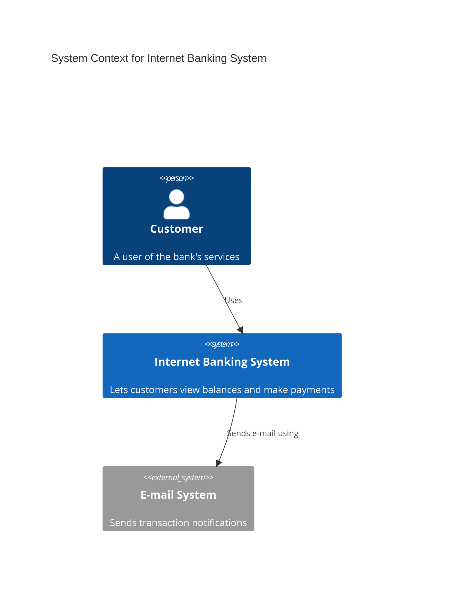
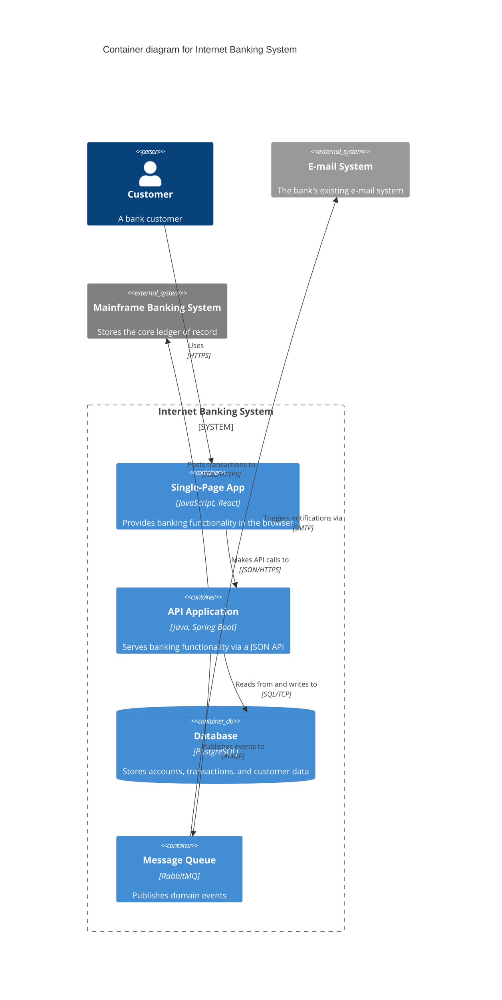

# C4 Diagram

> **Status:** Experimental - the Mermaid docs state plainly: "This is an experimental diagram for now. The syntax and properties can change in future releases." Treat generated diagrams of this type as more likely to need adjustment than stable types.

## Overview
C4 diagrams implement the C4 model (Context, Container, Component, Code) for describing software architecture at successive levels of zoom, using a PlantUML-compatible statement syntax. Mermaid supports the top four levels plus a dynamic-interaction variant - Context, Container, Component, and Dynamic - along with a Deployment variant for infrastructure mapping. Each level is its own diagram type with its own starting keyword rather than one keyword with a "level" parameter.

## Best-fit uses
- Documenting system architecture at a chosen zoom level (context, containers, or components) using the well-known C4 vocabulary
- Onboarding material that shows how a system fits among external actors and other systems (Context) or how its internal containers talk to each other (Container)
- Porting an existing PlantUML C4 diagram into Mermaid with minimal rewrites
- Illustrating deployment topology (nodes, containers-on-nodes) with `C4Deployment`

## When NOT to use this
- A lightweight, general-purpose system diagram without committing to full C4 vocabulary and boundaries - see `architecture.md` or `flowchart.md` instead.
- Fine-grained runtime call sequences between components - see `sequence.md` instead; C4Dynamic shows numbered interactions but is not a substitute for a true sequence diagram.
- Diagrams needing custom layout control - C4 diagrams in Mermaid have no automatic layout engine; element order in the source is the layout, which fights back on anything but simple, linear structures.

## Basic syntax
Each C4 diagram opens with exactly one diagram-level keyword - do not mix them in a single diagram:
- `C4Context` - actors and systems (`Person`, `System`, `System_Ext`, `SystemDb`, `SystemQueue`) plus boundaries, for a top-level system-context view.
- `C4Container` - adds `Container`, `Container_Ext`, `ContainerDb`, `ContainerQueue` inside a system, for showing the applications/services/data stores that make it up.
- `C4Component` - adds `Component`, `Component_Ext` inside a container, for showing internal building blocks.
- `C4Dynamic` - same element vocabulary as Container/Component, but relationships are numbered to show an ordered sequence of interactions rather than a static structure.
- `C4Deployment` - adds `Deployment_Node` and lets containers/components be placed on nodes, for infrastructure/topology views.

Common building blocks across all variants:
- Actors/systems/containers/components are declared as `Type(alias, label, ?techn, ?descr, ?sprite, ?tags, $link)` - most arguments after `label` are optional.
- Boundaries group elements: `Boundary(alias, label, ?type) { ... }`, `Enterprise_Boundary`, `System_Boundary`, `Container_Boundary` - boundaries nest via nested `{ }` blocks.
- Relationships: `Rel(from, to, label, ?techn, ?descr)`, plus `BiRel` (bidirectional), directional variants `Rel_U`/`Rel_D`/`Rel_L`/`Rel_R`, and `Rel_Back`.
- Styling overrides: `UpdateElementStyle(alias, $bgColor=..., $fontColor=..., $borderColor=...)`, `UpdateRelStyle(from, to, $textColor=..., $offsetX=..., $offsetY=...)`, `UpdateLayoutConfig($c4ShapeInRow=..., $c4BoundaryInRow=...)`.
- Optional `title` line naming the diagram.

## Simple example

`System_Ext` marks the e-mail system as external to the boundary of what the team owns, which Mermaid typically renders in a visually distinct style from `System`.

## Complex example

<!-- mermaid-validate: keyword-exempt reason="C4 family diagrams support C4Context/C4Container/C4Component/C4Deployment; complex example demonstrates C4Container variant" -->

`System_Boundary` visually groups the containers that belong to the bank's own system; the two `System_Ext` elements sit outside it. `UpdateLayoutConfig` is the closest thing to a layout hint Mermaid's C4 support offers - it only controls how many shapes/boundaries wrap per row, not true positioning.

## Escaping & special characters
- Every `label`, `techn`, and `descr` argument is a quoted string - wrap it in double quotes; commas inside a quoted argument are safe, but an unescaped double quote inside the string will break parsing.
- Named/keyword arguments (`$bgColor=`, `$offsetX=`, etc.) let you skip positional placeholders you don't need instead of passing empty `""` for every gap.
- Inside a fenced ```mermaid block in Markdown, keep C4 statements on their own lines - the parser is line-oriented, and wrapping a call across lines is not supported.
- Aliases (the first argument to any element macro) must be unique, unquoted identifiers - no spaces or punctuation - since they're referenced verbatim by `Rel()` and `Update*Style()` calls.
- **Tested (Mermaid 12.0.0 and 11.16.1):** Inside the double quotes `<`, `#`, `;`, `:` and parentheses are safe; a `>` must be written `#gt;` (or `&gt;`). A literal `"` has no working escape (`#34;`, `#quot;` and `\"` all fail) - use `'` or typographic quotes. Named codes are otherwise not decoded here.

## Common pitfalls
- Mixing diagram-level keywords - starting a diagram with `C4Context` but then using `Container()` (which belongs to `C4Container`) is invalid; pick the keyword matching the elements you intend to use.
- Expecting automatic layout - Mermaid places C4 shapes in source order with no force-directed or hierarchical layout engine, so reordering statements is often the only way to fix a cramped rendering.
- Forgetting that boundaries are blocks - `Boundary(...) { ... }` needs the opening and closing braces; a missing brace silently pulls following elements outside the intended grouping.
- Reaching for unsupported PlantUML-C4 features - sprites, tags, links, and legends are explicitly called out by Mermaid's docs as not supported in the near term, so a diagram ported from PlantUML using those may need trimming.
- Referencing an alias in `Rel()` before it has been declared, or misspelling an alias - both fail silently or produce a confusing render rather than a clear error in some Mermaid versions.

## v11 fallback

No syntax differences. Every example in this file parses and renders on both Mermaid 12.0.0 and 11.16.1.

## Beta/experimental caveats
Mermaid's own docs flag C4 support as experimental, explicitly warning that syntax and properties can change in future releases - always mention this to a user when handing over a generated C4 diagram, alongside a note to pin or record the Mermaid version used. The docs also list a set of PlantUML-C4 features Mermaid does not yet support in the short term (sprites, tags, links, legends), which in practice means C4 support here trails the upstream PlantUML C4 extension and should be treated as functionally narrower and slower to gain new features than Mermaid's core, stable diagram types.

## Further reading
- https://mermaid.js.org/syntax/c4.html
