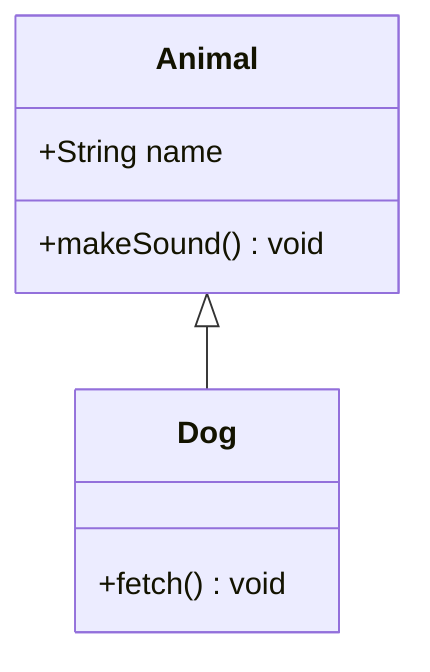
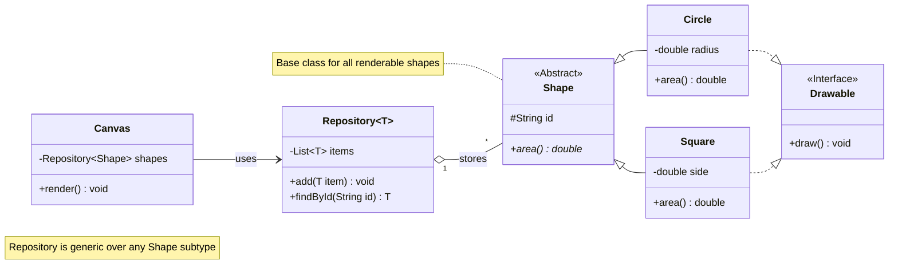

# Class Diagram

> **Status:** Stable - introduced long-standing (pre-v10).

## Overview
A class diagram models the static structure of a system: types (classes and interfaces), their attributes and methods with visibility markers, and the relationships - inheritance, composition, aggregation, association, dependency, realization - that connect them. It is a UML-style blueprint of "what exists and how the pieces relate," not a description of runtime order or behavior.

## Best-fit uses
- Documenting object-oriented type hierarchies and the relationships between classes
- Designing or reviewing a domain model's entities and their associations
- Capturing interface implementation and inheritance hierarchies
- Recording cardinality (one-to-many, etc.) between related types

## When NOT to use this
- Runtime message ordering between instances - see `sequence.md` instead.
- A single object's lifecycle and states over time - see `state.md` instead.
- Generic process flow with no OOP structure to convey - see `flowchart.md` instead.

## Basic syntax
- Start keyword: `classDiagram`.
- Class block: `class ClassName { attribute; method() }`; or the one-member colon form `ClassName : attribute` / `ClassName : method()`.
- Visibility prefixes: `+` public, `-` private, `#` protected, `~` package/internal.
- Trailing classifiers: `*` abstract, `$` static (placed after the method parens or return type).
- Generics: tilde-wrapped, e.g. `List~int~`, `Map~String, int~` is *not* supported (commas inside generics are unsupported).
- Relationships: `<|--` inheritance, `*--` composition, `o--` aggregation, `-->` association, `--` solid link, `..>` dependency, `..|>` realization, `..` dashed link.
- Cardinality: quoted labels flanking a relation, e.g. `ClassA "1" --> "*" ClassB : label`.
- Annotations: `<<Interface>>`, `<<Abstract>>`, `<<Service>>`, `<<Enumeration>>`, placed inline, on their own line, or nested inside the class block.
- Namespaces: `namespace Name { class A }`.
- Notes: `note "text"` or `note for ClassName "text"`.
- Direction: `direction LR` / `TB`.
- Styling: `style ClassName fill:#f9f`; `classDef name ...` applied via `class ClassName name` or the shorthand `ClassName:::name`.
- Comments: `%% comment text`.

## Simple example

`<|--` points from the subclass toward the superclass, the reverse of how the relation reads in English ("Dog inherits from Animal").

## Complex example

`area() double*` marks an abstract method via the trailing `*`; `Repository~T~` is a generic class instantiated later as `Repository~Shape~`; `o--` denotes aggregation (the repository holds shapes without owning their lifecycle), while a plain `-->` denotes a weaker "uses" association.

## Escaping & special characters
- Class names may only contain alphanumerics (including unicode), underscores, and dashes; wrap anything else in backticks as a display label, e.g. `` class `My.Weird#Name` ``.
- Generics use tildes (`~T~`); a literal comma inside a generic parameter list is not supported - simplify the type or describe it in a note instead.
- Quote cardinality/relationship labels that contain punctuation, e.g. `"0..1"`.
- Avoid a literal triple-backtick sequence inside note/label text; bump the *outer* fence wrapping this whole mermaid block to four backticks if unavoidable.
- **Tested (Mermaid 12.0.0 and 11.16.1):** A relationship label breaks on `:` and `;` (`#58;`, `#59;`); member text breaks on `)`, `{` and `}` (`#41;`, `#123;`, `#125;`). For a labelled class (`class A["text"]`) the only character that still needs an escape inside the quotes is `"`, written `#34;`.

## Common pitfalls
- Forgetting the closing `}` for a bracket-style class member block.
- Confusing composition (`*--`, implies ownership/lifecycle) with aggregation (`o--`, no ownership implied).
- Putting a comma inside a generic type parameter list - unsupported and will fail to parse.
- Declaring the same class name twice with conflicting members across separate `class` blocks.
- Omitting quotes around multiplicity/cardinality labels on a relation.

## v11 fallback

- **Default appearance:** v12 draws this type with the `neo` look and the `redux-color` theme by default, laid out by ELK instead of dagre; v11 draws it with the `classic` look and the `default` theme and dagre layout. The diagram source is identical - only the rendering differs. `general/v11-compatibility.md` shows how to make v12 draw the v11 appearance.
- **`class.defaultRenderer`** is removed in v12 and ignored. Set `layout` in frontmatter `config:` instead.

## Beta/experimental caveats
N/A - stable diagram type, no known compatibility caveats. Dot-notation namespace paths (`class namespace.A.B.ClassName`) are a v11.15.0 addition layered on top of the stable core grammar.

## Further reading
- https://mermaid.js.org/syntax/classDiagram.html
