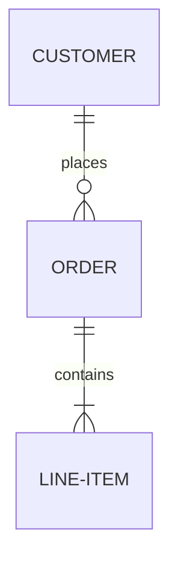
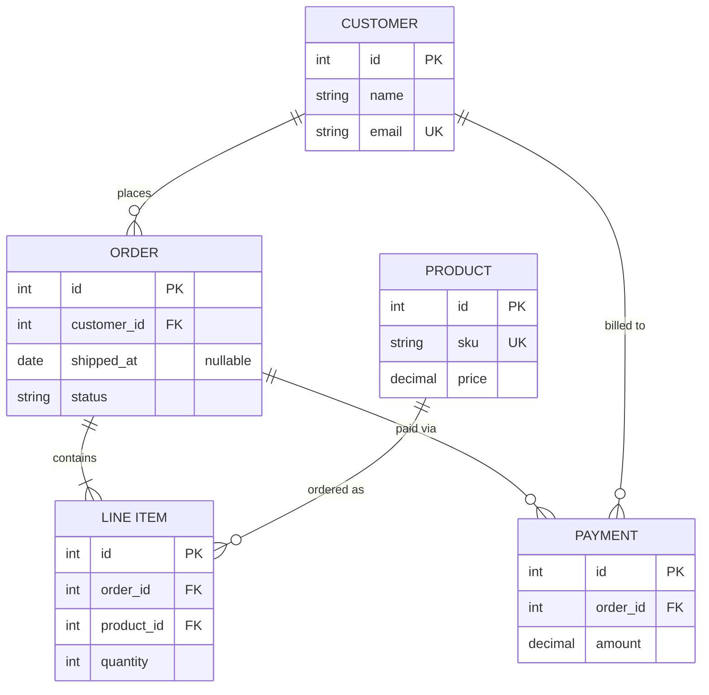

# Entity Relationship Diagram

> **Status:** Experimental - introduced long-standing (pre-v10). Syntax and support may change; treat generated diagrams of this type as more likely to need adjustment than stable types.

## Overview
An ER diagram maps the entities (tables, domain objects) in a system and the relationships between them, expressed with crow's-foot cardinality notation on each end of a connecting line. Entities can optionally list their attributes - including primary/foreign/unique key markers - turning the diagram into something close to a logical data model rather than just a relationship sketch.

## Best-fit uses
- Sketching a database schema or logical data model with tables and cardinalities
- Documenting how domain entities relate before or alongside implementing a data layer
- Communicating one-to-many / many-to-many relationships precisely, including optionality (zero vs. one)
- Reviewing a normalized schema design with a non-technical stakeholder

## When NOT to use this
- A quick, informal sketch of related concepts without needing precise cardinality - a `flowchart.md` graph or `class.md` diagram is lighter-weight.
- Modeling class inheritance, interfaces, or object-oriented structure - see `class.md` instead, which has relationship arrows suited to OOP rather than data cardinality.
- Runtime/sequence behavior between records or services - see `sequence.md` instead.

## Basic syntax
- Start keyword: `erDiagram`.
- Relationship statement: `EntityA <left-cardinality>--<right-cardinality> EntityB : label` (the `label` is required whenever a relationship line is drawn).
- Relationship line style: `--` identifying relationship (solid), `..` non-identifying relationship (dashed).
- Cardinality markers, one per side, combined outer+inner:
  - `|o` / `o|` - zero or one
  - `||` - exactly one
  - `}o` / `o{` - zero or more (many)
  - `}|` / `|{` - one or more (many)
- Entity names: unicode allowed; wrap in double quotes if the name contains spaces, e.g. `"Line Item"`.
- Attribute block: `EntityName { type name key "comment" ... }`, one attribute per line (or comma-separated), where `key` is an optional `PK`, `FK`, or `UK` (comma-separated if an attribute is more than one). A `type` may carry a `?` suffix to mark the attribute nullable, but **this requires Mermaid >= 11.16.0** - on older versions `date?` throws `Parse error ... Expecting 'ATTRIBUTE_WORD', got '?'`. Prefer a trailing comment (e.g. `date shipped_at "nullable"`) to stay portable across platforms; only use the `?` suffix when the target renderer is known to be 11.16.0+.
- Aliases: `EntityName["Display Alias"]` shows an alternate label without changing the identifier used in relationship statements.
- Direction: `TB`, `BT`, `LR`, `RL`.
- Styling: `style entityId ...`, and `classDef`/`class` for reusable style classes, same as other Mermaid diagram types.

## Simple example

Reads as: exactly one customer relates to zero-or-more orders, and exactly one order relates to one-or-more line items. Cardinality is read from the far end of the line relative to the entity you start at.

## Complex example

Attribute blocks turn each entity into a mini schema definition; `PK`/`FK`/`UK` markers document keys directly, and a trailing comment (`"nullable"`) flags a nullable column without needing the `?` type suffix - deliberately, so the example stays portable to Mermaid versions below 11.16.0 (see the note under "Basic syntax" above).

## Escaping & special characters
- Any entity name, attribute name, or relationship label containing a space, punctuation, or reserved character must be double-quoted: `"LINE ITEM"`, `"ordered as"`.
- Attribute-level free-text comments go in trailing double quotes after the key marker: `string status "one of: pending, shipped"`.
- Inside a fenced ```mermaid block in Markdown, avoid an unescaped triple-backtick inside any quoted label; if unavoidable, widen the surrounding Markdown fence to four backticks.
- Basic markdown emphasis (e.g. `**bold**`) is supported inside quoted relationship labels and renders as formatted text, not literal asterisks.
- **Tested (Mermaid 12.0.0 and 11.16.1):** Quote attribute comments and relationship labels (`A ||--o{ B : "text"`); the only character that still needs an escape inside the quotes is `"`, written `#34;`.

## Common pitfalls
- Reversing the cardinality pair - the marker touching an entity describes the *other* entity's cardinality relative to it, which reads backwards from plain English the first few times.
- Mixing up `|o` (zero-or-one) with `o|` - the vertical bar and circle are ordered differently depending on which side of the relation they sit on; copy the marker pair verbatim rather than reconstructing it from memory.
- Forgetting the relationship label after the second entity - it is not optional once a relationship line is present.
- Omitting quotes around a multi-word entity name or label, which breaks parsing rather than degrading gracefully.
- Using `--` (identifying) when the relationship is actually optional/non-identifying (`..`), which changes the rendered line style and, in some ER conventions, the implied meaning.
- Assuming attribute blocks are required - they are optional, and a relationship-only diagram is valid and often clearer for a quick sketch.
- Using the `?` optional-type suffix (`date?`) on an attribute type without confirming the target renderer is Mermaid >= 11.16.0. On older versions (see `general/renderers.md` for which markdown renderers are older, and some offline tools) this fails with `Parse error ... Expecting 'ATTRIBUTE_WORD', got '?'` rather than degrading gracefully - use a trailing comment to mark nullability instead.

## v11 fallback

- **Default appearance:** v12 draws this type with the `neo` look and the `redux-color` theme by default, laid out by ELK instead of dagre; v11 draws it with the `classic` look and the `default` theme and dagre layout. The diagram source is identical - only the rendering differs. `general/v11-compatibility.md` shows how to make v12 draw the v11 appearance.
- **Attribute type `?` suffix** (`date?`) needs v11.16.0+ and hard-fails below it with `Expecting 'ATTRIBUTE_WORD', got '?'` - Obsidian's Mermaid 11.13.0 is such a renderer. Express nullability with a trailing comment (`date shipped_at "nullable"`) when the target may be older.
- **Subgraphs** (`subgraph "Customer Domain" ... end`) are documented v11.17.0+; a test diagram also rendered on 11.16.1, and renderers older than that were not tested.

## Beta/experimental caveats
The live Mermaid documentation for this diagram type does not carry an explicit "experimental" banner in its prose - ER diagrams have existed in Mermaid since before v10 and are broadly usable. This skill nonetheless tracks the diagram as experimental-tier for planning purposes, so mention to the user that cardinality-notation edge cases and attribute-block formatting are newer additions worth double-checking against the Mermaid version being targeted before relying on them in a rendered diagram. The `?` optional-type suffix is the most fragile of these: it only landed in v11.16.0, so it breaks on any renderer older than that (see `general/renderers.md`). Default to expressing nullability with a comment and only emit `date?` when the user confirms the target renderer is 11.16.0+.

## Further reading
- https://mermaid.js.org/syntax/entityRelationshipDiagram.html
