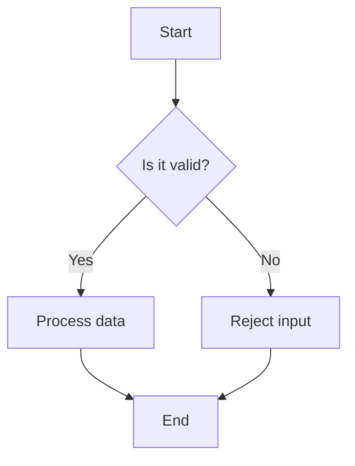
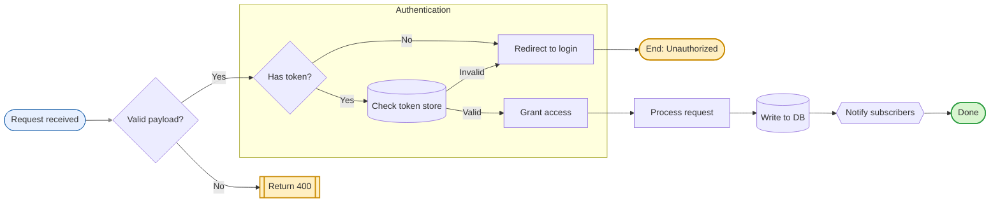

# Flowchart

> **Status:** Stable - introduced long-standing (pre-v10).

## Overview
A flowchart models a process, algorithm, or decision path as a directed graph of labeled nodes connected by edges. Node shape conveys semantic meaning (a diamond for a decision, a rectangle for a step, a cylinder for storage, etc.), and edges carry optional labels and line styles that describe the relationship or condition governing the move from one node to the next. The core mental model is simply "boxes and arrows: what happens, and what happens next."

## Best-fit uses
- Documenting a process, algorithm, or decision tree step by step
- Visualizing branching logic with clear yes/no or multi-way decision points
- Diagramming data or control flow between system components using labeled edges
- Grouping related steps into logical clusters with subgraphs

## When NOT to use this
- Ordered messages exchanged between actors over time - see `sequence.md` instead.
- An object's internal lifecycle and valid state transitions - see `state.md` instead.
- Static class/type structure and relationships - see `class.md` instead.

## Basic syntax
- Start keyword: `flowchart` (preferred) or the legacy alias `graph`.
- Direction (immediately after the keyword): `TB`/`TD` (top-down), `BT` (bottom-up), `LR` (left-right), `RL` (right-left).
- Node shapes: `A[text]` rectangle, `A(text)` rounded, `A([text])` stadium, `A[[text]]` subroutine, `A[(text)]` cylinder, `A((text))` circle, `A(((text)))` double circle, `A{text}` diamond/decision, `A{{text}}` hexagon, `A>text]` flag/asymmetric, `A[/text/]` / `A[\text\]` parallelogram, `A[/text\]` / `A[\text/]` trapezoid.
- Edges: `-->` arrow, `---` open line, `==>` thick arrow, `===` thick open line, `-.->` dotted arrow, `-.-` dotted open line, `--o` circle-tip, `--x` cross-tip, `<-->` bidirectional, `~~~` invisible link.
- Edge label: `A -->|label| B` or `A -- label --> B`.
- Subgraph: `subgraph id [title]` ... `end`.
- Styling: `style nodeId fill:#f9f,stroke:#333`; reusable classes via `classDef name fill:#f9f`, applied with `class nodeId name` or the shorthand `nodeId:::name`.
- Interactivity: `click nodeId "https://url" "tooltip"` or `click nodeId call fn() "tooltip"` (requires `securityLevel: loose`).
- Comments: `%% comment text` on its own line.

## Simple example

`B` is a decision diamond; the two labeled edges (`Yes`/`No`) branch to different nodes, and both branches converge back on `E`.

## Complex example

`classDef` declares reusable style classes applied via `:::`; `subgraph AuthFlow` groups related nodes and sets its own internal `direction`; `click` attaches interactivity (only rendered live under `securityLevel: loose`); `linkStyle 0` targets the first edge by declaration index.

## Escaping & special characters
- Wrap label text in double quotes when it contains characters Mermaid would otherwise parse as syntax, e.g. `A["Value (raw)"]`.
- Use HTML entity codes for punctuation that collides with node/edge delimiters, e.g. `#35;` for `#`, `#quot;` for `"`.
- Angle brackets `<` `>` inside labels should be quoted or entity-encoded (`&lt;` `&gt;`) so they aren't read as markup.
- `|` is reserved as the edge-label delimiter - quote any label text that must contain a literal pipe.
- `(` and `)` are node-shape delimiters - quote the whole label if it needs literal parentheses.
- Never let a literal triple-backtick sequence appear inside label text; if a label must show one, quote the label and bump the *outer* fence wrapping this whole mermaid block to four backticks.
- **Tested (Mermaid 12.0.0 and 11.16.1):** Quote node, edge and subgraph labels (`A["text"]`, `A -->|"text"| B`, `subgraph S["text"]`); unquoted labels break on `" | ( ) [ ] { }`, and the only character that still needs an escape inside the quotes is `"`, written `#34;`. A `<`...`>` pair survives inside quotes here (an actual tag such as `<b>` is rendered as HTML). Codes for the rest are in `general/authoring-rules.md`.

## Common pitfalls
- Using lowercase `end` as a bare node id/label - it's the reserved subgraph-closing token; capitalize as `End`/`END` or quote it.
- A node id starting with `o` or `x` directly followed by an edge that also starts with `o`/`x` can be misparsed as an edge decorator - add a space or capitalize.
- Mixing arrow lengths inconsistently, e.g. `--->` (three dashes) is not a valid arrow token.
- Forgetting the closing `end` for every opened `subgraph`.
- Unquoted labels containing `()`, `[]`, `{}`, or `|` that collide with shape/link delimiters.
- Redeclaring the same node id with a different shape later in the file - the first-seen shape wins and later shape declarations are ignored.

## v11 fallback

- **Default appearance:** v12 draws this type with the `neo` look and the `redux-color` theme by default, laid out by ELK instead of dagre; v11 draws it with the `classic` look and the `default` theme and dagre layout. The diagram source is identical - only the rendering differs. `general/v11-compatibility.md` shows how to make v12 draw the v11 appearance.
- **Collapsible subgraphs** - `id@{ view: collapsed }` (documented v11.17.0+). v12 folds the subgraph to one node; 11.16.1 parses it without error and ignores it, drawing the subgraph expanded.
- **Shapes `folder` (alias `directory`), `bucket`, `console`, `browser`, `person`** (documented v11.17.0+). 11.16.1 hard-fails with `No such shape: <name>.` Fall back to a shape it has: `cyl` for `bucket`, `rect` (with a descriptive label) for the others.
- **`flowchart.defaultRenderer`** is removed in v12 and ignored; the `flowchart-elk` keyword still works but is no longer needed. Set `layout: dagre` or `layout: elk` in frontmatter `config:` instead.

## Beta/experimental caveats
N/A - stable diagram type, no known compatibility caveats. The newer unified `@{ shape: ... }` node syntax (v11.3.0+) is an additive alternative, not a breaking change to the classic shape tokens above.

## Further reading
- https://mermaid.js.org/syntax/flowchart.html
