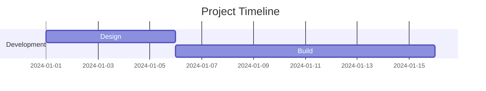
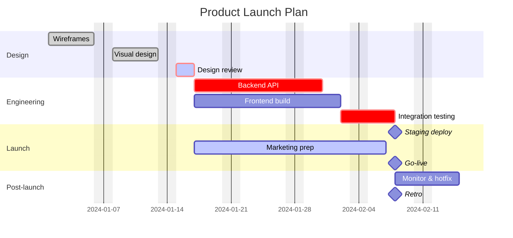

# Gantt

> **Status:** Stable - introduced long-standing (pre-v10).

## Overview
A Gantt chart lays project tasks out as horizontal bars along a shared time axis, showing when each task starts, how long it runs, and how it depends on other tasks finishing first. Sections group related tasks into swimlane-like bands, and tags mark special states (done, in-progress, critical-path, milestone). The mental model is scheduling: dates and durations drive the layout, and dependency chains (`after`) let mermaid compute start dates for you instead of hand-placing every bar.

## Best-fit uses
- Project schedules where tasks have real dates/durations and dependencies on each other
- Highlighting a critical path or in-progress/completed status across many parallel workstreams
- Roadmaps that need calculated end dates rather than hand-authored positions

## When NOT to use this
- Time periods are qualitative labels, not real calculated dates - use `timeline.md` instead
- You're mapping emotional highs/lows through a process rather than scheduling work - use `user-journey.md`
- You need calendar-style event scheduling with no bar/duration semantics - a simpler list or `timeline.md` fits better

## Basic syntax
Start with `gantt`. Common top-level directives: `title`, `dateFormat` (input date parsing, default `YYYY-MM-DD`), `axisFormat` (output axis display), `excludes` (dates/weekdays to skip, e.g. `weekends`), `todayMarker`. Group tasks with `section <name>`. Each task line is:

```
Task name : [tags], [id,] [start-or-after], [end-or-duration]
```

- Optional tags (must come first, comma-separated): `active`, `done`, `crit`, `milestone`
- Start can be an explicit date (per `dateFormat`), `after <taskId> [<taskId2> ...]`, or omitted (defaults to previous task's end)
- End can be an explicit date, a duration (`10d`, `4h`, `2w`, etc.), or `until <taskId>`
- Giving a task an id (e.g. `des1`) lets later tasks reference it via `after`/`until`

## Simple example


"Build" has no explicit start date - `after des1` tells mermaid to start it the moment "Design" ends.

## Complex example


This combines four sections, `done`/`active`/`crit`/`milestone` tags, multi-parent dependencies (`after dev1 dev2`), zero-duration milestones, an `until` dependency, `excludes weekends`, and a styled `todayMarker` - the critical-path tasks (`crit`) trace Design review through Backend API to Integration testing.

## Escaping & special characters
- `:` is the hard separator between a task's display name and its metadata (tags/dates/duration) - a literal colon in a task name will break parsing; rephrase or omit it.
- `,` separates metadata items and multiple `after` task ids - avoid unescaped commas in task names.
- Task ids should stay alphanumeric (plus `_`/`-`) since they're referenced bare in `after`/`until` clauses; spaces or punctuation in an id will not parse as intended.
- Inside a ` ```mermaid ` fence in a larger markdown document, nothing in gantt syntax needs backtick escaping - just ensure no task/section text contains a literal triple backtick; use a four-backtick outer fence if it must.
- **Tested (Mermaid 12.0.0 and 11.16.1):** A task name breaks on `:` - write `#58;`. Section names accept every character.

## Common pitfalls
- [ ] Does every date match the declared (or default `YYYY-MM-DD`) `dateFormat` exactly?
- [ ] Are tags (`done`/`active`/`crit`/`milestone`) placed first in the metadata, before the id/dates?
- [ ] Did you avoid a literal `:` inside a task's display-name text?
- [ ] Do `after`/`until` references point at task ids that were actually assigned (not display names)?
- [ ] Is `excludes` spelled out per line if you need multiple exclusion rules (dates, weekends, specific weekdays)?
- [ ] Do milestones use `milestone` tag with an explicit (often `0d`) duration so they render as a point, not a bar?

## v11 fallback

No syntax differences. Every example in this file parses and renders on both Mermaid 12.0.0 and 11.16.1.

## Beta/experimental caveats
N/A - stable diagram type, no known compatibility caveats.

## Further reading
- https://mermaid.js.org/syntax/gantt.html
