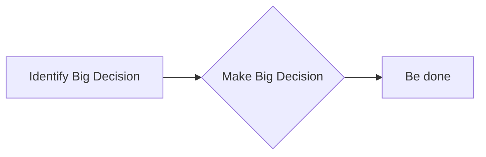

# Accessibility

Mermaid can attach an accessible title and description to a diagram's SVG output so screen readers and other assistive technology (and search engines) get a text summary of what the diagram shows. Use this reference when a user asks for a diagram to be made accessible, or asks how to add `accTitle`/`accDescr`.

## Key concepts

Mermaid automatically sets `aria-roledescription` on the rendered `<svg>` element to the diagram type's internal key (e.g. `"stateDiagram"` for a state diagram, `"flowchart-v2"` for a flowchart - note this key can differ slightly from the keyword used in the diagram's own source syntax). This happens automatically with no author action needed.

The accessible title and description, by contrast, are opt-in and author-supplied via two keywords placed near the top of the diagram body (this syntax is uniform across every diagram type):

- **`accTitle:`** - single line only, text runs to the end of the line. Produces a `<title id="chart-title-...">` element in the SVG, referenced by the SVG's `aria-labelledby`.
- **`accDescr:`** - single-line form, same colon syntax as `accTitle`. Produces a `<desc id="chart-desc-...">` element, referenced by `aria-describedby`.
- **`accDescr { ... }`** - multi-line form: no colon after `accDescr`, content wrapped in curly braces instead, spanning multiple lines.

Both elements are inserted only if the author actually supplies them; if omitted, no `<title>`/`<desc>` is added (aside from the always-present `aria-roledescription`).

## Example

Multi-line description form:

This renders SVG containing `aria-labelledby`/`aria-describedby` pointing at generated `<title>`/`<desc>` elements holding exactly this text.

## Gotchas

- `accTitle` is always single-line - there is no curly-brace multi-line form for it, only for `accDescr`.
- The multi-line `accDescr {}` form must omit the colon; `accDescr: {` (colon plus a brace) is not the documented syntax.
- `aria-roledescription` is automatic and needs no author input - only the title/description are opt-in.
- Both directives are supported identically across all diagram types (flowchart, sequence, class, ER, Gantt, GitGraph, pie, requirement, state, user journey) - there's no per-diagram-type variant of this syntax to worry about.

## Further reading
- https://mermaid.js.org/config/accessibility.html
