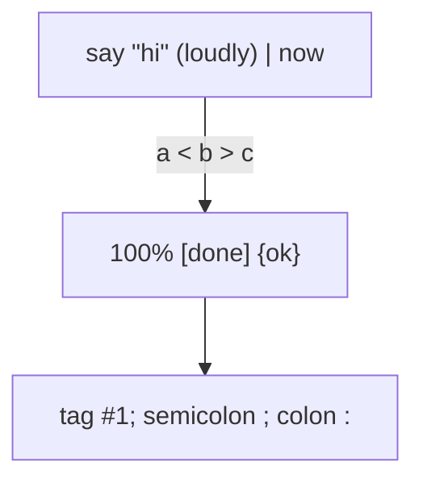
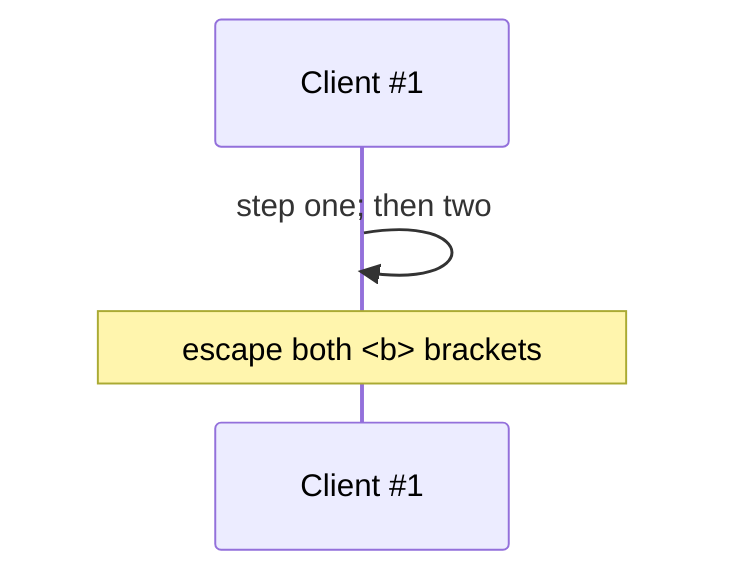

# Authoring rules

Escaping rules and the pre-delivery self-check that apply once a diagram type is chosen. Apply every rule below before delivering a diagram. A type's own "Escaping & special characters" section adds the rules for that type and wins where it differs.

## Escaping and quoting

The rules in this section were tested by putting each special character into each label position of each diagram family, then rendering on Mermaid 12.0.0 and 11.16.1 and reading the label text back out of the SVG. Results are identical on both versions for every type that exists in both. A label can *parse* and still render wrong, so "no error" is not proof the text is right.

**1. Quote by default.** Wrap any label in double quotes: `A["text"]`, `A -->|"text"| B`, `subgraph S["text"]`, `state "text" as s1`, `Person(p, "text")`. Quoting is always safe and removes most collisions. Unquoted text breaks on the characters in the table below, so when unsure, quote.

**2. Inside quotes only `"` still needs an escape.** Write it as `#34;` (or `#quot;` where the type supports named codes).

**3. Escape with `#<decimal>;`.** A `#`, the character's decimal code, and a `;`. This form decoded correctly in every position tested and is the one to reach for. The HTML form `&#35;` did not decode reliably, and named codes (`#quot;`, `#lt;`, `#gt;`, `#amp;`) fail in C4, architecture, timeline and Ishikawa text, so avoid both when a numeric code will do.

| Character | Code | Character | Code | Character | Code |
| --- | --- | --- | --- | --- | --- |
| `"` | `#34;` | `:` | `#58;` | `{` | `#123;` |
| `#` | `#35;` | `;` | `#59;` | `\|` | `#124;` |
| `&` | `#38;` | `<` | `#60;` | `}` | `#125;` |
| `'` | `#39;` | `>` | `#62;` | `` ` `` | `#96;` |
| `(` | `#40;` | `[` | `#91;` | | |
| `)` | `#41;` | `]` | `#93;` | | |

**4. In some types a `<`...`>` pair is read as an HTML tag and silently dropped.** `"a < b > c"` renders as `a  c`, with no error, in sequence and journey titles, pie and timeline titles, XY chart, quadrant, git graph commit ids, use case, railroad and Ishikawa text, and Wardley titles - even inside quotes. Escape both: `a #60; b #62; c`. Flowchart, swimlane, class, state, ER, kanban and agentflow keep the pair intact, but escaping is harmless there too. A lone `<` or `>` usually survives.

**5. Where raw characters break unquoted text** (escape these, or quote where the position accepts quotes):

| Position | Unquoted text breaks on |
| --- | --- |
| Flowchart, swimlane: node, edge and subgraph labels | `"` `\|` `(` `)` `[` `]` `{` `}` - quote the label |
| Sequence: participant alias, message, note, title | `#` and `;` (the text is cut or lost); title also a `<`...`>` pair |
| Class: relationship label | `:` and `;` |
| Class: member text | `)` `{` `}` |
| State: transition text | `;` (state descriptions: use `state "text" as id`) |
| User journey: task text | `:` `#` `;` |
| User journey: title | `#` `;` and a `<`...`>` pair |
| Gantt: task name | `:` (section names take every character) |
| Timeline: event and section text | `:` |
| Mindmap: node text | `(` `)` `[` `]` `{` `}` are shape delimiters - write `id["text"]` |
| Quadrant: point name | `:` `\|` `(` `)` `[` `]` `{` `}` `;` `"` `<` `>` - write `"name": [x, y]` |
| Architecture: label | `[` `]` - write `service id(icon)["text"]` |
| Wardley: component and anchor names | anything but letters, digits and spaces - quote the name |
| Packet: field label | must be quoted at all times (`+8: "Version"`) |
| Event modeling: identifier | `:` is a lexer error (the `{ data }` part accepts any character) |
| Agentflow, ER, kanban, Venn, radar, block, treemap, requirement, TreeView: labels | written quoted; inside the quotes only `"` (`#34;`) needs escaping |
| Use case: labels | written quoted; inside the quotes `"` (`#34;`) and a `<`...`>` pair need escaping |
| C4: labels | written quoted; `>` must be `#gt;`, and `"` has no escape (see item 6) |

**6. Where no escape exists.** State the limit in the reply and reword instead:

- **C4:** a literal `"` inside a label has no working escape (`#34;`, `#quot;` and `\"` all fail). Use `'` or typographic quotes. A `>` must be written `#gt;`.
- **Sankey:** node names accept ASCII letters, digits and spaces only. `#`, non-ASCII characters and (because it corrupts the SVG) `<` cannot be used at all, quoted or not. A comma needs the field in quotes, and a literal `"` is doubled (`""`).

**7. Other rules that stand.**

- **Comments** use `%%`, whole-line only, and never inside a quoted label.
- **No literal triple backticks** in label text destined for a ```mermaid fence; if the diagram must display one, make the outer fence four backticks.
- **No accidental fence close:** avoid a blank line followed by unindented text inside a fence.
- **The bare word `end`** is reserved as an id, and in Flowchart and Sequence it is also misread as a block terminator when it stands alone as label text. Wrap it: `(end)`, `[end]`, `{end}`.
- **Line breaks:** a raw newline in a label is collapsed or fails. Force a break with `<br/>`. Mindmap's backtick markdown-string label (`id["`text`"]`) is the documented wrapping exception.
- **Structural delimiters are not escapable by quoting** where the grammar uses them as field separators: a bare `:` in Gantt tasks and journey tasks, `,` in Sankey rows. Use the `#58;` code, or reword.
- **YAML frontmatter is its own context.** A `---` block above the diagram keyword (config, themeVariables) is plain YAML: quote any value containing `:` or other YAML-special characters, independently of how the same text is quoted in the diagram body.
- **Indentation is structure** in Mindmap, Timeline, Kanban, TreeView and Ishikawa. A renderer, linter or editor that dedents or trims inside a fence corrupts these; preserve leading whitespace byte for byte.

## Self-check before delivering

Work through every item; each is a yes-or-no you can answer.

1. The diagram keyword is the first non-blank token, with the exact casing and suffix documented for the type (`sankey`, but `venn-beta`; verified per file, never assumed from a pattern). A config frontmatter block may precede it.
2. Every opened `[`, `(`, `{`, `"`, `<<` has its match.
3. Every label containing any of `" # & ; : < > | ( ) [ ] { }` is quoted, or the character is written as its `#<decimal>;` code, following the position table above. In the types listed under rule 4, no `<` and `>` pair is left raw.
4. Where the type has a no-escape limit (C4 quotes, Sankey characters), the label was reworded, and the reply says so.
5. No node, actor or participant id collides with a reserved word for the diagram family (`end`, `graph`, `class`, `click`, `style`, `subgraph`).
6. Arrow and relationship tokens belong to the diagram family and are never mixed across families (flowchart `-->`, class `<|--` / `*--` / `o--`, state `-->`, ER `||--o{`).
7. Indentation is consistent, and exact where it is structural.
8. Every `subgraph`, `flow` or composite-state block that needs a closing `end` has one.
9. The target renderer's Mermaid version is known or assumed, and the type's "v11 fallback" section has been read: a feature newer than the target's version is replaced with the fallback, not emitted. Which renderers ship which version is in `renderers.md`; when the target is unnamed, write for Mermaid 12 and state the minimum version.
10. For beta and experimental types, the minimum Mermaid version and the status are stated in the prose delivered to the user, not only buried in the reference file.
11. Inside this skill's own repository, run the validator before finishing: `node tools/validate-mermaid.mjs --mode parse` (fast, no browser) or `node tools/validate-mermaid.mjs` (parse and render). Outside it the validator is unavailable, so items 1-10 are the whole check.
12. Editing this skill's own references: run the validator (parse, then full) against the pinned version, and against `--mermaid-version 11.16.1` for any block or section that concerns the v11 fallback.

## Escaped-label example

Every escape below is exercised by the validator (parse and render) on each run.




