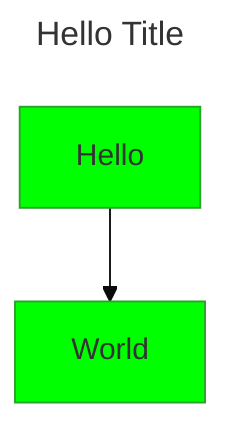

# Configuration

Mermaid's rendering behavior (theme, security posture, per-diagram-type options) is controlled by a layered configuration system rather than a single flat settings object. This reference is for when a user asks how config is resolved, where to put an override, or why an override "isn't taking" - it isn't needed for ordinary diagram generation, where frontmatter or an init directive is usually enough on its own.

## Key concepts

Mermaid builds the config actually used to render a diagram (the **render config**) by layering four sources, in this order:

1. **Default configuration** - Mermaid's built-in defaults.
2. **siteConfig** - set once via `mermaid.initialize({...})`. This is applied by whoever embeds Mermaid on a page/site and affects every diagram rendered there. It is meant to be called a single time; `configApi.reset()` restores each diagram's working config back to this siteConfig baseline immediately before every render, so per-diagram overrides never leak between diagrams.
3. **Frontmatter config** (v10.5.0+) - a YAML block at the top of an individual diagram's source, under a `config:` key. This is the diagram author's per-diagram override mechanism and is now the recommended way to do that (see `directives.md` for how this superseded the older directive mechanism). Frontmatter can override the entire Mermaid config **except** a set of keys marked non-overridable for security reasons (e.g. things like `securityLevel` itself) - Mermaid does not want diagram text, which may come from an untrusted source, to be able to loosen its own sandboxing.
4. **Directives** - `%%{init: {...}}%%` blocks inside the diagram text itself. Deprecated in favor of frontmatter config as of v10.5.0, but still functional.

So the practical mental model: `initialize()` sets the site-wide floor once; every individual diagram then layers its own frontmatter/directive overrides on top of that floor before rendering, and that combined result is discarded and rebuilt from siteConfig for the next diagram.

## Example

This frontmatter block sets the diagram's theme to `base` and overrides `themeVariables.primaryColor` for this diagram only - it does not affect any other diagram on the page, unlike a call to `mermaid.initialize()`.

## Gotchas

- `mermaid.initialize()` is a one-time, site-level call - don't expect calling it again mid-session to retroactively change already-configured diagrams; per-diagram state is reset from siteConfig before each render, not from whatever `initialize()` was most recently called with in some other order.
- Frontmatter config cannot override everything - a subset of keys is deliberately locked down for security and will be ignored if set there.
- Frontmatter (the `config:` key in a YAML frontmatter block) and directives (`%%{init: {...}}%%` in the diagram body) are two different mechanisms that both produce diagram-level overrides - don't confuse them. Frontmatter is the current recommended one.

## Further reading
- https://mermaid.js.org/config/configuration.html
