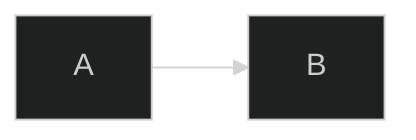
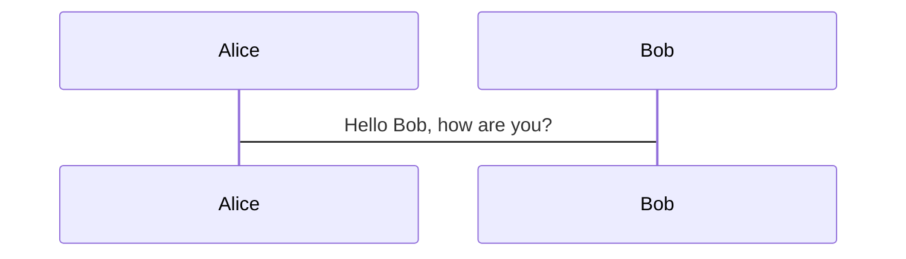

# Directives

Directives are the `%%{...}%%` blocks a diagram author can embed directly in diagram source to change configuration for that one diagram. Consult this when a user pastes a diagram containing a `%%{init: ...}%%` line and wants it explained or modified, or asks how to change theme/config "from inside" the diagram text rather than via frontmatter.

## Key concepts

The directive syntax is `%%{ ... }%%` with a JSON-like object inside. In practice this is almost always an **init directive**: the root key is `init` (or, equivalently, `initialize` - both are accepted and, if a diagram contains more than one, Mermaid merges them into a single init object, with later values winning key-by-key on conflicts rather than one directive simply replacing another).

Init directives accept two kinds of keys:
- **General/top-level config**, applied globally to the whole diagram: the page's own list is `theme`, `fontFamily`, `logLevel`, `securityLevel`, `startOnLoad`, `secure`.
- **Diagram-specific config**, nested one level deeper under the diagram-type name (e.g. `flowchart`, `sequence`), affecting only that diagram type - e.g. `sequence.mirrorActors`, `flowchart.curve`.

Not every config key can be set via a directive - some are excluded "for security reasons," and a site integrator can further restrict which keys diagram authors are allowed to override.

**Modern vs. legacy - read the nuance carefully.** The directives page carries an explicit warning: *"Directives are deprecated from v10.5.0. Please use the `config` key in frontmatter to pass configuration."* So within Mermaid's own history there are effectively two generations of "config inside the diagram text" mechanism:
- **Legacy (still works, still documented in depth): the `%%{init: {...}}%%` directive** described on this page - the whole subject of this reference file.
- **Current/recommended: frontmatter config** - a YAML `---` block with a `config:` key at the top of the diagram (see `configuration.md`), introduced in v10.5.0 specifically as the directive mechanism's replacement.

In other words, this page is documenting a mechanism the project itself now steers authors away from, while still fully supporting it - new diagrams should prefer frontmatter `config:`, but directives are not broken or removed, and a great deal of real-world Mermaid source still uses them.

One more narrower deprecation lives on this same page: `flowchart.htmlLabels` is deprecated as of v11.12.3+ in favor of setting the now-global `htmlLabels` at the top level instead of nesting it under `flowchart`.

## Example

Both directives are merged into one init object before being handed to `mermaid.initialize(...)`. Because `logLevel` is set twice, the later value wins - the effective result is `{"logLevel": "fatal", "theme": "dark", "startOnLoad": true}`.

Diagram-specific example - enabling line wrap only for a sequence diagram (default is `false`):

## Gotchas

- The object inside `%%{...}%%` must use valid, quoted key/value pairs - malformed content is silently ignored rather than erroring loudly.
- `init` and `initialize` are interchangeable and get merged together, not treated as separate configs - don't assume the second one simply overwrites the first wholesale.
- `flowchart.htmlLabels` is deprecated; set `htmlLabels` at the top level instead.
- Directives can't override every config key - some are locked for security regardless of what a directive requests.
- Prefer frontmatter `config:` for new work; treat directives as the legacy path, not the primary one, even though it remains functional.

## Further reading
- https://mermaid.js.org/config/directives.html
