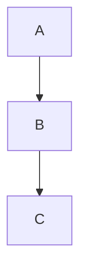

# Layout

The layout engine positions nodes and routes edges - a separate concern from the theme and the look. Consult this reference when node placement or edge routing isn't what's wanted, or when a user asks about switching layout algorithms.

## Key concepts

Mermaid 12 supports these layouts, chosen with the `layout` config key (frontmatter `config: { layout: ... }` or `mermaid.initialize()`):

- **`elk`** - the Eclipse Layout Kernel. **Bundled with `mermaid` and the default** for flowchart, state, class, entity relationship, requirement, use case and agentflow diagrams; no package to install or register. ELK variants are selected as `elk.stress`, `elk.force`, `elk.mrtree`, `elk.sporeOverlap`, `elk.box` and `elk.rectpacking`.
- **`dagre`** - layered layout, the layout of Mermaid 11 for those same types. `layout: dagre` restores it.
- **`cose-bilkent`** - force-directed; the default for mindmaps (the one type not laid out by ELK by default).
- **`tidy-tree`** - hierarchical; needs the separate `@mermaid-js/layout-tidy-tree` package, and the docs describe it as primarily for mindmaps.

Types with no graph layout to choose (pie, Gantt, XY chart, and similar) ignore `layout`.

ELK tuning keys live under `elk:` in config: `preset` (`default`, `legacy`, `modelOrder`, `depthFirst`), `nodePlacementAlignment`, `keepEntryNodeOnTop`. A single container can pick its own algorithm: `containerId@{ algorithm: "elk.rectpacking" }` on a subgraph (flowchart) or `flow` (agentflow).

A layout that isn't registered in the running build falls back to `dagre` with a console warning instead of throwing. The tiny build omits ELK and behaves this way.

## Example

Naming `dagre` in frontmatter to get the Mermaid 11 layout under Mermaid 12.

## Gotchas

- ELK sizes and orders differently from dagre: diagrams may come out wider or taller than under v11, and a subgraph's size can change. `elk.preset: depthFirst` keeps the layout closer to the earlier ELK default.
- The Mermaid theming page still describes dagre as the global default and ELK as a separate package. The layouts page, the 12.0.0 release notes and the config schema all say ELK is bundled and the default; follow those.
- `flowchart.defaultRenderer`, `class.defaultRenderer` and `state.defaultRenderer` are removed in v12 and ignored. Use the top-level `layout` key.
- The legacy `flowchart-elk` keyword still works but is no longer needed.
- On Mermaid 11 renderers, `layout: elk` needs ELK registered by the host; GitLab and VS Code register it (see `renderers.md`), so do not assume it elsewhere.

## Further reading
- https://mermaid.js.org/config/layouts.html
