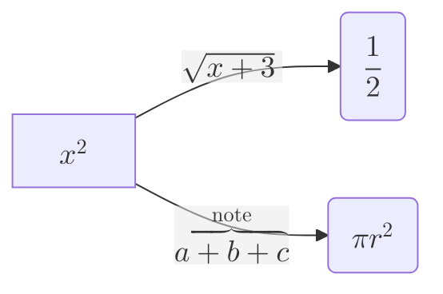

# Math

Mermaid can render mathematical notation inside diagram labels. Use this reference when a user wants an equation or mathematical expression embedded in a flowchart or sequence diagram label, rather than plain text.

## Key concepts

Math support (added in v10.9.0) is built on the **KaTeX** typesetter. Wrap the expression in `$$...$$` inside any text that would normally hold a label, and Mermaid renders it as typeset math rather than literal text. As of this writing, math is supported in exactly two diagram types: **flowcharts** and **sequence diagrams** - it is not available in other diagram types.

By default, math is rendered using the browser's native **MathML** support. Because MathML rendering quality/availability varies by browser and OS (fonts differ across platforms), Mermaid offers two config escape hatches:
- `legacyMathML: true` - falls back to KaTeX's own CSS-based rendering for browsers without MathML support. This requires the embedding page to include KaTeX's stylesheet itself; it is not bundled with Mermaid.
- `forceLegacyMathML: true` - always uses KaTeX's stylesheet rendering, regardless of whether the browser supports MathML, to get consistent results across all platforms rather than only falling back when MathML is unsupported. Only this flag needs to be set (not both) to force consistent rendering everywhere.

## Example

Each `$$...$$` span inside a node or edge label is typeset as math instead of literal text; everything outside the delimiters in the same label is not affected.

## Gotchas

- Math only works in flowcharts and sequence diagrams - don't expect `$$...$$` to typeset in, say, a class diagram or state diagram.
- Rendering can look visibly different across browsers/OSes under the default MathML path - if consistency matters more than avoiding an extra stylesheet, use `forceLegacyMathML` plus KaTeX's CSS.
- `legacyMathML`/`forceLegacyMathML` require you to include KaTeX's stylesheet yourself (matching the KaTeX version Mermaid bundles) - Mermaid does not ship it for you.

## Further reading
- https://mermaid.js.org/config/math.html
