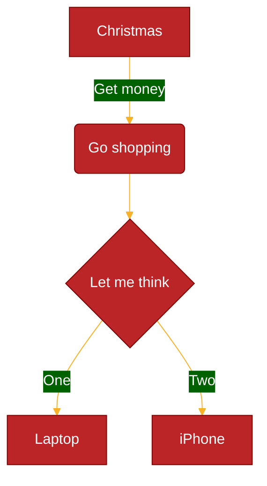

# Theming

Theming controls the color/font palette and the drawing style a diagram renders with. Reach for this reference when a user wants to change diagram colors, restore the Mermaid 11 appearance, or build a genuinely custom palette rather than use a stock theme.

## Key concepts

**Themes.** Mermaid 12 ships eleven named themes: `redux-color`, `redux-dark-color`, `redux`, `redux-dark`, `default`, `neutral` (print / black-and-white), `dark` (pair with `darkMode: true` for dark backgrounds), `forest`, `neo`, `neo-dark` and `base`. Of these, **only `base` is customizable**; it exists as the starting point for a custom palette.

**Looks.** `look` is a separate setting from `theme`: `classic`, `handDrawn` or `neo`. `neo` is meant to pair with the `neo` themes; `handDrawn` is unsupported by some types (Cynefin, Railroad).

**Per-diagram defaults (v12).** Ten types default to the `redux-color` theme and the `neo` look; every other type defaults to `default` and `classic`. The config key that scopes a setting to a type is not always its diagram keyword:

| Config key | Diagram keyword |
| --- | --- |
| `agentflow` | `agentflow-beta` |
| `flowchart` | `flowchart` |
| `swimlane` | `swimlane-beta` |
| `class` | `classDiagram` |
| `er` | `erDiagram` |
| `requirement` | `requirementDiagram` |
| `sequence` | `sequenceDiagram` |
| `state` | `stateDiagram` |
| `usecase` | `usecase-beta` |
| `venn` | `venn-beta` |

**Precedence, highest first:** the diagram's own frontmatter or `%%{init}%%` directive; `mermaid.initialize()`; the diagram type's default; the global default. A value scoped to one diagram type beats a global value set in the same layer:

```yaml
---
config:
  look: classic
  flowchart:
    look: handDrawn
---
```

**Restoring the Mermaid 11 appearance under v12** - name the previous theme, look and layout in the diagram's frontmatter (all three keys are accepted by Mermaid 11 too, so the block is safe to keep for either version):

```yaml
---
config:
  theme: default
  look: classic
  layout: dagre
---
```

For every diagram on a page, pass the same keys to `mermaid.initialize()`; to scope them to one type, `mermaid.initialize({ layout: 'dagre', flowchart: { theme: 'default', look: 'classic' } })`.

**Customizing.** Selection works site-wide via `mermaid.initialize({ theme: 'base' })`, per diagram via frontmatter, or (legacy) via an init directive. Customization goes through `themeVariables` set alongside `theme: base`. Mermaid derives many colors from a small set of primary variables (`primaryColor`, `secondaryColor`, `tertiaryColor`, `lineColor`, `textColor`, `mainBkg`, ...), so a custom theme stays consistent without every token spelled out. The theming engine understands hex colors only, not CSS color names.

Confirmed default values of the core shared variables: `darkMode: false`, `background: #f4f4f4`, `fontFamily: trebuchet ms, verdana, arial`, `fontSize: 16px`, `primaryColor: #fff4dd`, `noteBkgColor: #fff5ad`, `noteTextColor: #333`; most others are calculated from these.

Use case diagrams add theme variables `usecaseActorBkg`, `usecaseActorBorder`, `usecaseBkg`, `usecaseBorder`, `usecaseBoundaryBkg`, `usecaseBoundaryBorder`, `usecaseIncludeLine`, `usecaseExtendLine`; see `../usecase.md`.

## Example



Setting six variables on top of `theme: base` restyles the whole diagram; every derived color updates to stay consistent.

## Gotchas

- `themeVariables` without `theme: base` has no effect - only the base theme reads them.
- Named CSS colors (`red`, `teal`) are not recognized; use hex.
- A hardcoded `fill` is tied to the theme it was written for; pair it with a `color` so text stays readable in a dark theme.
- An unrecognised `theme` name resolves to `default` in v12.
- Per-diagram-type variable tables (flowchart, sequence, pie, state, class, user-journey, ...) exist beyond the shared core list - if an element's color looks unaffected by a core variable, check that type's own variable.
- The theme `dark` and dark *mode* (`darkMode: true`) are related but distinct: the theme changes the diagram's palette, `darkMode` affects how derived colors are calculated.
- Under `look: neo`, node strokes take a gradient when the theme sets `useGradient` (`base` does); a custom `nodeBorder` on `base` turns it off.

## Further reading
- https://mermaid.js.org/config/theming.html
