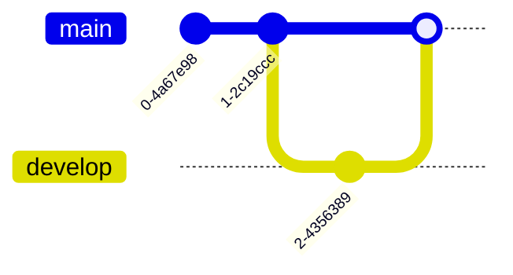
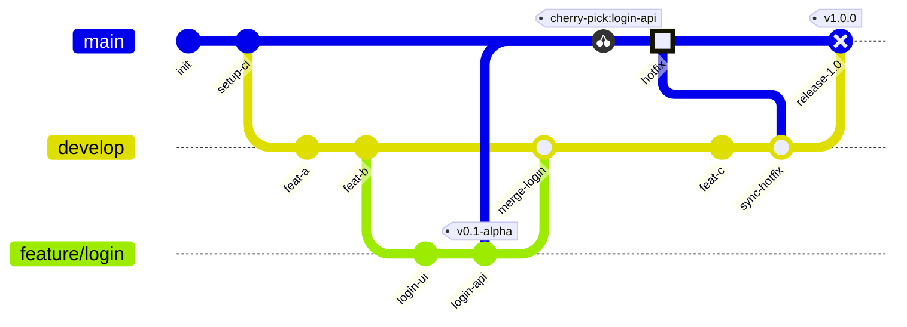

# GitGraph (Git) Diagram

> **Status:** Stable - introduced long-standing (pre-v10).

## Overview
A GitGraph diagram visualizes git commit history and branch topology - commits, branch creation, checkouts, merges, and cherry-picks - laid out along a timeline. The core mental model is a rendered `git log --graph`: a picture of how branches diverge from and reconverge with each other over a sequence of commits.

## Best-fit uses
- Visualizing a repository's branching, merge, and commit history
- Documenting a proposed or actual git branching strategy for a team
- Illustrating a release/hotfix workflow (e.g. git-flow) with merges
- Showing cherry-pick relationships between commits on different branches

## When NOT to use this
- Generic process flow unrelated to git history - see `flowchart.md` instead.
- Ordered interactions between people or systems in general (this diagram is git-commit-specific) - see `sequence.md` instead.

## Basic syntax
- Start keyword: `gitGraph`, optionally followed by an orientation suffix: `gitGraph LR:` (left-to-right, the default), `gitGraph TB:` (top-to-bottom), `gitGraph BT:` (bottom-to-top).
- `commit [id: "text"] [tag: "text"] [type: NORMAL|REVERSE|HIGHLIGHT]` - records a commit on the current branch; a plain `commit` auto-generates an id.
- `branch name [order: n]` - creates a new branch and switches to it.
- `checkout name` / `switch name` - interchangeable; sets the current active branch.
- `merge name [id: "text"] [tag: "text"] [type: TYPE]` - merges the named branch into the current branch.
- `cherry-pick id: "commit_id" [parent: "parent_id"]` - replays a specific commit onto the current branch.
- The default root branch is `main`, and it starts out checked out.
- Comments: `%% comment text`.

## Simple example

Each bare `commit` auto-generates its id; `branch develop` both creates the branch and switches to it in one step, so the following `checkout develop` is redundant here but shown for clarity.

## Complex example

`order:` pins each branch's lane position in the rendered graph regardless of declaration order; the `cherry-pick` onto `main` requires `login-api` to have been given an explicit `id:` earlier and a `parent:` because it followed a merge; `type: HIGHLIGHT` and `type: REVERSE` change a commit's rendered marker shape.

## Escaping & special characters
- Any `id:`, `tag:`, or commit/branch text containing spaces or punctuation must be double-quoted, e.g. `commit id: "release candidate 1"`.
- Keep branch names to alphanumerics, dashes, underscores, and slashes (e.g. `feature/login`) for reliable parsing; quote anything more exotic where the grammar allows it.
- Avoid a literal triple-backtick sequence inside any quoted id/tag text; bump the *outer* fence wrapping this whole mermaid block to four backticks if unavoidable.
- **Tested (Mermaid 12.0.0 and 11.16.1):** Quote commit ids and messages; inside them the only character that still needs an escape inside the quotes is `"`, written `#34;`, and a `<`...`>` pair is read as an HTML tag and silently dropped, so write both as `#60;` and `#62;`.

## Common pitfalls
- Cherry-picking a commit that was never given an explicit `id:` - `cherry-pick` can only target commits declared with `commit id: "..."`.
- Cherry-picking from the branch you're currently checked out on - the source commit must be reachable from a different branch.
- Issuing `cherry-pick` before the current branch has at least one commit of its own.
- Omitting `parent:` when cherry-picking a merge commit - merge commits require the immediate parent to be specified explicitly.
- Confusing `checkout` (switch to an existing branch) with `branch` (create a new branch and switch to it) - `checkout` on a branch that doesn't exist yet is an error.
- Relying on declaration order alone for lane placement instead of the `order:` attribute when exact lane position matters.

## v11 fallback

No syntax differences. Every example in this file parses and renders on both Mermaid 12.0.0 and 11.16.1.

## Beta/experimental caveats
N/A - stable diagram type, no known compatibility caveats.

## Further reading
- https://mermaid.js.org/syntax/gitgraph.html
