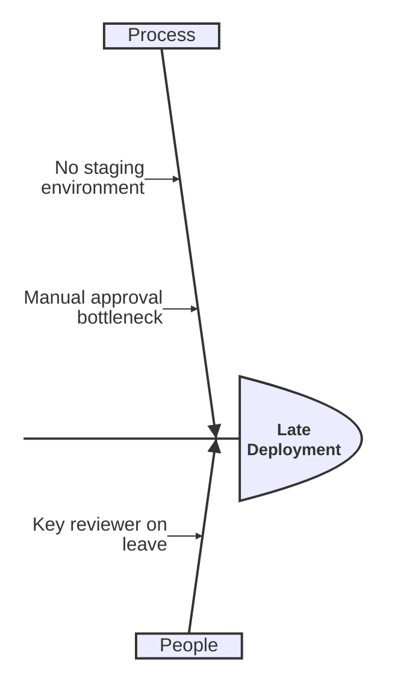
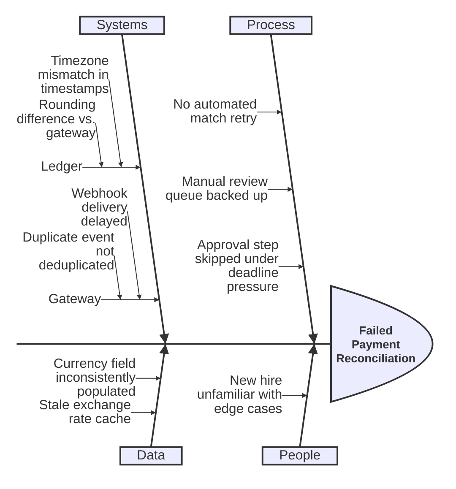

# Ishikawa

> **Status:** Beta - introduced v11.12.3. Syntax may evolve; treat generated diagrams of this type as more likely to need adjustment than stable types.

## Overview
An Ishikawa diagram (fishbone / herringbone / cause-and-effect diagram) traces a single problem back to its contributing causes, grouped into categories that branch off a central spine like ribs off a fish skeleton. It's a root-cause-analysis tool: the problem sits at the head, major cause categories are the main bones, and each category can nest more specific sub-causes off of it.

## Best-fit uses
- Root-cause analysis of a single defined problem or incident
- Grouping many potential causes into a handful of categories (process, people, equipment, environment, etc.)
- Post-mortems and quality-investigation writeups where causes need visible hierarchy, not just a flat list

## When NOT to use this
- You're documenting a process or sequence of steps rather than causes of one problem - use `flowchart.md`
- Your causes don't naturally group into a small number of categories - a plain nested list or `mindmap.md` may communicate just as well with less structure overhead
- You need to show causal chains between causes (A leads to B leads to C) - a fishbone only shows two levels of grouping, not arbitrary chains; consider `flowchart.md`

## Basic syntax
Start with `ishikawa-beta`. The **first line after the keyword is the event/problem** the diagram is about. Every subsequent line is a cause, and indentation depth determines the fishbone structure:

- Depth-1 (same indent as top-level lines) lines are the main bones/categories branching off the spine.
- Depth-2 lines (indented one level further) are causes under that category.
- Depth-3+ lines nest sub-causes further under a depth-2 cause.

There's no special punctuation for causes - indentation alone (spaces, consistent per level) defines the tree; there's no separate `bone`/`cause` keyword.

## Simple example

"Late Deployment" is the head problem; "Process" and "People" are the two main bones, each with one or two causes nested beneath.

## Complex example

Four main bones ("Process", "People", "Systems", "Data") branch off the head problem; "Systems" goes a level deeper, splitting into "Ledger" and "Gateway" sub-categories that each carry their own causes - demonstrating the 3rd indentation level.

## Escaping & special characters
- Lines are plain text - no bracket or quote wrapping is required for labels, unlike flowchart/venn/radar.
- Because indentation is structurally significant, avoid mixing tabs and spaces; keep each depth level's indentation consistent (e.g. always 4 spaces per level) or nested causes may attach at the wrong depth.
- Avoid leading/trailing punctuation that could be mistaken for Mermaid comment or directive syntax (e.g. a line starting with `%%`).
- Inside a ```mermaid fence, no extra escaping is needed beyond avoiding literal triple backticks in a cause label.
- **Tested (Mermaid 12.0.0 and 11.16.1):** Cause text is plain indented text: a `<`...`>` pair is read as an HTML tag and silently dropped, so write both as `#60;` and `#62;`. Named codes (`#quot;`) are not decoded here; use numeric ones.

## Common pitfalls
- [ ] Is the very first content line the problem/event, not a category (a common mistake carried over from mindmap habits)?
- [ ] Is indentation consistent in spaces-per-level throughout the whole diagram (no tab/space mixing)?
- [ ] Did you accidentally put a cause at the same indent level as a category, flattening the fishbone structure?
- [ ] Are deeply nested sub-causes (3+ levels) still readable, or would flattening into fewer, better-named categories communicate more clearly?
- [ ] Did you use `ishikawa-beta` and not a bare `ishikawa` (the `-beta` suffix is part of the required keyword)?

## v11 fallback

No syntax differences. Every example in this file parses and renders on both Mermaid 12.0.0 and 11.16.1.

## Beta/experimental caveats
Ishikawa diagrams are beta as of v11.12.3; indentation-based grammar, nesting-depth limits, and styling options may still change in minor releases. When delivering this diagram type, note it requires Mermaid v11.12.3 or later, and that the exact starting keyword is `ishikawa-beta` (confirmed from the live doc's rendered example source, not inferred) - a bare `ishikawa` will not parse.

## Further reading
- https://mermaid.js.org/syntax/ishikawa.html
