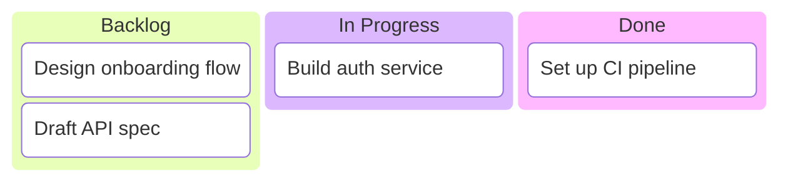
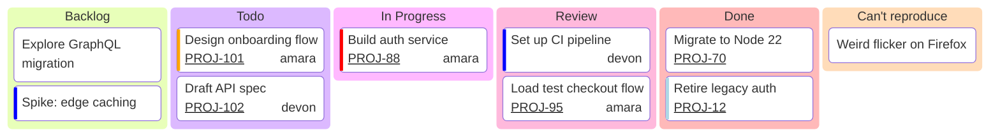

# Kanban

> **Status:** Beta - introduced v11.4.0. Syntax may evolve; treat generated diagrams of this type as more likely to need adjustment than stable types.

## Overview
A Kanban diagram renders a workflow board: named columns representing stages, each holding an ordered list of task cards. It's a static snapshot of a board's current state - there's no timeline or transition syntax, just what's in each column right now, optionally annotated with assignee/ticket/priority metadata.

## Best-fit uses
- Snapshotting a team's current workflow state (Todo/In Progress/Done) for docs or a status report
- Communicating work-item ownership and priority alongside its stage, without a live board tool
- Lightweight, text-versionable alternative to a screenshot of an external Kanban tool

## When NOT to use this
- You need to show the board changing over time or a sequence of transitions - a Kanban diagram is a single static snapshot, not an animation; consider `timeline.md` for the chronological view instead
- The stages have strict entry/exit conditions or branching logic that matters - a flowchart or state diagram captures process rules that a Kanban board's columns can't express
- The relationships between tasks (blocking, dependency) matter more than which column they're in - a flowchart's edges represent that better than column membership does

## Basic syntax
Start with `kanban`. Then declare columns, and indent tasks beneath the column they belong to:

- **Column:** `<columnId>[<Column Title>]` - a unique id and a bracketed title. A bare word with no brackets (e.g. `Backlog`) is also valid and uses the word itself as both id and title.
- **Task:** indented under its column, `<taskId>[<Task Description>]` - same id + bracketed-description shape as a column.
- **Metadata:** append `@{ key: value, ... }` immediately after a task to attach structured metadata. Supported keys: `assigned` (a string), `ticket` (an issue/ticket id), `priority` (one of `'Very High'`, `'High'`, `'Low'`, `'Very Low'`).
- Indentation is what nests a task under its column - proper, consistent indentation is required for the parser to associate tasks with the right column.

Config lives under `kanban:` in a YAML frontmatter block; the one documented option is `ticketBaseUrl`, a URL template containing the literal token `#TICKET#`, which gets replaced with a task's `ticket` metadata value to turn the rendered ticket number into a link.

## Simple example

Three columns hold one to two tasks each; `InProgress` shows the `id[Title]` form used to give a column a display title that differs from its id.

## Complex example

Five columns carry a mix of tasks with partial metadata (some have only `priority`, some only `ticket`, some all three keys); the frontmatter `ticketBaseUrl` makes every `ticket:` value in the diagram render as a link to the issue tracker.

## Escaping & special characters
- Column and task descriptions inside `[ ]` should avoid literal `]` characters, since that closes the bracket early.
- Metadata values that are strings (`assigned`, ticket ids with non-numeric characters) should be single-quoted inside the `@{ ... }` block; `priority` values specifically must match one of the four documented literal strings exactly, quotes included.
- `#TICKET#` inside `ticketBaseUrl` is a literal placeholder token, not a variable reference - don't substitute or quote it differently.
- Inside a ```mermaid fence in markdown, indentation nesting tasks under columns is structurally significant - keep it consistent the same way `mindmap.md` requires, or a markdown renderer that dedents the block will misattach tasks to the wrong column.
- **Tested (Mermaid 12.0.0 and 11.16.1):** Quote column and task labels (`col["text"]`); the only character that still needs an escape inside the quotes is `"`, written `#34;`.

## Common pitfalls
- [ ] Is every task indented under the correct column, with consistent whitespace (no mixing tabs and spaces)?
- [ ] Are column and task ids unique across the whole diagram, not just within one column?
- [ ] Does every `priority` value exactly match one of `'Very High'`, `'High'`, `'Low'`, `'Very Low'` (case and wording)?
- [ ] Is `@{ ... }` metadata placed immediately after the task's `[...]`, with no space breaking the association?
- [ ] If using `ticketBaseUrl`, does it contain the literal `#TICKET#` placeholder, and is it nested correctly under `config.kanban` in the frontmatter?

## v11 fallback

No syntax differences. Every example in this file parses and renders on both Mermaid 12.0.0 and 11.16.1.

## Beta/experimental caveats
Requires Mermaid v11.4.0 or later; this version was not stated on the doc page itself and is cross-referenced from the mermaid-js/mermaid GitHub release notes ("Adding Kanban board, a new diagram type"). Unlike Sankey, Treemap, XY Chart, Block, and Packet, Kanban has no `-beta`-suffixed alias at all - the diagram detector in the mermaid-js/mermaid source only recognizes the bare `kanban` keyword, so there's no legacy form to be aware of here. Column/task metadata is a newer addition to the syntax and is the most likely piece to gain new supported keys in future releases.

## Further reading
- https://mermaid.js.org/syntax/kanban.html
