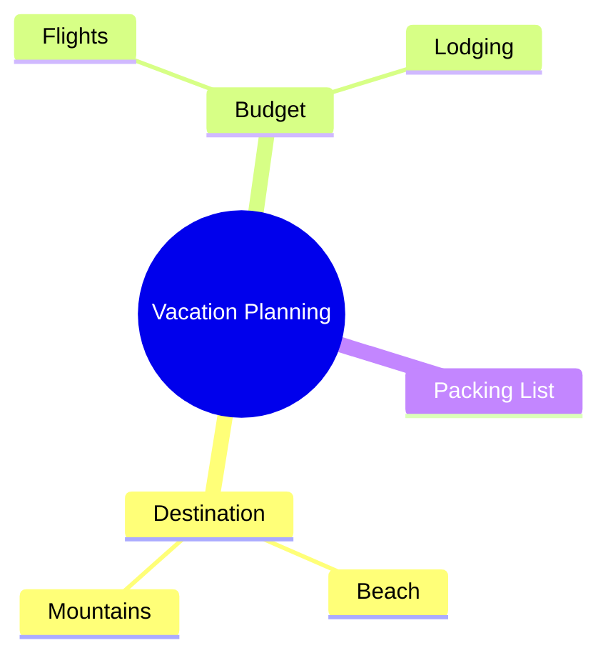
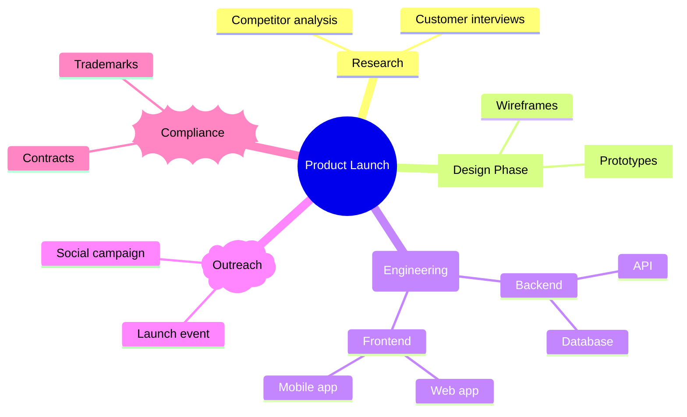

# Mindmap

> **Status:** Stable - introduced v9.2.0 (widely cited in the mermaid release history; the doc page itself does not state an introduction version). The mermaid docs still flag mindmap as an "experimental diagram for now," but call out that the core syntax is stable - only the icon integration is the genuinely experimental part.

## Overview

A mindmap radiates a tree of ideas out from a single root node, using pure indentation to say "this line is a child of that line" - there's no arrow syntax at all. It's the right tool when the content is a hierarchy of loosely related thoughts rather than a sequence of steps or a strict org chart. Mermaid auto-colors each top-level branch, which is what makes a mindmap read faster than an equivalent indented bullet list even though the underlying data is the same shape.

## Best-fit uses

- Brainstorming or outlining ideas radiating from one central topic
- Breaking a broad topic into categories and sub-categories for note-taking
- Visualizing a knowledge tree, taxonomy, or feature breakdown that has no inherent order between siblings

## When NOT to use this

- Steps happen in a defined order or over calendar time - use `timeline.md` instead
- Nodes represent a strict reporting/ownership hierarchy with one well-defined relationship type - a flowchart tree communicates that more precisely
- You need cross-links between branches - mindmap is strictly tree-shaped, no cross-branch edges are possible

## Basic syntax

Every diagram starts with the `mindmap` keyword, then one root node, then children indented under it. Indentation depth - not an arrow - establishes parent/child.

```
mindmap
    Root
        Branch A
            Leaf A1
            Leaf A2
        Branch B
```

Node text can be wrapped in different bracket pairs to pick a shape (id is optional but required if you also want to attach an icon or class):

| Shape | Syntax |
|---|---|
| Default | `bare text`, no brackets |
| Square | `id[text]` |
| Rounded square | `id(text)` |
| Circle | `id((text))` |
| Bang | `id))text((` |
| Cloud | `id)text(` |
| Hexagon | `id{{text}}` |

Icons and classes are each written on their own line, indented at the same level as the node they modify, immediately following it:

```
mindmap
    Root
        A
        ::icon(fa fa-book)
        B(B)
        :::urgent large
```

## Simple example



Three branches hang off a circular root node; each branch can keep growing its own sub-children independently of the others.

## Complex example



This combines five node shapes (circle root, square, rounded, cloud, bang), a class annotation (`:::urgent large`) and an icon annotation (`::icon(...)`) in one tree - showing how shape choice can visually distinguish node "types" (research vs. design vs. legal) at a glance.

## Escaping & special characters

- **Indentation is the entire grammar.** Two sibling lines must share the same leading whitespace; a line indented further than intended silently becomes a grandchild instead of a sibling. Mermaid does auto-correct minor inconsistencies by attaching a line to the nearest ancestor with smaller indentation, but don't rely on that - pick spaces or tabs and stay consistent throughout the diagram.
- Wrap node text in double quotes if it contains characters mermaid would otherwise parse as syntax, e.g. `"Budget: $500"`.
- Use markdown-string form to get `**bold**`/`*italic*` formatting and automatic line wrapping: wrap the label in a backtick immediately inside the double quotes, like this square node -
  ```
  id1["`**Bold intro** then plain text that wraps automatically`"]
  ```
  Without the backtick form, long labels will not auto-wrap and need manual `<br/>` breaks instead.
- Inside a ` ```mermaid ` fence in a markdown document, the fence doesn't care about the mindmap's internal indentation, but keep the block's own indentation relative to the fence consistent so a markdown renderer doesn't dedent (and thereby corrupt) the tree structure.
- **Tested (Mermaid 12.0.0 and 11.16.1):** Unquoted node text breaks on `( ) [ ] { }` because they are shape delimiters - write `id["text"]`; the only character that still needs an escape inside the quotes is `"`, written `#34;`.

## Common pitfalls

- [ ] Did every sibling node use identical leading whitespace (no mixing tabs and spaces)?
- [ ] Did you close every bracket pair for shaped nodes - note bang (`))...((`) and cloud (`)...(`) use opposite-facing parens, easy to swap?
- [ ] Is there exactly one root node at the top of the tree?
- [ ] Are `::icon(...)` and `:::class` lines placed as their own line, indented level with the node they decorate - not appended inline to the node text?
- [ ] If a label contains `:`, `(`, `)`, or `[`, is it quoted (or written as a markdown-string in backticks)?

## v11 fallback

No syntax differences. Every example in this file parses and renders on both Mermaid 12.0.0 and 11.16.1.

## Beta/experimental caveats

The overall outline/shape syntax is stable, but the mermaid docs explicitly call icon integration (`::icon()`) the still-experimental piece - behavior there may change across releases even though the rest of the syntax won't.

## Further reading

- https://mermaid.js.org/syntax/mindmap.html
