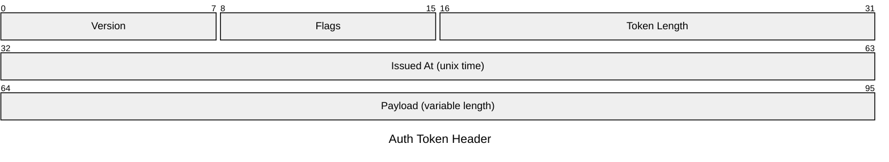
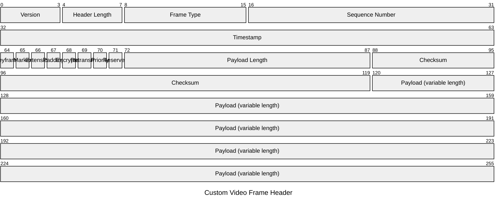

# Packet

> **Status:** Beta - introduced v11.0.0. Syntax may evolve; treat generated diagrams of this type as more likely to need adjustment than stable types.

## Overview
A packet diagram renders a network (or any binary) packet as a labeled bit/byte field map - each row is one field, shown at its exact bit position within the packet. It's the diagram type for documenting wire formats and binary layouts, where a flowchart or class diagram would be the wrong level of abstraction entirely.

## Best-fit uses
- Documenting a network protocol header (TCP/UDP/custom) field-by-field, bit-accurate
- Any fixed-layout binary structure - file formats, hardware registers, serialization formats
- Teaching materials that need to show exact bit offsets and field widths at a glance

## When NOT to use this
- The structure is a general nested data shape without fixed bit positions - a class or ER diagram represents fields/relationships without needing bit math
- You need to show data flowing through processing stages rather than the static shape of one packet - use `sankey.md` or `flowchart.md`
- The fields don't have a meaningful fixed order/offset - a plain table is simpler and avoids implying bit-position precision you don't have

## Basic syntax
Start with `packet`. An optional title can be set either as a YAML frontmatter `title:` value, or as a `title <text>` line directly under the `packet` keyword. Every remaining line is one field:

- **Bit-range field:** `<start>-<end>: "<description>"` - inclusive bit positions (0-indexed), quoted description.
- **Single-bit field:** `<bit>: "<description>"` - one position instead of a range.
- **Auto-width field (v11.7.0+):** `+<count>: "<description>"` - a field that is `<count>` bits wide, starting immediately after the previous field ends. This can be freely mixed with manual `<start>-<end>:` lines in the same diagram.
- `%% comment` lines are supported, same as other Mermaid diagram types.

## Simple example

Three fields use the auto-width `+<count>` shorthand and chain automatically from bit 0, then two fields fall back to manual bit ranges for a fixed-width timestamp and a variable-length payload.

## Complex example

A custom header mixes manual bit ranges for the first two fields with a long run of `+<count>` auto-width fields - including seven consecutive single-bit flags plus a checksum - before a final manual range picks up exactly where the last `+<count>` field left off (bit 120) to close out a variable-length payload.

## Escaping & special characters
- Field descriptions must be wrapped in double quotes; an unquoted description containing a space will break the field's bit-range parsing.
- A literal `"` inside a field description should be avoided or rephrased - there's no documented escape sequence for it in this diagram type.
- Bit ranges and `+<count>` values must be plain integers with no units, spaces, or thousands separators.
- Inside a ```mermaid fence in markdown, no extra escaping is needed beyond avoiding literal triple backticks inside a description.
- **Tested (Mermaid 12.0.0 and 11.16.1):** Field labels must always be quoted (`+8: "Version"`); the only character that still needs an escape inside the quotes is `"`, written `#34;`.

## Common pitfalls
- [ ] Do manual bit ranges (`start-end:`) actually start where the previous field left off - no accidental gaps or overlaps?
- [ ] When mixing `+<count>` fields with manual ranges, does the next manual range's `start` correctly account for however many bits the preceding `+<count>` fields consumed?
- [ ] Is every field description wrapped in double quotes?
- [ ] Are bit positions 0-indexed and inclusive on both ends of a range, as intended?
- [ ] If the packet has a variable-length trailing field, is that communicated in the description text (there's no dedicated "variable length" token)?

## v11 fallback

- **`+<count>` auto-width bits** needs v11.7.0+; use explicit `start-end:` ranges when the target may be older.

## Beta/experimental caveats
Requires Mermaid v11.0.0 or later (confirmed directly on the doc page's own title, "Packet Diagram (v11.0.0+)"). The `+<count>` auto-width bits-syntax specifically requires v11.7.0+ - call this out explicitly if targeting an older pinned Mermaid version, since manual `start-end:` ranges are the only option before then. Note that the canonical keyword confirmed on the current doc page is plain `packet`, not `packet-beta` (the `-beta` form is still accepted as a legacy alias per the diagram detector in the mermaid-js/mermaid source, but isn't what the docs themselves use).

## Further reading
- https://mermaid.js.org/syntax/packet.html
