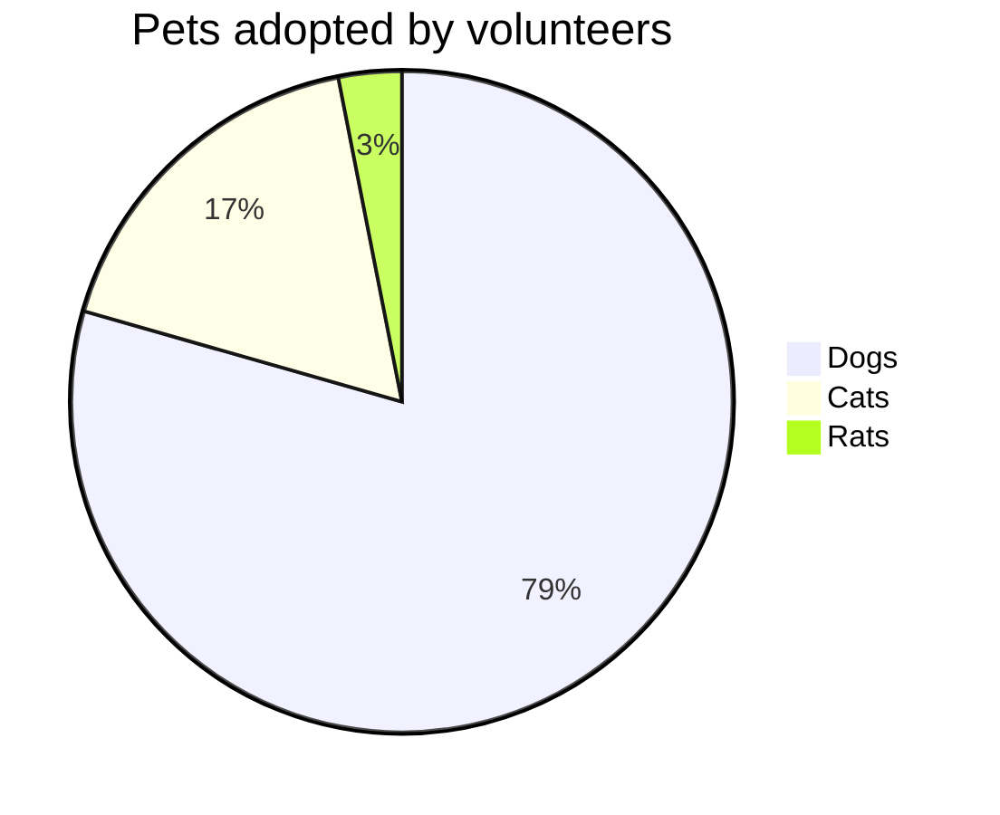
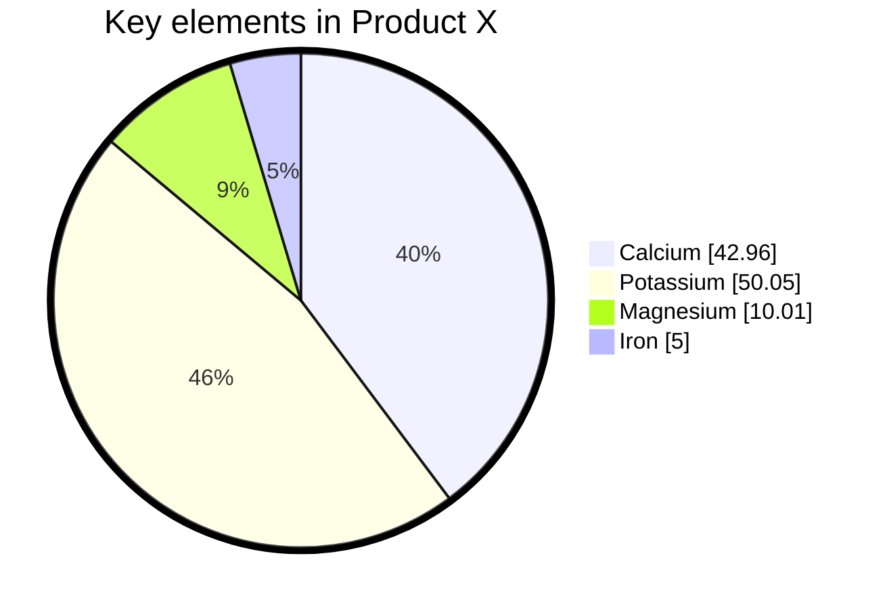

# Pie Chart

> **Status:** Stable - introduced long-standing (pre-v10).

## Overview
A pie chart shows how a whole splits into labeled proportional slices, each backed by a plain numeric value that mermaid converts into percentages automatically. The mental model is "parts of one total" - every value must be positive, and mermaid handles the arc-angle math, ordering slices clockwise from the top. It's a static, single-series chart: one label maps to one number, nothing more.

## Best-fit uses
- Showing relative share of a single total across a handful of categories
- Quick proportional breakdowns (survey results, budget splits, composition data) where exact category count is small
- Cases where you want the actual data values displayed alongside the chart via `showData`

## When NOT to use this
- You have more than roughly 6-8 categories - slices become unreadable; consider a table or bar-style visualization outside mermaid
- You need to compare multiple series or show change over time - pie has no axis or time dimension, unlike `gantt.md` or `quadrant.md`
- Values can be zero, negative, or need multi-dimensional comparison - pie requires positive numbers and a single dimension

## Basic syntax
Start with `pie`, optionally followed by `showData` on the same line to print each slice's raw value next to its legend entry. An optional `title <text>` line follows. Then one line per slice:

```
pie [showData]
    title <optional title>
    "<label>" : <positive number>
    "<label>" : <positive number>
```

Labels must be quoted strings; values are positive numbers (up to two decimal places) - negative or zero values are rejected.

## Simple example


Three slices sized proportionally to 386/85/15; mermaid computes each percentage and clockwise arc automatically.

## Complex example


A YAML frontmatter block sets `pie`-specific config (`textPosition` moves labels toward/away from center, `donutHole` punches a hole to render as a donut chart, `highlightSlice` calls out the "Potassium" slice) plus a `themeVariables` override for the outer stroke width; `showData` on the `pie` line prints each numeric value next to its label.

## Escaping & special characters
- Labels must be wrapped in double quotes - a label containing a literal `"` needs it escaped or removed, since the parser uses quotes to delimit the label text.
- `:` after the closing quote is the fixed separator before the value; don't put a colon inside the quoted label unless you intend it as literal label text (quoting protects it from being read as the separator).
- Values only accept digits and up to two decimal places - no currency symbols, commas as thousands separators, or units inline; put units in the title or a separate legend instead.
- A YAML frontmatter block above `pie` (for `config`/`themeVariables`) is standard YAML - quote any string value containing `:` or other YAML-special characters.
- Inside a ` ```mermaid ` fence in markdown, nothing in pie syntax needs backtick escaping; just avoid literal triple backticks in label text, using a four-backtick outer fence if unavoidable.
- **Tested (Mermaid 12.0.0 and 11.16.1):** Quote slice labels; the only character that still needs an escape inside the quotes is `"`, written `#34;`. In an unquoted title, a `<`...`>` pair is read as an HTML tag and silently dropped, so write both as `#60;` and `#62;`.

## Common pitfalls
- [ ] Is every label wrapped in double quotes?
- [ ] Are all values strictly positive (no zero, no negative)?
- [ ] Is the `:` separator placed directly after the closing quote, before the value?
- [ ] If using `showData`, is it on the same line as `pie` (not a separate directive)?
- [ ] If overriding `pie`-scoped config (`textPosition`, `donutHole`, `legendPosition`, `highlightSlice`), is it inside a valid YAML frontmatter `config.pie` block, not loose text in the diagram body?
- [ ] Does the slice count stay small enough to remain readable (roughly under 8)?

## v11 fallback

No syntax differences. Every example in this file parses and renders on both Mermaid 12.0.0 and 11.16.1.

## Beta/experimental caveats
N/A - stable diagram type, no known compatibility caveats.

## Further reading
- https://mermaid.js.org/syntax/pie.html
