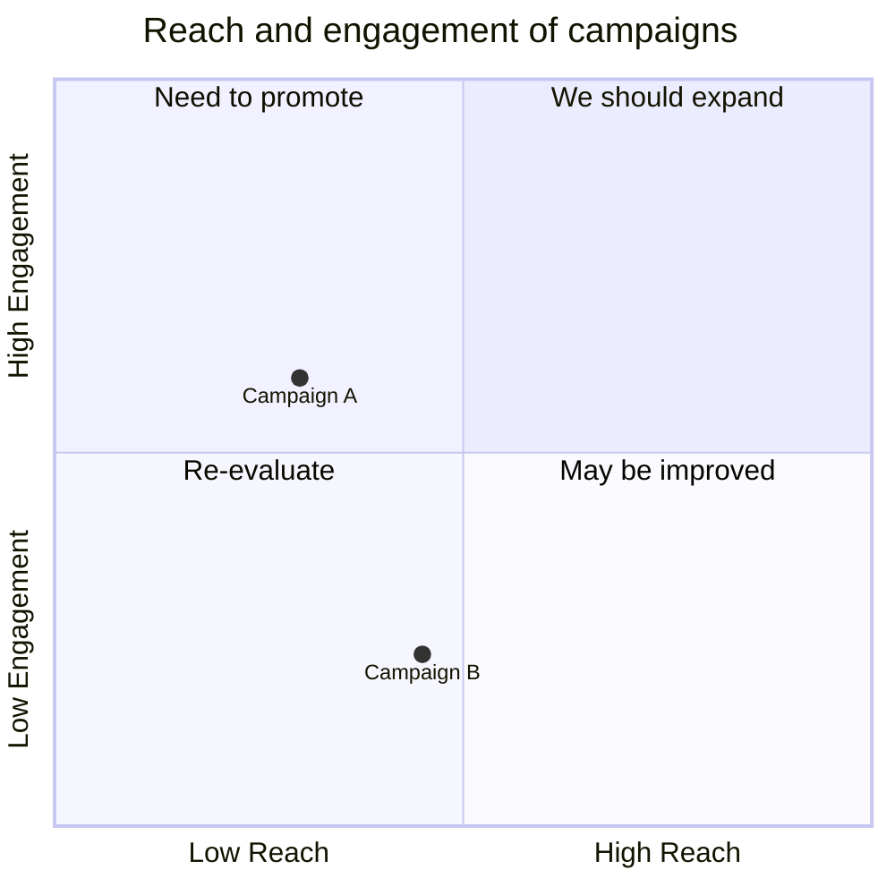
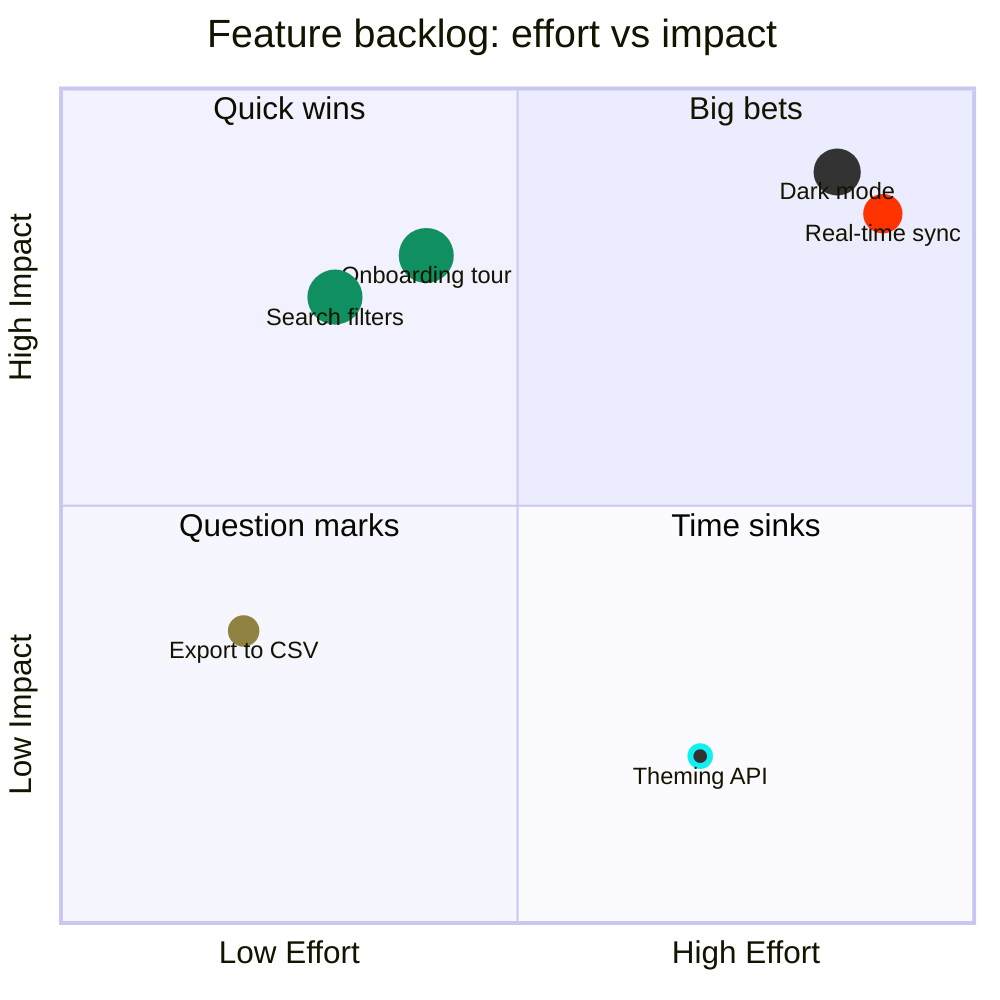

# Quadrant Chart

> **Status:** Stable - introduced v10.2.0.

## Overview
A quadrant chart plots labeled points on a two-axis grid divided into four named quadrants, letting you position items by two independent scores (e.g. reach vs. engagement, urgency vs. importance) and read off which strategic bucket each one lands in. The mental model is a scatter plot with meaning baked into its four corners rather than a continuous trend line - placement relative to the center, not exact coordinates, is what communicates.

## Best-fit uses
- Prioritization matrices like an Eisenhower grid (urgent/important) or effort-vs-impact analysis
- Comparing many discrete items (campaigns, features, risks) across exactly two independent dimensions at once
- Portfolio or positioning maps where the four named regions carry distinct strategic meaning

## When NOT to use this
- You're comparing more than two dimensions per item - a quadrant chart only supports x/y; consider a table
- You need chronological ordering rather than a static two-axis snapshot - use `gantt.md` or `timeline.md`
- The categories are hierarchical/associative rather than positional - use `flowchart.md` or `mindmap`

## Basic syntax
Start with `quadrantChart`. Optional `title <text>`. Axis labels: `x-axis <left label> --> <right label>` (or just `x-axis <left label>` for a single label), same pattern for `y-axis` (bottom --> top). Name each corner: `quadrant-1` (top-right), `quadrant-2` (top-left), `quadrant-3` (bottom-left), `quadrant-4` (bottom-right). Plot points as:

```
<point label>: [<x>, <y>]
```

where x and y are numbers between 0 and 1. Points can carry inline styling (`radius:`, `color:`, `stroke-width:`, `stroke-color:`) or a class via `<label>:::<className>`, with matching `classDef <className> <properties>` lines.

## Simple example


Campaign A sits left-of-center on reach but above-center on engagement, landing it in the "Need to promote" (top-left) quadrant.

## Complex example


Eight-plus features are scored on effort (x) and impact (y); two `classDef` blocks (`highImpact`, `lowEffort`) apply shared styling to several points via the `:::className` shorthand, while other points use one-off inline `radius`/`color`/`stroke-*` styling directly on the point line.

## Escaping & special characters
- Point labels ending in `:::<className>` reserve that token for class assignment - a label needing a literal `:::` sequence should be avoided or rephrased.
- `[x, y]` coordinates must be plain numbers between 0 and 1; no units or extra characters inside the brackets.
- Axis/quadrant labels containing special characters (emoji, non-ASCII, or symbols like `<`, `>`) generally render fine unquoted, but wrap the label in double quotes if it contains characters the parser could otherwise misread as syntax (e.g. `-->`, `:`).
- A YAML frontmatter block above `quadrantChart` for `config.quadrantChart` or `themeVariables` (e.g. `quadrant1TextFill`) is standard YAML - quote string values containing `:`.
- Inside a ` ```mermaid ` fence in markdown, nothing in quadrant syntax needs backtick escaping; avoid literal triple backticks in label text, or use a four-backtick outer fence if unavoidable.
- **Tested (Mermaid 12.0.0 and 11.16.1):** Point names containing `: | ( ) [ ] { } ; " < >` must be written quoted (`"name": [x, y]`) or with `#<n>;` codes; inside the quotes still escape `"` and a `<`...`>` pair is read as an HTML tag and silently dropped, so write both as `#60;` and `#62;`. In the title, a `<`...`>` pair is read as an HTML tag and silently dropped, so write both as `#60;` and `#62;`.

## Common pitfalls
- [ ] Are all point coordinates between 0 and 1 (not raw/unnormalized numbers)?
- [ ] Are `quadrant-1` through `quadrant-4` mapped to the corners you expect (1=top-right, 2=top-left, 3=bottom-left, 4=bottom-right)?
- [ ] Does the arrow in axis labels use exactly `-->` (not `->` or `=>`)?
- [ ] If using class-based styling, does every `:::className` reference a `classDef` that's actually declared?
- [ ] Did you avoid mixing inline point styling and a `:::className` class on the same point in conflicting ways?
- [ ] Is a label with special characters (`:`, `-->`) quoted to avoid parser ambiguity?

## v11 fallback

No syntax differences. Every example in this file parses and renders on both Mermaid 12.0.0 and 11.16.1.

## Beta/experimental caveats
N/A - stable diagram type, no known compatibility caveats.

## Further reading
- https://mermaid.js.org/syntax/quadrantChart.html
