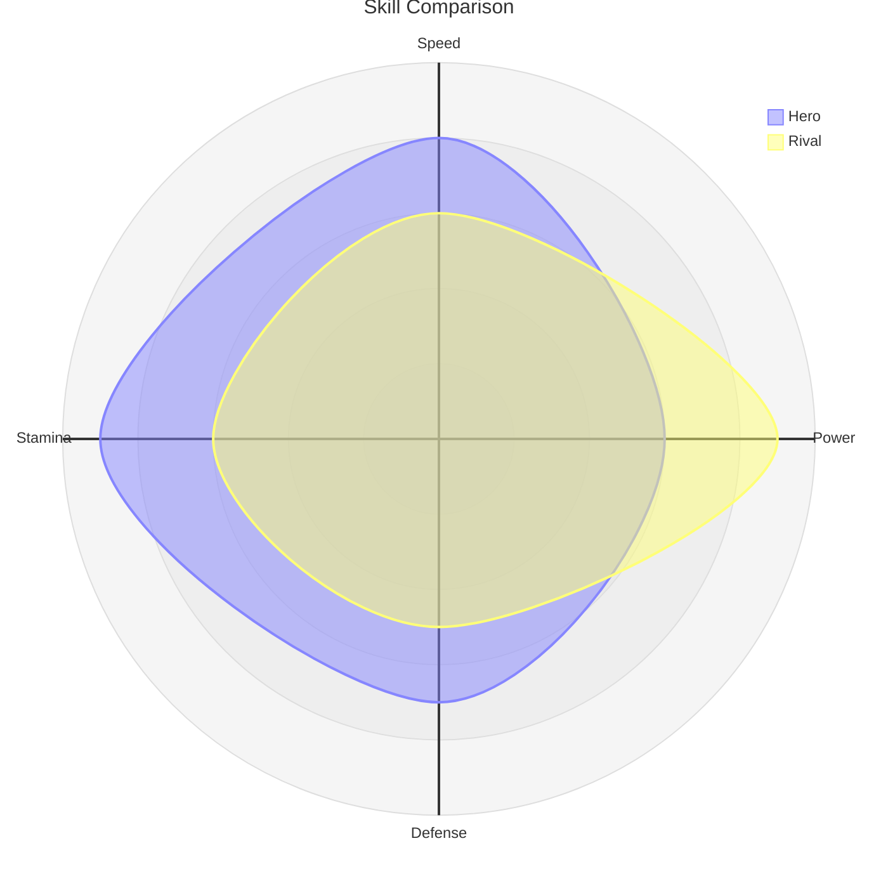
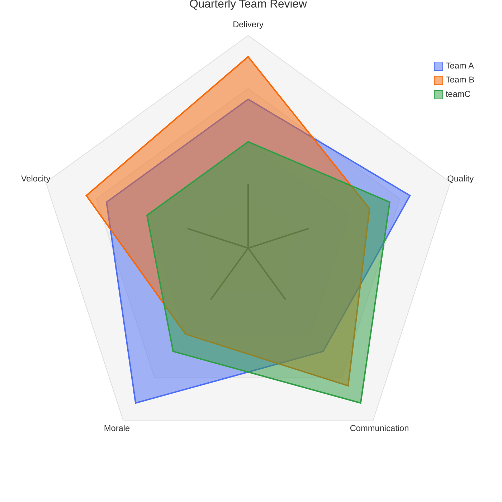

# Radar

> **Status:** Beta - introduced v11.6.0. Syntax may evolve; treat generated diagrams of this type as more likely to need adjustment than stable types.

## Overview
A radar diagram (also called a spider or star chart) plots one or more series across three or more shared axes arranged around a circle, so each series becomes a closed polygon whose shape communicates relative strengths and weaknesses across dimensions at a glance. It's the multi-axis generalization of a quadrant chart's two-axis positioning.

## Best-fit uses
- Comparing multiple items across three or more shared criteria (skills, product features, scores)
- Visualizing a single entity's profile across many dimensions at once (e.g. a character's stat sheet)
- Side-by-side comparison of a handful of series where shape/coverage matters more than exact values

## When NOT to use this
- You only have two dimensions to compare - use `quadrant.md` instead, it's clearer for exactly two axes
- Dimensions aren't naturally cyclical/comparable on the same scale - a bar chart or table communicates better
- You need to show change over time rather than a multi-axis snapshot - use `timeline.md` or `gantt.md`

## Basic syntax
Start with `radar-beta`. Optional `title <text>` line (or a YAML frontmatter `title:` above the diagram). Declare axes and curves:

- **Axis:** `axis <id>["<Label>"]` - label is optional; multiple axes can share one line comma-separated: `axis a["A"], b["B"]`. Axes can also be declared bare with no labels: `axis A, B, C, D, E`.
- **Curve:** `curve <id>["<Label>"]{<v1>, <v2>, ...}` - values in positional order matching axis declaration order, or as key/value pairs referencing axis ids: `curve id{ axisB: 30, axisA: 20 }`. Label is optional.
- **Scale:** `max <n>` and `min <n>` set the shared value range (min defaults to 0; max auto-calculates if omitted).
- **Grid shape:** `graticule circle` or `graticule polygon`.
- **Other options:** `showLegend true|false` (default true), `ticks <n>` (number of concentric rings, default 5), plus layout knobs (`width`, `height`, margins) and per-curve color via `themeVariables.cScaleN` in a config block.

## Simple example

Two series (`Hero`, `Rival`) are scored 0–10 across four axes; each renders as a closed polygon so their strengths and weaknesses are visually comparable.

## Complex example

Three teams are compared across five axes; the config frontmatter overrides curve colors and grid tension, `teamC` uses key/value curve syntax instead of positional values, and the grid is rendered as a polygon graticule with 4 rings.

## Escaping & special characters
- Axis/curve labels use `["..."]` bracket syntax - wrap in double quotes if the label contains a comma, colon, or curly brace, since those are structurally significant elsewhere in the syntax.
- Curve value lists use `{ }` - key/value entries need a colon after the axis id (`axisId: value`); mixing positional and key/value forms in the same curve line is unsupported, pick one style per curve.
- A YAML frontmatter block (`---` fences) above `radar-beta` follows standard YAML escaping - quote hex colors and any string containing `:`.
- Inside a ```mermaid fence, no extra escaping is needed beyond avoiding literal triple backticks in labels.
- **Tested (Mermaid 12.0.0 and 11.16.1):** Quote axis and curve labels (`axis a["text"]`); the only character that still needs an escape inside the quotes is `"`, written `#34;`.

## Common pitfalls
- [ ] Does every curve supply exactly as many values as there are axes (or fully qualify each with an axis id)?
- [ ] Are you mixing positional and key/value syntax within a single curve's `{ }` block?
- [ ] Is `max` set high enough to contain your largest value (Mermaid won't clip, but an unset max auto-calculates and may surprise you)?
- [ ] Did you pick `graticule polygon` vs `circle` deliberately - polygon emphasizes per-axis comparison, circle emphasizes overall coverage?
- [ ] Are axis ids referenced in key/value curves spelled exactly as declared in the `axis` lines?
- [ ] Is `showLegend` needed - with many curves, an on-by-default legend can crowd a small canvas?

## v11 fallback

No syntax differences. Every example in this file parses and renders on both Mermaid 12.0.0 and 11.16.1.

## Beta/experimental caveats
Radar diagrams are beta as of v11.6.0; axis/curve grammar, default tick count, and config option names may still change in minor releases. When delivering this diagram type, note it requires Mermaid v11.6.0 or later and that generated output should be spot-checked against the target renderer.

## Further reading
- https://mermaid.js.org/syntax/radar.html
