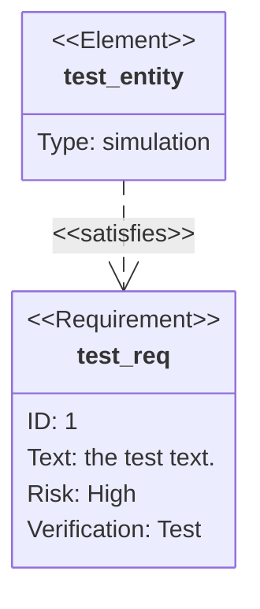
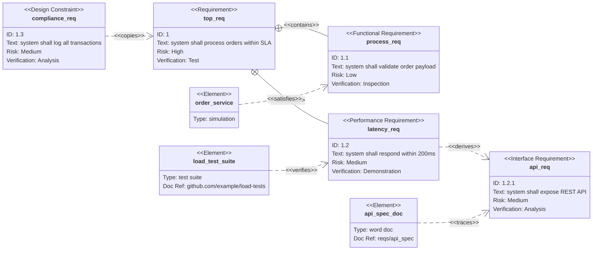

# Requirement Diagram

> **Status:** Stable - introduced v8.9.2.

## Overview
A requirement diagram models formal requirements (in the style of SysML) as typed blocks - each carrying an id, descriptive text, a risk level, and a verification method - and connects them to each other and to real-world elements (documents, test suites, subsystems) via typed relationships like "satisfies" or "verifies". The mental model is traceability: it answers "which artifact fulfills which requirement, and how was that confirmed" rather than depicting process flow or structure the way a flowchart or class diagram would.

## Best-fit uses
- Tracing formal requirements to the elements (designs, tests, documents) that satisfy or verify them
- Documenting requirement hierarchies via containment/derivation (a requirement broken into sub-requirements)
- Recording verification method and risk level alongside each requirement for audit or compliance purposes

## When NOT to use this
- You're modeling class/interface structure rather than requirements traceability - use `class.md`
- You need general-purpose flow logic between arbitrary nodes - use `flowchart.md`, which doesn't carry requirement-specific typed fields
- The relationships are conversational/temporal (who calls whom, in what order) - use `sequence.md`

## Basic syntax
Start with `requirementDiagram`. An optional `direction <TB|BT|LR|RL>` line sets layout (default `TB`). Define a requirement block using one of six types - `requirement`, `functionalRequirement`, `interfaceRequirement`, `performanceRequirement`, `physicalRequirement`, `designConstraint` - each with a name and a brace-delimited body:

```
<type> <name> {
    id: <id>
    text: <description>
    risk: <Low|Medium|High>
    verifymethod: <Analysis|Inspection|Test|Demonstration>
}
```

Define an `element` similarly, with user-defined fields such as `type` and optional `docRef`:

```
element <name> {
    type: <text>
    docRef: <text>
}
```

Relate two blocks with a typed relationship arrow, in either direction:

```
<source> - <relationship> -> <destination>
<destination> <- <relationship> - <source>
```

Valid relationship types: `contains`, `copies`, `derives`, `satisfies`, `verifies`, `refines`, `traces`.

## Simple example


One requirement and one element, linked by a single "satisfies" relationship read as "test_entity satisfies test_req".

## Complex example


This combines four requirement types, three elements (one with a `docRef`), a `direction LR` override, and six relationships spanning containment, derivation, satisfaction, verification, tracing, and copying - showing a full traceability tree from one top-level requirement down through sub-requirements to their verifying artifacts.

## Escaping & special characters
- Names used as identifiers (before `{`) should stay alphanumeric/underscore since they're referenced bare in relationship lines; wrap free text values (`text:`, `type:`, `docRef:`) in double quotes if they contain spaces-adjacent punctuation or characters the parser could misread, e.g. `text: "*italicized* **bold**"`.
- Quoted field values support inline markdown formatting (`*italic*`, `**bold**`).
- The relationship arrow tokens (`-`, `->`, `<-`) are reserved syntax - don't use a literal `-` adjacent to a relationship keyword in a way that could be misparsed as part of the arrow.
- A literal `:` inside an unquoted field value (e.g. `docRef: github.com/user/repo`) is generally fine since these are simple bare tokens, but if the value contains spaces or other special characters, quote it.
- Inside a ` ```mermaid ` fence in markdown, nothing in requirement-diagram syntax needs backtick escaping; avoid literal triple backticks in any text field, or use a four-backtick outer fence if unavoidable.
- **Tested (Mermaid 12.0.0 and 11.16.1):** Quote the `text:` value; the only character that still needs an escape inside the quotes is `"`, written `#34;`.

## Common pitfalls
- [ ] Does every requirement/element block close its `{ ... }` on its own and include all expected fields?
- [ ] Is `risk` one of exactly `Low`, `Medium`, `High` (case as documented)?
- [ ] Is `verifymethod` one of exactly `Analysis`, `Inspection`, `Test`, `Demonstration`?
- [ ] Are relationship lines using a real relationship keyword (`contains`, `copies`, `derives`, `satisfies`, `verifies`, `refines`, `traces`) between the dashes/arrow?
- [ ] Do both ends of every relationship reference names that were actually declared as a `requirement`/`element` type?
- [ ] If a field value has spaces or punctuation, is it wrapped in double quotes?

## v11 fallback

- **Default appearance:** v12 draws this type with the `neo` look and the `redux-color` theme by default, laid out by ELK instead of dagre; v11 draws it with the `classic` look and the `default` theme and dagre layout. The diagram source is identical - only the rendering differs. `general/v11-compatibility.md` shows how to make v12 draw the v11 appearance.

## Beta/experimental caveats
N/A - stable diagram type, no known compatibility caveats.

## Further reading
- https://mermaid.js.org/syntax/requirementDiagram.html
