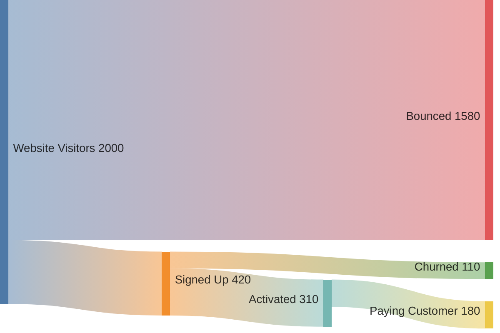
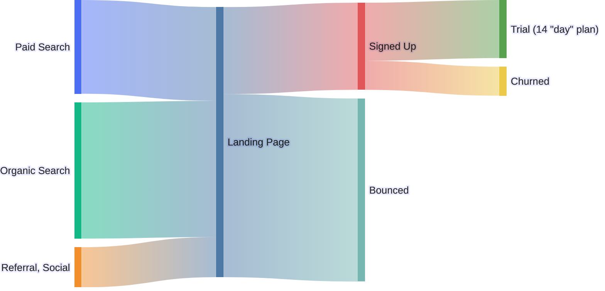

# Sankey

> **Status:** Beta - introduced v10.3.0. Syntax may evolve; treat generated diagrams of this type as more likely to need adjustment than stable types.

## Overview
A Sankey diagram shows a flow moving between named stages as a set of proportionally-weighted bands: the wider the band, the larger the quantity flowing from one node to the next. It's built almost entirely on a 3-column CSV table (source, target, value) rather than a bespoke node/edge grammar, which makes it easy to generate from tabular data but limits it to that fixed shape.

## Best-fit uses
- Showing how a quantity splits, merges, or drains away as it passes through stages (funnels, energy/material flows, budget allocation)
- Visualizing conversion or attrition across a multi-step pipeline (traffic source to signup to activation to churn)
- Any dataset that's naturally already a `source,target,value` table

## When NOT to use this
- The data is a strict nested hierarchy with no shared/converging paths - `treemap.md` shows part-to-whole proportion more clearly when there's no flow between siblings
- You need a single snapshot of static proportions rather than movement between stages - a pie chart or treemap communicates that with less visual noise
- You need arbitrary graph topology (cycles, multiple edge types) - Sankey expects a directed, mostly acyclic flow

## Basic syntax
Start the diagram body with the `sankey` keyword, then a blank line, then plain CSV rows - no bracket or arrow syntax at all:

```
sankey

<source>,<target>,<value>
```

- The CSV must have **exactly 3 columns**: source, target, value. A node is simply any string that appears in the source or target column - nodes aren't declared separately, and the same spelling always refers to the same node.
- Blank lines between rows are allowed and ignored (useful for visually grouping related rows).
- A value containing a comma must be wrapped in double quotes: `"Heating, homes"`.
- A literal double quote inside a quoted value is written as a doubled pair: `""`.
- A `%%` line is a comment, same as other Mermaid diagram types.

Config lives under `sankey:` in a YAML frontmatter block (or `mermaid.initialize`), and supports:

| Option | Values |
|---|---|
| `showValues` | `true`/`false` - show the numeric value next to each node |
| `linkColor` | `source`, `target`, `gradient`, or a hex color |
| `nodeAlignment` | `justify`, `center`, `left`, `right` |
| `width`, `height` | pixel dimensions |
| `labelStyle` (v11.15.0+) | `legacy` (default, plain text) or `outlined` (background stroke) |
| `nodeWidth`, `nodePadding` (v11.15.0+) | node rectangle width / vertical gap between nodes, in pixels |
| `nodeColors` (v11.15.0+) | a map of node name → CSS color, for nodes not covered by the default palette |

## Simple example

Five rows describe a signup funnel: visitors either sign up or bounce, and signups either activate or churn, ending in a smaller paying-customer band.

## Complex example

A frontmatter `config` block sets link coloring, node alignment, outlined labels, and per-node colors for two of the acquisition-channel nodes. Row groups are separated by blank lines for readability, one source value uses quoted-comma escaping (`"Referral, Social"`), and one target value demonstrates the doubled-quote escape for a literal `"` inside a quoted field.

## Escaping & special characters
- Any value containing a comma must be double-quoted, or the CSV parser will misread it as an extra column and the "3 columns only" rule will be violated.
- A literal `"` inside a quoted value is written as `""` (standard CSV double-quote escaping).
- Node names are matched by exact string - trailing whitespace or inconsistent capitalization silently creates a second, separate node instead of merging into the existing one.
- YAML frontmatter above `sankey` follows normal YAML quoting rules - quote any `nodeColors` key that itself contains a comma or colon.
- Inside a ```mermaid fence in markdown, nothing about Sankey's CSV syntax needs backtick escaping; just avoid a literal blank first line being mistaken for the diagram's required blank line before data.
- **Tested (Mermaid 12.0.0 and 11.16.1):** Node names accept ASCII letters, digits and spaces only: `#`, non-ASCII characters and `<` cannot be used, quoted or not (`<` also corrupts the SVG). A comma needs the field in quotes, and a literal `"` is doubled (`""`).

## Common pitfalls
- [ ] Does every data row have exactly 3 comma-separated fields (source, target, value)?
- [ ] Are values containing a comma wrapped in double quotes, and is a literal `"` inside one doubled (`""`)?
- [ ] Are node name spellings byte-for-byte identical everywhere the same node should appear (case, whitespace)?
- [ ] Is the `value` column strictly numeric - no currency symbols, thousands separators, or units baked into the CSV value?
- [ ] If using `nodeColors`, do the map keys exactly match node names used in the data rows?
- [ ] Is the `sankey:` config block correctly nested under a YAML `config:` key at the top of the frontmatter, not a sibling of it?

## v11 fallback

- **`labelStyle`, `nodeWidth`, `nodePadding`, `nodeColors`** need v11.15.0+; omit them when the target may be older.

## Beta/experimental caveats
Mermaid's own docs label Sankey "an experimental diagram" whose CSV-like syntax is expected to be extended over time - treat generated Sankey diagrams as more likely than stable types to need a syntax tweak on a future Mermaid upgrade. Requires Mermaid v10.3.0 or later; `labelStyle`, `nodeWidth`, `nodePadding`, and `nodeColors` additionally require v11.15.0+. Note: the legacy keyword `sankey-beta` is still accepted (cross-checked against the diagram detector in the mermaid-js/mermaid source, not stated on the doc page itself) - the current canonical keyword shown in every example on the doc page is plain `sankey`, without the `-beta` suffix.

## Further reading
- https://mermaid.js.org/syntax/sankey.html
