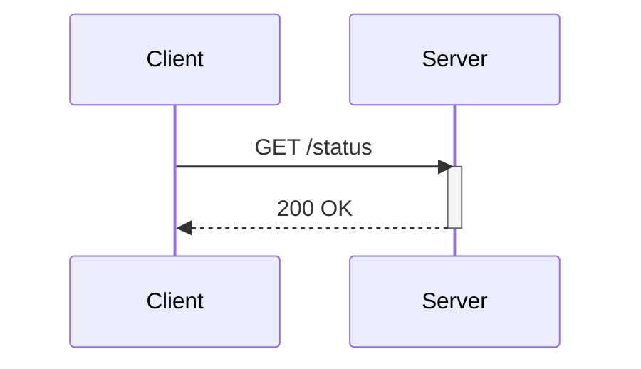
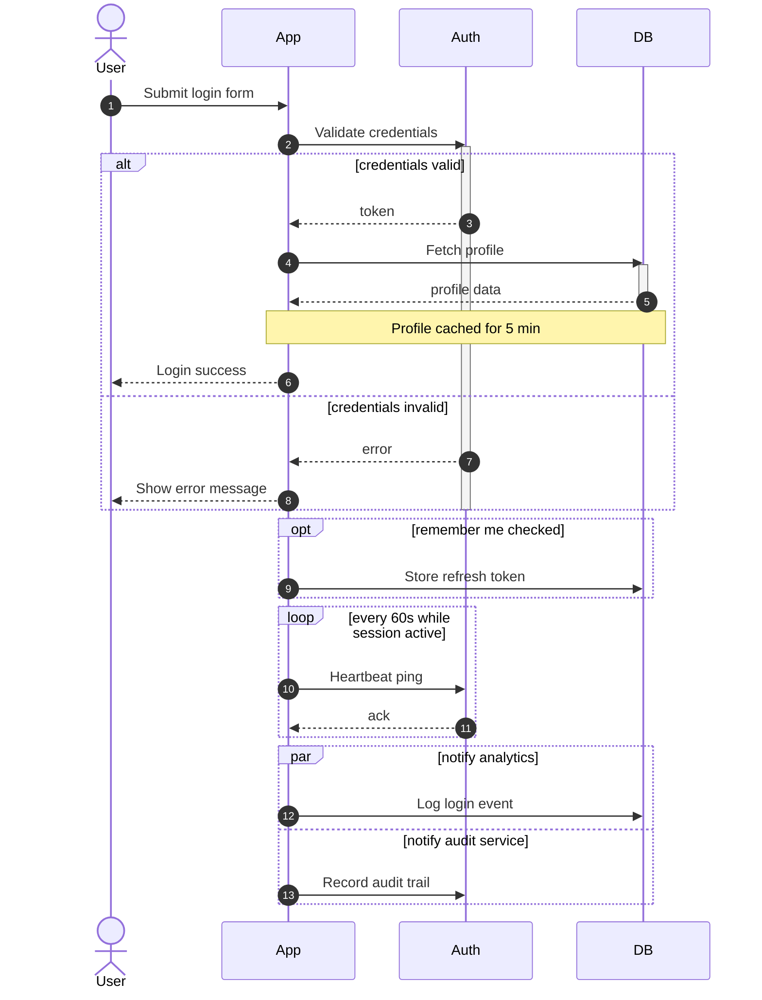

# Sequence Diagram

> **Status:** Stable - introduced long-standing (pre-v10).

## Overview
A sequence diagram shows a time-ordered exchange of messages between named participants - actors, services, or objects - read top-to-bottom as a shared timeline with each participant's lifeline running down the page. Optional constructs layer in activation bars, conditional branches, loops, and parallel regions on top of that timeline. The core mental model is "who talks to whom, in what order, and what happens conditionally along the way."

## Best-fit uses
- Documenting the order of calls or messages between services or actors
- Mapping an API request/response flow, including auth handoffs
- Illustrating conditional or looping message flows (`alt`/`opt`/`loop`/`par`)
- Walking through a multi-step user-and-system interaction for onboarding docs

## When NOT to use this
- An object's internal states and valid transitions over time - see `state.md` instead.
- Branching decision logic with no timeline of communicating actors - see `flowchart.md` instead.
- Static structural relationships between types - see `class.md` instead.

## Basic syntax
- Start keyword: `sequenceDiagram`.
- Participants: `participant id [as alias]`, `actor id [as alias]`; group with `box [color] ... end`.
- Messages: `->` solid no arrowhead, `-->` dashed no arrowhead, `->>` solid arrowhead, `-->>` dashed arrowhead, `-x`/`--x` solid/dashed with cross, `-)`/`--)` solid/dashed async, `<<->>`/`<<-->>` bidirectional.
- Activation: `activate id` / `deactivate id`, or the `+`/`-` shorthand suffix on an arrow's target/source.
- Blocks (all require a matching `end`): `loop text ... end`, `alt text ... else text ... end`, `opt text ... end`, `par text ... and text ... end`, `critical text ... option text ... end`, `break text ... end`.
- Notes: `Note right of id: text`, `Note left of id: text`, `Note over id1,id2: text`.
- `autonumber` turns on automatic message numbering from that point.
- Comments: `%% comment text`.

## Simple example

The `+`-free `activate`/`deactivate` pair explicitly brackets `Server`'s active lifetime; `-->>` is a dashed reply arrow, conventionally used for responses.

## Complex example

`actor User` renders as a stick figure instead of a box; `alt/else` forks the flow into mutually exclusive branches, each closing its own `activate`/`deactivate` pair; `par/and` shows two message flows happening concurrently rather than sequentially.

## Escaping & special characters
- Use entity codes for punctuation that collides with the message/note grammar, e.g. `#35;` for `#`, `#59;` for a literal semicolon inside message text.
- The literal word `end` appearing as message or note text must be wrapped, e.g. `(end)`, `[end]`, or `{end}`, so it isn't parsed as a block terminator.
- Avoid a literal triple-backtick sequence inside message/note text; if unavoidable, bump the *outer* fence wrapping this whole mermaid block to four backticks.
- **Tested (Mermaid 12.0.0 and 11.16.1):** In participant aliases, message text, notes and titles a `#` or `;` is cut or lost - write `#35;` and `#59;`. In a title, a `<`...`>` pair is read as an HTML tag and silently dropped, so write both as `#60;` and `#62;`.

## Common pitfalls
- Forgetting the closing `end` for any `loop`/`alt`/`opt`/`par`/`critical`/`break` block.
- Mismatched `activate`/`deactivate` pairs - every explicit `activate` needs its `deactivate`, or use the `+`/`-` arrow shorthand consistently instead.
- Using `->` (no arrowhead) where a directional `->>` was actually intended.
- Assuming participant left-to-right order - it follows first-appearance order in the diagram body unless participants are declared up front, which can produce a confusing layout.
- Placing `else`, `and`, or `option` without a matching `alt`, `par`, or `critical` block opener.
- Leaving the literal word `end` unescaped in message text, breaking block parsing.

## v11 fallback

- **Default appearance:** v12 draws this type with the `neo` look and the `redux-color` theme by default; v11 draws it with the `classic` look and the `default` theme. The diagram source is identical - only the rendering differs. `general/v11-compatibility.md` shows how to make v12 draw the v11 appearance.

## Beta/experimental caveats
N/A - stable diagram type, no known compatibility caveats. Half-arrow message variants and inline JSON actor stereotypes/aliases are later additive syntax (v11.12+/v11.15+) layered on top of the same stable core grammar.

## Further reading
- https://mermaid.js.org/syntax/sequenceDiagram.html
