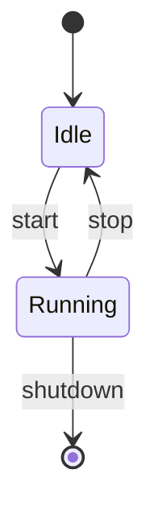
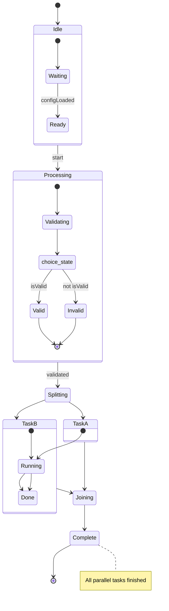

# State Diagram

> **Status:** Stable - introduced long-standing (pre-v10).

## Overview
A state diagram models a finite-state machine: the distinct states an entity can occupy, and the events or transitions that move it from one state to another, including start/end pseudo-states, nested composite states, and parallel regions. The core mental model is "what mode is this thing currently in, and what triggers a move to a different mode" - a very different question from a sequence diagram's "who said what, in what order."

## Best-fit uses
- Modeling a finite state machine's states and valid transitions
- Documenting a record's lifecycle (e.g. an order moving Draft to Approved to Archived)
- Showing composite/nested states with internal sub-states
- Representing concurrent state regions or branching via a choice pseudostate

## When NOT to use this
- Chronological messages exchanged between multiple actors - see `sequence.md` instead.
- Static type structure and relationships - see `class.md` instead.
- A generic branching process with no persistent "current state" notion - see `flowchart.md` instead.

## Basic syntax
- Start keyword: `stateDiagram-v2` (the recommended, modern renderer). The bare `stateDiagram` keyword still works but selects the older legacy renderer, kept only for backward compatibility.
- Direction: `direction TB` / `LR` / `BT` / `RL`.
- State declaration: a bare id used directly in a transition, or `state "Description text" as id` to give a multi-word description its own short id.
- Transition: `StateA --> StateB : event label`.
- Start/end pseudostates: `[*] --> StateA` (entry) and `StateA --> [*]` (exit).
- Composite state: `state id { ...nested transitions... }`.
- Choice: `state choice_id <<choice>>`, then branch transitions out of `choice_id`.
- Fork/join: `state fork_id <<fork>>` / `state join_id <<join>>`.
- Notes: single line `note right of StateA : text`; multi-line block `note right of StateA` ... `end note`.
- Styling: `classDef name ...`, applied with `class id name` or the shorthand `id:::name`.
- Comments: `%% comment text`.

## Simple example

`[*]` on the left of the first line is the initial pseudostate; `[*]` on the right of the last transition marks a valid exit point, not a literal state.

## Complex example

`Idle` and `Processing` are composite states with their own internal `[*]` entry points; `choice_state` fans a single transition out into two mutually exclusive branches based on a guard condition in the label; `Splitting`/`Joining` fork into `TaskA`/`TaskB` running in parallel and rejoin before `Complete`.

## Escaping & special characters
- For labels with spaces or punctuation, declare a short id separately (`state "Long description, with punctuation" as S1`) and reference `S1` in transitions rather than embedding the raw text inline.
- Use HTML entity codes for characters that collide with the grammar (e.g. `#35;` for `#`), the same convention used across other Mermaid diagram types.
- Multi-line note text requires the block form (`note right of X` ... `end note`); the single-line colon form only holds one line.
- Avoid a literal triple-backtick sequence inside state/note text; bump the *outer* fence wrapping this whole mermaid block to four backticks if unavoidable.
- **Tested (Mermaid 12.0.0 and 11.16.1):** Write descriptions as `state "text" as id` (the only character that still needs an escape inside the quotes is `"`, written `#34;`); transition text breaks on `;` (`#59;`).

## Common pitfalls
- Forgetting the closing `}` for every opened composite state block.
- Forgetting the `end note` terminator when using the multi-line note block form.
- Treating legacy `stateDiagram` and `stateDiagram-v2` as interchangeable - use `stateDiagram-v2` unless you specifically need the old renderer.
- Malformed stereotype declarations - `<<choice>>`/`<<fork>>`/`<<join>>` must be attached via a separate `state id <<stereotype>>` line, not inline on a transition.
- Omitting `[*]` entry/exit markers where the diagram needs to show a clear start or terminal point.

## v11 fallback

- **Default appearance:** v12 draws this type with the `neo` look and the `redux-color` theme by default, laid out by ELK instead of dagre; v11 draws it with the `classic` look and the `default` theme and dagre layout. The diagram source is identical - only the rendering differs. `general/v11-compatibility.md` shows how to make v12 draw the v11 appearance.
- **`state.defaultRenderer`** is removed in v12 and ignored. Set `layout` in frontmatter `config:` instead.

## Beta/experimental caveats
N/A - `stateDiagram-v2` is the stable, recommended renderer; the legacy `stateDiagram` keyword is retained only for backward compatibility and carries no new-feature guarantees.

## Further reading
- https://mermaid.js.org/syntax/stateDiagram.html
