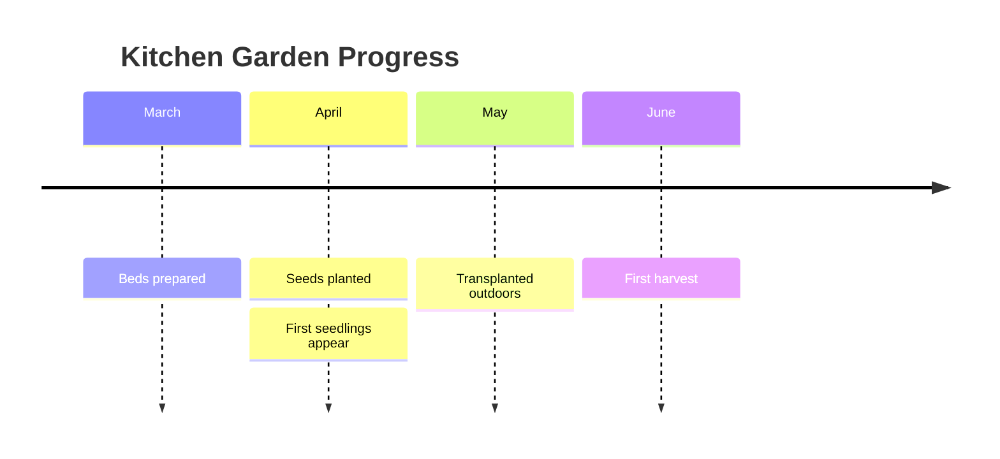
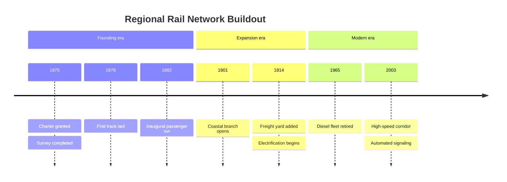

# Timeline

> **Status:** Stable - introduced v10.0.0 (widely cited in the mermaid release history; the doc page itself does not state an introduction version). The mermaid docs still carry a blanket "experimental diagram for now" disclaimer on this page (the same wording used on mindmap's page), but call out that the core syntax is stable except for icon integration - a feature timeline itself doesn't currently document using.

## Overview

A timeline lays out chronological events left-to-right (or top-down since v11.14.0), grouping them under optional named sections/"ages" and letting each time period carry more than one event stacked underneath it. Unlike a Gantt chart, time periods here are arbitrary labels ("2002", "Stone Age", "Q1 2023") rather than calculated dates with durations - the diagram cares about sequence, not precise scale. That makes it well suited to narrative history or roadmap storytelling where relative order matters more than exact spacing.

## Best-fit uses

- Telling a chronological story - product history, company milestones, historical eras
- Grouping related time periods into labeled sections/ages (e.g. decades, quarters, "Bronze Age")
- Roadmap-style overviews where each period needs several bullet-point events, not just one label

## When NOT to use this

- You need calculated durations, dependencies, or resource scheduling - use a Gantt chart, not timeline
- The relationships are hierarchical/associative rather than chronological - use `mindmap.md` instead
- You need precise date-math or milestone tracking - timeline treats periods as opaque text labels, not real dates

## Basic syntax

Start with `timeline`, optionally give it a `title`, then list `time period : event` lines. Sections are optional; without one, every period lands in a single default section.

```
timeline
    title <diagram title>
    section <section name>
        <time period> : <event>
        <time period> : <event> : <event>
```

Multiple events under one time period can be written two ways: chained with extra colons on the same line, or continued on subsequent lines that start with just a colon (no repeated period label):

```
timeline
    2004 : Facebook : Google
    2005 : YouTube
         : Reddit
```

Direction can be set right after the keyword (v11.14.0+): `timeline TD` for top-down instead of the default left-to-right.

## Simple example



Each month is a time period; April stacks two events ("Seeds planted" then "First seedlings appear") using the continuation-colon form.

## Complex example



Three sections ("Founding era", "Expansion era", "Modern era") each get their own color, and several periods carry more than one chained event - showing sections plus multi-event periods working together.

## Escaping & special characters

- **Indentation signals nesting but is more forgiving than mindmap's** - `section` lines and `time period : event` lines are recognized by keyword/colon structure, not strictly by column position, though consistent indentation is still strongly recommended for readability and to avoid ambiguity with continuation lines.
- The `:` character is the field separator between a time period and its event(s) - if an event's own text needs a literal colon, that will conflict with the parser, so avoid embedding raw colons in event/period text.
- Long time-period or event text auto-wraps by default; force a manual line break inside a label with `<br>`.
- A YAML frontmatter block (` --- ... --- `) above the `timeline` keyword can set `theme`, and under `config.timeline.disableMulticolor` or `themeVariables.cScale0`…`cScale11` / `cScaleLabel0`…`cScaleLabel11` to control per-section coloring - this frontmatter is standard YAML, so quote any string value containing `:` or other YAML-special characters.
- Inside a ` ```mermaid ` fence in markdown, keep the fence's own indentation consistent; nothing inside the timeline body needs escaping specifically because it's fenced.
- **Tested (Mermaid 12.0.0 and 11.16.1):** A `:` in an event or section name splits it - write `#58;`. In the title, a `<`...`>` pair is read as an HTML tag and silently dropped, so write both as `#60;` and `#62;`. Named codes (`#quot;`) are not decoded here; use numeric ones.

## Common pitfalls

- [ ] Is `title` (if used) on its own line directly after `timeline`?
- [ ] Does every `section` line come before the periods it should group, with no stray period left outside any section if sections are used elsewhere in the diagram?
- [ ] For multi-event periods, did you either chain them with `:` on one line or use bare leading-colon continuation lines - not repeat the period label on each line?
- [ ] Did you avoid putting a literal `:` inside period/event text itself?
- [ ] If setting `theme` or `cScale*` variables, is the frontmatter valid YAML (proper `---` fences, quoted color strings)?

## v11 fallback

No syntax differences. Every example in this file parses and renders on both Mermaid 12.0.0 and 11.16.1.

## Beta/experimental caveats

The mermaid docs still label timeline's page with a general "experimental diagram" disclaimer (same boilerplate as mindmap's), but the actual scoped exception they call out - icon integration - isn't a documented timeline feature at all. Treat the core `title`/`section`/`period : event` grammar as settled; there's no known unstable corner specific to timeline as of the pinned version.

## Further reading

- https://mermaid.js.org/syntax/timeline.html
