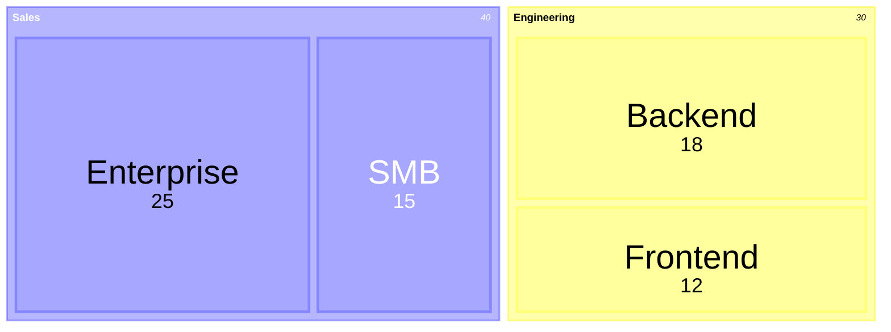
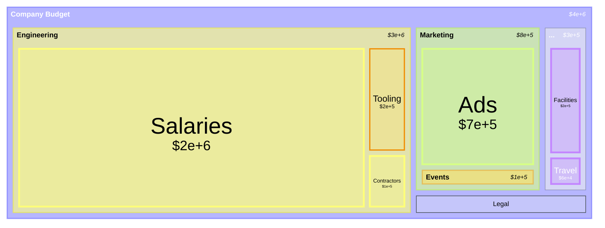

# Treemap

> **Status:** Beta - introduced v11.8.0. Syntax may evolve; treat generated diagrams of this type as more likely to need adjustment than stable types.

## Overview
A treemap divides a rectangle into nested sub-rectangles, where each rectangle's area is proportional to the numeric value it represents. Parent categories tile the space among their children, so both the hierarchy (via nesting) and the relative magnitude (via area) are visible in a single compact layout - something a flat pie chart can't do once there's more than one level of grouping.

## Best-fit uses
- Part-to-whole proportions across a hierarchy (budget by department by line item, disk usage by folder)
- Spotting the largest contributors at a glance when there are many small siblings and a few big ones
- Dense, space-constrained dashboards where a tall nested list or multiple pie charts wouldn't fit

## When NOT to use this
- The data is a flow between stages rather than a static nested proportion - use `sankey.md`, which shows movement, not just size
- There's no real hierarchy (just one flat set of categories) - a plain pie chart is simpler and just as clear
- Any value can be negative - treemap area can't represent a negative quantity meaningfully

## Basic syntax
Start with `treemap-beta`. Every node - parent or leaf - is written as a **quoted string**; indentation (spaces or tabs, kept consistent) establishes parent/child nesting:

- **Parent/section node:** `"Section Name"` - quoted text only, no value. Its children are the indented lines beneath it.
- **Leaf node with value:** `"Leaf Name": <value>` - quoted text, a colon, then a plain number. Leaves are what get sized and drawn as tiles.
- **Styling:** append `:::<className>` directly after a node (parent or leaf) to apply a class, paired with a standard `classDef <className> <css-properties>` line anywhere in the diagram.

## Simple example

Two top-level sections (Engineering, Sales) each tile their own area with two leaf values; Sales' larger total (40 vs 30) gives it more overall space in the rendered layout.

## Complex example

A three-level hierarchy (Company Budget → department → line item) is combined with a frontmatter `config.treemap` block that formats every value as dollars, widens the outer diagram padding, and forces values to display. The `tight` class is applied to both a leaf (`"Tooling"`) and a parent section (`"Events"`), while `watch` is applied to a parent (`"Operations"`) and an unrelated leaf (`"Legal"`) - showing that `:::class` styling isn't limited to leaves, and that multiple classes can coexist in one diagram.

## Escaping & special characters
- Node names must be double-quoted - an unquoted node name is not valid syntax, unlike some other Mermaid diagram types where quoting is optional.
- The leaf value follows the closing quote directly with a colon: `"Name": 12` - a space before or after the colon is fine, but the colon must immediately follow the closing `"`.
- A literal `"` inside a node name needs standard escaping for the surrounding context (avoid it if possible; prefer rephrasing the label).
- `:::<className>` is a reserved token sequence - a class name can't itself contain `:::`.
- Inside a ```mermaid fence in markdown, keep the block's indentation relative to the fence consistent, since a markdown renderer that dedents the fenced content will corrupt the hierarchy the same way inconsistent indentation would.
- **Tested (Mermaid 12.0.0 and 11.16.1):** Quote node labels; the only character that still needs an escape inside the quotes is `"`, written `#34;`.

## Common pitfalls
- [ ] Is every node name (parent and leaf) wrapped in double quotes?
- [ ] Does every leaf value follow immediately after `":"` with no other characters in between?
- [ ] Is indentation consistent (same whitespace character and width) for every sibling at a given level?
- [ ] Are all values non-negative - treemap area can't represent a negative number?
- [ ] Does every `:::className` reference a `classDef` that's actually declared somewhere in the diagram?
- [ ] If using `valueFormat`, is it a valid D3 format specifier or one of the documented currency shortcuts (`$`, `$0,0`, `$.2f`, `$,.2f`, etc.)?

## v11 fallback

No syntax differences. Every example in this file parses and renders on both Mermaid 12.0.0 and 11.16.1.

## Beta/experimental caveats
Mermaid's own docs flag treemap as "a new diagram type" whose syntax "may evolve in future versions" - expect possible breaking changes to node/leaf grammar or config option names on future Mermaid upgrades. Requires Mermaid v11.8.0 or later (this version was not stated on the doc page itself; it's cross-referenced from the mermaid-js/mermaid GitHub release notes, where treemap first appears as "Adding support for the new diagram type nested treemap"). Note that as of this writing, the docs also mention a Sunburst (radial hierarchy) diagram as a planned-but-unreleased alternative - don't offer it as an option.

## Further reading
- https://mermaid.js.org/syntax/treemap.html
