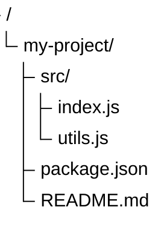
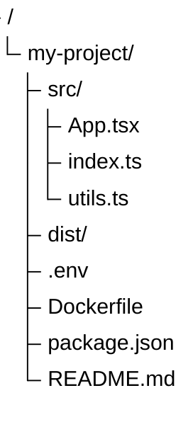

# TreeView

> **Status:** Beta - introduced v11.14.0. Syntax may evolve; treat generated diagrams of this type as more likely to need adjustment than stable types.

## Overview
A TreeView diagram renders hierarchical data as a directory-like listing, complete with connector lines, optional file/folder icons, and inline annotations. Unlike a flowchart forced into a tree shape or a mindmap's free-form radial layout, TreeView is purpose-built to look like a literal file/folder tree - the kind you'd see from a `tree` command output. It accepts two interchangeable input styles (pure indentation, or pasted box-drawing ASCII art), and the parser auto-detects which one you used.

## Best-fit uses
- Rendering a file/folder structure, directory listing, or codebase layout
- Documenting a project's package/module hierarchy for onboarding or architecture docs
- Turning an existing `tree`-command-style ASCII dump into a styled diagram with almost no editing

## When NOT to use this
- The hierarchy has no natural "directory" framing (e.g. org chart, taxonomy, brainstorm) - use `mindmap.md` instead
- Nodes need multiple relationship types or cross-links, not just parent/child containment - use `flowchart.md`
- You need to show sequence/order of steps rather than static structure - use `flowchart.md` or `timeline.md`

## Basic syntax
Every diagram starts with the `treeView-beta` keyword (note the capital `V` - case-sensitive). Structure comes from **either** of two auto-detected input styles - do not mix them in one diagram:

**1. Indentation style** - nesting depth is set purely by leading whitespace, same convention as mindmap:
```
treeView-beta
    my-project/
        src/
            index.js
        package.json
        README.md
```

**2. Box-drawing style** - paste ASCII/Unicode tree art directly; depth is inferred from the column position of the branch character. Both standard (`├──`, `└──`, `│`) and heavy (`┣━━`, `┗━━`, `┃`) Unicode variants are supported:
```
treeView-beta
├── src/
│   ├── index.ts
│   └── utils.ts
├── package.json
└── README.md
```

Other syntax rules:
- A trailing `/` on a label marks it as a directory - directories render in **bold**.
- Labels can be bare (unquoted) or double-quoted; quoting is required if the name contains spaces, e.g. `"my file.txt"`. **Bare labels only parse on Mermaid >= 11.16.0** - on v11.14.0/v11.15.0, every label must be double-quoted or the parser throws `Expecting token of type 'STRING2'`. Prefer quoted labels to stay portable across the full supported range.
- `%%` starts an invisible comment line, standard Mermaid convention.
- Tab characters in indentation are automatically expanded to spaces.
- Per-node annotations append after the label, in any order/combination. **All three annotation forms require Mermaid >= 11.16.0** - on v11.14.0/v11.15.0 they are a hard parse error, not a silent no-op:
  - `` :::className `` - apply a CSS class (built-in `highlight` class provided)
  - `## description text` - visible italic description next to the label
  - `icon(name)` - set an explicit icon, e.g. `icon(logos:react)` or `icon(none)` to force-hide one
- Icons are hidden by default; set `showIcons: true` under `config.treeView` in frontmatter to show built-in `file`/`folder` icons. File-type icon mapping is configured via `filenameIcons` and `extensionIcons` under the same config block, resolved against a registered icon pack.

## Simple example

A minimal indentation-style tree: one directory (`my-project/`, bold) containing a `src/` subdirectory with two files, plus two files at the top level. Labels are double-quoted because **bare (unquoted) labels only parse on Mermaid >= 11.16.0** - quoting keeps this example portable back to the v11.14.0 introduction (see "Common pitfalls").

## Complex example

This combines frontmatter config (icon pack registration plus filename/extension icon maps), a directory tree with a `%%` comment marking a line that produces no visible output, and quoted labels throughout so the block parses on every Mermaid version from v11.14.0 onward. The annotation features (`:::className`, `icon(name)`, `## description`) shown in "Basic syntax" are deliberately omitted here - they all require **Mermaid >= 11.16.0** and would otherwise break this example on older renderers (see "Common pitfalls").

## Escaping & special characters
- Quote any label containing spaces or characters the parser could misread as an annotation delimiter (`:`, `#`, `(`, `)`): `"release notes (v2).txt"`.
- Labels - quoted or bare - are rendered exactly as written, including consecutive spaces and Unicode/emoji; emoji are a handy stand-in icon since built-in icons are opt-in.
- Inside a ```` ```mermaid ```` fence in Markdown, keep box-drawing characters byte-for-byte as pasted - most Markdown renderers won't reflow them, but editors that auto-trim trailing whitespace can corrupt a `│ ` continuation column, silently shifting depth on later lines.
- Don't mix indentation-style and box-drawing-style lines in the same diagram; the auto-detector keys off the first structural line.
- **Tested (Mermaid 12.0.0 and 11.16.1):** Quote labels (portable to v11.14.0); the only character that still needs an escape inside the quotes is `"`, written `#34;`.

## Common pitfalls
- [ ] Did you use `treeView-beta` with a capital `V` - not `treeview-beta`?
- [ ] Are directory labels given a trailing `/`?
- [ ] If mixing indentation depths, is every sibling line indented identically (no stray extra space)?
- [ ] If pasting box-drawing art, is the vertical `│`/`┃` continuation column preserved on every line under a branch (not trimmed by an editor)?
- [ ] Are labels with spaces, colons, or parentheses wrapped in double quotes?
- [ ] If icons were expected but aren't showing, is `showIcons: true` set under `config.treeView` in frontmatter?
- [ ] Are annotations (`:::class`, `icon()`, `##`) appended after the label rather than placed on their own line (unlike mindmap's icon/class syntax)?
- [ ] Are bare labels or annotations (`:::class`, `icon()`, `##`) avoided unless the target renderer is confirmed Mermaid >= 11.16.0? On v11.14.0/v11.15.0, a bare label is a parse error (`Expecting token of type 'STRING2'`) and an annotation is also a hard parse error - quote every label and skip annotations to stay portable back to the v11.14.0 introduction.

## v11 fallback

This type was introduced in v11.14.0. Renderers older than that fail with `No diagram type detected` (see `general/renderers.md` for which markdown renderers those are). For such targets use a plain-text tree in a fenced code block (or a `mindmap.md` outline when hierarchy, not file layout, is the point).

- **Bare (unquoted) labels and all annotations** (`:::class`, `##`, `icon()`) need v11.16.0+ and hard-fail on v11.14.0/v11.15.0 with `Expecting token of type 'STRING2'`. Quote every label and skip annotations when the target may be older.

## Beta/experimental caveats
TreeView is new as of v11.14.0 and both the dual-input-style parser and the icon-resolution config surface (`filenameIcons`/`extensionIcons`/`defaultIconPack`) are young enough that edge cases in auto-detection or icon-pack resolution may change in later releases. Confirm the target Mermaid runtime is v11.14.0 or later before delivering a TreeView diagram; on older pinned versions this diagram type does not exist and will fail to parse. Note two syntax gates layered on after introduction: **bare (unquoted) labels and all annotation forms (`:::class`, `##`, `icon()`) both require Mermaid >= 11.16.0** - the v11.14.0/v11.15.0 grammar only accepts double-quoted labels with no annotations. Default to quoted labels and no annotations for maximum portability, and only use bare labels/annotations when the user confirms the target renderer is 11.16.0+.

## Further reading
- https://mermaid.js.org/syntax/treeView.html
