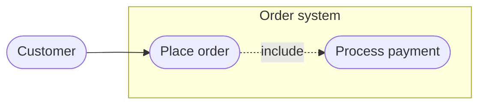

# Use Case

> **Status:** Beta - introduced v12.0.0. Syntax may evolve; treat generated diagrams of this type as more likely to need adjustment than stable types.

## Overview
A UML use case diagram shows who (actors) interacts with a system and what the system offers (use cases), with optional system boundaries, `include`/`extend`/generalization relationships, notes, and JSON data tables. The keyword is the single token `usecase-beta`; in prose it is two words, "use case".

## Best-fit uses
- Showing which actors can do which things with a system, and where one use case includes or extends another
- Scoping a system: what sits inside a boundary versus which actors sit outside it
- Business-level views, using the `business` marker and stereotypes

## When NOT to use this
- The order of interactions matters - use `sequence.md`
- The diagram is a workflow with decisions - use `flowchart.md`
- The reader's renderer is older than Mermaid 12 - none of the markdown renderers in `general/renderers.md` is known to ship it - see "v11 fallback" below

## Basic syntax
Start with `usecase-beta`. One statement per physical line (a Markdown-string label or a boundary block may span lines). `direction` takes `TD`, `TB`, `BT`, `LR` or `RL`.

- **Actor:** `actor Customer`, or with a label `actor Admin("Main administrator")`. Actors are never inferred from a relationship - declare each with `actor`.
- **Use case:** `Login("Sign in")` for an ellipse, `Report[Generate report]` for a rectangle. A quoted line alone (`"Reset password"`) declares one with a generated identifier. An undeclared relationship endpoint becomes an ellipse use case.
- **Actor variants:** `actor A@{ type: hollow }`, `@{ type: awesome }`, `@{ icon: "fa:user" }` (register the icon pack first), `@{ business: true }` for the business slash. An icon cannot combine with a non-normal `type` or with `business`.
- **Stereotype:** `<<Employee>>` after any metadata, before a `:::class` suffix.
- **System boundary:** `systemBoundary <id>["Title"]@{ type: package }` ... `end`. One level deep; only actor and use case declarations inside; relationships stay at the top level.
- **Associations:** `-->`, `<--`, `--`, `--o`, `o--`, `--x`, `x--`. Label with `A -- "text" --> B`. Extra dashes (`--->`) lengthen the edge.
- **UML relationships:** `A ..> : include B`, `A ..> : extend B` (use case to use case), `A --|> B` generalization (actor to actor or use case to use case).
- **Edge id and animation:** `A opens@--> B`, then `opens@{ animation: fast }`.
- **Note:** `note for Login "text"` - one target, actor or use case only.
- **JSON table:** `json Payload@{ "k": "v" }` at the top level; connect with a plain association.
- **Styling:** `classDef`, `class`, `style`, `:::cls`. Actor metadata is typed - fill and stroke keys are errors; use `classDef`.
- **Accessibility:** `accTitle:` and `accDescr:` / `accDescr { ... }`.

## Simple example
<!-- mermaid-validate: since="12.0.0" -->
```mermaid
usecase-beta
direction LR
actor Customer("Customer")
systemBoundary "Order system"
  Checkout("Place order")
end
Customer --> Checkout
```
One actor, one use case inside a boundary, joined by an association.

## Complex example
<!-- mermaid-validate: since="12.0.0" -->
```mermaid
usecase-beta
direction LR
accTitle: Online ordering use cases
accDescr {
  A customer places an order through the storefront.
  Staff review the order.
}
actor Customer("Customer")
actor Staff("Order staff")@{ type: hollow, business: true } <<Employee>>
systemBoundary ordering["Ordering System"]@{ type: package }:::system
  Browse("Browse products")
  Checkout("Checkout") <<Core>>:::critical
  Payment("Process payment")
  Review[Review order]
end
note for Checkout "`Validates the **cart** before payment`"
Customer starts@-- "places order" ---> Checkout
Customer --> Browse
Checkout pays@..> : include Payment
Staff --> Review
classDef system stroke:#c8a02a,stroke-width:2px
classDef critical stroke:#c33,stroke-width:3px
starts@{ animation: fast }
style pays stroke:#6b46c1,stroke-width:2px
```
A package boundary, a business actor with a stereotype, an include relationship, an animated labelled edge, a note, and class-based styling.

## Escaping & special characters
- Labels may be unquoted text in `(...)` or `[...]`, a quoted plain string, or a quoted Markdown string (`"`text`"`, which allows physical newlines).
- The reserved sequences inside an unquoted label are the delimiters `( ) [ ] { }`, the quotes `"` and `'`, and `--`, `-->`, `<--`, `--o`, `--x`, `--|>`, `..>`, `:::`, `@{`, `<<`. Quote the label when one must appear.
- Entity codes for reserved characters: `#quot;`, `#39;`, `#40;`, `#41;`, `#91;`, `#93;`, `#96;`.
- Backslash never escapes: `"First\nSecond"` shows a literal backslash and `n`. Use a Markdown string with a physical newline for a line break.
- `%%` starts a whole-line comment only. `//`, `#` and `;` are not comments or separators.
- **Tested (Mermaid 12.0.0):** Quote labels; the only character that still needs an escape inside the quotes is `"`, written `#34;`, and a `<`...`>` pair is read as an HTML tag and silently dropped, so write both as `#60;` and `#62;`.

## Common pitfalls
- [ ] Is every actor declared with `actor`? Position in a relationship never makes one.
- [ ] One statement per physical line?
- [ ] Boundary contents limited to actor and use case declarations (no relationships, notes, nesting)? Each element in at most one boundary?
- [ ] `include`/`extend` written as `..> : include X`? A label containing "include" on a `-->` is still a plain association.
- [ ] Generalization `--|>` between two actors or two use cases, never mixed?
- [ ] Actor styled with `classDef`/`style`, not `fillColor`/`strokeColor` metadata (errors)?
- [ ] Is a hard-coded `fill` on a boundary paired with a `color`, so the title stays readable in a dark theme?
- [ ] Does the target renderer know `usecase-beta`? If not, deliver the flowchart form.

## v11 fallback
The type does not exist below v12.0.0; older renderers fail with `No diagram type detected`. Deliver a `flowchart.md` diagram instead:

| Use case element | Flowchart equivalent |
| --- | --- |
| `actor Customer` | `Customer(["Customer"])` or `Customer(("Customer"))` |
| use case `Login("Sign in")` | `Login(["Sign in"])` |
| `systemBoundary "X" ... end` | `subgraph X ... end` |
| association `A --> B` | `A --> B` |
| `A ..> : include B` | `A -. include .-> B` |
| `A ..> : extend B` | `A -. extend .-> B` |
| generalization `A --\|> B` | `A --> B` with label `generalizes` |

<!-- mermaid-validate: keyword-exempt reason="v11 fallback: a flowchart, not a usecase-beta diagram" -->


Default appearance: `neo` look, `redux-color` theme and ELK layout in v12 (see `general/v11-compatibility.md` to restore the classic look).

## Beta/experimental caveats
Use case diagrams are beta as of v12.0.0, and the docs state the syntax may evolve. Tell the user the diagram requires Mermaid 12.0.0 or later, that none of the markdown renderers in `general/renderers.md` is known to ship it yet, and offer the flowchart form for anything older. `look: handDrawn` support is not documented for this type; do not promise it.

## Further reading
- https://mermaid.js.org/syntax/usecase.html
