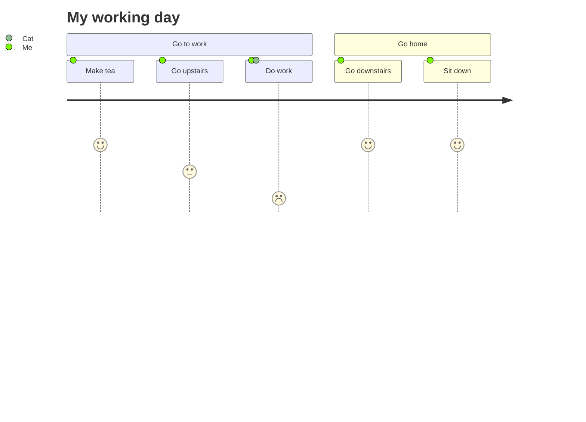
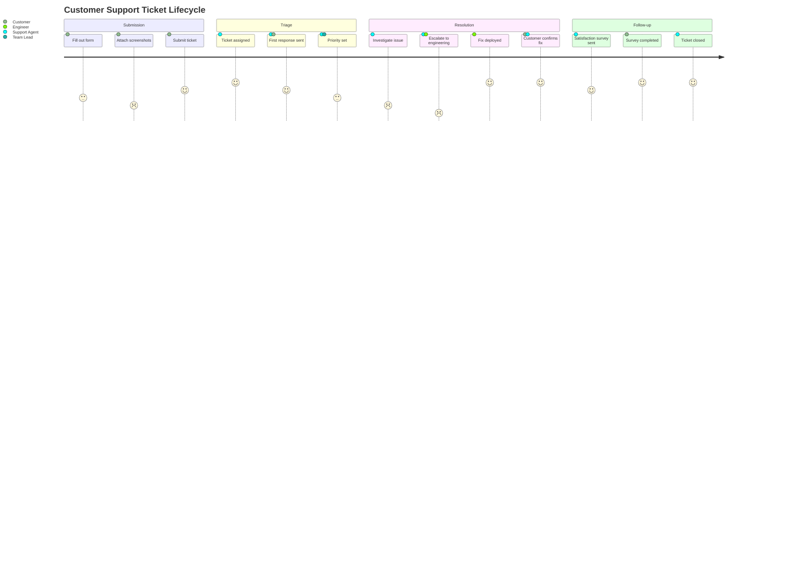

# User Journey

> **Status:** Stable - introduced long-standing (pre-v10).

## Overview
A user journey diagram tracks a person moving through a multi-step process, scoring how satisfied they feel at each step and who else is involved. It renders as a horizontal line chart where the y-axis is a happiness/satisfaction score, so the shape of the line tells you at a glance where a workflow delights or frustrates people. It's less about sequencing mechanics (like a sequence diagram) and more about the emotional/experiential read of a flow.

## Best-fit uses
- Visualizing satisfaction highs and lows across a user's path through a product or service
- Comparing which steps involve which actors (e.g. "Me" vs "Support Team") alongside the satisfaction trend
- Grouping a flow into named phases (sections) to spot where in the journey friction concentrates

## When NOT to use this
- You need to show message passing or system call order - use `sequence.md` instead
- You need calculated timing/duration between steps - use `gantt.md`
- You're mapping a decision tree or branching logic rather than a linear experience - use `flowchart.md`

## Basic syntax
Start with the `journey` keyword. An optional `title` line follows. The body is organized into `section <name>` blocks (optional but typical), each containing one task per line in the form:

```
Task name: <score>: <actor1>, <actor2>, ...
```

The score is a number from 1 to 5 inclusive (higher = happier). Actors are a comma-separated list; a task can list one or many.

## Simple example


The "Do work" task lists two actors ("Me, Cat") - both are plotted as separate lines/legend entries sharing that task's score.

## Complex example


Four sections trace the full lifecycle; scores dip during "Resolution" (as low as 1 for the escalation step) and recover in "Follow-up", and several tasks share multiple actors to show handoffs between customer, agent, and engineer.

## Escaping & special characters
- The task line uses `:` as a hard field separator between the task name, score, and actor list - a literal colon inside a task name will be misparsed as an extra field, so avoid it or rephrase the label.
- Commas separate actors, so avoid unescaped commas inside a single actor's name.
- Quotes, parentheses, and other punctuation are generally fine in task-name text since it's free text up to the first colon, but keep it simple and test render if you need anything unusual.
- Wrapping a journey diagram inside a larger ` ```mermaid ` fenced block in markdown is safe as long as the task/actor text itself never contains a literal triple backtick; if it must, fence the outer markdown block with four backticks instead of three.
- **Tested (Mermaid 12.0.0 and 11.16.1):** Task text breaks on `:`, `#` and `;` (`#58;`, `#35;`, `#59;`). A title breaks on `#` and `;`, and a `<`...`>` pair is read as an HTML tag and silently dropped, so write both as `#60;` and `#62;`.

## Common pitfalls
- [ ] Is the score a plain integer between 1 and 5 (not 0, not 6+, not a decimal)?
- [ ] Does every task line have exactly two colons - one before the score, one before the actor list?
- [ ] Are multiple actors comma-separated on the same task line, rather than repeating the task on multiple lines?
- [ ] Is each `section` header its own line, with tasks indented underneath rather than inline?
- [ ] Did you avoid embedding a literal `:` inside the task-name text itself?

## v11 fallback

No syntax differences. Every example in this file parses and renders on both Mermaid 12.0.0 and 11.16.1.

## Beta/experimental caveats
N/A - stable diagram type, no known compatibility caveats.

## Further reading
- https://mermaid.js.org/syntax/userJourney.html
