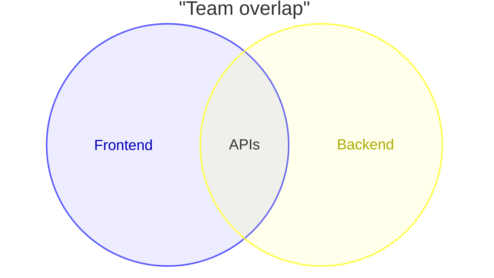
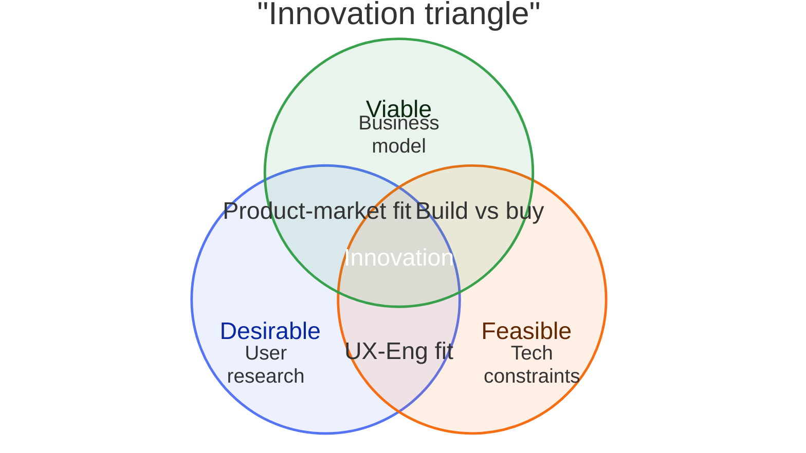

# Venn

> **Status:** Beta - introduced v11.12.3. Syntax may evolve; treat generated diagrams of this type as more likely to need adjustment than stable types.

## Overview
A Venn diagram draws named sets as overlapping circles and lets you label the overlapping regions directly, making it the natural choice whenever the thing you're communicating is "which items belong to which combination of categories." Unlike a flowchart, there's no direction or sequence - only membership and intersection.

## Best-fit uses
- Showing which categories or groups share members and which don't
- Labeling the overlap itself (e.g. what belongs to "both Frontend and Backend")
- Classic 2-3 set comparisons like a feasibility/desirability/viability innovation triangle

## When NOT to use this
- You're modeling a sequence of steps or decisions rather than set membership - use `flowchart.md`
- You have more than 3-4 sets - overlapping-circle layouts get visually unreadable past a handful of sets; consider a table
- You need hierarchical containment (strict subsets, tree structure) rather than overlap - use `mindmap.md`

## Basic syntax
Start with `venn-beta`. Optional `title "<text>"` line.

- **Set:** `set <id>` - or `set <id>["<Display Label>"]` to show a different label than the identifier.
- **Union (overlap region):** `union <id1>,<id2>[,...]["<Label>"]` - every set named must already be declared by an earlier `set` line; 2+ sets required, and 3+ ("higher-arity" unions) render their pairwise overlaps automatically so the union label has a region to sit in.
- **Text (annotation inside a region):** `text <id>["<Label>"]`, indented under the `set` or `union` line it belongs to, to add extra text inside that region.
- **Sizing:** append `:<N>` to a `set` or `union` line to weight/size that region, e.g. `set A["Alpha"]:20`.
- **Styling:** `style <id>[,<id>...] <property>: <value>` - supports `fill`, `color`, `stroke`, `stroke-width`, `fill-opacity`, applied to a set, union, or text id.

## Simple example

Two sets, `Frontend` and `Backend`, with their overlap region labeled "APIs" - the shared responsibility between the two teams.

## Complex example

Three sized sets each carry an inline text annotation, pairwise overlaps are individually labeled, a three-way union labels the center region, and `style` lines recolor each set with white text over all three fills.

## Escaping & special characters
- Display labels use `["..."]` bracket syntax - wrap in double quotes if the label contains a comma (which otherwise separates set names in a `union` line).
- Identifiers can be bare words or quoted strings (`"Foo Bar"`); prefer bare short ids and put the human-readable text in the `["..."]` label instead of the identifier.
- `union` set lists are comma-separated with no space required (`A,B,C`) - extra whitespace around commas is generally tolerated but not required.
- Inside a ```mermaid fence, no extra escaping is needed beyond avoiding literal triple backticks in labels.
- **Tested (Mermaid 12.0.0 and 11.16.1):** Quote set labels (`set A["text"]`); the only character that still needs an escape inside the quotes is `"`, written `#34;`.

## Common pitfalls
- [ ] Is every set named in a `union` line declared by an earlier `set` line (forward references aren't allowed)?
- [ ] Does every `union` list at least two set ids?
- [ ] Are `text` lines indented under the `set`/`union` they annotate, not left at top level?
- [ ] Are you trying to show more than 3-4 sets - consider whether the overlap layout will actually stay readable?
- [ ] Do `style` lines target valid, already-declared ids (sets, unions, or text)?
- [ ] Did you intend `:<N>` sizing to visually communicate proportion - sizes are relative weights, not exact area guarantees?

## v11 fallback

- **Default appearance:** v12 draws this type with the `neo` look and the `redux-color` theme by default; v11 draws it with the `classic` look and the `default` theme. The diagram source is identical - only the rendering differs. `general/v11-compatibility.md` shows how to make v12 draw the v11 appearance.

## Beta/experimental caveats
Venn diagrams are beta as of v11.12.3, with the docs explicitly noting the syntax may evolve. When delivering this diagram type, note it requires Mermaid v11.12.3 or later and that statement forms (especially sizing and styling) are more likely to change in future minor releases than stable diagram types.

## Further reading
- https://mermaid.js.org/syntax/venn.html
