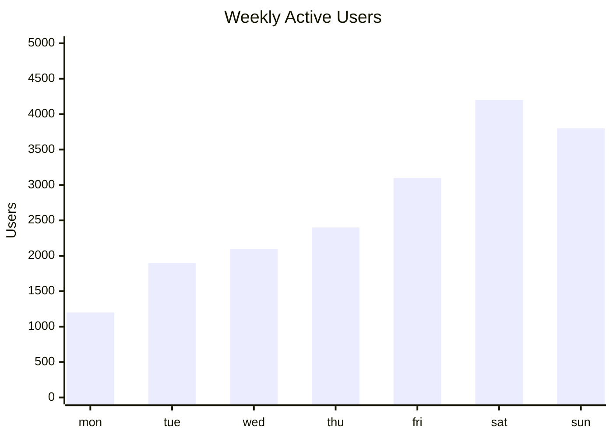
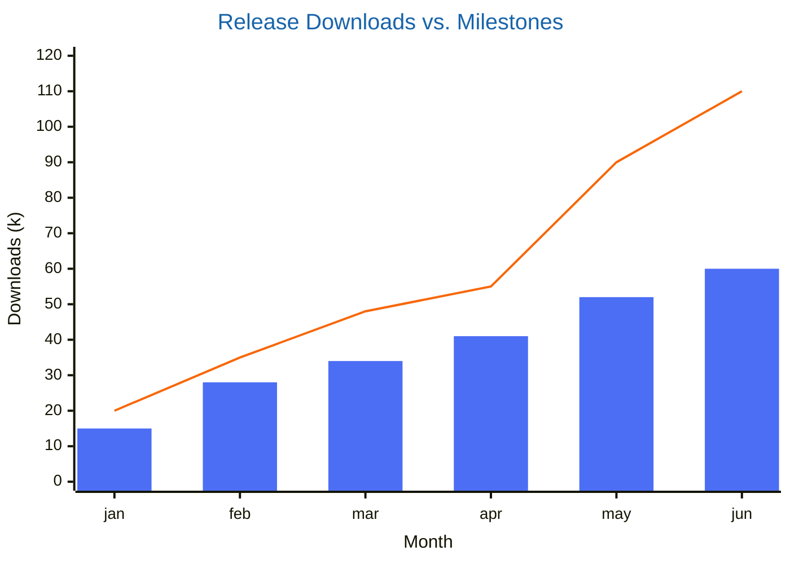

# XY Chart

> **Status:** Beta - introduced v10.6.0. Syntax may evolve; treat generated diagrams of this type as more likely to need adjustment than stable types.

## Overview
An XY chart plots one or more bar and/or line series against a shared categorical or numeric x-axis and a numeric y-axis - the familiar "bar chart" / "line chart" combo chart, in one diagram type. It's the closest thing Mermaid has to a conventional business-report chart, as opposed to a structural or relational diagram.

## Best-fit uses
- Trends over time or ordered categories (monthly revenue, weekly active users) as a line, a bar, or both together
- Comparing magnitudes across discrete categories (a bar chart) with an overlaid target or trend line
- Any two-numeric-variable dataset where the shape of a line/bar over an axis is what matters, not multi-dimensional positioning

## When NOT to use this
- You're placing discrete items in strategic buckets by two independent scores, not plotting a series - use `quadrant.md` instead
- The comparison is across more than two shared dimensions per item - use `radar.md`
- The data is fundamentally a proportion or hierarchy rather than a magnitude-over-axis series - use `treemap.md` or a pie chart

## Basic syntax
Start with `xychart` (or `xychart horizontal` to flip orientation; default is vertical). Optional `title "<text>"` line - quotes are required only if the text contains a space.

- **x-axis:** either a numeric range `x-axis <title> <min> --> <max>`, or categorical `x-axis "<title>" [cat1, "cat2 with space", cat3]` - the title is optional in both forms.
- **y-axis:** always numeric: `y-axis "<title>" <min> --> <max>`, or just `y-axis "<title>"` to auto-range from the data. Both axes are optional; Mermaid infers a range if omitted.
- **Series:** `bar [<v1>, <v2>, ...]` and/or `line [<v1>, <v2>, ...]`, one entry per x-axis category/position, in order. Multiple `bar`/`line` lines can appear to plot several series.
- **Per-point labels on line series (v11.16.0+):** any value in a `line [...]` list can be followed by a quoted label - `line [540 "PaLM", 65, 34 "Llama 2"]` - labels are optional per point (unlabeled points work unchanged) and are silently ignored if used on a `bar` series.

Config lives under `xychart:` (dimensions, per-axis behavior, orientation, data labels) and `themeVariables.xyChart` (colors, including `plotColorPalette` - a comma-separated list of colors applied in series order) in a YAML frontmatter block.

## Simple example

A single bar series plots daily active users across a categorical x-axis, with an explicit y-axis range and title.

## Complex example

A bar series (monthly download counts) and a line series (a running trend) share one chart, and a frontmatter config block sets custom dimensions, a two-color palette, a custom title color, outside-the-bar data labels, and nested `xAxis`/`yAxis` sub-config under `xychart:`. Note the line series deliberately uses plain values - per-point quoted labels (e.g. `20 "Beta"`) are a Mermaid >= 11.16.0 feature and are omitted here so the example stays portable (see "Common pitfalls").

## Escaping & special characters
- A title, axis title, or category value that is a single word needs no quotes; any value containing a space must be wrapped in double quotes, or the parser will misread the extra words as separate tokens.
- Categorical x-axis lists use `[ ]` with comma-separated entries - quote individual entries that contain spaces, not the whole list.
- Numeric ranges use `-->` (three characters exactly, matching the arrow used in `quadrant.md`'s axis syntax) - not `->` or `=>`.
- Per-point line labels are a quoted string placed directly after the numeric value, separated by whitespace, inside the same `[ ]` list - no comma between a value and its label.
- Inside a ```mermaid fence in markdown, nothing extra needs escaping beyond avoiding a literal triple backtick inside a quoted label.
- **Tested (Mermaid 12.0.0 and 11.16.1):** Quote the title and category labels; the only character that still needs an escape inside the quotes is `"`, written `#34;`. Even inside quotes, a `<`...`>` pair is read as an HTML tag and silently dropped, so write both as `#60;` and `#62;`.

## Common pitfalls
- [ ] Does every `bar`/`line` series list have exactly as many values as there are x-axis categories (or a value at every implied numeric position)?
- [ ] Are multi-word titles, axis titles, and category labels wrapped in double quotes?
- [ ] Is the y-axis strictly numeric - categorical values are only valid on the x-axis?
- [ ] If relying on per-point line labels, are they only on a `line` series (they render but are silently dropped on `bar`)?
- [ ] Are per-point line labels avoided unless the target renderer is confirmed Mermaid >= 11.16.0? On older versions `line [20 "Beta", ...]` is a hard parse error (`Expecting 'SQUARE_BRACES_END', 'COMMA', got 'STR'`), not a silent no-op - use plain values to stay portable.
- [ ] Is `showDataLabel` (and `showDataLabelOutsideBar` if used) actually turned on in config - data labels are off by default?
- [ ] Does `plotColorPalette` list enough colors for every series, in the order series are declared?

## v11 fallback

- **Legend for named series** (`line "avg" [...]`, `bar "name" [...]`) is documented v11.17.0+. 11.16.1 parses the same source and draws no legend.
- **Per-point line labels** (`line [20 "Beta", ...]`) need v11.16.0+ and hard-fail below it with `Expecting 'SQUARE_BRACES_END', 'COMMA', got 'STR'`. Use plain values when the target may be older.

## Beta/experimental caveats
XY Chart requires Mermaid v10.6.0 or later; this base version was not stated on the doc page itself and is cross-referenced from the mermaid-js/mermaid GitHub release notes ("Add new chart xychart"). Two features layered on afterward are version-gated and should be called out explicitly when relied on: bar data labels (`showDataLabel`/`showDataLabelOutsideBar`) require v11.14.0+ and silently do nothing against an older pinned Mermaid version, while per-point line labels require v11.16.0+ and fail with a hard parse error (`Expecting 'SQUARE_BRACES_END', 'COMMA', got 'STR'`) rather than degrading gracefully - so default to plain values and only emit `20 "Beta"` when the user confirms the target renderer is 11.16.0+. Note also that the canonical keyword confirmed on the current doc page is plain `xychart`, not `xychart-beta` (the `-beta` form is still accepted as a legacy alias per the diagram detector in the mermaid-js/mermaid source, but isn't what the docs themselves use).

## Further reading
- https://mermaid.js.org/syntax/xyChart.html
