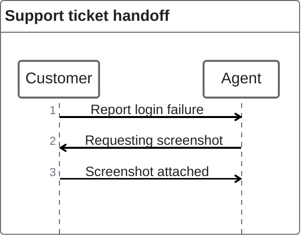
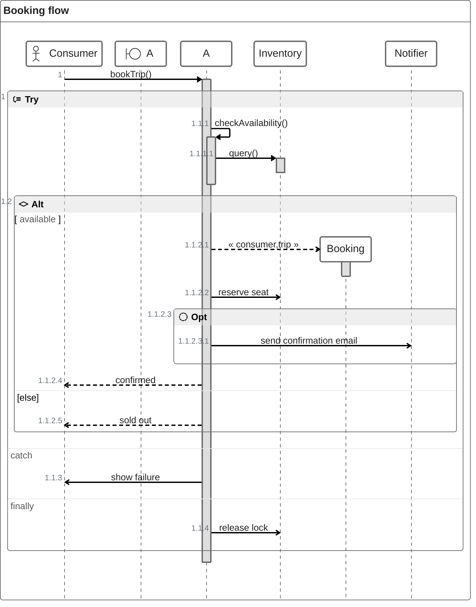

# ZenUML

> **Status:** Stable - introduced ~v10.2.0 (not stated explicitly on the doc page; inferred from the `@mermaid-js/mermaid-zenuml` plugin's npm publish date relative to core mermaid releases - treat as approximate). Requires the ZenUML plugin/renderer; verify target tool supports it before promising output.

## Overview

ZenUML is mermaid's alternate renderer for sequence diagrams: same underlying idea as the built-in `sequenceDiagram` type - participants exchanging messages over time - but with a code-like DSL where a "call" reads like a method invocation (`A.method()`) and can be nested with curly braces instead of separate arrow/activate/deactivate lines. It ships as a separate package (`@mermaid-js/mermaid-zenuml`) that the host application must explicitly register with mermaid before a `zenuml` block will render at all.

## Best-fit uses

- Sequence diagrams where nested/blocking calls read more naturally as code (`A.method() { ... }`) than as stacked arrows
- Diagrams that lean on control-flow constructs - loops, if/else, try/catch, parallel blocks - expressed with familiar brace syntax
- Teams already comfortable reading pseudocode who want a sequence diagram that mirrors call-stack structure

## When NOT to use this

- The target renderer is unknown or fixed (e.g. GitHub/GitLab markdown preview, a docs site using only the default mermaid bundle) - those do not load the ZenUML plugin, so a `zenuml` block will fail to render; use mermaid's standard `sequenceDiagram` instead
- You want the most portable, universally-supported sequence diagram syntax - `sequenceDiagram` is built into every mermaid distribution, `zenuml` is not
- Any doubt exists about plugin availability - confirm the consuming tool has run `mermaid.registerExternalDiagrams([zenuml])` (or equivalent) before relying on ZenUML output

## Basic syntax

A `zenuml` block opens with the keyword, optionally followed by `title <text>`. Participants can appear implicitly (first mention establishes them) or be declared up front to control ordering:

```
zenuml
    Warehouse
    Storefront
    Storefront->Warehouse: check stock
    Warehouse->Storefront: 4 units available
```

Core message forms:

- **Plain/async message:** `A->B: text` - a simple arrow with a label, no method-call parens.
- **Sync (call) message:** `A.method()` or `A.method(args) { ... }` - dot-call notation; braces nest further calls inside it.
- **Creation message:** `new ObjectName` or `new ObjectName(args)`.
- **Reply/return:** assign a variable from a call (`x = A.method()`), use `return value` inside a call's braces, or use the `@return` annotator immediately before an arrow message to send a reply to an outer caller.
- **Annotated participants:** `@Actor Alice`, `@Database Bob`, etc. render as symbols instead of plain rectangles.
- **Aliases:** `A as Alice` gives a short id a descriptive display label.

Control-flow blocks all use brace syntax: `if (cond) { ... } else { ... }`, `while (cond) { ... }`, `opt { ... }`, `par { ... }`, `try { ... } catch { ... } finally { ... }`.

## Simple example

<!-- mermaid-validate: parse-only reason="validator registers @mermaid-js/mermaid-zenuml for --mode parse (jsdom) but not yet for --mode render (puppeteer); grammar is confirmed, full SVG rendering is not" -->


Three plain arrow messages between two implicitly-declared participants - the minimal ZenUML diagram.

## Complex example

<!-- mermaid-validate: parse-only reason="validator registers @mermaid-js/mermaid-zenuml for --mode parse (jsdom) but not yet for --mode render (puppeteer); grammar is confirmed, full SVG rendering is not" -->


This nests a sync call inside a `try/catch/finally` block, mixes a creation message, a conditional, an `opt` fragment, and both an inline `return` and plain arrow replies - showing several ZenUML features working together in one call stack.

## Escaping & special characters

- Message text after `:` runs to end of line - a literal `:` inside a label can conflict with parsing, so keep labels colon-free or quote them if the target renderer supports quoted labels.
- Braces `{ }` must balance; every `if`, `while`, `opt`, `par`, `try/catch/finally`, and sync/creation-message block that opens a brace needs its matching close, and nesting depth is exactly what you see in the source - indentation is cosmetic here, unlike mindmap/timeline where indentation is load-bearing.
- Comments use `// text` and render above the message or fragment that follows; a comment on a bare participant declaration is silently dropped (not rendered). Comment text supports markdown (e.g. `// **bold**`).
- Inside a ` ```mermaid ` fence in a markdown document, nothing about ZenUML's brace syntax needs extra escaping - just make sure the fence itself doesn't get reformatted by a markdown linter that reflows curly braces or trailing whitespace.

## Common pitfalls

- [ ] Has the consuming tool actually registered the ZenUML plugin (`mermaid.registerExternalDiagrams`)? A correctly-written `zenuml` block still won't render without it.
- [ ] Did every `{` get a matching `}` - unlike arrow-only sequence diagrams, ZenUML's nesting is brace-delimited and a missing close will break the parse.
- [ ] Did you use dot-call syntax (`A.method()`) for calls you want to nest, rather than a plain arrow (`A->B: text`), which cannot contain nested `{}` content?
- [ ] If using `@return`, is it placed immediately before the arrow message it's meant to annotate?
- [ ] Are annotated participant types (`@Actor`, `@Database`, etc.) spelled/cased as the target ZenUML version expects - the plugin defines this list, not mermaid core?

## v11 fallback

- **Plugin:** ZenUML needs `@mermaid-js/mermaid-zenuml` registered in every renderer. Plugin 1.0.1 declares support for Mermaid 10, 11 and 12; the 0.2.x line covers Mermaid 11 only.

## Beta/experimental caveats

The mermaid docs describe ZenUML as using "experimental lazy loading & async rendering features which could change in the future," and - more fundamentally - it is an *external* diagram type shipped in its own package, not bundled with mermaid core. Any environment that doesn't explicitly load and register `@mermaid-js/mermaid-zenuml` will fail to render a `zenuml` block even though the syntax itself is valid. Confirm plugin support before promising ZenUML output in a given tool.

This skill's own validator (`tools/validate-mermaid.mjs`) registers `@mermaid-js/mermaid-zenuml` (1.0.1 for Mermaid 12, 0.2.3 for Mermaid 11, chosen from the Mermaid version under test) before checking the examples below, so both examples on this page are exercised by `--mode parse`, not skipped. That only confirms the *grammar* parses under jsdom, though - `--mode render` (real browser) doesn't register the plugin yet, so full SVG rendering of ZenUML is still unverified by this skill's tooling. The guidance above about confirming plugin registration in your own target renderer still applies - this skill validating its own examples doesn't mean every consuming tool has the plugin loaded.

## Further reading

- https://mermaid.js.org/syntax/zenuml.html
