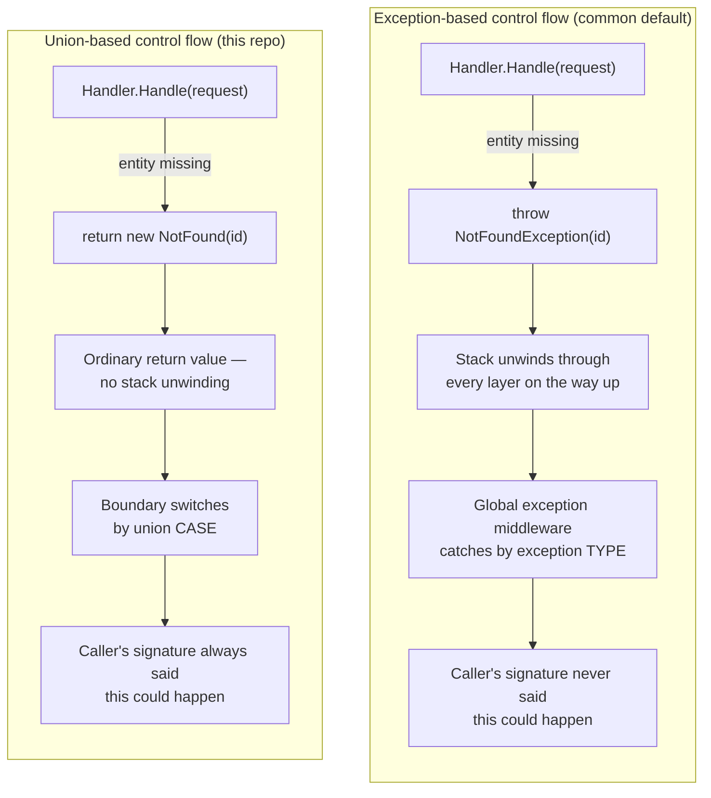
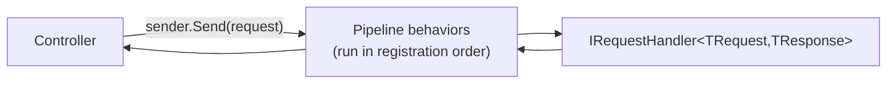
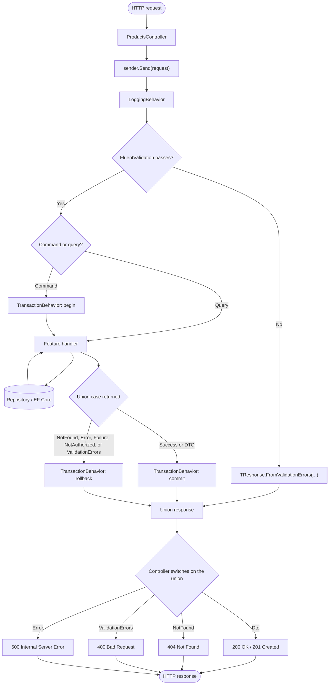
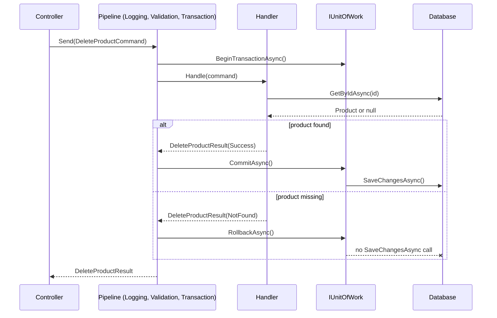
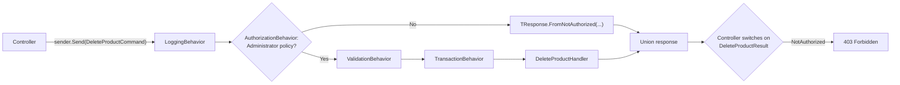
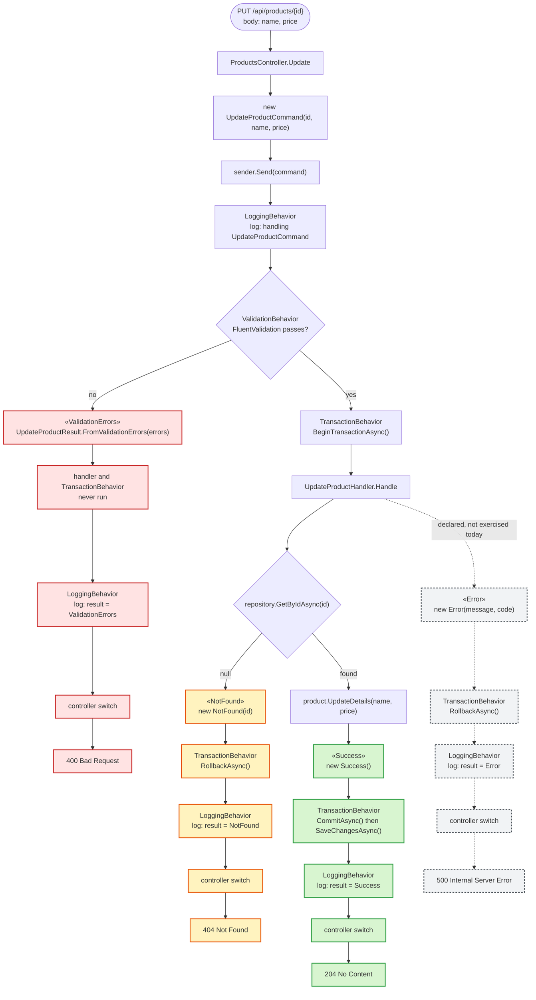

# MediatrUnionPoc

A proof of concept: can C#'s new `union` type serve as the response type for a MediatR/CQRS
handler, replacing the usual "throw an exception or return null" grab-bag with a closed,
exhaustively-checked set of outcomes?

Short answer: yes, and it composes well with MediatR pipeline behaviors via generic
constraints on **static abstract interface members**. Details below.

> [!IMPORTANT]
> The `union` keyword is a **C# 15** feature — it needs **.NET 11 Preview 5+**.
> This repo targets `net11.0` with `<LangVersion>preview</LangVersion>` and was built
> against the .NET 11 RC1 SDK.

## Motivation

Most CQRS handlers end up with a response shape that's either:

- **A single DTO**, with failures signaled by throwing (`NotFoundException`, `ValidationException`,
  ...) and caught somewhere upstream, or
- **A hand-rolled "Result" wrapper** (`Result<T>`, `OneOf<T1,T2,...>`, `ErrorOr<T>`) from a
  third-party library, because C# had no first-class closed-union type to express
  "exactly one of these N things came back."

`union` gives you option two, built into the language, with compiler-enforced exhaustiveness at
every `switch`. This project pushes that as far as it reasonably goes: every command and query
returns a `union` of whatever outcomes are actually possible for that operation — no more, no
fewer — and nothing in the request pipeline throws for an outcome it expected to see.

## Glossary

This project sits at the intersection of a few architectural patterns, MediatR's own vocabulary,
one third-party library (Vogen), and a brand-new language feature. If any term below is unfamiliar,
read this section before the deep-dive sections that follow — they assume it.

### Architectural patterns

| Term | Meaning |
| --- | --- |
| **CQRS** (Command Query Responsibility Segregation) | Splits every operation into a **command** (changes state, returns little more than "did it work") or a **query** (reads state, never changes it). Each side can be reasoned about, validated, and optimized independently instead of one method doing both. |
| **Mediator pattern** | Callers don't invoke handlers directly; they send a message to a mediator, which finds the one handler registered for it. A controller sending `CreateProductCommand` has no compile-time dependency on `CreateProductHandler` at all. MediatR is the library implementing this pattern here. |
| **Pipeline (middleware) pattern** | Cross-cutting concerns (logging, validation, transactions) are applied as a chain of wrapping steps every request passes through, instead of being duplicated inside every handler. ASP.NET Core's HTTP middleware pipeline is the same idea one layer up the stack; MediatR's pipeline behaviors are the same idea for in-process messages. |
| **Vertical slice architecture** | Code is organized by *feature* (`Features/Products/Create/` holds that operation's command, handler, validator, and result together) rather than by *technical layer* (a `Commands/` folder, a `Handlers/` folder, each containing pieces of every feature). Changing one operation touches one folder. |
| **Repository pattern** | An interface (`IProductRepository`) hiding how entities are actually fetched or persisted behind method calls that read like domain operations (`GetByIdAsync`, `AddAsync`) — the caller doesn't know or care whether that's EF Core, a REST call, or a file. |
| **Unit of Work pattern** | A single object (`IUnitOfWork`) that tracks everything changed during one logical operation and commits or rolls it all back together, so a handler touching multiple repositories doesn't have to save each one individually and risk a partial write. |

### C# language concepts

| Term | Meaning |
| --- | --- |
| **Generics** | Writing code once against a type parameter (`T`, `TRequest`, `TResponse`) instead of once per concrete type. `IRequestHandler<TRequest, TResponse>` is generic so one interface serves every command and query without duplication. |
| **Interface** | A contract listing members a type must implement, without providing its own implementation. `IProductRepository`, MediatR's `IRequestHandler<,>`, and this repo's own `IValidatable<TSelf>` are all interfaces. |
| **Static abstract interface member** *(C# 11+)* | An interface member marked `static abstract`: every *implementing type* — not every instance — must supply it, and it's callable through a generic type parameter constrained to that interface (`where TSelf : IValidatable<TSelf>`). This is what lets fully generic pipeline code construct or query a concrete union type it has never seen, by calling `TResponse.FromValidationErrors(...)` or `TResponse.ShouldCommit(...)` — impossible with an ordinary instance member, since there's no instance to call it on yet. |
| **Record** | A type (`record`, or `record struct`) with compiler-generated structural equality (same property values ⇒ `==`), a generated `ToString()`, and non-destructive mutation via `with`. Used here for immutable shapes like `ProductDto` and every command/query. |
| **Struct vs. class** | A `struct` is a value type — copied by value, usually stack-allocated, not nullable by default. A `class` is a reference type — copied by reference, heap-allocated, nullable by default. A `union` compiles down to a `struct` (see below), which is part of why it carries no boxing tax for the common case. |
| **Pattern matching / `switch` expression** | `switch` used as an *expression* producing a value (`var x = input switch { ... }`) rather than a statement that just branches. Every case is tested against the switched value's shape or type, and — for a closed set of possibilities like a union — the compiler can prove every case was handled. |
| **Union type** *(C# 15 preview — the concept this whole repo tests)* | A closed set of "case types" declared as `union Name(CaseA, CaseB, CaseC)`. A value of that type is always exactly one of the listed cases, never null, never anything outside the list. See [The C# `union` type](#the-c-union-type) for the full mechanics. |
| **Exhaustiveness checking** | The compiler verifying that a `switch` over a closed set of possibilities (a union, or an enum with no `default`) handles every member of that set, refusing to compile (`CS8509`) if one is missing. This is what turns "forgot to handle a new case" into a build failure instead of a runtime gap. |
| **Source generator** | A compiler plugin that generates additional C# source at build time, usually driven by an attribute. Vogen uses one to turn a six-line `ValueObject<Guid>` declaration into a full value type with factories, equality, and serialization support — see [Vogen: avoiding primitive obsession](#vogen-avoiding-primitive-obsession). |

### MediatR vocabulary

| Term | Meaning |
| --- | --- |
| **`IRequest<TResponse>`** | MediatR's marker interface for "this message expects a `TResponse` back." Every command and query here implements it indirectly through this repo's own `ICommand<TResponse>` / `IQuery<TResponse>` / `ITransactionalCommand<TResponse>` (below). |
| **`IRequestHandler<TRequest, TResponse>`** | MediatR's interface for "the one place that knows how to handle a `TRequest` and produce a `TResponse`." MediatR resolves and calls exactly one registered handler per request type. |
| **`IPipelineBehavior<TRequest, TResponse>`** | MediatR's interface for a pipeline step wrapping every request's handling: it receives the request plus a delegate to call the *next* step (another behavior, or the handler itself). `LoggingBehavior`, `ValidationBehavior`, and `TransactionBehavior` all implement this, and run in the order they're registered. |
| **`ICommand<TResponse>` / `IQuery<TResponse>` / `ITransactionalCommand<TResponse>`** *(this repo's own marker interfaces — not part of MediatR)* | Sit between `IRequest<TResponse>` and a concrete request to say which pipeline behaviors apply: `IQuery<TResponse>` never runs `TransactionBehavior`; `ICommand<TResponse>` may mutate state with no transaction assumption; `ITransactionalCommand<TResponse>` additionally requires its `TResponse` implement `ITransactionOutcome<TResponse>`. See [`Messages.cs`](src/MediatrUnionPoc.Application/Common/Abstractions/Messages.cs). |

### Vogen vocabulary

| Term | Meaning |
| --- | --- |
| **Value object** | A type identified by *what it holds*, not by identity, and typically immutable — two `Money` instances wrapping `9.99m` are the same value. Contrast with an *entity* (`Product`), which keeps its identity even as its other properties change. |
| **Primitive obsession** | A code smell where domain concepts (a product ID, a monetary amount) are represented directly by a bare primitive (`Guid`, `decimal`) instead of their own type — letting an arbitrary `Guid` be passed where a `ProductId` was meant, or a negative `decimal` be accepted where a `Money` should never have been constructible at all. Vogen exists to eliminate this at compile time with almost no boilerplate. |
| **`[ValueObject<T>]`** *(Vogen-specific)* | Vogen's attribute; placed on a `partial struct`, it triggers the source generator to build that value type's factories, equality, and (per selected `Conversions`) serialization/EF Core support around the wrapped primitive `T`. |

### This repo's own types

| Term | Meaning |
| --- | --- |
| **`IValidatable<TSelf>`** *(project-specific)* | An interface a union implements (`static abstract TSelf FromValidationErrors(ValidationErrors)`) so `ValidationBehavior` can build that union's own validation-failure case generically, without ever naming the concrete union type. |
| **`ITransactionOutcome<TSelf>`** *(project-specific)* | An interface a union implements (`static abstract bool ShouldCommit(TSelf)`) so `TransactionBehavior` can ask the union itself whether to commit or roll back, without inspecting which case type came back by name. See [Shared case types are meaning-free](#shared-case-types-are-meaning-free-transactionbehavior-cant-assume-what-a-case-means). |
| **Case type** *(C# spec term)* | Any one of the types listed in a union's declaration (`union Name(CaseA, CaseB, CaseC)` — `CaseA`, `CaseB`, and `CaseC` are all case types of `Name`). This repo further splits case types into two roles it names itself — **shared** and **bespoke**, below — because the spec term alone doesn't distinguish them. |
| **Shared case type** *(project-specific)* | A plain, meaning-free record (`Success`, `NotFound`, `Error`, ...) reused across many unions. A shared case type's identity never implies what it means for commit/rollback or anything else — only the union that declares it decides that; see [Case types used here](#case-types-used-here). |
| **Bespoke case type** *(project-specific)* | A case type carrying one operation's actual payload (`ProductDto`, a hypothetical `PongDto`) rather than a meaning-free shared record. It can still appear in more than one union — `ProductDto` is the success case of both `CreateProductResult` and `GetProductByIdResult`, and again wrapped in `PagedResult<ProductDto>` inside `GetPagedProductsResult` — but unlike a shared case type, that reuse is because those operations happen to succeed with the same payload shape, not because its identity is deliberately meaning-free. |

## Why this matters

> [!NOTE]
> **This is a convention, not a MediatR requirement.** `IRequestHandler<TRequest, TResponse>`
> places no constraint on `TResponse` beyond being a type — a handler is free to return a plain
> DTO, a `bool`, a `Task` with nothing meaningful in it, or anything else, and MediatR is
> completely indifferent to unions. Returning a `union` of shared and bespoke case types is
> *this repo's own deliberate convention* for expressing "exactly one of N meaningful outcomes,"
> adopted because it fits CQRS-style commands/queries that can genuinely end several different
> ways — not something MediatR asks for, and not the only valid return shape for a handler even
> within this codebase's own pattern. A trivial operation with only one possible outcome has no
> reason to introduce a union at all.

### Union types as responses

- **Exhaustiveness is enforced by the compiler.** Add a new case to a union, and every `switch`
  over it stops compiling until you handle the new case. A forgotten `if (result == null)` check
  simply can't happen — there's no null, only the cases you declared.
- **The signature *is* the contract.** `Task<CreateProductResult>` where
  `CreateProductResult` is `union(ProductDto, ValidationErrors, Error)` tells a caller everything
  that can happen without reading the method body or any docs.
- **Mix-and-match per operation.** A union is declared per use case, not shared globally — a
  "get" query might only ever produce `(Dto, NotFound, Error)` while a "delete" produces
  `(Success, NotFound, Error)`. No forcing every endpoint through one bloated `Result` type with
  irrelevant properties.
- **No boxing tax for the common path.** Case types are checked directly against the union's
  underlying `object? Value` at pattern-match sites; the union itself is a lightweight struct.
- **Generic code can still build a union it doesn't know the shape of.** By having each union
  implement an interface with a **static abstract member** (`static abstract TSelf
  FromValidationErrors(ValidationErrors errors)`), a fully generic `ValidationBehavior<TRequest,
  TResponse>` can construct the right concrete union's error case without ever naming it — see
  [`IValidatable<TSelf>`](src/MediatrUnionPoc.Application/Common/Abstractions/IValidatable.cs).

### No exceptions for expected outcomes

A validation failure, a missing entity, an unauthorized caller, a business-rule violation — these
are not bugs, not infrastructure faults, and not exceptional. They are ordinary, anticipated
outputs of a use case, and this codebase treats them that way: every union declares them as cases,
and nothing in the request pipeline throws to signal one.

#### Why MediatR codebases reach for exceptions anyway

MediatR's own contract doesn't stop anyone from throwing: `IRequestHandler<TRequest,
TResponse>.Handle` returns `Task<TResponse>`, and nothing about that signature says a not-found or
a validation failure has to be part of `TResponse`. Three things push the ecosystem toward
exceptions as the default anyway:

- **ASP.NET Core ships a global exception-handling story, and no equivalent for anything else.**
  `UseExceptionHandler`/`IExceptionHandler` and problem-details middleware exist specifically to
  turn a thrown exception into an HTTP response in exactly one place, so `throw new
  NotFoundException(id)` inside any handler, anywhere, "just works" without that handler's author
  writing any HTTP-mapping code at all. There is no equivalent one-line convenience for "return a
  typed outcome and let something downstream map it" — that has to be built, which is exactly what
  the `switch` in every controller action in this repo is doing.
- **Before `union`, C# had no built-in way to say "returns exactly one of these N things."** The
  realistic options were a hand-rolled `Result<T>` type, a third-party library (`OneOf`,
  `ErrorOr`, `FluentResults`), or leaving `TResponse` a single DTO and using an exception for
  everything that isn't the happy path. The third option needs zero new types and zero new
  dependencies, which is why it's the default in countless tutorials, project templates, and
  production codebases — not because it's better, but because it requires nothing else to be
  installed.
- **It composes for free across call depth.** A handler three calls deep can `throw`, and nothing
  in between has to know or care — the exception unwinds the stack automatically until something
  catches it. A typed result has to be threaded back up explicitly through every intermediate
  return, which reads as more code to write in the moment it's written, even though it's the code
  that keeps the contract honest.

#### Why that convenience is a bad trade

None of the above makes exceptions-as-control-flow *correct* — it explains why it's common, not why
it's a good idea. **`throw` should mean what its name says: something exceptional happened.** The
moment a validation failure or a missing entity becomes a routine, expected outcome of calling an
operation, throwing for it stops being a shortcut and starts being a liability, in ways that get
worse as a codebase grows, not better:

- **It lies about the method's contract.** `Task<ProductDto> GetByIdAsync(ProductId id)` looks
  total — call it with any valid ID, get a `ProductDto` back — but if "not found" throws, the real
  contract is "returns a `ProductDto`, *or* throws one of an unbounded, undocumented set of
  exception types you'll only discover by reading the implementation or hitting one in production."
  A signature that misrepresents what can happen is worse than no signature at all, because it
  invites callers to trust it.
- **The compiler can't backstop it.** Forgetting `if (result is null)` is a mistake tooling can be
  made to catch — nullable reference types, or (better) exhaustive `switch` over a union with no
  null in its case set at all. Forgetting to wrap a call in `try`/`catch` for an exception type you
  didn't know it could throw is a mistake nothing catches — C# has no `throws` clause. The failure
  mode isn't "won't compile"; it's "compiles cleanly, throws unhandled in production."
- **It's measurably, not marginally, slower.** Throwing and catching a .NET exception costs orders
  of magnitude more than an ordinary return — stack-trace capture and stack unwinding are real CLR
  work that happens even when the `catch` is right there waiting. A `NotFound` that happens
  routinely (a stale bookmark, a race against a concurrent delete) shouldn't cost more than the
  `switch` that already exists to route it.
- **It pollutes observability with false signal.** Most hosting and APM setups treat any
  exception — logged or unhandled — as an *error*: it shows up in error-rate dashboards and can
  trip paging, for a stack trace nobody needed to explain a routine 404. Do this enough and a team
  either tunes out real incidents (alert fatigue — precisely the failure mode exceptions exist to
  prevent) or spends real effort teaching its own monitoring to ignore its own "errors," which is a
  worse position than never having generated the noise.
- **It scatters the outcome-to-response mapping instead of concentrating it.** With exceptions,
  "what HTTP status does a missing product produce" lives inside exception-handling middleware,
  switching on exception *type*, disconnected from the operation that threw it. With a union, that
  mapping lives in the one `switch` at the boundary that already has to exist for the happy path —
  there is no second, parallel place for it to drift out of sync with the first.
- **It's trivial to over-catch by accident.** A `catch (Exception)` written to handle one expected
  failure will just as happily catch a `NullReferenceException` from an actual bug, log it
  identically, and move on — nothing about the `catch` clause distinguishes "outcome I was
  expecting" from "bug I wasn't." A union case, by contrast, can only exist because some code
  explicitly constructed it as that case.



#### What this repo does instead

- **Exceptions are reserved for the truly exceptional** — a dropped DB connection, a bug, a
  contract violation from a dependency. Anything a handler can *expect* to happen is a union case,
  constructed and returned like any other value.
- **Impossible to "forget to catch."** A thrown `NotFoundException` three layers up is a runtime
  surprise if some caller doesn't wrap it. A `NotFound` case in a union is impossible to silently
  drop — the compiler makes every `switch` look at it.
- **Transactions decide by outcome, not by catching.** [`TransactionBehavior`](src/MediatrUnionPoc.Application/Common/Behaviors/TransactionBehavior.cs)
  asks the union itself — `ITransactionOutcome<TSelf>.ShouldCommit` — whether to commit, rather
  than inspecting which case type came back. No `catch` block is involved for expected outcomes; a
  `catch` still exists, but only for genuinely unexpected exceptions, and it rolls back and
  rethrows rather than swallowing anything into a result. See
  [Shared case types are meaning-free](#shared-case-types-are-meaning-free-transactionbehavior-cant-assume-what-a-case-means)
  for why this isn't a hardcoded list of "which case types mean error."

### Shared case types are meaning-free: TransactionBehavior can't assume what a case means

`Error`, `NotFound`, `Success`, and the rest of this codebase's shared case types are plain,
meaning-free records. Any union is free to reuse `NotFound` to mean something that should
*commit*, or to introduce its own bespoke case type that should roll back — nothing about a shared
case type's identity says what it means for a given operation's transaction. That rules out
deciding commit-vs-rollback by pattern-matching case types against a fixed list (`response.Value is
Error or Failure or NotAuthorized or ValidationErrors or NotFound`): that's a closed-world
assumption baked into generic code, and it would silently misclassify any case type outside the
list, including one declared after the code that lists them was written.

The decision belongs on the union itself instead, via
[`ITransactionOutcome<TSelf>`](src/MediatrUnionPoc.Application/Common/Abstractions/ITransactionOutcome.cs):

```csharp
public interface ITransactionOutcome<TSelf> where TSelf : ITransactionOutcome<TSelf>
{
    static abstract bool ShouldCommit(TSelf response);
}
```

Each command's union implements it with a `switch` over **its own** cases:

```csharp
public union UpdateProductResult(Success, NotFound, ValidationErrors, Error)
    : IValidatable<UpdateProductResult>, ITransactionOutcome<UpdateProductResult>
{
    public static bool ShouldCommit(UpdateProductResult response) => response switch
    {
        Success => true,
        NotFound => false,
        ValidationErrors => false,
        Error => false,
    };
}
```

`TransactionBehavior` calls `TResponse.ShouldCommit(response)` and never inspects a case type by
name. Two compiler-enforced guarantees back this, not just convention:

- **Every case, including future ones, must be classified.** `ShouldCommit`'s `switch` is
  exhaustive over that union's own closed case set — exactly like every other union `switch` in
  this codebase. Adding a case to `UpdateProductResult` without updating its `ShouldCommit` fails
  the build with `CS8509`, the same diagnostic
  [`ExhaustivenessTests`](tests/MediatrUnionPoc.Application.Tests/Unions/ExhaustivenessTests.cs) proves against
  a plain `switch`. Two more scratch projects,
  [`ShouldCommitNonExhaustive`](tests/CompileTimeChecks/ShouldCommitNonExhaustive) and
  [`ShouldCommitExhaustive`](tests/CompileTimeChecks/ShouldCommitExhaustive), prove this
  specifically for `ShouldCommit` using a union of entirely made-up case types —
  `Approved`, `Rejected`, `NeedsManualReview` — showing the guarantee holds for arbitrary case
  types, not just the ones any existing union happens to declare.
- **Only commands that need a transaction carry the obligation.** `ITransactionOutcome<TResponse>`
  is required by [`ITransactionalCommand<TResponse>`](src/MediatrUnionPoc.Application/Common/Abstractions/Messages.cs),
  not by `ICommand<TResponse>` itself — a command with nothing to commit or roll back (one that
  only publishes an event, say) is a plain `ICommand<TResponse>` and never needs to answer the
  question at all. A command that *does* declare `ITransactionalCommand<TResponse>` without its
  response implementing `ShouldCommit` is a compile error at the command declaration, not a
  pipeline behavior that quietly declines to run because a generic constraint wasn't satisfied. See
  [`NonTransactionalCommandTests`](tests/MediatrUnionPoc.Application.Tests/Behaviors/NonTransactionalCommandTests.cs)
  for both halves of this proved together.

[`TransactionBehaviorTests`](tests/MediatrUnionPoc.Application.Tests/Behaviors/TransactionBehaviorTests.cs)
proves the general case with an `ArbitraryOutcome` union whose case type (`SomeDevsOwnCaseType`)
shares no name, shape, or relationship with any case type used anywhere else in the codebase — the
behavior rolls back correctly purely by asking the union, never by recognizing the type.

## Project layout

| Project                          | Responsibility                                                            |
| --------------------------------- | --------------------------------------------------------------------------- |
| `MediatrUnionPoc.Domain`          | Entities, Vogen value objects (`ProductId`, `Money`), repository/UoW interfaces |
| `MediatrUnionPoc.Application`     | Commands, queries, handlers, union result types, validators, pipeline behaviors |
| `MediatrUnionPoc.Infrastructure`  | EF Core `DbContext`, repository + unit-of-work implementations             |
| `MediatrUnionPoc.Api`             | Controllers that map each union to an `IActionResult`                      |
| `MediatrUnionPoc.Domain.Tests`    | Unit tests for `Money`, `ProductId`, and `Product`                          |
| `MediatrUnionPoc.Application.Tests` | xUnit + NSubstitute — union mechanics, pipeline behaviors, handlers, validators |
| `MediatrUnionPoc.Infrastructure.IntegrationTests` | Real EF Core InMemory provider, end to end |
| `MediatrUnionPoc.Api.IntegrationTests` | `WebApplicationFactory`-based Api integration tests           |
| `MediatrUnionPoc.ArchitectureTests` | `NetArchTest.Rules` assertions enforcing the layering above               |

Application code is organized as **vertical slices** under `Features/Products/<Operation>/`
(`Create`, `Update`, `Delete`, `GetById`, `GetPaged`) — everything for one operation
(command/query, validator, handler, result union) lives together, rather than being split across
horizontal "Commands/Handlers/Validators" folders.

## Getting started

```bash
dotnet build
dotnet test
dotnet run --project src/MediatrUnionPoc.Api
```

`global.json` pins the SDK to the exact `11.0.100-rc.1...` preview build this repo was written
against. Without it, an IDE's own SDK resolver (Visual Studio in particular) can silently fall
back to the newest *stable* SDK it finds and fail with `NETSDK1045` ("does not support targeting
.NET 11.0") — `allowPrerelease: true` is what tells it a preview SDK is expected here, not a
missing `<TargetFramework>` value. If VS still shows the error after pulling this file, close and
reopen the solution so it re-resolves.

`.editorconfig` configures the analyzer suite referenced by every project (StyleCop.Analyzers,
SonarAnalyzer.CSharp, IDisposableAnalyzers, AsyncFixer, Microsoft.VisualStudio.Threading.Analyzers)
— every suppression in it is commented with why, not just silenced blanket. One is worth calling
out on its own: `StyleCop.Analyzers`' `SA1649` rule crashes outright on a file containing a
`union` declaration (`Unhandled declaration kind: UnionDeclaration`) — the analyzer package
predates this preview language feature. Two packages that showed up as noise during setup are
deliberately *not* referenced: `SonarAnalyzer.CSharp.Styling` (SonarSource's own internal
code-style ruleset, not meant for general consumption) and `Roslynator.Testing.CSharp.MSTest` (a
testing helper for people writing unit tests of their own Roslyn analyzers, not a code analyzer).

## Vogen: avoiding primitive obsession

> Deeper, citation-backed research behind this section lives in
> [`docs/research/vogen-research.md`](docs/research/vogen-research.md) — primary sources (Vogen's
> README and official docs site) for the factory/equality/conversion behavior described below, and
> the defense-in-depth reasoning behind the EF Core converter choice.

[Vogen](https://github.com/SteveDunn/Vogen) is a source generator that turns a bare primitive
(`Guid`, `decimal`, `string`, ...) into a distinct, validated value type — so `ProductId` and an
unrelated `Guid` parameter can never be swapped by mistake, and an invalid value can never be
constructed in the first place.

```csharp
[ValueObject<Guid>(conversions: Conversions.SystemTextJson)]
public readonly partial struct ProductId
{
    private static Validation Validate(Guid input) =>
        input != Guid.Empty ? Validation.Ok : Validation.Invalid("ProductId cannot be an empty guid.");

    public static ProductId New() => From(Guid.NewGuid());
}
```

From this ~6-line declaration, Vogen generates:

- **Factory methods** — `ProductId.From(guid)` (throws on invalid input) and `TryFrom(guid, out id)`
  (doesn't). `Validate` runs inside *every* generated factory, so an empty-guid `ProductId` cannot
  exist anywhere in the codebase — not just at the API boundary where FluentValidation already
  checks it.
- **Structural equality, hashing, and `ToString`** — two `ProductId`s wrapping the same `Guid` are
  equal; `record`-style value semantics without needing `record` (this has to be a `struct` per
  Vogen's own constraints, and `readonly partial struct` is the declaration shape it generates
  into).
- **Conversions**, opt-in per flag on the attribute. This repo uses `Conversions.SystemTextJson`
  only, so `ProductId` serializes as a bare GUID string (`"..."`), not as a wrapper object — see
  [`ProductDto`](src/MediatrUnionPoc.Application/Features/Products/Common/ProductDto.cs) for where
  that matters on the wire.

`Money` ([`Money.cs`](src/MediatrUnionPoc.Domain/Money.cs)) follows the identical pattern over
`decimal`, rejecting negative amounts.

Two Vogen-specific pitfalls we hit while building this — full detail in
[Notes and gotchas](#notes-and-gotchas) — are worth knowing about up front if you add your own
value object: don't set `PrivateAssets="all"` on the `Vogen` package reference, and don't reach
for Vogen's generated `EfCoreValueConverter` from a persistence-agnostic Domain project (this repo
hand-writes its EF Core converters in Infrastructure instead — see
[`ValueConverters.cs`](src/MediatrUnionPoc.Infrastructure/ValueConverters.cs)).

## MediatR, for the unfamiliar

> Deeper, citation-backed research behind this section lives in
> [`docs/research/mediatr-research.md`](docs/research/mediatr-research.md) — primary sources
> (MediatR's own repo and release notes) for the pipeline behavior mechanics below, plus a worked
> sequence diagram tracing `CreateProductCommand` through the full pipeline.

MediatR is an in-process mediator: instead of a controller calling a service directly, it sends a
message object and MediatR routes it to exactly one handler. This is what makes CQRS's
"Commands write, Queries read" split easy to enforce — commands and queries are just different
message types, and cross-cutting concerns (logging, validation, transactions) wrap around all of
them uniformly via **pipeline behaviors**, the MediatR equivalent of ASP.NET Core middleware.



### Adding a new command or query

Every operation in this repo has five pieces. Using a hypothetical `Ping` query as a minimal,
non-Product example:

**1. Declare what can come back, as a union:**

```csharp
public union PingResult(PongDto, Error) : IValidatable<PingResult>
{
    public static PingResult FromValidationErrors(ValidationErrors errors) =>
        new Error(errors.ToErrorMessage(), Error.ValidationFailureCode);
}
```

**2. Declare the request.** Implement `IQuery<TResponse>` for a read-only request (this example),
`ICommand<TResponse>` for one that mutates state but needs no transaction, or
`ITransactionalCommand<TResponse>` for one `TransactionBehavior` should commit or roll back —
the latter requires the response union to implement `ITransactionOutcome<TResponse>`:

```csharp
public sealed record PingQuery(string Message) : IQuery<PingResult>;
```

**3. (Optional) add a [FluentValidation](https://github.com/FluentValidation/FluentValidation)
validator** — picked up automatically by assembly scanning, no manual registration needed. Deeper,
citation-backed research on FluentValidation's async/cascade/DI behavior in this pipeline lives in
[`docs/research/fluentvalidation-research.md`](docs/research/fluentvalidation-research.md):

```csharp
public sealed class PingValidator : AbstractValidator<PingQuery>
{
    public PingValidator() => RuleFor(x => x.Message).NotEmpty();
}
```

**4. Write the handler** — return a case type; MediatR/the union's implicit conversion does the
rest:

```csharp
public sealed class PingHandler : IRequestHandler<PingQuery, PingResult>
{
    public Task<PingResult> Handle(PingQuery request, CancellationToken cancellationToken) =>
        Task.FromResult<PingResult>(new PongDto(request.Message));
}
```

**5. Call it from a controller** and `switch` exhaustively on the result:

```csharp
var result = await sender.Send(new PingQuery("hi"), cancellationToken);

return result switch
{
    PongDto pong => Ok(pong),
    Error error => Problem(detail: error.Message, statusCode: 500, title: error.Code),
};
```

That's it — no DI registration step for the handler or validator; both are found via
`services.AddMediatR(...)` and `services.AddValidatorsFromAssembly(...)` in
[`DependencyInjection.cs`](src/MediatrUnionPoc.Application/DependencyInjection.cs).

## The C# `union` type

> Deeper, citation-backed research behind this section lives in
> [`docs/research/csharp-union-type-research.md`](docs/research/csharp-union-type-research.md) —
> primary sources (language reference, feature spec, LDM issue, compiler bug tracker) for every
> claim below, plus open questions not yet settled upstream.

```csharp
public union CreateProductResult(ProductDto, ValidationErrors, Error);
```

This declares a closed set of three **case types**. The compiler generates a struct implementing
`IUnion { object? Value { get; } }`, plus an implicit conversion from each case type:

```csharp
CreateProductResult ok = new ProductDto(id, "Widget", 9.99m);   // implicit conversion
CreateProductResult bad = new Error("boom", "BOOM");            // implicit conversion
```

Pattern matching unwraps to the *contained* case, not the union wrapper itself:

```csharp
var response = result switch
{
    ProductDto dto => Ok(dto),          // matches result.Value is ProductDto
    ValidationErrors e => BadRequest(e),
    Error err => Problem(err.Message),
    // no default/discard needed — the compiler knows these are the only three cases
};
```

Unions can carry a body, including implementing interfaces — which is how this repo gets a union
to expose a static factory method usable from fully generic code (see `IValidatable<TSelf>`
above). This only works because C# now allows **static abstract members on interfaces** —
without that, a generic pipeline behavior would have no way to construct an arbitrary union type
it has never seen.

### Switch-and-unwrap: why controllers never return the union directly

Every action in [`ProductsController`](src/MediatrUnionPoc.Api/Controllers/ProductsController.cs)
`switch`es on the union and returns a plain DTO/`ProblemPayload`/status code — it never does
`return Ok(result)` with the raw union itself.

> [!NOTE]
> It's not because `System.Text.Json` would otherwise serialize the generated struct's own
> `Value` property as a wrapper. .NET 11's `System.Text.Json` has built-in awareness of `IUnion`
> and transparently flattens to whichever case type is boxed inside, with no wrapper at all:
> `JsonSerializer.Serialize((CreateProductResult)new ProductDto(...))` produces the exact same
> bytes as serializing the `ProductDto` directly. See
> [`UnionJsonSerializationTests`](tests/MediatrUnionPoc.Application.Tests/Unions/UnionJsonSerializationTests.cs)
> for the proof.

The real reason to switch first has nothing to do with serialization shape:

- **There is no wire-level case discriminator.** Even with automatic flattening, nothing in the
  JSON says *which* case came back. `Success` serializes to a completely uninformative `{}`; a
  `ProductDto` and a `NotFound` produce different-looking objects only because their fields happen
  to differ — there is no formal `"case"` or `"$type"` tag guaranteeing that. A consumer receiving
  raw bytes, outside the context of (say) an HTTP status code, cannot reliably tell "succeeded with
  nothing to report" apart from "an unrecognized case was added and I don't know what it means."
- **Each case still needs boundary-specific context attached.** A `NotFound` needs to become
  HTTP 404, not just "an object shaped like `{"Id": "..."}"`; a `ValidationErrors` needs to become
  an RFC 7807 problem response with per-field errors. Nothing about serialization does that
  mapping — only code that inspects which case came back can, which is exactly what the
  `switch` in every controller action does.
- **The union is for code that's still in-process; the unwrapped result is for anything crossing a
  boundary.** Controller, queue consumer, CLI — whichever boundary the domain outcome meets,
  that's where the `switch` belongs, turning a domain outcome into whatever shape *that* boundary
  actually needs.

## Case types used here

| Case               | Role    | Meaning                                                         |
| ------------------ | ------- | --------------------------------------------------------------- |
| `Success`          | Shared  | The command completed; no payload to return                     |
| `<Dto>`            | Bespoke | The operation's actual result payload (e.g. `ProductDto`)       |
| `NotFound`         | Shared  | The requested entity doesn't exist                              |
| `ValidationErrors` | Shared  | Input failed FluentValidation checks                            |
| `Error`            | Shared  | An unexpected/domain error, with a stable machine-readable code |
| `Failure`          | Shared  | Business-rule failure(s) that aren't input validation           |
| `NotAuthorized`    | Shared  | The caller isn't allowed to perform this operation              |

Every row but `<Dto>` is a **shared case type** — the same meaning-free record reused across
unions (see [Shared case types are meaning-free](#shared-case-types-are-meaning-free-transactionbehavior-cant-assume-what-a-case-means)).
`<Dto>` stands for whatever **bespoke case type** carries that operation's actual payload —
`ProductDto` for the Products feature. "Bespoke" here means *not meaning-free* — a `ProductDto`
means exactly one thing, a successfully materialized product — not that it's confined to a single
union: it's the success case of `CreateProductResult` and `GetProductByIdResult` alike, and appears
again wrapped as `PagedResult<ProductDto>` inside `GetPagedProductsResult`. That's a third,
different kind of reuse from a shared case type's — `ProductDto` is reused because every one of
those operations happens to succeed with the same payload shape, not because its identity is
deliberately meaning-free the way `Success` or `NotFound`'s is.

Each union in this repo declares only the subset of cases that operation can actually produce —
see `CreateProductResult` vs `UpdateProductResult` vs `GetProductByIdResult` for three different
mixes.

> [!WARNING]
> **Don't design case types as a mirror of HTTP status codes.** A union case describes what
> *happened in the domain* — it's meaning, not transport. `NotFound` doesn't mean "return 404";
> it means "the thing wasn't there," full stop. The mapping to a status code (or a gRPC status, or
> a retry decision, or a log line) belongs entirely to the outermost adapter — here, the
> controller's `switch` — and nowhere else. The same `NotFound` case, consumed by a queue worker
> instead of a controller, might mean "drop the message" or "dead-letter it"; it never means
> "404" in that context, because there is no HTTP response to produce. Keep the case types
> transport-agnostic so the Application layer stays usable from a worker, a CLI, or a gRPC service
> without modification.

## Speculative shared case types for a larger API

Not implemented here, but worth having in your vocabulary for a real project — none of these map
1:1 onto an HTTP status, deliberately. Like the shared case types actually used in this repo, each
one below is meant to be a meaning-free record reused across many unions, not tied to any single
operation:

| Case                                    | Meaning                                                                 |
| ----------------------------------------- | -------------------------------------------------------------------------- |
| `Accepted(jobId)`                        | Work was queued/deferred, not completed synchronously                     |
| `Conflict(currentVersion)`               | Optimistic-concurrency version mismatch on update                         |
| `Locked(heldBy)`                         | Resource is pessimistically locked by another process                    |
| `RateLimited(retryAfter)`                | Caller hit a throttling limit                                             |
| `Timeout(dependency)`                    | A downstream dependency didn't respond in time                           |
| `QuotaExceeded(limit, current)`          | A business quota (not a rate limit) was exceeded                          |
| `PartialSuccess(succeeded, failed)`      | A batch operation partially completed                                     |
| `AlreadyProcessed(idempotencyKey)`       | A duplicate request was detected and safely ignored                       |
| `RequiresConfirmation(prompt)`           | The action needs an explicit second confirmation before proceeding        |
| `Stale(asOf)`                            | Data was served from a cache/read-replica and may be out of date          |
| `Deprecated(replacement)`                | The operation still works but callers should migrate                      |

A queue consumer, a scheduled job, and an HTTP controller could all share the exact same
`Conflict`/`Locked`/`AlreadyProcessed` cases and each map them to something completely different
in their own boundary code.

## Request lifecycle



Note that only the last "Controller switches on the union" step is HTTP-aware — everything above
it deals purely in domain outcomes.

### Commit vs. rollback, message by message



No `catch` block appears anywhere in this flow — the branch is decided entirely by which case type
the handler returned.

## Authorization

`DeleteProductCommand` is the one operation in this POC gated behind an authorization check —
only an administrator may delete a product. It's built entirely from **standard ASP.NET Core
authorization primitives** (`IAuthorizationService`, a custom `IAuthorizationHandler`, and a
named policy), wired into the MediatR pipeline the same way `ValidationBehavior` and
`TransactionBehavior` already are: a marker interface on the request, a marker interface on the
response union, and a pipeline behavior that short-circuits generically without knowing either
concrete type.

### How it fits the pipeline



`AuthorizationBehavior` runs immediately after `LoggingBehavior` and before `ValidationBehavior` —
check who's calling before checking whether their input is well-formed, so an unauthorized caller
never learns anything about the shape of a request they were never allowed to make in the first
place.

### The pieces

1. **[`IRequiresAuthorization`](src/MediatrUnionPoc.Application/Common/Abstractions/IRequiresAuthorization.cs)**
   — a request implements this, exposing `ClaimsPrincipal Principal` and a `string PolicyName` to
   evaluate it against, to opt into `AuthorizationBehavior`. `DeleteProductCommand` is the only
   request that does today, naming the `Administrator` policy. A request that doesn't implement it
   (every other command/query) simply doesn't match the behavior's generic constraints and skips
   authorization entirely — the same opt-in pattern `ITransactionalCommand` uses for
   `TransactionBehavior`.
2. **[`IAuthorizable<TSelf>`](src/MediatrUnionPoc.Application/Common/Abstractions/IAuthorizable.cs)**
   — a response union implements this (`static abstract TSelf FromNotAuthorized(NotAuthorized)`)
   so the behavior can build the union's `NotAuthorized` case generically, the same role
   `IValidatable<TSelf>` plays for `ValidationErrors`.
3. **[`AuthorizationBehavior<TRequest,TResponse>`](src/MediatrUnionPoc.Application/Common/Behaviors/AuthorizationBehavior.cs)**
   — calls `IAuthorizationService.AuthorizeAsync(request.Principal, request.PolicyName)`, reading
   the policy name generically off the request rather than hardcoding one. On failure, it
   short-circuits to `TResponse.FromNotAuthorized(...)` without ever calling the handler — same as
   an unauthorized caller is simply another outcome, never an exception.
4. **[`AdministratorRequirement`](src/MediatrUnionPoc.Application/Common/Authorization/AdministratorRequirement.cs)
   and [`AdministratorAuthorizationHandler`](src/MediatrUnionPoc.Application/Common/Authorization/AdministratorAuthorizationHandler.cs)**
   — a real `IAuthorizationRequirement`/`IAuthorizationHandler<TRequirement>` pair, modeled
   directly on ASP.NET Core's own built-in `RolesAuthorizationRequirement`/`RolesAuthorizationHandler`:
   the requirement carries a set of allowed roles, and the handler succeeds if the caller is in
   *any one* of them (an empty set is automatically satisfied — nothing to challenge against).
5. **Registration**, in [`Application/DependencyInjection.cs`](src/MediatrUnionPoc.Application/DependencyInjection.cs)'s
   `AddApplication()`:

   ```csharp
   services.AddAuthorizationCore(options =>
       options.AddPolicy(
           AuthorizationPolicies.Administrator,
           policy => policy.Requirements.Add(new AdministratorRequirement("Administrator"))));
   services.AddSingleton<IAuthorizationHandler, AdministratorAuthorizationHandler>();
   ```

   `AddAuthorizationCore` (not `AddAuthorization`) is deliberate: it registers the authorization
   *service and policy evaluation* without pulling in ASP.NET Core's `[Authorize]`
   attribute/middleware machinery, which this POC has no use for — `AuthorizationBehavior` calls
   `IAuthorizationService` directly instead of relying on an HTTP-pipeline gate.

### Where the identity comes from

This POC has no real authentication — no login, no JWTs, no cookies. Instead,
[`ProductsController.DeleteAsync`](src/MediatrUnionPoc.Api/Controllers/ProductsController.cs)
builds a `ClaimsPrincipal` directly from an `X-Admin` request header and passes it on the command:

```csharp
[HttpDelete("{id:guid}")]
public async Task<IActionResult> DeleteAsync(
    Guid id,
    [FromHeader(Name = AdminHeaderName)] string? adminHeader,
    CancellationToken cancellationToken = default)
{
    var result = await sender.Send(new DeleteProductCommand(id, CallerPrincipal(adminHeader)), cancellationToken);
    // ...
}
```

Sending `X-Admin: true` adds an `Administrator` role claim to the `ClaimsIdentity`; any other
value (or no header at all) produces an anonymous principal with no roles, which
`AdministratorAuthorizationHandler` then denies. Try it against a running instance
(`dotnet run --project src/MediatrUnionPoc.Api`):

```bash
# 403 Forbidden — no proof of administrator identity
curl -i -X DELETE https://localhost:<port>/api/products/<id>

# 204 No Content — caller claims Administrator
curl -i -X DELETE https://localhost:<port>/api/products/<id> -H "X-Admin: true"
```

> [!WARNING]
> The `X-Admin` header is a stand-in for real authentication, appropriate only for this POC.
> A real deployment would replace the controller's `CallerPrincipal(adminHeader)` call with
> `HttpContext.User` — populated by an actual authentication scheme (cookies, JWT bearer, etc.)
> via `app.UseAuthentication()` — and delete the header-reading code entirely.
> `AuthorizationBehavior`, `IRequiresAuthorization`, and `IAuthorizable<TSelf>` wouldn't need to
> change at all: they only ever see a `ClaimsPrincipal`, never how it was constructed.

### Configuring authorization for a new command

To gate another command the same way `DeleteProductCommand` is gated:

1. Add `ClaimsPrincipal Principal` to the command and implement `IRequiresAuthorization`,
   returning the name of whichever registered policy should gate it from `PolicyName`
   (`AuthorizationPolicies.Administrator` to reuse the existing one).
2. Add `NotAuthorized` to the response union's case list and implement `IAuthorizable<TSelf>`
   (`FromNotAuthorized(NotAuthorized) => notAuthorized;` is usually the whole implementation).
3. If the union also implements `ITransactionOutcome<TSelf>`, add a `NotAuthorized => false` arm
   to its `ShouldCommit` switch — the compiler enforces this, the same way it enforces every other
   case being classified.
4. Have the controller build (or reuse) a `ClaimsPrincipal` and pass it on the command; add a
   `NotAuthorized` arm to the controller's `switch`, mapping it to `403 Forbidden`.

To require a *different* role than `Administrator` for some other operation, register a new named
policy with its own `AdministratorRequirement("SomeOtherRole")` (or a differently-named
role-requirement type, if `Administrator` shouldn't be in its allowed-roles list at all), then
return that policy's name from the new command's `PolicyName` — `AuthorizationBehavior` doesn't
care which policy a request names, only that one is registered under that name. The
requirement/handler pair already supports multiple allowed roles per policy and an
any-one-matches check, so a single policy can also gate on more than one role
(`new AdministratorRequirement("Administrator", "SuperUser")`) without a new handler.

## Worked example: `UpdateProductCommand`, case by case

The two diagrams above show the pipeline shape in the abstract. This one traces a single,
concrete request — `PUT /api/products/{id}` — all the way through, branching at every point where
a different case of [`UpdateProductResult`](src/MediatrUnionPoc.Application/Features/Products/Update/UpdateProductResult.cs)
(`union(Success, NotFound, ValidationErrors, Error)`) could come back. Each terminal branch is
tagged with the case type it produces («Success», «NotFound», «ValidationErrors», «Error») and
color-coded so the same case is easy to follow from where it's created to the HTTP status it
becomes.

Three of the four cases are actually reachable from
[`UpdateProductHandler`](src/MediatrUnionPoc.Application/Features/Products/Update/UpdateProductHandler.cs)
as written today. `«Error»` is included because the union *declares* it as a possible outcome —
reserved for a future unexpected-failure path — even though nothing in the current handler
produces it; the diagram marks that branch as dashed for exactly this reason.



Reading the diagram:

- **Green («Success»)** is the only path where `TransactionBehavior` commits — everything else
  rolls back or never opens a transaction at all.
- **Red («ValidationErrors»)** short-circuits *before* `TransactionBehavior` even runs — no
  transaction is opened for input that never should have reached the handler.
- **Yellow («NotFound»)** and **dashed grey («Error»)** both reach the handler, open a
  transaction, and get rolled back — the difference between them is only which case type the
  handler chose to return, not any `try`/`catch` structure.
- Every branch still passes back through `LoggingBehavior` on the way out, so every outcome —
  success or not — gets logged exactly once, symmetrically.

## Notes and gotchas

- **Vogen + `PrivateAssets="all"`:** don't set this on the `Vogen` package reference. Vogen ships
  a small runtime support assembly (`Vogen.SharedTypes.dll`) alongside its source generator;
  `PrivateAssets="all"` strips that runtime assembly from consuming projects too, causing a
  `FileNotFoundException` at runtime, not just a build warning.
- **Vogen + EF Core:** Vogen can generate an `EfCoreValueConverter` nested type directly on the
  value object, but that requires the value object's own project to reference EF Core — which
  leaks a persistence concern into the Domain layer. This repo keeps Domain persistence-agnostic
  (`Conversions.SystemTextJson` only) and hand-writes `ValueConverter<T,TPrimitive>` classes in
  Infrastructure instead — see [`ValueConverters.cs`](src/MediatrUnionPoc.Infrastructure/ValueConverters.cs).
- **EF Core InMemory provider doesn't support real transactions.** `InMemoryUnitOfWork.BeginTransactionAsync`
  catches the resulting exception and falls back to "only call `SaveChangesAsync` on commit, detach
  tracked entries on rollback." The class is named `InMemoryUnitOfWork`, not just `UnitOfWork`,
  specifically to flag that this swallow-and-detach dance is a provider-specific workaround — a
  future relational adapter (`SqlServerUnitOfWork`, say) would get a genuine transaction instead
  and shouldn't replicate either behavior.
- **NSubstitute + Vogen structs:** two `Arg.Any<T>()` matchers in the same mocked call, where one
  `T` is a Vogen value object (custom equality), can throw `AmbiguousArgumentsException`. Use a
  concrete value object instance instead of `Arg.Any<T>()` for at least one of the arguments.
- **Central Package Management** (`Directory.Packages.props`) pins every package version once at
  the solution root; individual `.csproj` files reference packages without a `Version` attribute.
- **MediatR's license changed** starting with v10+ — free for individuals and small
  organizations, commercial licensing applies above a revenue threshold. Worth checking before
  using it in anything beyond a POC.
- **Async naming convention:** every async method this repo owns the signature of ends in `Async`
  and takes a `CancellationToken cancellationToken = default` — required in the sense that callers
  who have a token should pass it, defaulted so call sites that don't (tests, REPL-style usage)
  aren't forced to pass `CancellationToken.None` everywhere. The one exception is `Handle` on every
  `IRequestHandler<TRequest,TResponse>` and `IPipelineBehavior<TRequest,TResponse>` implementation
  (handlers, `LoggingBehavior`, `ValidationBehavior`, `TransactionBehavior`) — MediatR's interfaces
  fix that method's name and require the token be non-defaulted, so those implementations
  deliberately don't follow the convention; they can't without breaking the interface.
- **ASP.NET Core trims "Async" from controller action names by default.** `MvcOptions.SuppressAsyncSuffixInActionNames`
  defaults to `true`, which would register `ProductsController.GetByIdAsync` as action name
  `"GetById"` — breaking `CreatedAtAction(nameof(GetByIdAsync), ...)`'s link generation, since
  `nameof` gives the C# identifier, not the trimmed action name MVC would otherwise register it
  under. `Program.cs`'s `AddControllers(...)` call sets `SuppressAsyncSuffixInActionNames = false`
  so action names keep the `Async` suffix this repo's naming convention requires everywhere else.
  [`ProductsControllerTests`](tests/MediatrUnionPoc.Api.IntegrationTests/ProductsControllerTests.cs) exercises
  the real ASP.NET Core host end to end, including following the `Location` header `CreatedAtAction`
  returns, specifically so a link-generation mismatch like this can't pass silently.
- **Compile-time proof, not just documentation:** [`ExhaustivenessTests`](tests/MediatrUnionPoc.Application.Tests/Unions/ExhaustivenessTests.cs)
  shells out to `dotnet build` against four tiny scratch projects under `tests/CompileTimeChecks/`
  (excluded from `MediatrUnionPoc.slnx` on purpose) to prove a non-exhaustive `switch` over a union
  — and, separately, a non-exhaustive `ITransactionOutcome.ShouldCommit` — is a real compiler error
  (`CS8509`), using the exact installed SDK compiler rather than an in-process Roslyn NuGet
  package — the latter could easily predate this brand-new preview language feature and silently
  fail to reproduce the behavior being tested.
