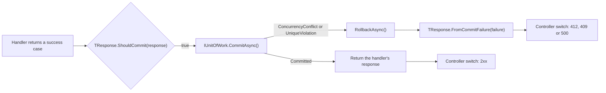
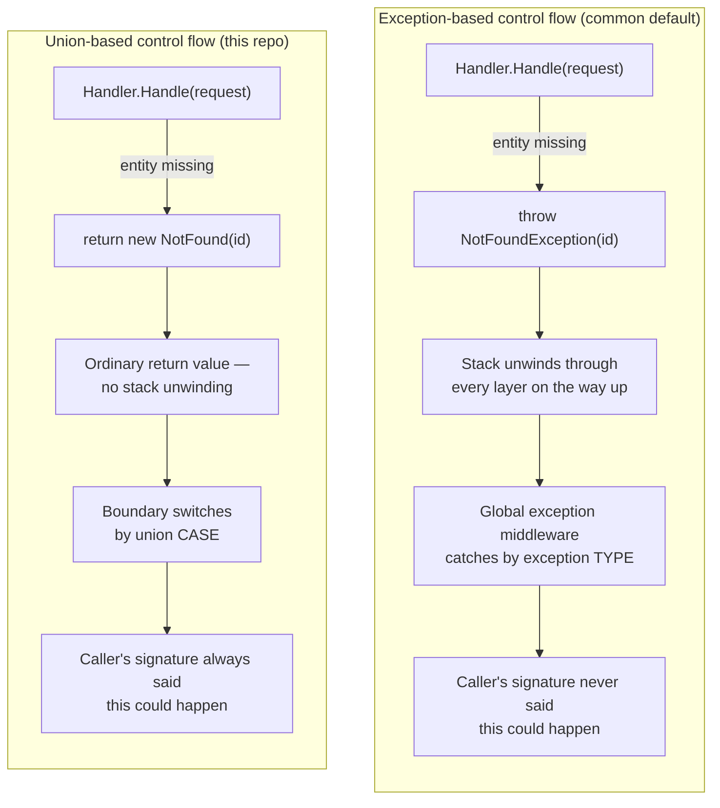
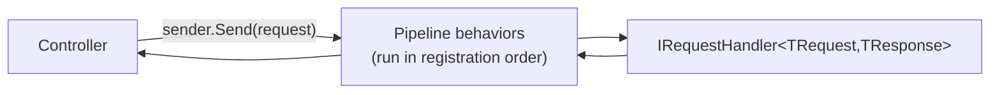
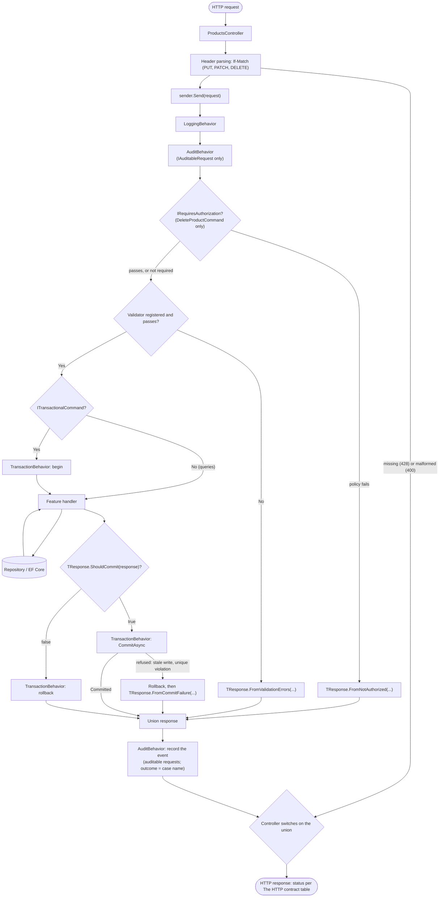
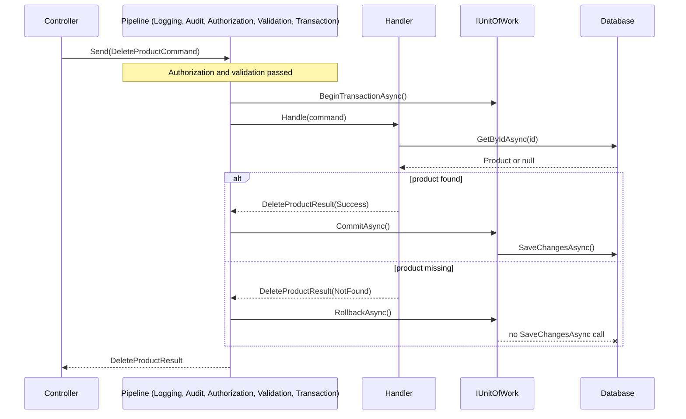
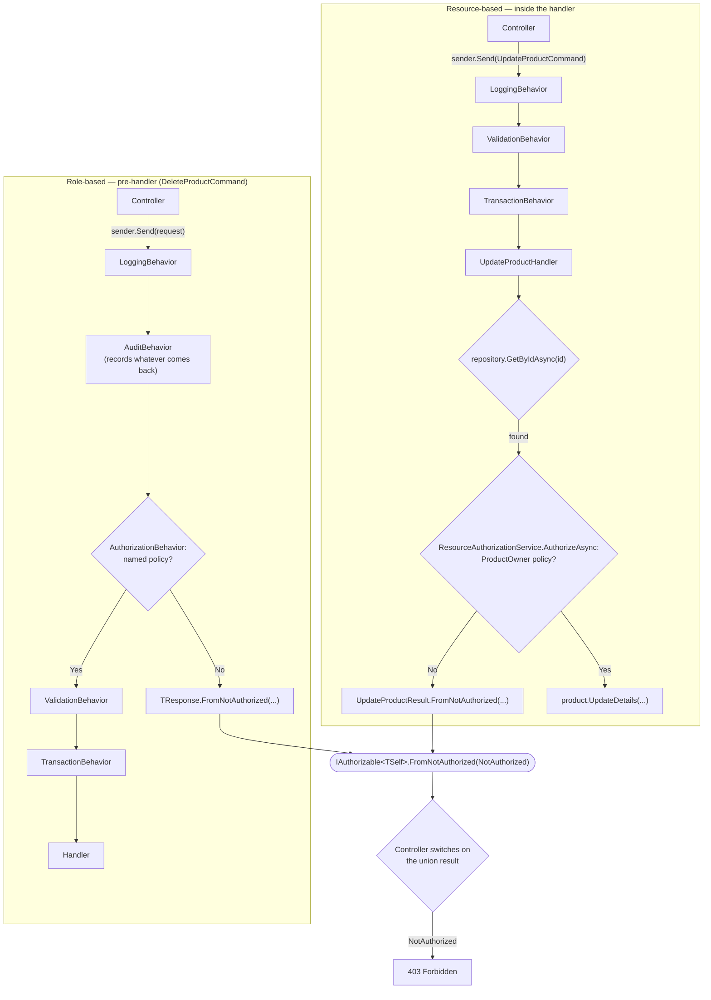
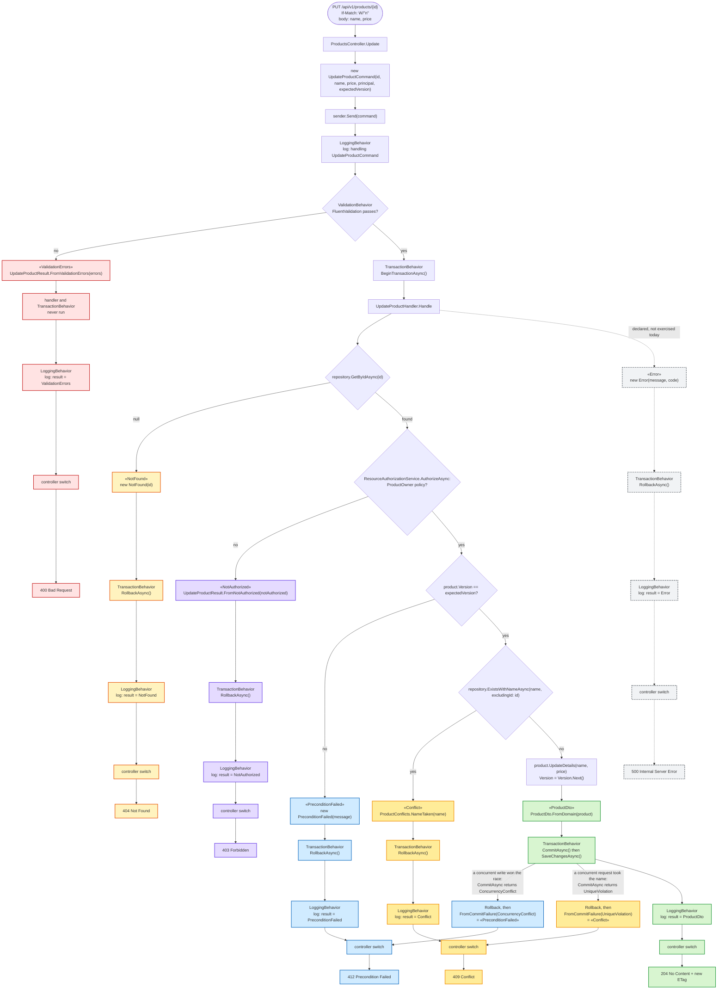
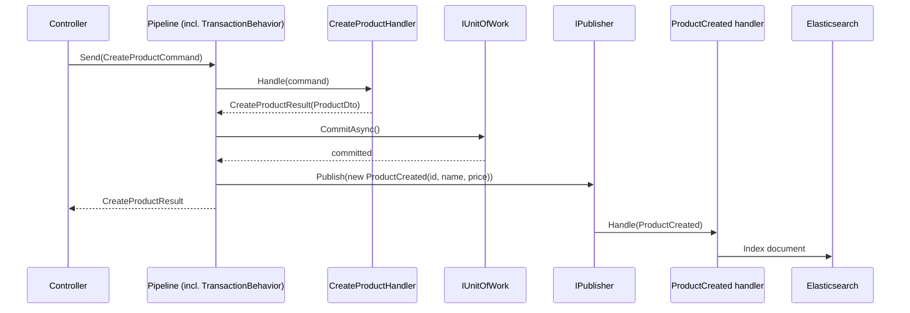

# MediatrUnionPoc

A proof of concept: can C#'s new [`union`](#the-c-union-type) type serve as the response type for a
[MediatR](#mediatr-vocabulary)[^mediatr-license]/[CQRS](#architectural-patterns) handler, replacing
the usual "throw an exception or return null" grab-bag with a closed, exhaustively-checked set of
outcomes?

Short answer: yes, and it composes well with MediatR pipeline behaviors via generic constraints on
**[static abstract interface members](#static-abstract-interface-members-why-generic-code-can-build-a-union-its-never-seen)**.
Details below.

> [!IMPORTANT]
> The `union` keyword is a **C# 15** feature — it needs **.NET 11 Preview 5+**.
> This repo targets `net11.0` with `<LangVersion>preview</LangVersion>` and was built
> against the .NET 11 RC1 SDK.

> [!NOTE]
> **This is one opinionated take, not a prescription.** This repo starts from the position that
> exceptions should be reserved for truly exceptional circumstances — not for ordinary business
> outcomes like "not found" or "validation failed" — and builds a set of suggested conventions
> around that position: unions as response types, meaning-free shared case types, and pipeline-based
> cross-cutting concerns. There are many other defensible ways to solve the same problem — a
> hand-rolled `Result<T>`, a third-party library, or exceptions used deliberately and consistently
> could all work for a different team. Treat what follows as "one thing that works," not "the
> correct answer."

## Table of contents

- [Getting started](#getting-started)
  - [Development environment](#development-environment)
  - [Project layout](#project-layout)
- [Motivation](#motivation)
- [What this pattern provides, and its actual scope](#what-this-pattern-provides-and-its-actual-scope)
- [What this POC demonstrates, and what it leaves out](#what-this-poc-demonstrates-and-what-it-leaves-out)
- [Core concepts](#core-concepts)
  - [The C# `union` type](#the-c-union-type)
    - [Overriding one arm, or writing your own extension member](#overriding-one-arm-or-writing-your-own-extension-member)
  - [Static abstract interface members: why generic code can build a union it's never seen](#static-abstract-interface-members-why-generic-code-can-build-a-union-its-never-seen)
  - [Case types used here](#case-types-used-here)
  - [Shared case types are meaning-free](#shared-case-types-are-meaning-free-transactionbehavior-cant-assume-what-a-case-means)
    - [A commit can fail too: `ICommitFailable`](#a-commit-can-fail-too-icommitfailable)
  - [No exceptions for expected outcomes](#no-exceptions-for-expected-outcomes)
  - [Transactions: what rollback undoes, and why it matters](#transactions-what-rollback-undoes-and-why-it-matters)
  - [Unit of Work: one session, every repository](#unit-of-work-one-session-every-repository)
  - [Vogen: avoiding primitive obsession](#vogen-avoiding-primitive-obsession)
- [Adding a new command or query](#adding-a-new-command-or-query)
- [Request lifecycle](#request-lifecycle)
  - [Commit vs. rollback, message by message](#commit-vs-rollback-message-by-message)
- [The HTTP contract: every endpoint and outcome](#the-http-contract-every-endpoint-and-outcome)
- [Trace id and unhandled exceptions](#trace-id-and-unhandled-exceptions)
  - [Logging](#logging)
- [Health checks and options](#health-checks-and-options)
- [Optimistic concurrency: `ProductVersion`, `ETag` and `If-Match`](#optimistic-concurrency-productversion-etag-and-if-match)
- [Partial updates: `PATCH` as JSON Merge Patch](#partial-updates-patch-as-json-merge-patch)
- [Listing products: filtering, sorting and paging](#listing-products-filtering-sorting-and-paging)
- [Authorization](#authorization)
  - [Why two different points in the request lifetime](#why-two-different-points-in-the-request-lifetime)
  - [How the two flows fit together](#how-the-two-flows-fit-together)
  - [Role-based: `IRequiresAuthorization` + `AuthorizationBehavior`](#role-based-irequiresauthorization--authorizationbehavior)
  - [Resource-based: `ResourceAuthorizationService` + `OwnerAuthorizationHandler<TResource>`](#resource-based-resourceauthorizationservice--ownerauthorizationhandlertresource)
  - [Zero-to-many handlers, and multiple requirements](#zero-to-many-handlers-and-multiple-requirements)
  - [Where the identity comes from](#where-the-identity-comes-from)
  - [Configuring role-based authorization for a new command](#configuring-role-based-authorization-for-a-new-command)
  - [Configuring resource-based authorization for a new command](#configuring-resource-based-authorization-for-a-new-command)
  - [Why not `IAuthorizationRequirementData` attributes](#why-not-iauthorizationrequirementdata-attributes)
- [Impersonation: acting as another identity](#impersonation-acting-as-another-identity)
- [Audit stream: a separate record of security-relevant actions](#audit-stream-a-separate-record-of-security-relevant-actions)
- [CORS: letting a browser client call the API](#cors-letting-a-browser-client-call-the-api)
- [Rate limiting: a budget per caller](#rate-limiting-a-budget-per-caller)
- [Request timeouts: a deadline per request](#request-timeouts-a-deadline-per-request)
- [OpenAPI contract check: no accidental drift](#openapi-contract-check-no-accidental-drift)
- [Worked example: `UpdateProductCommand`, case by case](#worked-example-updateproductcommand-case-by-case)
- [Extending the pattern: syncing a search index](#extending-the-pattern-syncing-a-search-index)
- [Speculative shared case types for a larger API](#speculative-shared-case-types-for-a-larger-api)
- [Testing](#testing)
- [Notes and gotchas](#notes-and-gotchas)
- [Glossary](#glossary)
- [Footnotes](#footnotes)

## Getting started

```bash
dotnet build
dotnet test
dotnet run --project src/MediatrUnionPoc.Api
```

`dotnet run` uses the first launch profile, so the API listens on `http://localhost:5233` (the
`https` profile adds `https://localhost:7070`). In the Development environment it serves the
OpenAPI document of API version 1 at `/openapi/v1.json` (one document per version) and a Scalar UI at `/scalar`. With no
`ConnectionStrings:Products` value the API keeps a private in-memory SQLite database (empty on every
start); set that value to a SQLite connection string such as `Data Source=products.db` to persist.
Every endpoint except the health probes (and, in Development, the OpenAPI and Scalar documents) requires a bearer token; a quick tour, using a token minted as described under [Authorization](#where-the-identity-comes-from):

```bash
curl -i -X POST http://localhost:5233/api/v1/products -H "Authorization: Bearer $TOKEN" \
  -H "Content-Type: application/json" -d '{"name":"Widget","price":9.99}'   # 201, ETag: W/"1"
curl -i http://localhost:5233/api/v1/products -H "Authorization: Bearer $TOKEN" # 200 with X-Total-Count and Link
curl -i http://localhost:5233/api/v1/products                                   # 401, a problem body
```

The full request/response contract of every endpoint is in
[The HTTP contract](#the-http-contract-every-endpoint-and-outcome); the routes are versioned
(`/api/v1/...`, see [API versioning](#api-versioning)).

`global.json` pins the SDK to the exact `11.0.100-rc.1...` preview build this repo was written
against. Without it, an IDE's own SDK resolver (Visual Studio in particular) can silently fall
back to the newest *stable* SDK it finds and fail with `NETSDK1045` ("does not support targeting
.NET 11.0") — `allowPrerelease: true` is what tells it a preview SDK is expected here, not a
missing `<TargetFramework>` value. If VS still shows the error after pulling this file, close and
reopen the solution so it re-resolves.

### Project layout

| Project                          | Responsibility                                                            |
| --------------------------------- | --------------------------------------------------------------------------- |
| `MediatrUnionPoc.Domain`          | Entities, [Vogen](#vogen-avoiding-primitive-obsession) [value objects](#vogen-vocabulary) (`ProductId`, `Money`, `ProductVersion`), the listing vocabulary (`ProductCriteria`, `ProductSort`, `PagedResult`), `CommitResult`, repository/UoW interfaces |
| `MediatrUnionPoc.Application`     | Commands, queries, handlers, union result types, validators, pipeline behaviors, authorization |
| `MediatrUnionPoc.Infrastructure`  | EF Core `DbContext` over SQLite, repository + unit-of-work implementations; the only place criteria and sort become a database query |
| `MediatrUnionPoc.Api`             | The controllers that map each union to an `IActionResult`, the `Http/` extension members, URL-segment API versioning, JWT authentication, impersonation token signing, the file-backed audit stream and its middleware, trace id middleware, exception handler and OpenAPI transformers |
| `MediatrUnionPoc.Domain.Tests`    | Unit tests for the value objects, `Product`, `ProductNames`, `PagedResult` and the sort vocabulary |
| `MediatrUnionPoc.Application.Tests` | xUnit v3 + NSubstitute — union mechanics, pipeline behaviors, handlers, validators, authorization |
| `MediatrUnionPoc.Infrastructure.IntegrationTests` | Real EF Core SQLite provider (in-memory database), end to end |
| `MediatrUnionPoc.Api.IntegrationTests` | `WebApplicationFactory`-based Api integration tests against real SQLite |
| `MediatrUnionPoc.ArchitectureTests` | `NetArchTest.Rules` assertions enforcing the layering above               |

Four one-file probe projects under `tests/CompileTimeChecks/` are deliberately not in the solution;
see [Testing](#testing).

Application code is organized as **[vertical slices](#architectural-patterns)** under
`Features/Products/<Operation>/` (`Create`, `Update`, `Patch`, `Delete`, `GetById`, `GetPaged`) and
`Features/Impersonation/IssueToken/` — everything
for one operation (command/query, validator, handler, result union) lives together, rather than
being split across horizontal "Commands/Handlers/Validators" folders.

## Motivation

Most CQRS handlers end up with a response shape that's either:

- **A single DTO**, with failures signaled by throwing (`NotFoundException`, `ValidationException`,
  ...) and caught somewhere upstream, or
- **A hand-rolled "Result" wrapper** (`Result<T>`, `OneOf<T1,T2,...>`, `ErrorOr<T>`) from a
  third-party library, because C# had no first-class closed-union type to express
  "exactly one of these N things came back."

`union` gives you option two, built into the language, with compiler-enforced
[exhaustiveness](#c-language-concepts) at every [`switch`](#c-language-concepts). This project
pushes that as far as it reasonably goes: every command and query returns a `union` of whatever
outcomes are actually possible for that operation — no more, no fewer — and nothing in the request
pipeline throws for an outcome it expected to see.

## What this pattern provides, and its actual scope

> [!NOTE]
> **This is a convention, not a MediatR requirement.** `IRequestHandler<TRequest, TResponse>`
> places no constraint on `TResponse` beyond being a type — a handler is free to return a plain
> DTO, a `bool`, a `Task` with nothing meaningful in it, or anything else, and MediatR is
> completely indifferent to unions. Returning a `union` of shared and bespoke case types is
> *this repo's own deliberate convention* for expressing "exactly one of N meaningful outcomes,"
> adopted because it fits CQRS-style commands/queries that can genuinely end several different
> ways — not something MediatR asks for, and not the only valid return shape for a handler even
> within this codebase's own pattern. A trivial operation with only one possible outcome has no
> reason to introduce a union at all.

### Union types as responses

- **Exhaustiveness is enforced by the compiler.** Add a new case to a union, and every `switch`
  over it stops compiling until you handle the new case. A forgotten `if (result == null)` check
  simply can't happen — there's no null, only the cases you declared.
- **The signature *is* the contract.** `Task<CreateProductResult>` where
  `CreateProductResult` is `union(ProductDto, ValidationErrors, Error, Conflict)` tells a caller everything
  that can happen without reading the method body or any docs.
- **Mix-and-match per operation.** A union is declared per use case, not shared globally — a
  "get" query might only ever produce `(Dto, NotFound, Error)` while a "delete" produces
  `(Success, NotFound, Error, NotAuthorized, PreconditionFailed)`. No forcing every endpoint through one bloated `Result` type with
  irrelevant properties.
- **No boxing tax for the common path.** Case types are checked directly against the union's
  underlying `object? Value` at pattern-match sites; the union itself is a lightweight struct.
- **Generic code can still build a union it doesn't know the shape of.** By having each union
  implement an interface with a **static abstract member** (`static abstract TSelf
  FromValidationErrors(ValidationErrors errors)`), a fully generic `ValidationBehavior<TRequest,
  TResponse>` can construct the right concrete union's error case without ever naming it — see
  [`IValidatable<TSelf>`](src/MediatrUnionPoc.Application/Common/Abstractions/IValidatable.cs) and
  [Static abstract interface members](#static-abstract-interface-members-why-generic-code-can-build-a-union-its-never-seen)
  below.

## What this POC demonstrates, and what it leaves out

**Demonstrated**, all on one small Products API:

- `union` response types for every command and query, with compiler-checked `switch` exhaustiveness
  at the controller and at every per-union hook (`ShouldCommit`, `FromCommitFailure`,
  `FromValidationErrors`, `FromNotAuthorized`).
- A MediatR pipeline (logging, audit, authorization, validation, transaction) that stays generic through
  `static abstract` interface members.
- Optimistic concurrency with a weak `ETag` and `If-Match`, duplicate-name `Conflict`, JSON Merge
  Patch, filtered/sorted/paged listing with `X-Total-Count` and `Link` headers.
- Uniform RFC 7807 problem bodies, a trace id on every response and log line, and a global
  exception handler for the genuinely unexpected.

**Deliberately out of scope** (this is a pattern POC, not a production template):

- **An identity provider.** The API validates JWT bearer tokens but issues none (no login, no
  refresh, no user store); see [Where the identity comes from](#where-the-identity-comes-from).
- **Cross-instance rate limiting.** Limits are counted per instance, in memory; enforcing one limit across
  instances needs a gateway or a shared store (see [Rate limiting](#rate-limiting-a-budget-per-caller)).
- **Migrations and a production database.** The schema is created with `EnsureCreated` on SQLite.
  There is no migration history, and the unique-violation detection reads SQLite's error message,
  so another provider needs its own check (see
  [Duplicate product names](#duplicate-product-names)).
- **Soft delete and audit columns.** `DELETE` removes the row; the only timestamp is `CreatedAt`. (Who did
  what is recorded in the separate [audit stream](#audit-stream-a-separate-record-of-security-relevant-actions),
  not in the product table; an audit database table is not built.)
- **Exception tracking and a log server.** Serilog writes the console and a rolling JSON file; no
  exception-tracking service or log server (Seq) is bundled. The trace id is the join key for whichever
  you add: OpenTelemetry (exception events on spans), Sentry, or a Serilog sink added in
  configuration. See [Trace id and unhandled exceptions](#trace-id-and-unhandled-exceptions).

## Core concepts

The sections below cover the mechanics and vocabulary the pattern is built on, roughly in the order
they build on each other. Read what's relevant to what you're doing; the [Glossary](#glossary) at
the end is reference material, not required front-to-back reading.

### The C# `union` type

> [!TIP]
> Deeper, citation-backed research behind this section lives in
> [`docs/research/csharp-union-type-research.md`](docs/research/csharp-union-type-research.md) —
> primary sources (language reference, feature spec, [LDM](#cross-cutting-concepts) issue, compiler
> bug tracker) for every claim below, plus open questions not yet settled upstream.

```csharp
public union CreateProductResult(ProductDto, ValidationErrors, Error, Conflict);
```

This declares a closed set of four **[case types](#this-repos-own-types)**. The compiler generates
a [struct](#c-language-concepts) implementing `IUnion { object? Value { get; } }`, plus an implicit
conversion from each case type:

```csharp
CreateProductResult ok = ProductDto.FromDomain(product);        // implicit conversion
CreateProductResult bad = new Error("boom", "BOOM");            // implicit conversion
```

[Pattern matching](#c-language-concepts) unwraps to the *contained* case, not the union wrapper
itself:

```csharp
var response = result switch
{
    ProductDto dto => Ok(dto),          // matches result.Value is ProductDto
    ValidationErrors e => BadRequest(e),
    Error err => Problem(err.Message),  // or err.ToProblemResult(HttpContext), see below
    Conflict c => Conflict(c.Message),
    // no default/discard needed — the compiler knows these are the only four cases
};
```

Unions can carry a body, including implementing [interfaces](#c-language-concepts) — which is how
this repo gets a union to expose a static factory method usable from fully generic code (see
[Static abstract interface members](#static-abstract-interface-members-why-generic-code-can-build-a-union-its-never-seen)
below). This only works because C# allows **static abstract members on interfaces** —
without that, a generic pipeline behavior would have no way to construct an arbitrary union type
it has never seen.

#### Switch-and-unwrap: why controllers never return the union directly

Every action in [`ProductsController`](src/MediatrUnionPoc.Api/Controllers/ProductsController.cs)
`switch`es on the union and returns a plain DTO/RFC 7807 problem/status code — it never does
`return Ok(result)` with the raw union itself. The `switch` stays in the controller so the
compiler keeps enforcing exhaustiveness (`CS8509`); only the repeated failure *arms* are one-liners
that call C# 14 extension members from [`Api/Http`](src/MediatrUnionPoc.Api/Http/):

```csharp
return result switch
{
    ProductDto dto => Ok(dto),
    NotFoundCase notFound => notFound.ToProblemResult(HttpContext, resource: "Product"),
    Error error => error.ToProblemResult(HttpContext),
};
```

Each `ToProblemResult` (on `Error`, `NotFound<TId>`, `NotAuthorized`, `ValidationErrors`,
`PreconditionFailed`, `Conflict` and the Api-level `MissingIfMatch`) builds an
`application/problem+json` body, so every non-2xx response in the API is RFC 7807 (the not-found
body carries a `code` member, `"NOT_FOUND"`). Shared policy lives in `HttpMappingOptions`,
registered in `Program.cs` with `AddResultHttpMapping(...)`: an `Error.Code` to HTTP status table
(default: `Error.ValidationFailureCode` is 400, every other code 500) and a switch for RFC 7807
`type` URIs. Each extension also takes optional per-call overrides (`statusCode`, `title`,
`detail`), and nothing is sealed: a controller can write any arm by hand, or its own extension
members over the same case types; see
[Overriding one arm, or writing your own extension member](#overriding-one-arm-or-writing-your-own-extension-member).

> [!NOTE]
> It's not because `System.Text.Json` would otherwise serialize the generated struct's own
> `Value` property as a wrapper. .NET 11's `System.Text.Json` has built-in awareness of `IUnion`
> and transparently flattens to whichever case type is boxed inside, with no wrapper at all:
> `JsonSerializer.Serialize((CreateProductResult)new ProductDto(...))` produces the exact same
> bytes as serializing the `ProductDto` directly. See
> [`UnionJsonSerializationTests`](tests/MediatrUnionPoc.Application.Tests/Unions/UnionJsonSerializationTests.cs)
> for the proof. `System.Text.Json` is simply this repo's own choice of serializer, not a
> requirement of the union pattern itself — it's what ASP.NET Core defaults to, and it happens to
> have this `IUnion` awareness in this preview build. A different serializer (`Newtonsoft.Json`,
> say) or a non-JSON boundary entirely (gRPC, a message queue's binary format) would need its own
> answer to "how do I represent one of N cases on the wire," or none at all if it never crosses a
> serialization boundary — nothing about the pattern in this repo *requires* System.Text.Json.

The real reason to switch first has nothing to do with serialization shape:

- **There is no wire-level case discriminator.** Even with automatic flattening, nothing in the
  JSON says *which* case came back. `Success` serializes to a completely uninformative `{}`; a
  `ProductDto` and a `NotFound` produce different-looking objects only because their fields happen
  to differ — there is no formal `"case"` or `"$type"` tag guaranteeing that. A consumer receiving
  raw bytes, outside the context of (say) an HTTP status code, cannot reliably tell "succeeded with
  nothing to report" apart from "an unrecognized case was added and I don't know what it means."
- **Each case still needs boundary-specific context attached.** A `NotFound` needs to become
  HTTP 404, not just "an object shaped like `{"Id": "..."}"`; a `ValidationErrors` needs to become
  an RFC 7807 ([Problem Details for HTTP APIs](https://www.rfc-editor.org/rfc/rfc7807) — a
  standardized JSON shape for HTTP error responses) problem response with per-field errors. Nothing
  about serialization does that mapping — only code that inspects which case came back can, which
  is exactly what the `switch` in every controller action does.
- **The union is for code that's still in-process; the unwrapped result is for anything crossing a
  boundary.** Controller, queue consumer, CLI — whichever boundary the domain outcome meets,
  that's where the `switch` belongs, turning a domain outcome into whatever shape *that* boundary
  actually needs.

#### Overriding one arm, or writing your own extension member

The mapping has three layers, and each can be changed without touching the others. All snippets
below are taken from the repo (`ResultHttpMappingTests`, `ResultHttpExtensions`, `ProductsController`).

**1. Change shared policy**, once, in `Program.cs` or a test host. Here a custom error code gets its
own status, and the built-in validation code is remapped:

```csharp
services.AddResultHttpMapping(o => o.ErrorStatusCodes["OUT_OF_STOCK"] = 503);

services.AddResultHttpMapping(options =>
    options.ErrorStatusCodes[Error.ValidationFailureCode] = StatusCodes.Status422UnprocessableEntity);
```

`HttpMappingOptions` also holds `DefaultErrorStatusCode` (500), `IncludeTypeUris` and the status to
`type` URI table `TypeUris`. It is an ordinary options class, so `services.Configure<HttpMappingOptions>(...)`
works as well.

**2. Override a single arm.** Every extension member takes optional `statusCode`, `title` and `detail`
parameters, so one controller arm can differ from the rest without a new type:

```csharp
NotFoundCase notFound => notFound.ToProblemResult(HttpContext, resource: "Product", statusCode: 410),
```

An arm is just an expression of type `IActionResult`, so it can equally be hand-written
(`Ok(...)`, `Problem(...)`, `StatusCode(...)`) instead of calling an extension at all; the
`switch` around it still has to cover every case.

**3. Define your own extension member.** The extensions are C# 14 `extension` blocks, so a member
over a case type (or over any other type, such as `ClaimsPrincipal`) is a
new `extension` block in any static class. A property over the caller's principal, say, needs
nothing but public types:

```csharp
extension(ClaimsPrincipal principal)
{
    public string? CallerId => principal.FindFirstValue(ClaimTypes.NameIdentifier);
}
```

and this is the shape of a per-case member, the built-in `Conflict` one (its XML docs and null
guards trimmed). `BuildProblem` and `OptionsOf` are private helpers of `ResultHttpExtensions`; an
extension of your own would create its `ProblemDetails` the same way through the registered
`ProblemDetailsFactory`:

```csharp
extension(Conflict conflict)
{
    public IActionResult ToProblemResult(
        HttpContext http,
        int? statusCode = null,
        string? title = null,
        string? detail = null
    )
    {
        return BuildProblem(
            http,
            statusCode ?? StatusCodes.Status409Conflict,
            title ?? "Conflict",
            detail ?? conflict.Message
        );
    }
}
```

Because the controller keeps its own `switch`, none of this weakens exhaustiveness: adding a case to
a union still fails the build until an arm exists for it.

### Static abstract interface members: why generic code can build a union it's never seen

[`IValidatable<TSelf>`](src/MediatrUnionPoc.Application/Common/Abstractions/IValidatable.cs),
[`ITransactionOutcome<TSelf>`](src/MediatrUnionPoc.Application/Common/Abstractions/ITransactionOutcome.cs),
and [`IAuthorizable<TSelf>`](src/MediatrUnionPoc.Application/Common/Abstractions/IAuthorizable.cs)
all lean on the same language feature: a **static abstract interface member** — introduced in
**[C# 11 / .NET 7](https://learn.microsoft.com/dotnet/csharp/whats-new/csharp-11#static-abstract-members-in-interfaces)**
(November 2022), originally to support generic math (`INumber<T>` and similar interfaces). Before
it existed, an interface could only require *instance* members: `bool IsValid()` works fine when
you already have an instance to call it on, but a generic pipeline behavior like
`ValidationBehavior<TRequest, TResponse>` doesn't have a `TResponse` instance yet when validation
fails — it needs to *construct* one, generically, for a concrete union type it has never seen and
will never reference by name.

```csharp
public interface IValidatable<TSelf> where TSelf : IValidatable<TSelf>
{
    static abstract TSelf FromValidationErrors(ValidationErrors errors);
}
```

Because `FromValidationErrors` is `static abstract`, every *implementing type* — not every
instance — must supply it, and it becomes callable through a [generic](#c-language-concepts) type
parameter constrained to the interface: `TResponse.FromValidationErrors(errors)` compiles and
dispatches to whichever concrete union `TResponse` actually is at the call site, resolved via the
generic constraint (`where TResponse : IValidatable<TResponse>`), with no runtime type inspection
at all.

**Before C# 11, none of this could be expressed this cleanly.** The realistic workarounds were:

- **Reflection** — look up a static method by name/convention (`FromValidationErrors`) via
  `typeof(TResponse).GetMethod(...)` and invoke it dynamically. This throws away compile-time
  safety entirely: a typo in the method name, or a union that forgot to implement the convention,
  fails at runtime instead of at the build. It's also measurably slower than a direct call.
- **A required base class, or a factory delegate registered per type** — workable, but every new
  union then needs a line of manual registration somewhere central, and that central registry has
  to be kept in sync by hand as unions are added — exactly the kind of bookkeeping this pattern is
  trying to eliminate.
- **Assuming the shape instead of enforcing it** — trusting every union "just happens" to expose a
  compatible static method, with nothing checking that assumption until it's already wrong in
  production.

Static abstract interface members close that gap: the compiler enforces the contract at the
*implementing type's own declaration*, and generic code calls it with the same safety and
performance as a resolved instance-method call — no reflection, no registry, no runtime surprises.

### Case types used here

| Case               | Role    | Meaning                                                         |
| ------------------ | ------- | --------------------------------------------------------------- |
| `Success`          | Shared  | The command completed; no payload to return (used by `DeleteProductResult`) |
| `<Dto>`            | Bespoke | The operation's actual result payload (e.g. `ProductDto`)       |
| `NotFound<TId>`    | Shared  | The requested entity doesn't exist; carries the id that missed  |
| `ValidationErrors` | Shared  | Input failed FluentValidation checks                            |
| `Error`            | Shared  | An unexpected/domain error, with a stable machine-readable code (`Error.ValidationFailureCode` is the one code the Api maps to 400) |
| `Failure`          | Shared  | Business-rule failure(s) that aren't input validation (defined, but no Products union declares it) |
| `NotAuthorized`    | Shared  | The caller isn't allowed to perform this operation              |
| `PreconditionFailed` | Shared | A precondition the caller attached (a stale `If-Match`) no longer holds |
| `Conflict`         | Shared  | The request collides with the current state (e.g. a value that must be unique is taken) |

Every row but `<Dto>` is a **[shared case type](#this-repos-own-types)** — the same meaning-free
record reused across unions (see
[Shared case types are meaning-free](#shared-case-types-are-meaning-free-transactionbehavior-cant-assume-what-a-case-means)).
`<Dto>` stands for whatever **[bespoke case type](#this-repos-own-types)** carries that operation's
actual payload — `ProductDto` for the Products feature. "Bespoke" here means *not meaning-free* —
a `ProductDto` means exactly one thing, a successfully materialized product — not that it's
confined to a single union: it's the success case of `CreateProductResult` and
`GetProductByIdResult` alike, and appears again wrapped as `PagedResult<ProductDto>` inside
`GetPagedProductsResult`. That's a third, different kind of reuse from a shared case type's —
`ProductDto` is reused because every one of those operations happens to succeed with the same
payload shape, not because its identity is deliberately meaning-free the way `Success` or
`NotFound`'s is.

Each union in this repo declares only the subset of cases that operation can actually produce:

| Union | Cases |
| --- | --- |
| `CreateProductResult` | `ProductDto`, `ValidationErrors`, `Error`, `Conflict` |
| `GetProductByIdResult` | `ProductDto`, `NotFound<ProductId>`, `Error` |
| `GetPagedProductsResult` | `PagedResult<ProductDto>`, `ValidationErrors`, `Error` |
| `UpdateProductResult` | `ProductDto`, `NotFound<ProductId>`, `ValidationErrors`, `Error`, `NotAuthorized`, `PreconditionFailed`, `Conflict` |
| `PatchProductResult` | the same seven as `UpdateProductResult` |
| `DeleteProductResult` | `Success`, `NotFound<ProductId>`, `Error`, `NotAuthorized`, `PreconditionFailed` |

Two smaller unions live outside Application: `CommitResult` and `CommitFailure` in the Domain (see
[A commit can fail too](#a-commit-can-fail-too-icommitfailable)) and `IfMatchHeader` in the Api
(`ProductVersion`, `MissingIfMatch`, `ValidationErrors`), which classifies the `If-Match` request
header before anything is sent to MediatR.

> [!WARNING]
> **Don't design case types as a mirror of HTTP status codes.** A union case describes what
> *happened in the domain* — it's meaning, not transport. `NotFound` doesn't mean "return 404";
> it means "the thing wasn't there," full stop. The mapping to a status code (or a gRPC status, or
> a retry decision, or a log line) belongs entirely to the outermost adapter — here, the
> controller's `switch` — and nowhere else. The same `NotFound` case, consumed by a queue worker
> instead of a controller, might mean "drop the message" or "dead-letter it"; it never means
> "404" in that context, because there is no HTTP response to produce. Keep the case types
> transport-agnostic so the Application layer stays usable from a worker, a CLI, or a gRPC service
> without modification.

### Shared case types are meaning-free: TransactionBehavior can't assume what a case means

`Error`, `NotFound`, `Success`, and the rest of this codebase's shared case types are plain,
meaning-free records. Any union is free to reuse `NotFound` to mean something that should
*commit*, or to introduce its own bespoke case type that should roll back — nothing about a shared
case type's identity says what it means for a given operation's transaction. That rules out
deciding commit-vs-rollback by pattern-matching case types against a fixed list (`response.Value is
Error or Failure or NotAuthorized or ValidationErrors or NotFound`): that's a closed-world
assumption baked into generic code, and it would silently misclassify any case type outside the
list, including one declared after the code that lists them was written.

The decision belongs on the union itself instead, via
[`ITransactionOutcome<TSelf>`](src/MediatrUnionPoc.Application/Common/Abstractions/ITransactionOutcome.cs):

```csharp
public interface ITransactionOutcome<TSelf> where TSelf : ITransactionOutcome<TSelf>
{
    static abstract bool ShouldCommit(TSelf response);
}
```

Each command's union implements it with a `switch` over **its own** cases:

```csharp
public union UpdateProductResult(
    ProductDto, NotFound<ProductId>, ValidationErrors, Error, NotAuthorized, PreconditionFailed, Conflict)
    : IValidatable<UpdateProductResult>, ITransactionOutcome<UpdateProductResult>,
        IAuthorizable<UpdateProductResult>, ICommitFailable<UpdateProductResult>
{
    public static bool ShouldCommit(UpdateProductResult response) => response switch
    {
        ProductDto => true,
        NotFound<ProductId> => false,
        ValidationErrors => false,
        Error => false,
        NotAuthorized => false,
        PreconditionFailed => false,
        Conflict => false,
    };
}
```

`TransactionBehavior` calls `TResponse.ShouldCommit(response)` and never inspects a case type by
name. Two compiler-enforced guarantees back this, not just convention:

- **Every case, including future ones, must be classified.** `ShouldCommit`'s `switch` is
  exhaustive over that union's own closed case set — exactly like every other union `switch` in
  this codebase. Adding a case to `UpdateProductResult` without updating its `ShouldCommit` fails
  the build with `CS8509`, the same diagnostic
  [`ExhaustivenessTests`](tests/MediatrUnionPoc.Application.Tests/Unions/ExhaustivenessTests.cs) proves against
  a plain `switch`. Two more scratch projects,
  [`ShouldCommitNonExhaustive`](tests/CompileTimeChecks/ShouldCommitNonExhaustive) and
  [`ShouldCommitExhaustive`](tests/CompileTimeChecks/ShouldCommitExhaustive), prove this
  specifically for `ShouldCommit` using a union of entirely made-up case types —
  `Approved`, `Rejected`, `NeedsManualReview` — showing the guarantee holds for arbitrary case
  types, not just the ones any existing union happens to declare.
- **Only commands that need a transaction carry the obligation.** `ITransactionOutcome<TResponse>`
  is required by [`ITransactionalCommand<TResponse>`](src/MediatrUnionPoc.Application/Common/Abstractions/Messages.cs),
  not by `ICommand<TResponse>` itself — a command with nothing to commit or roll back (one that
  only publishes an event, say) is a plain `ICommand<TResponse>` and never needs to answer the
  question at all. A command that *does* declare `ITransactionalCommand<TResponse>` without its
  response implementing `ShouldCommit` is a compile error at the command declaration, not a
  pipeline behavior that quietly declines to run because a generic constraint wasn't satisfied. See
  [`NonTransactionalCommandTests`](tests/MediatrUnionPoc.Application.Tests/Behaviors/NonTransactionalCommandTests.cs)
  for both halves of this proved together.

[`TransactionBehaviorTests`](tests/MediatrUnionPoc.Application.Tests/Behaviors/TransactionBehaviorTests.cs)
proves the general case with an `ArbitraryOutcome` union whose case type (`SomeDevsOwnCaseType`)
shares no name, shape, or relationship with any case type used anywhere else in the codebase — the
behavior rolls back correctly purely by asking the union, never by recognizing the type.

#### A commit can fail too: `ICommitFailable`

`ShouldCommit` decides whether to *attempt* a commit. The commit itself can still be refused for an
ordinary, expected reason: another request changed the row first (an optimistic-concurrency
failure), or the write would break a uniqueness constraint (the unique index on a product's normalised name). Those are outcomes, not faults, so
[`IUnitOfWork.CommitAsync`](src/MediatrUnionPoc.Domain/IUnitOfWork.cs) reports them as a small
closed union instead of throwing:

```csharp
public union CommitResult(Committed, ConcurrencyConflict, UniqueViolation);
public union CommitFailure(ConcurrencyConflict, UniqueViolation);   // the two failing cases
```

What a failure *means* is operation-specific — a stale write on an update is a precondition
failure; the same failure on a brand-new row is impossible, so for a create it can only be an
unexpected error; a uniqueness violation on a create or an update is a conflict. So, exactly as with
`ShouldCommit`, the union answers, through
[`ICommitFailable<TSelf>`](src/MediatrUnionPoc.Application/Common/Abstractions/ICommitFailable.cs):

```csharp
public interface ICommitFailable<TSelf> where TSelf : ICommitFailable<TSelf>
{
    static abstract TSelf FromCommitFailure(CommitFailure failure);
}

// UpdateProductResult
public static UpdateProductResult FromCommitFailure(CommitFailure failure) => failure switch
{
    ConcurrencyConflict => new PreconditionFailed("The product was changed by another request; reload it and retry."),
    UniqueViolation => ProductConflicts.NameTakenByConcurrentRequest(),   // a Conflict
};
```

Each transactional union answers for itself, and the answers differ:

| Union | `ConcurrencyConflict` becomes | `UniqueViolation` becomes |
| --- | --- | --- |
| `CreateProductResult` | `Error` (`COMMIT_CONCURRENCY_CONFLICT`): a brand-new row cannot have a stale version | `Conflict` |
| `UpdateProductResult` | `PreconditionFailed` | `Conflict` |
| `PatchProductResult` | `PreconditionFailed` | `Conflict` |
| `DeleteProductResult` | `PreconditionFailed` | `Error` (`COMMIT_UNIQUE_VIOLATION`): a delete cannot violate a uniqueness constraint |

The controller then maps those cases like any others (`Conflict` 409, `PreconditionFailed` 412,
`Error` 500):



`TransactionBehavior<TRequest, TResponse>` requires `TResponse : ICommitFailable<TResponse>` in
addition to `ITransactionOutcome<TResponse>`. When `CommitAsync` reports a failure it rolls back
and returns `TResponse.FromCommitFailure(failure)` in place of the handler's success response; the
behavior never sees which case types the union has. Because the `switch` is exhaustive over
`CommitFailure`, every transactional union is forced by the compiler to classify every commit
failure — including one added later. A genuinely unexpected exception (a dropped connection, say)
is still not a `CommitFailure`: it rolls back and is rethrown unchanged.

### No exceptions for expected outcomes

A validation failure, a missing entity, an unauthorized caller, a business-rule violation — these
are not bugs, not infrastructure faults, and not exceptional. They are ordinary, anticipated
outputs of a use case, and this codebase treats them that way: every union declares them as cases,
and nothing in the request pipeline throws to signal one.

#### Why MediatR codebases reach for exceptions anyway

MediatR's own contract doesn't stop anyone from throwing: `IRequestHandler<TRequest,
TResponse>.Handle` returns `Task<TResponse>`, and nothing about that signature says a not-found or
a validation failure has to be part of `TResponse`. Three things push the ecosystem toward
exceptions as the default anyway:

- **ASP.NET Core ships a global exception-handling story, and no equivalent for anything else.**
  `UseExceptionHandler`/`IExceptionHandler` and problem-details middleware exist specifically to
  turn a thrown exception into an HTTP response in exactly one place, so `throw new
  NotFoundException(id)` inside any handler, anywhere, "just works" without that handler's author
  writing any HTTP-mapping code at all. There is no equivalent one-line convenience for "return a
  typed outcome and let something downstream map it" — that has to be built, which is exactly what
  the `switch` in every controller action in this repo is doing.
- **Before `union`, C# had no built-in way to say "returns exactly one of these N things."** The
  realistic options were a hand-rolled `Result<T>` type, a third-party library (`OneOf`,
  `ErrorOr`, `FluentResults`), or leaving `TResponse` a single DTO and using an exception for
  everything that isn't the happy path. The third option needs zero new types and zero new
  dependencies, which is why it's the default in countless tutorials, project templates, and
  production codebases — not because it's better, but because it requires nothing else to be
  installed.
- **It composes for free across call depth.** A handler three calls deep can `throw`, and nothing
  in between has to know or care — the exception unwinds the stack automatically until something
  catches it. A typed result has to be threaded back up explicitly through every intermediate
  return, which reads as more code to write in the moment it's written, even though it's the code
  that keeps the contract honest.

#### Why that convenience is a bad trade

None of the above makes exceptions-as-control-flow *correct* — it explains why it's common, not why
it's a good idea. **`throw` should mean what its name says: something exceptional happened.** The
moment a validation failure or a missing entity becomes a routine, expected outcome of calling an
operation, throwing for it stops being a shortcut and starts being a liability, in ways that get
worse as a codebase grows, not better:

- **It lies about the method's contract.** `Task<ProductDto> GetByIdAsync(ProductId id)` looks
  total — call it with any valid ID, get a `ProductDto` back — but if "not found" throws, the real
  contract is "returns a `ProductDto`, *or* throws one of an unbounded, undocumented set of
  exception types you'll only discover by reading the implementation or hitting one in production."
  A signature that misrepresents what can happen is worse than no signature at all, because it
  invites callers to trust it.
- **The compiler can't backstop it.** Forgetting `if (result is null)` is a mistake tooling can be
  made to catch — nullable reference types, or (better) exhaustive `switch` over a union with no
  null in its case set at all. Forgetting to wrap a call in `try`/`catch` for an exception type you
  didn't know it could throw is a mistake nothing catches — C# has no `throws` clause. The failure
  mode isn't "won't compile"; it's "compiles cleanly, throws unhandled in production."
- **It's measurably, not marginally, slower.** Throwing and catching a .NET exception costs orders
  of magnitude more than an ordinary return — stack-trace capture and stack unwinding are real CLR
  work that happens even when the `catch` is right there waiting. A `NotFound` that happens
  routinely (a stale bookmark, a race against a concurrent delete) shouldn't cost more than the
  `switch` that already exists to route it.
- **It pollutes observability with false signal.** Most hosting and APM setups treat any
  exception — logged or unhandled — as an *error*: it shows up in error-rate dashboards and can
  trip paging, for a stack trace nobody needed to explain a routine 404. Do this enough and a team
  either tunes out real incidents (alert fatigue — precisely the failure mode exceptions exist to
  prevent) or spends real effort teaching its own monitoring to ignore its own "errors," which is a
  worse position than never having generated the noise.
- **It scatters the outcome-to-response mapping instead of concentrating it.** With exceptions,
  "what HTTP status does a missing product produce" lives inside exception-handling middleware,
  switching on exception *type*, disconnected from the operation that threw it. With a union, that
  mapping lives in the one `switch` at the boundary that already has to exist for the happy path —
  there is no second, parallel place for it to drift out of sync with the first.
- **It's trivial to over-catch by accident.** A `catch (Exception)` written to handle one expected
  failure will just as happily catch a `NullReferenceException` from an actual bug, log it
  identically, and move on — nothing about the `catch` clause distinguishes "outcome I was
  expecting" from "bug I wasn't." A union case, by contrast, can only exist because some code
  explicitly constructed it as that case.



#### What this repo does instead

- **Exceptions are reserved for the truly exceptional** — a dropped DB connection, a bug, a
  contract violation from a dependency. Anything a handler can *expect* to happen is a union case,
  constructed and returned like any other value.
- **Impossible to "forget to catch."** A thrown `NotFoundException` three layers up is a runtime
  surprise if some caller doesn't wrap it. A `NotFound` case in a union is impossible to silently
  drop — the compiler makes every `switch` look at it.
- **Transactions decide by outcome, not by catching.** [`TransactionBehavior`](src/MediatrUnionPoc.Application/Common/Behaviors/TransactionBehavior.cs)
  asks the union itself — `ITransactionOutcome<TSelf>.ShouldCommit` — whether to commit, rather
  than inspecting which case type came back. No `catch` block is involved for expected outcomes; a
  `catch` still exists, but only for genuinely unexpected exceptions, and it rolls back and
  rethrows rather than swallowing anything into a result. See
  [Shared case types are meaning-free](#shared-case-types-are-meaning-free-transactionbehavior-cant-assume-what-a-case-means)
  for why this isn't a hardcoded list of "which case types mean error," and
  [Transactions: what rollback undoes, and why it matters](#transactions-what-rollback-undoes-and-why-it-matters)
  below for what "rollback" actually does.
- **Validator-owned members are deliberately not null-guarded; everything else is.** Every other
  public reference-type parameter in Application, Domain, Infrastructure and Api throws
  `ArgumentNullException` on `null`, but `CreateProductCommand.Name` and `UpdateProductCommand.Name`
  are not guarded, because `CreateProductValidator` / `UpdateProductValidator` own that input rule
  and report a `null` name as a `ValidationErrors` outcome. Over HTTP a `null` name is already
  rejected earlier by MVC model validation (400), so the guard would be redundant there; but a
  guard would make a direct `ISender.Send` caller get a thrown exception instead of the union case.
  Pinned by `ValidationBehaviorTests.Ctor_NullName_DoesNotThrowAndFailsValidation_Test`.

### Transactions: what rollback undoes, and why it matters

A database transaction groups a set of writes so they succeed or fail *together*. `TransactionBehavior`
opens one before a [transactional command's](#mediatr-vocabulary) handler runs, and decides after the
handler returns whether to **commit** (make every write inside it permanent) or **rollback** (undo
every write inside it, as if none of them had ever happened).

**Where this matters**: a handler that touches more than one repository, or writes to an entity
across more than one step, would otherwise risk a *partial write* — succeeding at step one and
failing at step two, leaving the database in a state no business rule ever intended to exist. A
transaction turns "did some of this succeed?" into a question that never needs asking: either the
whole unit of work happened, or none of it did.

**What actually gets undone**: everything the underlying `DbContext`'s change tracker recorded
during the handler's execution but never reached the database via `SaveChangesAsync` — inserts,
updates, and deletes alike. Nothing about this repo's own handler code has to remember what to
undo; the database transaction (plus `EfCoreUnitOfWork`'s change-tracker detach — see
[Notes and gotchas](#notes-and-gotchas)) does that bookkeeping.

**Why this is a benefit, not just a safety net**: it lets a handler write code that assumes success
and bail out cleanly on any unexpected outcome, without manually tracking "what have I already done
that I'd need to compensate for." Compare a hypothetical handler with no transaction: if it updated
one row, then failed validating a second write, undoing the first row's change would need to be
written by hand, remembered, and tested — a whole category of bugs a transaction eliminates by
construction.

This repo decides commit-vs-rollback by asking the union itself
(`ITransactionOutcome<TSelf>.ShouldCommit`, [above](#shared-case-types-are-meaning-free-transactionbehavior-cant-assume-what-a-case-means))
rather than by catching an exception — so rolling back a transaction is just as available for an
*expected*, successfully-returned outcome (`NotFound`, `ValidationErrors`) as it is for a genuine
fault, with no `catch` block required to trigger it. See
[Commit vs. rollback, message by message](#commit-vs-rollback-message-by-message) below for this
traced through a concrete request.

### Unit of Work: one session, every repository

[`IUnitOfWork`](src/MediatrUnionPoc.Domain/IUnitOfWork.cs) is registered once per request (a scoped
[dependency injection](#cross-cutting-concepts) lifetime) and handed to every repository and
handler that needs it during that request — which means every repository sharing that same
`IUnitOfWork` is also sharing the same underlying `DbContext`/change-tracking session. A handler
that needs `IProductRepository` *and* a hypothetical `IOrderRepository` in the same operation gets
both backed by the same session automatically, purely from how dependency injection resolves scoped
services — no extra wiring required to keep them consistent with each other.

This is what lets `IUnitOfWork.CommitAsync()`/`RollbackAsync()` cover *every* repository touched
during the request with one call, instead of each repository having to save (or undo) its own
changes independently. That's the specific gap a **standalone repository or domain service method**
doesn't close on its own: a repository's own save method only knows about *its* entities —
coordinating a write that spans two repositories would need either the repositories to reference
each other (leaking persistence details across an otherwise clean boundary) or some other component
to explicitly own "did both succeed." [Unit of Work](#architectural-patterns) is that "other
component" — it doesn't replace repositories or domain services, and a simple operation touching
exactly one repository doesn't need to reach for it: a `Product`-only handler here still calls
`IProductRepository` directly, with `IUnitOfWork` only mattering for its transaction boundary, not
as a required intermediary for every read or write.

### Vogen: avoiding primitive obsession

> [!TIP]
> Deeper, citation-backed research behind this section lives in
> [`docs/research/vogen-research.md`](docs/research/vogen-research.md) — primary sources (Vogen's
> README and official docs site) for the factory/equality/conversion behavior described below, and
> the defense-in-depth reasoning behind the EF Core converter choice.

[Vogen](https://github.com/SteveDunn/Vogen) is a [source generator](#c-language-concepts) that
turns a bare primitive (`Guid`, `decimal`, `string`, ...) into a distinct, validated
[value type](#vogen-vocabulary) — so `ProductId` and an unrelated `Guid` parameter can never be
swapped by mistake, and an invalid value can never be constructed in the first place. This section
covers a supporting library this repo happens to use for that concern, not a language feature the
union pattern itself depends on — a different implementation could use plain primitives, a
different value-object library, or hand-rolled wrapper types instead.

```csharp
[ValueObject<Guid>(conversions: Conversions.SystemTextJson)]
public readonly partial struct ProductId
{
    private static Validation Validate(Guid input) =>
        input != Guid.Empty ? Validation.Ok : Validation.Invalid("ProductId cannot be an empty guid.");

    public static ProductId New() => From(Guid.NewGuid());
}
```

From this ~6-line declaration, Vogen generates:

- **Factory methods** — `ProductId.From(guid)` (throws on invalid input) and `TryFrom(guid, out id)`
  (doesn't). `Validate` runs inside *every* generated factory, so an empty-guid `ProductId` cannot
  exist anywhere in the codebase — not just at the API boundary where FluentValidation already
  checks it.
- **Structural equality, hashing, and `ToString`** — two `ProductId`s wrapping the same `Guid` are
  equal; [`record`](#c-language-concepts)-style value semantics without needing `record` (this has
  to be a `struct` per Vogen's own constraints, and `readonly partial struct` is the declaration
  shape it generates into).
- **Conversions**, opt-in per flag on the attribute. This repo uses `Conversions.SystemTextJson`
  only, so `ProductId` serializes as a bare GUID string (`"..."`), not as a wrapper object — see
  [`ProductDto`](src/MediatrUnionPoc.Application/Features/Products/Common/ProductDto.cs) for where
  that matters on the wire.

`Money` ([`Money.cs`](src/MediatrUnionPoc.Domain/Money.cs)) follows the identical pattern over
`decimal`, rejecting negative amounts.

Two Vogen-specific pitfalls we hit while building this — full detail in
[Notes and gotchas](#notes-and-gotchas) — are worth knowing about up front if you add your own
value object: don't set `PrivateAssets="all"` on the `Vogen` package reference, and don't reach
for Vogen's generated `EfCoreValueConverter` from a persistence-agnostic Domain project (this repo
hand-writes its EF Core converters in Infrastructure instead — see
[`ValueConverters.cs`](src/MediatrUnionPoc.Infrastructure/ValueConverters.cs)).

## Adding a new command or query

MediatR is an in-process [mediator](#architectural-patterns): instead of a controller calling a
service directly, it sends a message object and MediatR routes it to exactly one handler. This is
what makes CQRS's "Commands write, Queries read" split easy to enforce — commands and queries are
just different message types, and cross-cutting concerns (logging, validation, transactions) wrap
around all of them uniformly via **[pipeline behaviors](#architectural-patterns)**, the MediatR
equivalent of ASP.NET Core middleware.

> [!TIP]
> Deeper, citation-backed research behind MediatR's pipeline mechanics lives in
> [`docs/research/mediatr-research.md`](docs/research/mediatr-research.md) — primary sources
> (MediatR's own repo and release notes), plus a worked sequence diagram tracing
> `CreateProductCommand` through the full pipeline.



Every operation in this repo has five pieces. Using a hypothetical `Ping` query as a minimal,
non-Product example:

**1. Declare what can come back, as a union:**

```csharp
public union PingResult(PongDto, Error) : IValidatable<PingResult>
{
    public static PingResult FromValidationErrors(ValidationErrors errors) =>
        new Error(errors.ToErrorMessage(), Error.ValidationFailureCode);
}
```

**2. Declare the request.** Implement `IQuery<TResponse>` for a read-only request (this example),
`ICommand<TResponse>` for one that mutates state but needs no transaction, or
`ITransactionalCommand<TResponse>` for one `TransactionBehavior` should commit or roll back —
the latter requires the response union to implement `ITransactionOutcome<TResponse>` and
`ICommitFailable<TResponse>` (see [A commit can fail too](#a-commit-can-fail-too-icommitfailable)):

```csharp
public sealed record PingQuery(string Message) : IQuery<PingResult>;
```

**3. (Optional) add a [FluentValidation](https://github.com/FluentValidation/FluentValidation)
validator** — picked up automatically by assembly scanning, no manual registration needed.
FluentValidation is this POC's illustrative choice for wiring validation, not a prescription — any
approach that can short-circuit into the response union via `IValidatable<TSelf>` fits the pattern
equally well.

> [!TIP]
> Deeper, citation-backed research on FluentValidation's async/cascade/DI behavior in this
> pipeline lives in
> [`docs/research/fluentvalidation-research.md`](docs/research/fluentvalidation-research.md).

```csharp
public sealed class PingValidator : AbstractValidator<PingQuery>
{
    public PingValidator() => RuleFor(x => x.Message).NotEmpty();
}
```

**4. Write the handler** — return a case type; MediatR/the union's implicit conversion does the
rest:

```csharp
public sealed class PingHandler : IRequestHandler<PingQuery, PingResult>
{
    public Task<PingResult> Handle(PingQuery request, CancellationToken cancellationToken) =>
        Task.FromResult<PingResult>(new PongDto(request.Message));
}
```

**5. Call it from a controller** and `switch` exhaustively on the result:

```csharp
var result = await sender.Send(new PingQuery("hi"), cancellationToken);

return result switch
{
    PongDto pong => Ok(pong),
    Error error => error.ToProblemResult(HttpContext),
};
```

That's it — no DI registration step for the handler or validator; both are found via
`services.AddMediatR(...)` and `services.AddValidatorsFromAssembly(...)` in
[`DependencyInjection.cs`](src/MediatrUnionPoc.Application/DependencyInjection.cs).

**6. (Optional) audit it.** A command that changes security-relevant state also implements
`IAuditableRequest<TResponse>` (an action name, the caller, a failure policy and a `DescribeAudit`
method) and `AuditBehavior` then records every outcome; see
[Audit stream](#audit-stream-a-separate-record-of-security-relevant-actions).

## Request lifecycle



Before the controller runs, the request passes the host's middleware, in this order: forwarded headers (only
with trusted proxies), trace id, request logging, exception handler, status-code pages, HTTPS redirection, CORS,
authentication, user log context, impersonation audit, request timeout, rate limiter, authorization. Each is explained where it
is introduced ([CORS](#cors-letting-a-browser-client-call-the-api),
[Request timeouts](#request-timeouts-a-deadline-per-request),
[Rate limiting](#rate-limiting-a-budget-per-caller)); the diagram above starts after them.

Only the last "Controller switches on the union" step is HTTP-aware — everything above it deals
purely in domain outcomes; the status each case becomes is in
[The HTTP contract](#the-http-contract-every-endpoint-and-outcome). The pipeline behaviors run in
this registration order (`Application/DependencyInjection.cs`): `LoggingBehavior`, `AuditBehavior`,
`AuthorizationBehavior`, `ValidationBehavior`, `TransactionBehavior`. `AuditBehavior` sits outside
authorization and validation on purpose, so a request they refuse is still recorded. Which of them a request meets
is decided by its marker interfaces and its response union's interfaces:

| Behavior | Applies to requests that | Needs the response union to implement |
| --- | --- | --- |
| `LoggingBehavior` | every request | nothing |
| `AuditBehavior` | implement `IAuditableRequest<TResponse>` (the four product mutations and the impersonation command) | nothing beyond being a union |
| `AuthorizationBehavior` | implement `IRequiresAuthorization` (`DeleteProductCommand`) | `IAuthorizable<TSelf>` |
| `ValidationBehavior` | have a response union that implements `IValidatable<TSelf>` (all six operations); it does nothing when no validator is registered | `IValidatable<TSelf>` |
| `TransactionBehavior` | implement `ITransactionalCommand<TResponse>` (Create, Update, Patch, Delete) | `ITransactionOutcome<TSelf>` and `ICommitFailable<TSelf>` |

`ICommand<TResponse>` (no transaction assumption) and `IQuery<TResponse>` (read-only) are the other
two request markers; no Products operation uses a bare `ICommand`, but
`NonTransactionalCommandTests` proves such a command never meets `TransactionBehavior`. `PUT` and
`PATCH` are not `IRequiresAuthorization`: their ownership check needs the loaded product, so it runs
inside the handler (see [Authorization](#authorization)).

### Commit vs. rollback, message by message



No `catch` block appears anywhere in this flow — the branch is decided entirely by which case type
the handler returned (through `ShouldCommit`). A commit that is itself refused (`CommitAsync` returns
`ConcurrencyConflict` instead of `Committed`) takes the rollback branch too, and the response becomes
`DeleteProductResult.FromCommitFailure(...)`, here a `PreconditionFailed`. The handler's own version
check and the case where `If-Match` names a stale version also produce `PreconditionFailed` before
any commit is attempted, and that case is not committed either.

## The HTTP contract: every endpoint and outcome

This is the complete mapping the controller's `switch` arms and `ProducesResponseType` attributes
implement. Every non-2xx response is `application/problem+json` (`ValidationProblemDetails`, with an
`errors` member, for validation), and **every response** of any status carries an `X-Trace-Id`
header; problem bodies also carry `traceId` (see
[Trace id and unhandled exceptions](#trace-id-and-unhandled-exceptions)).

**Authentication.** Every product endpoint requires a valid bearer token (a fallback authorization
policy makes the whole host secure by default). A missing, expired, wrongly signed or wrongly
addressed token is `401` (with a `WWW-Authenticate: Bearer` challenge), on every verb and before any
row below applies; the table lists only what a valid caller can get. The middleware's `401` and `403`
are problem bodies with a `traceId` like every other failure. Only `/health/live`, `/health/ready`
and, in Development, `/openapi/v1.json` and `/scalar` are anonymous.

**Rate limiting.** Every endpoint of the table below (all but the health probes and the Development documents)
can also answer `429 Too Many Requests` once the caller has spent its budget: a problem body with `code`
`RATE_LIMITED`, the `traceId` and a `Retry-After` header in whole seconds. It comes from the rate limiter,
after authentication and before authorization, so it is not a union case and is not repeated per row; see
[Rate limiting](#rate-limiting-a-budget-per-caller).

**Request timeouts.** Likewise every endpoint of the table (again all but the health probes and the Development
documents) can answer `504 Gateway Timeout` when the request outlives its deadline: a problem body with `code`
`REQUEST_TIMEOUT` and the `traceId`. It comes from the timeout middleware, not from a union, and is not repeated
per row; see [Request timeouts](#request-timeouts-a-deadline-per-request).

Request headers the API reads:

| Header | Used by | Meaning |
| --- | --- | --- |
| `Authorization: Bearer <jwt>` | every product endpoint | The caller's identity: its `sub` becomes the new product's owner on `POST` and must equal the owner on `PUT`/`PATCH`; a `role` of `Administrator` is required on `DELETE` |
| `If-Match: W/"n"` | `PUT`, `PATCH` (required); `DELETE` (optional) | The `ETag` of the version being changed |
| `Content-Type: application/merge-patch+json` | `PATCH` | Required for `PATCH`; anything else is `415` |
| `X-Forwarded-For` | every endpoint, **only** from a configured trusted proxy | The client address a reverse proxy reports; ignored from anyone else. See [Behind a reverse proxy](#behind-a-reverse-proxy) |

| Endpoint | Union case | Status | Notes |
| --- | --- | --- | --- |
| `POST /api/v1/products` | `ProductDto` | `201` | `ETag: W/"1"`, `Location` header (the versioned URL of the new product), product in the body |
| | `ValidationErrors` | `400` | Per-field `errors` |
| | `NotAuthorized` | `403` | The token is valid but has no `sub` claim, so there is no identity to own the product; answered before anything is sent to MediatR |
| | `Conflict` | `409` | Another product has an equivalent name |
| | `Error` | `500` | Only a commit that cannot fail this way (`COMMIT_CONCURRENCY_CONFLICT`) |
| `GET /api/v1/products/{id}` | `ProductDto` | `200` | `ETag` header |
| | `NotFound<ProductId>` | `404` | `code` member `NOT_FOUND` |
| | `Error` | `400` / `500` | `400` for `Error.ValidationFailureCode` (an empty GUID), `500` for any other code |
| `GET /api/v1/products` | `PagedResult<ProductDto>` | `200` | `X-Total-Count` and RFC 8288 `Link` headers; a page past the end is still `200` with empty `items` |
| | `ValidationErrors` | `400` | Per-field `errors` (`PageNumber`, `PageSize`, `MinPrice`, `MaxPrice`, `NameContains`, `OwnerId`, `Sort`) |
| | `Error` | `500` | |
| `PUT /api/v1/products/{id}` | `ProductDto` | `204` | No body; the new `ETag` header |
| | `NotFound<ProductId>` | `404` | |
| | `ValidationErrors` | `400` | Also a malformed `If-Match` (an error naming the header) |
| | `NotAuthorized` | `403` | Caller is not the owner |
| | `Conflict` | `409` | The new name duplicates another product's, up front or at commit |
| | `PreconditionFailed` | `412` | Stale `If-Match`, up front or at commit |
| | absent `If-Match` (`MissingIfMatch`) | `428` | Answered before anything is sent to MediatR |
| | `Error` | `500` | |
| `PATCH /api/v1/products/{id}` | `ProductDto` | `200` | The whole updated product and its new `ETag` |
| | `NotFound<ProductId>` | `404` | |
| | `ValidationErrors` | `400` | Nothing supplied, a supplied `null`, a bad value, or a malformed `If-Match` |
| | `NotAuthorized` | `403` | |
| | `Conflict` | `409` | |
| | `PreconditionFailed` | `412` | |
| | body not `application/merge-patch+json` | `415` | Rejected by `[Consumes]` |
| | absent `If-Match` (`MissingIfMatch`) | `428` | |
| | `Error` | `500` | |
| `DELETE /api/v1/products/{id}` | `Success` | `204` | No body, no `ETag` |
| | `NotFound<ProductId>` | `404` | |
| | `NotAuthorized` | `403` | Caller is not an administrator; checked before validation |
| | `PreconditionFailed` | `412` | Only when `If-Match` was sent and is stale, up front or at commit |
| | malformed `If-Match` | `400` | An absent `If-Match` is fine and deletes whatever version is stored |
| | `Error` | `400` / `500` | `400` for `Error.ValidationFailureCode` (an empty GUID; this union has no `ValidationErrors` case), `500` otherwise |
| `POST /api/v1/impersonation/tokens` | `ImpersonationToken` | `200` | The token, its expiry and effective identity; `Cache-Control: no-store` on every response of this endpoint. See [Impersonation](#impersonation-acting-as-another-identity) |
| | `ValidationErrors` | `400` | Per-field `errors` (`Reason`, `TargetUserId`, `LifetimeMinutes`, `Roles`, `TicketReference`) |
| | `NotAuthorized` | `403` | Neither `Administrator` nor `Support` (checked first); already impersonating; a role outside `AssignableRoles`; a role a non-administrator does not hold |
| | `Error` (`IMPERSONATION_DISABLED`) | `404` | The feature is switched off; answered to every authenticated caller before the pipeline runs |
| | `Error` | `500` | |

Outside the union: the framework itself answers a body that cannot be bound (`400`), an unmatched
route (`404`, including a non-GUID `{id}` and an API version this host does not serve; `401` first
when the caller is anonymous, since the fallback policy covers unmatched requests too) and an
unsupported media type (`415`) with the same problem shape and trace id, `GlobalExceptionHandler`
answers an unexpected exception with `500`, the rate limiter answers `429` and the timeout middleware answers `504`.
The `Error` to status table is configurable (`HttpMappingOptions.ErrorStatusCodes`). The OpenAPI
document at `/openapi/v1.json` declares these responses, the `ETag` and paging response headers,
and example bodies.

### API versioning

The version is a URL segment: every product and impersonation route is
`/api/v{version}/...` and this host serves version `1.0` (`[ApiVersion("1.0")]` on the controllers,
`Asp.Versioning.Mvc`). Health checks, the OpenAPI documents and Scalar are not versioned. Versioning
lives in the Api project only; commands, handlers and persistence know nothing of it.

- **Reported versions.** Every response to a versioned route, whatever its status, carries
  `api-supported-versions: 1.0` (`ReportApiVersions`).
- **Generated URLs are versioned.** The `Location` of a `201` and every URL in the `Link` paging
  header always use the canonical `/api/v1/...` form, whichever route the client used, so a client
  never follows a link back onto the unversioned alias. (`/api/v1.0/...` is accepted too and is
  served identically; the URLs it gets back use the `v1` spelling.)
- **A version that is not served** (`/api/v9/products`, `/api/vabc/products`) is not a route: it is
  answered like any other unmatched URL, a `404` `application/problem+json` with the `traceId` and
  `X-Trace-Id` (`401` first when the caller is anonymous). With the version in the path there is no
  separate "unsupported version" status.
- **One OpenAPI document per version**, `/openapi/v1.json` for version 1, listing only the
  versioned paths; Scalar's picker lists each document. Every transformer applies to every document.
  `Asp.Versioning.OpenApi` is not used: it needs `Microsoft.OpenApi` 2.x, while
  `Microsoft.AspNetCore.OpenApi` 11 needs 3.x, so the documents are registered by hand
  (`AddVersionedOpenApi`) and grouped by the API explorer (`Asp.Versioning.Mvc.ApiExplorer`).
- **Transitional unversioned alias.** `/api/products` and `/api/impersonation/tokens` still work,
  with identical behaviour, as an alias for version 1 (`AssumeDefaultVersionWhenUnspecified` with
  default `1.0`, and a second `[Route]` on each controller). The alias is not in the OpenAPI
  document. It exists so existing callers can move; to retire it, delete the
  `ApiVersions.UnversionedAliasPrefix` `[Route]` on `ProductsController` and
  `ImpersonationController`, set `AssumeDefaultVersionWhenUnspecified` to `false`, and delete the
  alias tests in `ApiVersioningTests` (the `Unversioned` members of `ApiRoutes`).
- **Adding version 2.** Give the new controller (or actions) `[ApiVersion("2.0")]`, add the `V2`
  values to `ApiVersions` (its `Location`/`Link` URLs are built from them, as version 1's are), and
  register `AddVersionedOpenApi("v2")`; `api-supported-versions` then lists both, and
  `/openapi/v2.json` and Scalar's picker include the new document.

## Trace id and unhandled exceptions

Every request has one trace id: the W3C trace id of `Activity.Current` when present (so it joins
to distributed traces), otherwise `HttpContext.TraceIdentifier`, read through the single
`HttpContext.TraceId` extension member. It is exposed three ways, always with the same value:

- the `traceId` member of every `application/problem+json` body, including the framework's own
  (model-binding 400, routing 404, 415, unhandled 500), through `AddProblemDetails` +
  `CustomizeProblemDetails` and `UseStatusCodePages`;
- an `X-Trace-Id` response header on every response, success included (success bodies are
  unchanged);
- a `TraceId` logging scope opened by `TraceIdMiddleware`, which Serilog surfaces as a real
  `TraceId` property, so `LoggingBehavior` and every other log event in the request carry it (see
  [Logging](#logging)).

Expected outcomes are union cases; anything else is a bug or an outage, and `GlobalExceptionHandler`
(`IExceptionHandler` + `UseExceptionHandler`) answers it with a 500 problem body: generic title,
`traceId`, and `detail` (the exception text) **only in the Development environment**. The exception
is logged once at Error with structured properties (the request line that follows for the 500 is a
Warning, never a second Error). There is deliberately no per-exception-type status mapping. A client abort (`OperationCanceledException` while `RequestAborted` is cancelled)
is swallowed with no body and no error-level log.

Serilog is the logging implementation (see below), so exceptions land in the console and the rolling
JSON file with the trace id as a property. Seq is not included; because sinks are configuration,
adding one later needs no code change. No exception-tracking service is bundled: OpenTelemetry
(vendor-neutral exception events on spans) and Sentry remain the options, joined to the logs by the
same trace id.

### Logging

`ILogger` is the only logging API in the code. Serilog is wired behind it in the Api host only
(`UseApiLogging()` in `Api/Logging/`; Application and Domain reference no Serilog, and an
architecture test keeps it so). The logger is built per host from that host's configuration, not
stored in the static `Log.Logger`, so several hosts in one process do not replace each other's.

**Configuration** is the `Serilog` section of `appsettings*.json`, so levels and sinks change without
code. The default level is `Information` with `Microsoft.AspNetCore` and `Microsoft.EntityFrameworkCore`
at `Warning`. The old `Logging:LogLevel` section is not used; Serilog's `MinimumLevel` is the one
place levels are set.

| Sink | Format | Where |
| --- | --- | --- |
| Console | Human-readable line in Development (`[time LVL] traceId userId category: message`); compact JSON elsewhere | standard output |
| File | Compact JSON, one event per line, rolling daily, 14 files kept | `logs/log-<yyyyMMdd>.jsonl` (relative to the working directory; `logs/` is git-ignored) |

**Enrichers.** Every event carries `Application`, `ApplicationVersion`, `Environment` (the host's
environment name), `MachineName`, `ProcessId`, `ThreadId` and whatever the log context holds. Per
request, once the caller is authenticated, it also carries `UserId` (the `NameIdentifier` claim),
`IsImpersonated` and, for an impersonation token, `ImpersonatedBy` (the real caller from the `act`
claim). An anonymous request has none of the three. `TraceId` comes from the `TraceIdMiddleware`
scope. The request log line (`HTTP GET /api/v1/products responded 200 in 12.3456 ms`, replacing the
framework's multi-line request logs) adds `RequestMethod`, `RequestPath`, `StatusCode`, `Elapsed`,
`TraceId` and the same user properties. Health probes are written at `Debug`, so they are silent at
the default level. The request line sits outside the exception handler and logs a handled 500 at
`Warning`, so an unhandled exception is one `Error` entry, written by `GlobalExceptionHandler`.

**Event ids.** The hot-path messages are source-generated `[LoggerMessage]` methods with stable ids:
`LoggingBehavior` 1000 (`Handling {RequestName}`) and 1001 (`Handled {RequestName} -> {ResultCase}`),
`GlobalExceptionHandler` 2000 (unhandled exception) and 2001 (client abort), `AuditBehavior` 1100 and the
audit middleware 1200 (an audit event that could not be written: the action and event id only, never the
event). Security-relevant actions are not recorded here but in the separate
[audit stream](#audit-stream-a-separate-record-of-security-relevant-actions), which no logging sink receives.

**Never logged.** Tokens, `Authorization` headers, and request or response bodies. Only the three user
properties above are read from the principal. Tests assert that no captured event contains a bearer
token, an impersonation token or an `Authorization` header.

**Reading a trace id in the file logs.** Every response carries `X-Trace-Id`. Find the request with
that value in the `TraceId` property (compact JSON also has the same id as `@tr` when a W3C activity
exists):

```bash
rg '"TraceId":"4bf92f3577b34da6a3ce929d0e0e4736"' logs/
```

That returns the request line and every log event written while it ran, including the exception.

## Health checks and options

Two anonymous probe endpoints, mapped with `.AllowAnonymous().DisableRateLimiting().DisableRequestTimeout()` (a probe must never be
refused or given a deadline of its own) and answering the framework's default
plain-text status only (`Healthy`, `Degraded` or `Unhealthy`; never a JSON body of check details):

| Endpoint | Runs | Answers |
| --- | --- | --- |
| `GET /health/live` | no checks; proves the process responds | `200` |
| `GET /health/ready` | the checks tagged `ready`: a database round trip through `AppDbContext` (`AddDbContextCheck`, `SELECT 1`) | `200`, or `503` when the database cannot be reached |

The paths come from the `HealthEndpoints` configuration section (`LivePath`, `ReadyPath`; both must
start with `/`). Caveat: with the default private in-memory SQLite database the readiness check is
trivially healthy; it only says something with a real `ConnectionStrings:Products`.

**The options convention.** Every settings class is registered as
`AddOptions<T>().BindConfiguration("Section").ValidateOnStart()` and validated by an
`[OptionsValidator]` source-generated `IValidateOptions<T>` built from DataAnnotations on the class
(compile-time, no reflection), so a bad value stops the host at start. `HealthEndpointsOptions`
(`Api/Health/`) is the reference implementation; `JwtAuthOptions` (`Authentication:Jwt`) and
`ImpersonationOptions` (`Impersonation`) follow it, the latter adding a second, hand-written
`IValidateOptions` (`ImpersonationOptionsRules`) for rules that span members or another options class
(key required while enabled and different from the ordinary key, default lifetime not above the
maximum). `HttpMappingOptions` predates the convention and is configured in code only.

## Optimistic concurrency: `ProductVersion`, `ETag` and `If-Match`

Two clients that load the same product, edit it, and save would otherwise silently overwrite each
other (a lost update). This POC prevents that with **optimistic concurrency**: no locks are held
while a client thinks; instead each write says which version it was based on, and a write based on
a version that is no longer current is refused.

- **The version is a domain value.**
  [`ProductVersion`](src/MediatrUnionPoc.Domain/ProductVersion.cs) is a Vogen value object over a
  `long`. A new product starts at `ProductVersion.Initial` (1) and `Product.UpdateDetails` and `Product.ApplyChanges` advance
  it with `Version.Next()` on every mutation; the database does not generate it. Infrastructure
  maps it with a hand-written `ProductVersionValueConverter` (the same convention as `ProductId`
  and `Money`, keeping Domain free of EF Core) and marks it `IsConcurrencyToken()`, so every
  `UPDATE`/`DELETE` EF issues is conditioned on the version that was loaded. If no row matches, EF
  raises `DbUpdateConcurrencyException` and `EfCoreUnitOfWork.CommitAsync` reports it as
  `ConcurrencyConflict` (see [A commit can fail too](#a-commit-can-fail-too-icommitfailable)).
- **On the wire it is a weak ETag.** `ProductVersion.ToETag()` renders `W/"3"` and
  `ProductVersion.ParseETag` reads it back (anything else, including a strong tag or `*`, is not
  a version). `GET /api/v1/products/{id}` and `POST /api/v1/products` return it in the `ETag` header and
  `ProductDto` carries the same number in its `version` member; a successful `PUT` answers `204` (and
  a successful `PATCH` `200` with the product) with the *new* `ETag`.
- **`If-Match` carries it back.** `PUT` and `PATCH` require it: absent is `428 Precondition Required`,
  present but not a well-formed tag is a `400` validation problem naming the header. `DELETE` treats
  it as optional — absent deletes whatever is stored, present is enforced. Parsing lives in one place,
  [`IfMatchHeader.Parse`](src/MediatrUnionPoc.Api/Http/IfMatchHeader.cs), a small union of
  `ProductVersion`, `MissingIfMatch` and `ValidationErrors`.
- **A stale version is a `412`.** `UpdateProductCommand.ExpectedVersion` and
  `PatchProductCommand.ExpectedVersion` (required) and
  `DeleteProductCommand.ExpectedVersion` (optional) travel with the command; the handler compares
  it to the loaded product first and returns `PreconditionFailed`, so most stale writes never reach
  the database. A request that passes that check and then loses a race to another writer is
  caught by the concurrency token at commit, and each union's `FromCommitFailure` turns it into the
  same `PreconditionFailed`. Two racing `PUT`s with the same `ETag` therefore yield exactly one `204`
  and one `412`.

`PreconditionFailed` (412) and `Conflict` (409, for a collision with existing state — here a
duplicate product name) are shared case types in the same sense as `NotFound`: meaning-free records whose
HTTP mapping lives in
[`ResultHttpExtensions`](src/MediatrUnionPoc.Api/Http/ResultHttpExtensions.cs) as extension members,
with RFC 7807 bodies and the trace id like every other problem response. The OpenAPI document
declares the `409`/`412`/`428` responses (with example bodies) and the `ETag` response header.

#### Duplicate product names

A product name is a duplicate if it matches another product's name **ignoring case and
surrounding whitespace** (`"  BLUE widget "` collides with `"Blue Widget"`), across all owners.
`Create`, `Update` and `Patch` can therefore return `Conflict` (`Delete` cannot). The rule is enforced in
two layers that share one definition:

- **The Domain owns the rule.** [`ProductNames.Normalize`](src/MediatrUnionPoc.Domain/ProductNames.cs)
  (trim, then upper-case with the invariant culture) is the one canonical comparison key, and
  `Product.NormalizedName` keeps it in step with `Name` on every create and rename.
- **Up front, in the handler.** `IProductRepository.ExistsWithNameAsync(name, excludingId, ct)` asks
  whether another product already holds an equivalent name; on `true` the handler returns
  `Conflict` before mutating anything. `Update` passes the product's own id as `excludingId`, so
  resubmitting a product's own name (even re-cased) is never a conflict with itself. The problem
  body's `detail` echoes only the name the caller supplied, never anything about the product that
  holds it.
- **At commit, as the race backstop.** The check reads committed state, so two simultaneous requests
  can both pass it. A unique index on `NormalizedName` (Infrastructure's `AppDbContext`) settles the
  race: the loser's `SaveChanges` fails, `EfCoreUnitOfWork.CommitAsync` reports `UniqueViolation`,
  and `FromCommitFailure` turns that into the same `Conflict` — so two racing `POST`s with the same
  name yield exactly one `201` and one `409`. Storing the normalised key as a plain column keeps the
  index database-agnostic (no collation), and the translation only treats a unique violation on that
  index as `UniqueViolation`; any other constraint failure (a primary-key collision, say) still
  propagates as the unexpected fault it is. Identifying the index relies on SQLite's message naming
  the column (`Products.NormalizedName`); another provider needs its own check there.

```bash
# Create: 201 with ETag: W/"1"
curl -i -X POST localhost:5233/api/v1/products -H "Authorization: Bearer $ALICE" -H "Content-Type: application/json" \
  -d '{"name":"Widget","price":9.99}'

# No If-Match: 428.  Stale If-Match: 412.  Current If-Match: 204 with ETag: W/"2"
curl -i -X PUT localhost:5233/api/v1/products/$ID -H "Authorization: Bearer $ALICE" -H 'If-Match: W/"1"' \
  -H "Content-Type: application/json" -d '{"name":"Widget Pro","price":19.99}'
```

## Partial updates: `PATCH` as JSON Merge Patch

`PUT` replaces a product's name and price in full; `PATCH /api/v1/products/{id}` changes only the
fields the request names. The body is a **JSON Merge Patch** ([RFC 7396](https://www.rfc-editor.org/rfc/rfc7396)):
each member is either *absent* (leave that field alone) or *present* (replace it).

```bash
# Rename only; the price is untouched. 200 with the whole product and the new ETag: W/"2"
curl -i -X PATCH localhost:5233/api/v1/products/$ID -H "Authorization: Bearer $ALICE" -H 'If-Match: W/"1"' \
  -H "Content-Type: application/merge-patch+json" -d '{"name":"Widget Pro"}'
```

- **Semantics.** Absent leaves a field alone; present replaces it. A field that is present as JSON
  `null` is a per-field `400`, *not* "clear it": name and price are required, so there is nothing to
  clear. A body that names neither field (`{}`, or only members this API does not know) is a `400`
  too, so a patch that would change nothing never advances the version. Members the contract does
  not know are **ignored** (RFC 7396 leaves unrecognised members to the recipient), so a client
  cannot smuggle `ownerId` or `id` in; they are silently dropped. Validation errors are keyed by
  property (`Name`, `Price`) exactly as for `PUT`, and the name and price rules are the *same* rules
  create and update use ([`ProductRuleExtensions`](src/MediatrUnionPoc.Application/Features/Products/Common/ProductRuleExtensions.cs)).
- **Media type.** The body must be sent as `Content-Type: application/merge-patch+json`; anything
  else, including plain `application/json`, is a `415` problem. That is `[Consumes]` on the action:
  the framework's default JSON input formatter already accepts any `application/*+json`, so no
  custom formatter is needed for the body to bind. The OpenAPI document declares the request body
  as `application/merge-patch+json` (`ConsumesMediaTypeTransformer`), describes `name` and `price`
  as optional plain string/number members (`OptionalSchemaTransformer`) and carries a one-field
  example.
- **`Optional<T>`.** "Absent" versus "present as null" cannot be told apart with a nullable, so the
  command carries [`Optional<T>`](src/MediatrUnionPoc.Application/Common/Optional.cs): a struct that
  is absent at `default` and present via `Optional<T>.Of(value)` (a present value may itself be
  `null` when `T` is nullable — `PatchProductCommand` uses `Optional<string?>` and
  `Optional<decimal?>`, which is how an explicit `null` reaches the validator). It has no
  serializer dependency; binding lives in the Api project as
  [`OptionalJsonConverterFactory`](src/MediatrUnionPoc.Api/Http/OptionalJsonConverterFactory.cs), a
  `JsonConverterFactory` for any `Optional<T>` registered once on the MVC JSON options: a missing
  member leaves the property at `default` (absent), anything else, `null` included, is present.
- **Same guarantees as `PUT`.** `If-Match` is required (`428` absent, `400` malformed, `412`
  stale), only the product's owner may patch it (`403`), an unknown id is `404`, and renaming onto
  another product's name is `409`. The handler shares the load, ownership and version steps with
  `UpdateProductHandler` through `LoadForChangeAsync`
  ([`ProductChangeExtensions`](src/MediatrUnionPoc.Application/Features/Products/Common/ProductChangeExtensions.cs)),
  and asks `ExistsWithNameAsync` only when the patch moves the product to a *different normalised*
  name, so patching a name to itself (even re-cased) is never a conflict. A commit-time
  `ConcurrencyConflict` / `UniqueViolation` becomes `412` / `409` through
  `PatchProductResult.FromCommitFailure`, so two racing patches with the same `ETag` yield exactly
  one `200` and one `412`.
- **One version bump.** The handler makes a single `Product.ApplyChanges(name, price)` call, which
  applies whichever fields are non-null and advances `Version` exactly once; `CreatedAt`, `OwnerId`
  and `Id` are never touched, and patching only the price leaves `Name` and `NormalizedName` alone.
- **Success is `200`, not `204`.** Unlike `PUT`, a successful patch returns the updated
  `ProductDto` (so the client sees the fields it did not send) together with the new `ETag`.

| `PatchProductResult` case | Status |
| --- | --- |
| `ProductDto` | `200` with the product and the new `ETag` |
| `ValidationErrors` (nothing supplied, a supplied `null`, a bad value, a malformed `If-Match`) | `400` |
| `NotAuthorized` | `403` |
| `NotFound<ProductId>` | `404` |
| `Conflict` (duplicate name, up front or at commit) | `409` |
| `PreconditionFailed` (stale `If-Match`, up front or at commit) | `412` |
| non-`application/merge-patch+json` body | `415` |
| absent `If-Match` | `428` |
| `Error` | `500` |

## Listing products: filtering, sorting and paging

`GET /api/v1/products` returns one page of the products that match optional filters, in a requested
order. The request is bound from the query string, and every parameter is optional:

| Parameter      | Meaning                                                                                       |
| -------------- | --------------------------------------------------------------------------------------------- |
| `nameContains` | Name contains this text, ignoring case and surrounding whitespace (max 200 characters)          |
| `minPrice`     | Price at least this (inclusive, not negative)                                                  |
| `maxPrice`     | Price at most this (inclusive, not negative, not below `minPrice`)                             |
| `ownerId`      | Owned by exactly this caller id (the `sub` of the token used at creation; max 200 characters)   |
| `sort`         | Comma-separated keys in priority order; `name`, `price` or `createdAt`, `-` prefix for descending (`name,-price`). Default `name` |
| `pageNumber`   | 1-based page number (default 1)                                                                |
| `pageSize`     | 1 to 100 (default 10)                                                                          |

Filters combine with AND. Names bind case-insensitively, so `PageNumber=2` works too.

```bash
curl -i 'localhost:5233/api/v1/products?nameContains=widget&minPrice=5&sort=name,-price&pageNumber=2&pageSize=2'
```

**Database-agnostic by construction.** Domain and Application never see `IQueryable` or EF Core.
The Domain defines what a caller may ask for —
[`ProductCriteria`](src/MediatrUnionPoc.Domain/ProductCriteria.cs) (the filters) and
[`ProductSort`](src/MediatrUnionPoc.Domain/ProductSort.cs) (a `ProductSortField` of `Name`,
`Price` or `CreatedAt`, plus a `SortDirection`) — and `IProductRepository.GetPagedAsync(pageNumber,
pageSize, criteria, sort, ct)` takes exactly those. Sorting is an **enum allowlist**, so a caller
can never name a property outside it; the text form (`name,-price`) is parsed by
[`ProductSortParser`](src/MediatrUnionPoc.Application/Features/Products/GetPaged/ProductSortParser.cs)
in Application. Only `ProductRepository` in Infrastructure turns criteria and sort into a query:

- `nameContains` reuses the duplicate-name rule's normalisation (`ProductNames.Normalize`) against
  the stored `NormalizedName` column, so the match is case-insensitive without any provider-specific
  collation or function.
- Every sort **ends in an implicit `Id` tiebreaker**, so products that tie on every requested key
  still have one total order and consecutive pages never skip or repeat a row. Asking for no sort
  means `name` ascending.
- `Product.CreatedAt` is set by the Application layer from an injectable `TimeProvider` (registered
  as `TimeProvider.System` unless the host registered its own), never by the Domain reading a clock.
  SQLite refuses `ORDER BY` on the text it would store for a `DateTimeOffset`, so Infrastructure
  stores it through a hand-written `UtcTicksValueConverter` (UTC ticks in a `long`): it sorts by
  instant on any provider, at the cost of the original offset (a value read back is the same
  instant at offset zero). `ProductDto` exposes it as `createdAt`.
- Comparing and ordering `Money` works because it defines the relational operators (Vogen generates
  none); EF Core translates them against the decimal column.

**Bad input is a validation problem, per field.** `GetPagedProductsResult` declares a real
`ValidationErrors` case, so `GetPagedProductsValidator`'s failures reach the client as a `400`
`ValidationProblemDetails` whose `errors` names each offending field once per problem
(`PageNumber`, `PageSize`, `MinPrice`, `MaxPrice`, `NameContains`, `OwnerId`, `Sort`). An unknown or
duplicated sort field, an empty key, a minimum above the maximum, a page below 1 and a page size
outside 1 to 100 all end up there; a value that is not a number at all (`minPrice=abc`) is rejected
by model binding with the same shape.

**The response describes where you are.** The body is `PagedResult<ProductDto>`:

```json
{
  "items": [ { "id": "…", "name": "Widget", "price": 9.99, "version": 1, "createdAt": "2026-03-01T09:30:00+00:00" } ],
  "pageNumber": 2, "pageSize": 2, "totalCount": 5, "totalPages": 3,
  "firstPage": 1, "lastPage": 3, "nextPage": 3, "previousPage": 1,
  "sort": [ { "field": "name", "direction": "ascending" } ]
}
```

`totalCount` counts the products matching the filters, not the table. Every derived value
(`totalPages`, `firstPage`, `lastPage`, `nextPage`, `previousPage`) is computed in one place — as
members of the Domain's `PagedResult<T>` — so the body and the headers cannot disagree. An empty
result still has one (empty) page; a page past the end is a `200` with empty `items`, correct
metadata, no `nextPage`, and a `previousPage` pointing at the real last page.

The `200` also carries two headers, built by extension members in
[`PagingHttpExtensions`](src/MediatrUnionPoc.Api/Http/PagingHttpExtensions.cs) so a client can page
without reading the body:

- `X-Total-Count`: the same number as `totalCount`.
- `Link` (RFC 8288) with `rel` `first`, `prev`, `next` and `last`, omitting `prev` on the first page
  and `next` on the last. Each URL is the canonical versioned one (`/api/v1/products`, even when the
  request used the unversioned alias) with every query parameter of the request kept in
  its original order and only `pageNumber` replaced (or appended if it was not sent). For the request
  above (5 matching products, size 2, page 2):

  ```text
  Link: <http://localhost:5233/api/v1/products?nameContains=widget&minPrice=5&sort=name,-price&pageNumber=1&pageSize=2>; rel="first", <…pageNumber=1…>; rel="prev", <…pageNumber=3…>; rel="next", <…pageNumber=3…>; rel="last"
  ```

The OpenAPI document declares the query parameters (described from the XML docs on
`ListProductsRequest`), the two response headers (`PagingResponseHeaderTransformer`), the `400`
validation problem, and an example paged body.

## Authorization

This POC demonstrates two authorization shapes side by side, both built from **standard ASP.NET
Core authorization primitives** (`IAuthorizationService`, `IAuthorizationRequirement`,
`IAuthorizationHandler`, named policies) and both converging on the same union-based outcome —
`NotAuthorized` as just another case, never an exception:

- **Role/policy-based**, checked *before* a handler runs, by a MediatR pipeline behavior — nothing
  about the request's payload matters, only who's calling. Demoed by `DeleteProductCommand`'s
  `Administrator` policy: only an administrator may delete a product.
- **Resource-based**, checked *inside* a handler, once it has loaded the specific resource being
  acted on. Demoed by `UpdateProductCommand`'s `ProductOwner` policy: only the product's owner may
  update it.

> [!NOTE]
> Both are *example configurations* of a general mechanism, not the only valid way to wire
> authorization and not a prescription that every command needs one of them — a different project
> might gate different operations, use different policies, combine styles differently, or skip
> authorization entirely for commands that don't need it.

### Why two different points in the request lifetime

A role/policy check like "is this caller an administrator?" only needs the caller's
`ClaimsPrincipal` — nothing about the request's payload matters, so it can run generically in a
pipeline behavior before the handler, the same way `ValidationBehavior` runs before the handler.

A resource-based check like "does this caller own *this* product?" can't run that early: there is
no product to check ownership against until a handler has loaded it from the repository. ASP.NET
Core's own resource-based authorization guidance is explicit about this — resource-based checks
are necessarily imperative, called from inside the code that already has the resource in hand,
rather than declared ahead of time the way `[Authorize]` or a pipeline behavior can. This isn't a
gap in this repo's pipeline; it's why `ResourceAuthorizationService` exists as something a handler
calls explicitly instead of something wired into `AddTransient(typeof(IPipelineBehavior<,>), ...)`
alongside the other behaviors.

### How the two flows fit together



Every path calls `IAuthorizationService` under the hood and ends up asking the response union's
`IAuthorizable<TSelf>.FromNotAuthorized(...)` to build the same shared `NotAuthorized` case — only
*where* in the request's lifetime that call happens differs.

### Role-based: `IRequiresAuthorization` + `AuthorizationBehavior`

1. **[`IRequiresAuthorization`](src/MediatrUnionPoc.Application/Common/Abstractions/IRequiresAuthorization.cs)**
   — a request implements this, exposing `ClaimsPrincipal Principal` and a `string PolicyName` to
   evaluate it against, to opt into `AuthorizationBehavior`. A request that doesn't implement it
   simply doesn't match the behavior's generic constraints and skips this check entirely — the
   same opt-in pattern `ITransactionalCommand` uses for `TransactionBehavior`.
2. **[`IAuthorizable<TSelf>`](src/MediatrUnionPoc.Application/Common/Abstractions/IAuthorizable.cs)**
   — a response union implements this (`static abstract TSelf FromNotAuthorized(NotAuthorized)`)
   so the behavior can build the union's `NotAuthorized` case generically, the same role
   `IValidatable<TSelf>` plays for `ValidationErrors`. Both authorization patterns here rely
   on this same interface.
3. **[`AuthorizationBehavior<TRequest,TResponse>`](src/MediatrUnionPoc.Application/Common/Behaviors/AuthorizationBehavior.cs)**
   — calls `IAuthorizationService.AuthorizeAsync(request.Principal, request.PolicyName)` (the
   policy-only, two-argument overload), reading the policy name generically off the request rather
   than hardcoding one. On failure, it short-circuits to `TResponse.FromNotAuthorized(...)`
   without ever calling the handler.
4. **[`AdministratorRequirement`](src/MediatrUnionPoc.Application/Common/Authorization/AdministratorRequirement.cs)
   and [`AdministratorAuthorizationHandler`](src/MediatrUnionPoc.Application/Common/Authorization/AdministratorAuthorizationHandler.cs)**
   — a real `IAuthorizationRequirement`/`IAuthorizationHandler<TRequirement>` pair, modeled
   directly on ASP.NET Core's own built-in `RolesAuthorizationRequirement`/`RolesAuthorizationHandler`:
   the requirement carries a set of allowed roles, and the handler succeeds if the caller is in
   *any one* of them (an empty set is automatically satisfied — nothing to challenge against).
5. **Registration**, in [`Application/DependencyInjection.cs`](src/MediatrUnionPoc.Application/DependencyInjection.cs)'s
   `AddApplication()`:

   ```csharp
   services.AddAuthorizationCore(options =>
       options.AddPolicy(
           AuthorizationPolicies.Administrator,
           policy => policy.Requirements.Add(new AdministratorRequirement(AuthorizationRoles.Administrator))));
   services.AddSingleton<IAuthorizationHandler, AdministratorAuthorizationHandler>();
   ```

   `AddAuthorizationCore` (not `AddAuthorization`) is deliberate: it registers the authorization
   *service and policy evaluation* without pulling in ASP.NET Core's `[Authorize]`
   attribute/middleware machinery, which this POC has no use for — `AuthorizationBehavior` calls
   `IAuthorizationService` directly instead of relying on an HTTP-pipeline gate.

> [!NOTE]
> `DeleteProductCommand` is this pattern's production consumer: it implements
> `IRequiresAuthorization` with `PolicyName => AuthorizationPolicies.Administrator`, so
> `AuthorizationBehavior` rejects a non-administrator before `DeleteProductHandler` ever runs. The
> mechanism is also covered independently of that command by
> [`AuthorizationBehaviorTests`](tests/MediatrUnionPoc.Application.Tests/Behaviors/AuthorizationBehaviorTests.cs)'s
> `ArbitraryAdminCommand` fixture.

### Resource-based: `ResourceAuthorizationService` + `OwnerAuthorizationHandler<TResource>`

1. **[`IOwnedResource`](src/MediatrUnionPoc.Application/Common/Authorization/IOwnedResource.cs)**
   — any resource shape exposing `string OwnerId`, independent of the resource's own domain type.
   [`OwnedProductResource`](src/MediatrUnionPoc.Application/Features/Products/Common/OwnedProductResource.cs)
   adapts an already-loaded `Product` to it — `Product` itself can't implement `IOwnedResource`
   directly, since Domain must not depend on Application.
2. **[`OwnerAuthorizationHandler<TResource>`](src/MediatrUnionPoc.Application/Common/Authorization/OwnerAuthorizationHandler.cs)**
   — generic over any `IOwnedResource`, registered against the two-generic-parameter
   `AuthorizationHandler<TRequirement, TResource>` form (which receives the loaded resource
   directly), unlike the one-generic-parameter form the role-based handler above uses. It succeeds
   an `OperationAuthorizationRequirement` when the caller's `ClaimTypes.NameIdentifier` claim
   matches the resource's `OwnerId`, ignoring the requirement's `Name` entirely — so the same
   registered handler instance can answer every CRUD-shaped operation for `TResource` without a
   bespoke requirement type per operation.
3. **[`ResourceAuthorizationService`](src/MediatrUnionPoc.Application/Common/Authorization/ResourceAuthorizationService.cs)**
   — the resource-based counterpart to `AuthorizationBehavior`, callable from inside a handler
   once it has loaded the resource. It calls `IAuthorizationService`'s resource-aware
   three-argument `AuthorizeAsync(principal, resource, policyName)` overload — not the
   policy-only overload `AuthorizationBehavior` uses. It deliberately stops short of building the
   union's `NotAuthorized` case itself (that needs `IAuthorizable<TSelf>` and the concrete union
   type, which only the calling handler knows); it returns a plain `NotAuthorized?` instead, for
   the handler to pass straight to `TResponse.FromNotAuthorized(...)`.
4. **[`UpdateProductHandler`](src/MediatrUnionPoc.Application/Features/Products/Update/UpdateProductHandler.cs)**
   (and `PatchProductHandler`) — loads the product through the shared
   [`LoadForChangeAsync`](src/MediatrUnionPoc.Application/Features/Products/Common/ProductChangeExtensions.cs)
   step, which calls
   `resourceAuthorizationService.AuthorizeAsync(principal, OwnedProductResource.FromDomain(product), AuthorizationPolicies.ProductOwner, cancellationToken)`
   after the lookup and before the version check. The handler returns
   `UpdateProductResult.FromNotAuthorized(notAuthorized)` on failure before ever calling
   `product.UpdateDetails(...)`. `UpdateProductCommand` deliberately does **not** implement
   `IRequiresAuthorization` — that pipeline path runs before any resource is loaded, too early for
   an ownership check.
5. **Registration**, in the same `AddApplication()`:

   ```csharp
   options.AddPolicy(
       AuthorizationPolicies.ProductOwner,
       policy => policy.Requirements.Add(AuthorizationOperations.Update));
   services.AddSingleton<IAuthorizationHandler, OwnerAuthorizationHandler<OwnedProductResource>>();
   services.AddScoped<ResourceAuthorizationService>();
   ```

> [!WARNING]
> `OwnerAuthorizationHandler<OwnedProductResource>` is registered as a **singleton** because it
> has no dependency of its own — it only reads claims off the `ClaimsPrincipal` and compares a
> string. That registration is only safe *because* of that. A resource handler that instead needs
> to depend on EF Core (say, to re-check an owner against the database rather than trusting the
> already-loaded resource) must **not** be registered as a singleton — `DbContext` and other
> scoped EF Core services aren't safe to share across requests the way a singleton would; register
> a handler like that scoped or transient instead.

### Zero-to-many handlers, and multiple requirements

None of the policies above are special-cased by this repo — every behavior described here is
native `IAuthorizationService` behavior:

- A policy can hold **multiple requirements**; `AuthorizeAsync` only succeeds if *every*
  requirement succeeds (AND across requirements).
- A single requirement type can have **zero, one, or many registered handlers** (there is no
  1:1 requirement-to-handler constraint); a requirement succeeds if *any one* of its handlers
  calls `context.Succeed(requirement)` (OR across handlers) — the same "any match is enough"
  shape `AdministratorAuthorizationHandler` already applies *within* a single handler across
  multiple allowed roles, just one level up, across handlers.

[`ResourceAuthorizationOrAcrossHandlersTests`](tests/MediatrUnionPoc.Application.Tests/Authorization/ResourceAuthorizationOrAcrossHandlersTests.cs)
exercises this generically (multiple handlers registered for the same requirement type, only one
of which succeeds) to prove it's real `IAuthorizationService` behavior this repo relies on, not
something reimplemented here.

### Where the identity comes from

The API authenticates callers with **JWT bearer tokens** and, apart from the
[impersonation](#impersonation-acting-as-another-identity) endpoint, issues none itself. The registration is
`AddJwtAuthentication()` (`Api/Authentication/`), with `UseAuthentication()` ahead of
`UseAuthorization()` in `Program.cs`. There is no header-based identity any more: the controller
passes `User` (the token's principal) straight into each command, so the Application layer only ever
sees a `ClaimsPrincipal`, never how it was built.

**Secure by default.** A fallback authorization policy (`RequireAuthenticatedUser`) applies to every
endpoint that does not say otherwise, `GET` included, and to unmatched routes. The anonymous
exceptions are `/health/live`, `/health/ready` (`.AllowAnonymous()`) and, in Development only, the
OpenAPI document and Scalar UI. The middleware's `401` (no or invalid token) and `403` are rendered by
`ProblemDetailsAuthorizationResultHandler` as `application/problem+json` with the `traceId`. The
Application layer's own `Administrator` and `ProductOwner` policies live in the same
`AuthorizationOptions` (ASP.NET's `AddAuthorization` layers the fallback policy on top of the
Application layer's `AddAuthorizationCore`), so one `IAuthorizationService` serves the middleware and
the MediatR pipeline.

**Settings** (`Authentication:Jwt`, `JwtAuthOptions`, validated on start like every options class):

| Setting | Meaning |
| --- | --- |
| `Issuer`, `Audience` | Required. A token's `iss` and `aud` must match (in `appsettings.json`) |
| `SigningKey` | Required, at least 32 characters. HS256 shared secret. Only `appsettings.Development.json` carries one, labelled development-only; any other environment must supply it through user secrets, the `Authentication__Jwt__SigningKey` environment variable or a secret store, and a host without one **refuses to start** |
| `ClockSkewSeconds` | Tolerance for `exp`/`nbf`, 0 to 300, default 30 |

**Claims.** Tokens carry the standard `sub` and `role` claims. The Application layer authorizes
against `ClaimTypes.NameIdentifier` and `ClaimTypes.Role`, and the JWT handler's inbound claim
mapping (`MapInboundClaims`, `true`, which is also the .NET default and is set explicitly) renames
`sub` and `role` to exactly those types, so the two agree with no Application-layer change. Turning
the mapping off would leave `sub`/`role` unmapped and make every caller ownerless and role-less. An
integration test with a real signed token proves both directions (`sub` becomes the owner,
`role: Administrator` passes `DELETE`).

- `sub` becomes the product owner on `POST` and is what `PUT`/`PATCH` compare with it.
- A `role` claim (a string, or an array for several) of `Administrator` satisfies the `Administrator`
  policy on `DELETE`. Role names are case-sensitive.
- A validly signed token **without** `sub` is authenticated but has no identity to own anything: `POST`
  answers `403` (the shared `NotAuthorized` case, no exception) and creates nothing; `PUT`/`PATCH`
  fail the ownership check as before.
- Besides the ordinary key, the bearer scheme accepts tokens signed with the
  [impersonation](#impersonation-acting-as-another-identity) key (while impersonation is enabled);
  those carry `act`, `impersonated` and `imp_reason` claims in addition to `sub` and `role`. A `role`
  of `Support` satisfies only the `Impersonator` policy, not `Administrator`.

**Minting a token for local use.** Any HS256 JWT signed with the configured key, with the right
`iss` and `aud`, works. In Development, `dotnet user-jwts` works too, with no extra configuration:
it writes its own issuer, audiences and signing key under `Authentication:Schemes:Bearer` (user
secrets and `appsettings.Development.json`), the framework's bearer configuration binds that section,
and this API's own key, issuer and audience are *added* to it rather than replacing it, so both kinds
of token validate. Outside Development that section does not exist and only the configured key is
trusted.

```bash
# A token minted with dotnet user-jwts (Development). Its "sub" is the --name.
dotnet user-jwts create --project src/MediatrUnionPoc.Api --name alice
dotnet user-jwts create --project src/MediatrUnionPoc.Api --name root --role Administrator
ALICE=<the printed token>
```

Try both flows against a running instance (`dotnet run --project src/MediatrUnionPoc.Api`, with
`ALICE`, `BOB` and `ADMIN` holding tokens whose `sub` is that person and, for `ADMIN`, `role` is
`Administrator`):

```bash
# Resource-based (UpdateProductCommand, ProductOwner policy)

# Create as alice — she becomes the product's owner (201, ETag: W/"1")
curl -i -X POST http://localhost:5233/api/v1/products \
  -H "Authorization: Bearer $ALICE" -H "Content-Type: application/json" \
  -d '{"name":"Widget","price":9.99}'

# 403 Forbidden — bob didn't create this product
curl -i -X PUT http://localhost:5233/api/v1/products/<id> \
  -H "Authorization: Bearer $BOB" -H 'If-Match: W/"1"' -H "Content-Type: application/json" \
  -d '{"name":"Widget v2","price":12.99}'

# 204 No Content — alice owns this product
curl -i -X PUT http://localhost:5233/api/v1/products/<id> \
  -H "Authorization: Bearer $ALICE" -H 'If-Match: W/"1"' -H "Content-Type: application/json" \
  -d '{"name":"Widget v2","price":12.99}'
```

```bash
# Role-based (DeleteProductCommand, Administrator policy)

# 401 Unauthorized — no token at all
curl -i -X DELETE http://localhost:5233/api/v1/products/<id>

# 403 Forbidden — authenticated, but not an administrator
curl -i -X DELETE http://localhost:5233/api/v1/products/<id> -H "Authorization: Bearer $ALICE"

# 204 No Content — the token carries role Administrator
curl -i -X DELETE http://localhost:5233/api/v1/products/<id> -H "Authorization: Bearer $ADMIN"
```

### Configuring role-based authorization for a new command

To gate another command purely by role, the way `DeleteProductCommand` is gated:

1. Add `ClaimsPrincipal Principal` to the command and implement `IRequiresAuthorization`,
   returning the name of whichever registered policy should gate it from `PolicyName`
   (`AuthorizationPolicies.Administrator` to reuse the existing one).
2. Add `NotAuthorized` to the response union's case list and implement `IAuthorizable<TSelf>`
   (`FromNotAuthorized(NotAuthorized) => notAuthorized;` is usually the whole implementation).
3. If the union also implements `ITransactionOutcome<TSelf>`, add a `NotAuthorized => false` arm
   to its `ShouldCommit` switch — the compiler enforces this, the same way it enforces every other
   case being classified.
4. Have the controller build (or reuse) a `ClaimsPrincipal` and pass it on the command; add a
   `NotAuthorized` arm to the controller's `switch`, mapping it to `403 Forbidden`.

To require a *different* role than `Administrator` for some other operation, register a new named
policy with its own `AdministratorRequirement("SomeOtherRole")` (or a differently-named
role-requirement type, if `Administrator` shouldn't be in its allowed-roles list at all), then
return that policy's name from the new command's `PolicyName` — `AuthorizationBehavior` doesn't
care which policy a request names, only that one is registered under that name. The
requirement/handler pair already supports multiple allowed roles per policy and an
any-one-matches check, so a single policy can also gate on more than one role
(`new AdministratorRequirement("Administrator", "SuperUser")`) without a new handler. The
`Impersonator` policy is exactly that: `AdministratorRequirement("Administrator", "Support")`,
answered by the same `AdministratorAuthorizationHandler`, gating the
[impersonation](#impersonation-acting-as-another-identity) command.

### Configuring resource-based authorization for a new command

To gate another command the way `UpdateProductCommand` is gated (ownership-only):

1. Add `ClaimsPrincipal Principal` to the command, but do **not** implement `IRequiresAuthorization`
   on it — the check happens inside the handler, not the pipeline.
2. Make sure the resource being acted on implements (or is adapted to, the way
   `OwnedProductResource` adapts `Product`) `IOwnedResource`, or define a new resource-marker
   interface if the check isn't ownership-shaped.
3. Register a policy backed by an `OperationAuthorizationRequirement` (or a custom requirement),
   and a handler for it — `OwnerAuthorizationHandler<TResource>` can be reused directly if the
   resource already implements `IOwnedResource`.
4. Inject `ResourceAuthorizationService` into the handler; after loading the resource, call
   `AuthorizeAsync(request.Principal, resource, policyName, cancellationToken)` and return
   `TResponse.FromNotAuthorized(notAuthorized)` when it comes back non-null.
5. Add `NotAuthorized` to the response union's case list and implement `IAuthorizable<TSelf>`, the
   same as the role-based case above — both patterns converge on this same interface.
6. Add a `NotAuthorized` arm to the controller's `switch`, mapping it to `403 Forbidden`.

### Why not `IAuthorizationRequirementData` attributes

.NET 11 widens `IAuthorizationRequirementData`-backed attribute authorization (declaring
requirements via attributes ASP.NET Core discovers automatically) to cover MVC controllers, not
just Minimal APIs — and `ProductsController` is an MVC controller. This repo doesn't use it
because that feature is *declarative*, discovered at the HTTP endpoint layer (an attribute on an
action or controller drives the check before the action body runs). This repo's authorization runs
one layer down, in the Application layer: `AuthorizationBehavior` is a MediatR pipeline behavior
keyed off the request type, and `ResourceAuthorizationService` is called directly from inside a
handler. Neither has an HTTP action to attach a discoverable attribute to — there's no
endpoint-attribute-discovery step in this repo's authorization path for that feature to plug into.

## Impersonation: acting as another identity

`POST /api/v1/impersonation/tokens` (also served on the transitional unversioned alias, see [API versioning](#api-versioning)) lets an `Administrator` or `Support` caller mint a short-lived
bearer token that acts as **another identity**, so a support engineer can reproduce what a user sees
without knowing their credentials. It is available in every environment, and it is a **controlled
authentication bypass**: whoever can call it can become anyone. Every safeguard below is a hard
requirement, not an extra.

| Safeguard | What it does | Why |
| --- | --- | --- |
| Role gate | The `Impersonator` policy (`AdministratorRequirement("Administrator", "Support")`, answered by the existing `AdministratorAuthorizationHandler`) is checked by `AuthorizationBehavior` before validation or the handler run | Only staff who already hold an elevated role may attempt it; never anonymous |
| Mandatory reason | `reason` is required (10 to 500 characters after trimming, no control characters) and is written into the token and the audit record | An impersonation without a stated purpose cannot be reviewed afterwards |
| Separate signing key | Tokens are signed with `Impersonation:SigningKey`, which must differ from `Authentication:Jwt:SigningKey` (checked on start) | The two kinds of token stay distinguishable by who can sign them; leaking one key does not leak the other |
| No chaining | A caller already using an impersonation token is refused (`403`), even one that carries `Administrator` or `Support` | A minted token cannot be used to renew or widen itself |
| Assignable roles | A requested role must be in `Impersonation:AssignableRoles` | A role outside the list can never be granted, whoever asks |
| No escalation | Unless the caller is an `Administrator`, every requested role must be one the caller holds | A `Support` user cannot mint an `Administrator` token |
| Lifetime cap | The lifetime defaults to `DefaultLifetimeMinutes` and a request above `MaxLifetimeMinutes` is a `400` | The window a stolen token is useful is bounded |
| Audited, fail closed | Every attempt (issued, refused by the handler, refused by the policy, refused by validation) is written to the [audit stream](#audit-stream-a-separate-record-of-security-relevant-actions) before the response leaves; if the record cannot be written, no token is returned (`500`) | A token is never delivered unrecorded, and every later request made with it ties back to its mint through the `jti` |
| Off switch | `Impersonation:Enabled=false` turns the endpoint into a `404` and stops the bearer scheme accepting impersonation-key tokens | A deployment that does not want the feature has none of it |

### Requesting a token

```bash
curl -i -X POST http://localhost:5233/api/v1/impersonation/tokens \
  -H "Authorization: Bearer $SUPPORT" -H "Content-Type: application/json" \
  -d '{"targetUserId":"alice","roles":["Support"],"reason":"Reproducing the checkout error alice reported","ticketReference":"SUP-1234","lifetimeMinutes":15}'
```

`targetUserId` and `reason` are required; `roles` (default none), `ticketReference` (at most 100
characters) and `lifetimeMinutes` (default `DefaultLifetimeMinutes`) are optional. Impersonating
yourself is a validation error (`targetUserId` must differ from the caller's own id). The `200`
response carries `Cache-Control: no-store` (so does every response of this endpoint) and:

```json
{
  "token": "eyJhbGciOiJIUzI1NiIs...",
  "expiresAt": "2026-03-02T14:20:00+00:00",
  "userId": "alice",
  "roles": ["Support"],
  "actorId": "sam",
  "tokenType": "Bearer"
}
```

Present it like any other token (`Authorization: Bearer <token>`). The roles granted are exactly the
ones requested: there is no user directory, so the target's real roles are not looked up.

| Status | When |
| --- | --- |
| `200` | The token was issued |
| `400` | Per-field errors: missing or short `reason`, missing or self `targetUserId`, lifetime not between 1 and the maximum, over-long or control-character text, more than 10 roles |
| `401` | No or invalid token (the fallback policy, before anything else, and also when the feature is switched off) |
| `403` | The caller lacks both roles; is already using an impersonation token; asked for a role outside `AssignableRoles`; or (as a non-administrator) asked for a role they do not hold. The problem `detail` names which |
| `404` | `Enabled` is `false`, for every authenticated caller (an unqualified caller is not told the endpoint exists) |

### How it is built

It is a normal vertical slice, `Application/Features/Impersonation/IssueToken/`, following
[Adding a new command or query](#adding-a-new-command-or-query) and
[Configuring role-based authorization for a new command](#configuring-role-based-authorization-for-a-new-command):

- `IssueImpersonationTokenCommand` is an `ICommand<IssueImpersonationTokenResult>` (not
  transactional), an `IRequiresAuthorization` request for the `Impersonator` policy and an
  `IAuditableRequest` (action `Impersonation.IssueToken`, fail closed).
- `IssueImpersonationTokenResult` is `union(ImpersonationToken, ValidationErrors, NotAuthorized, Error)`
  implementing `IValidatable` and `IAuthorizable`. `Error` (code `IMPERSONATION_DISABLED`, mapped to
  `404`) is the handler's own refusal when the switch is off; the controller checks the switch first
  so that an unqualified caller sees a `404` and not a `403`.
- `IssueImpersonationTokenValidator` holds the input rules; `IssueImpersonationTokenHandler` holds the
  decisions (no chaining, assignable roles, no escalation) and returns `NotAuthorized`, never throws.
- The Application layer references no JWT library (an architecture test enforces it). It calls
  `IImpersonationTokenIssuer`; `JwtImpersonationTokenIssuer` in `Api/Impersonation/` signs the token.
  The rules it needs (`IImpersonationSettings`) are implemented by `ImpersonationOptions`.

### The token

An HS256 JWT with the same issuer and audience as ordinary tokens, signed with the impersonation key.
The bearer scheme accepts tokens signed with either key (`TokenValidationParameters.IssuerSigningKeys`)
and judges both identically: HS256 only, issuer, audience, lifetime and signature all validated.

| Claim | Value |
| --- | --- |
| `sub` | The target user id; becomes `ClaimTypes.NameIdentifier`, so the token owns what it creates |
| `role` | One per granted role; becomes `ClaimTypes.Role` |
| `act` | The RFC 8693 actor claim: a JSON object naming the real caller, `{"sub":"<caller id>"}` |
| `impersonated` | The marker, `true` |
| `imp_reason`, `imp_ticket` | The recorded reason, and the ticket reference when one was given |
| `jti`, `iat`, `nbf`, `exp` | Unique id and whole-second times; `exp` is exactly the returned `expiresAt` |

`act` is written as a nested JSON object and validated by the same `JsonWebTokenHandler` the bearer
scheme uses; on the resulting `ClaimsPrincipal` it is a single claim of type `act` whose value is the
JSON text `{"sub":"..."}` (`impersonated`, `imp_reason` and `imp_ticket` arrive under their own names,
untouched by inbound claim mapping). The application reads them through `ImpersonationClaims`
(`Application/Common/Authorization/`): `principal.IsImpersonated()` (the marker or an `act` claim) and
`principal.GetActorId()` (the `sub` of `act`, or `null`). An integration test proves the round trip
from signing through validation to those helpers.

### Configuration

`Impersonation` section, `ImpersonationOptions`, validated on start (DataAnnotations by the
source-generated `ImpersonationOptionsValidator`, the cross-field rules by `ImpersonationOptionsRules`):

| Setting | Meaning |
| --- | --- |
| `Enabled` | Default `true`. When `false`: the endpoint is `404`, the impersonation key is not trusted, no key is required |
| `SigningKey` | Required while enabled: at least 32 characters, different from the ordinary key. Only `appsettings.Development.json` carries one, labelled development-only; any other environment supplies it through user secrets, `Impersonation__SigningKey` or a secret store, and an enabled host without one **refuses to start** |
| `DefaultLifetimeMinutes` | Default 15; 1 to 1440 and not above the maximum |
| `MaxLifetimeMinutes` | Default 60; 1 to 1440 |
| `AssignableRoles` | Roles a token may carry; `appsettings.json` lists `Support` and `Administrator`. An empty list means plain identities only |

### Recording attempts

The handler records nothing itself. The command opts into the audit stream, and `AuditBehavior`, which
wraps the authorization and validation behaviors, writes one `Impersonation.IssueToken` event for every
attempt: the token issued, a refusal by the handler's rules, a refusal by the `Impersonator` policy (with
the caller as actor) and a validation failure. Each event names the real caller, the target, the roles
granted or asked for, the reason, the ticket, the denial message, and for a mint the `jti` of the new
token; every later request made with that token is recorded too (`Impersonation.Request`, carrying the
same `tokenId`). The token itself is never recorded (`ImpersonationToken.ToString()` omits it too). The
endpoint answering `404` while switched off happens before the pipeline and is not audited: no attempt
can succeed. See [Audit stream](#audit-stream-a-separate-record-of-security-relevant-actions).

## Audit stream: a separate record of security-relevant actions

An audit record answers "who did what, to what, and with what result", years later, for someone who was
not there. That is a different job from diagnostic logging, so it is a different stream: it is never
sampled, never filtered by level, never written to the console or the operational log file, and it is
honest about failure (below). It is deliberately simple, with no new infrastructure: JSON Lines files,
behind an abstraction that a database table can replace later.

### What is recorded

| Action | Written by | Outcome |
| --- | --- | --- |
| `Impersonation.IssueToken` | `AuditBehavior`, for `IssueImpersonationTokenCommand` | The runtime union case: `ImpersonationToken`, `NotAuthorized`, `ValidationErrors`, `Error` |
| `Impersonation.IssueToken` | `RateLimitRejectionHandler`, when the [rate limiter](#rate-limiting-a-budget-per-caller) refuses a request to the token endpoint before it reaches the pipeline | `RateLimited` (best effort: a failed write is logged at `Error` and the `429` is still sent) |
| `Product.Create`, `Product.Update`, `Product.Patch`, `Product.Delete` | `AuditBehavior`, for the four product mutations | The case: `ProductDto`, `Success`, `NotFound`, `ValidationErrors`, `NotAuthorized`, `PreconditionFailed`, `Conflict`, `Error` |
| `Impersonation.Request` | `ImpersonationAuditMiddleware`, for every HTTP request made under an impersonation token | The HTTP status code |

Reads (`GET`) and requests made with ordinary tokens are not audited, and health probes (anonymous) never
appear. **Not audited:** an anonymous request or a failed authentication (a missing, expired or badly
signed token) never reaches a principal to attribute, so the framework's `401` is only in the operational
request log (the one exception is an anonymous request the rate limiter refuses on the token endpoint, which
is recorded with no actor); a `429` on any other endpoint is only in the operational log; and `POST /api/v1/impersonation/tokens` answering `404` because impersonation is switched off
happens before the pipeline.

### The event

One JSON object per line, camelCase, `null` members omitted (`AuditEvent`, serialized by `AuditEventJson`):

| Member | Meaning |
| --- | --- |
| `id`, `timestamp` | A GUID, and the UTC time from the injectable `TimeProvider` |
| `action`, `outcome` | The stable dotted action name; the union case name (or the status code for `Impersonation.Request`; `Exception` when the rest of the pipeline threw) |
| `actorId` | The **real** caller: the `act` subject when the principal is impersonated, else its own id |
| `effectiveId`, `isImpersonated` | The identity the request ran as, and whether it ran under an impersonation token |
| `tokenId` | The `jti` of an impersonation token, both when it is minted and on every request made with it |
| `targetType`, `targetId` | What the action was aimed at (`User`/`Product` and its id) |
| `reason`, `ticket` | The impersonation reason and ticket reference |
| `traceId` | The same value as the response's `X-Trace-Id`, joining the record to the operational log |
| `sourceIp` | The connection's remote address (behind a reverse proxy, the proxy's unless forwarded headers are enabled) |
| `details` | Small string facts: `roles` granted or asked for, `denial`, `validation`, `errorCode`, and for a request event `method` and `path` (never the query string) |

A token string, a secret, an `Authorization` header or a request body is never part of an event, and
free text is cut to 512 characters (input is audited before it is validated). JSON escapes line breaks
and quotes, so a `reason` containing a newline and a pasted fake record stays one line; a test proves it.

```json
{"id":"2a0f...","timestamp":"2026-03-02T14:05:00+00:00","action":"Impersonation.IssueToken","outcome":"ImpersonationToken","actorId":"sam","effectiveId":"sam","isImpersonated":false,"tokenId":"9c1e...","targetType":"User","targetId":"alice","reason":"Reproducing the checkout error alice reported","ticket":"SUP-1234","traceId":"4bf92f35...","sourceIp":"203.0.113.7","details":{"roles":"Support"}}
```

### How it works

- **`IAuditLog`** (`Application/Common/Auditing/`) is the seam: `Task RecordAsync(AuditEvent, CancellationToken)`.
  Implementations must throw when they cannot store the event. **`FileAuditLog`** (`Api/Audit/`) is the
  implementation: `audit-yyyyMMdd.jsonl`, one file per UTC day chosen by the event's timestamp, appended
  under a lock so concurrent requests never interleave, written through to disk before the call returns.
  (A Serilog sink was not used: sinks swallow write failures, which defeats fail-closed auditing.)
- **`IAuditableRequest<TResponse>`** (`Application/Common/Abstractions/`) is the opt-in marker: an
  `AuditAction`, an `AuditFailurePolicy`, the `AuditPrincipal` to attribute, and
  `DescribeAudit(TResponse)`. **`AuditBehavior`** asks the request to describe itself and the response it
  got and adds who, when, the outcome name, the trace id and the source address (from
  `IAuditRequestContext`, which the Api implements over `HttpContext`, so Application stays free of
  ASP.NET).
- **The request describes its own response.** A create has no id until it succeeds, so
  `CreateProductCommand.DescribeAudit` reads the id from the `ProductDto` case of its own union. Case
  types stay meaning-free: the behavior never interprets a case, it only reads its runtime name for the
  outcome and lets the request, which owns its union, say what the case means for the target.
- **Order.** `AuditBehavior` is registered right after `LoggingBehavior`, so it wraps `AuthorizationBehavior`
  and `ValidationBehavior` and sees their short-circuit outcomes; `TransactionBehavior` is inside it, so a
  product event is written after the commit and reports its real result (a `Conflict` or a
  `PreconditionFailed` is recorded as such).
- **Impersonated requests.** `ImpersonationAuditMiddleware` sits after `UseAuthentication` and before
  `UseAuthorization`, so a `403` an impersonated caller receives is recorded too. A request that ends in an
  unhandled exception is recorded as `500`.

### Failure policy

| Policy | Used by | If the event cannot be written |
| --- | --- | --- |
| `FailClosed` | `Impersonation.IssueToken` | The failure is logged at Error (event id 1100) and an `AuditWriteFailedException` is thrown: the client gets the ordinary `500` problem, and the token the handler had signed is discarded, never delivered. An audit fault is an infrastructure fault, not an expected outcome, so it is an exception like a database outage rather than a union case |
| `BestEffort` | The product mutations and `Impersonation.Request` | The failure is logged at Error (1100 or 1200, the action and event id only) and the response proceeds |

The product mutations are best effort because `TransactionBehavior` sits inside `AuditBehavior`: by the time
the event is written the change has already committed, and failing the request would tell the client that
nothing happened when something did. An operator must therefore watch for those Error events; an unwritable
audit directory is a fault to alert on. The write ignores the request's cancellation token so a client that
disconnects cannot cost a committed action its record.

### Files, retention and configuration

`Audit` section, `AuditOptions`, validated on start: `Directory` (default `logs/audit`, resolved against the
content root; created on the first write). There is deliberately no `Enabled` switch: auditing cannot be
turned off. **The application never deletes, rotates or rewrites an audit file**; retention, archiving and
backup are an operational decision (unlike the operational log, which keeps 14 files). Keep the directory
apart from the operational logs, restrict who can read and write it, and ship it to storage the application
cannot alter if tamper-resistance matters; a file the process can write is a file an intruder with the
process's rights can edit.

### Audit versus logging

| | Operational log | Audit stream |
| --- | --- | --- |
| Question | What is the system doing? | Who did what to what? |
| Level and sampling | Filtered by configured levels | Every event, always |
| Sinks | Console and rolling file through Serilog, configurable | One writer behind `IAuditLog`, not configurable off |
| Write failure | Sinks swallow it | Fail closed, or logged at Error for best-effort actions |
| Content | Diagnostics; never tokens or bodies | Actor, target, outcome, reason; never tokens, secrets or bodies |
| Retention | Rolling, 14 files | Never deleted by the app |

The two are joined only by `traceId`; a test asserts that no audit content reaches the operational log
capture and that the audit files hold none of the operational fields.

### Replacing the file with a table

`IAuditLog` is the only thing the pipeline knows. A database implementation (an `AuditEvents` table with the
same members as columns, `details` as JSON, insert-only permissions for the application's database user)
replaces `FileAuditLog` in `AddAudit` and changes no caller. It would also make the trail queryable and give
tamper-resistance the files cannot. It is not built.

## CORS: letting a browser client call the API

A browser refuses to let a page from one origin read responses from another unless the API opts in
(cross-origin resource sharing). The API ships one CORS policy, built from the `Cors` configuration
section (`ApiCorsOptions`, `Api/Cors/`), applied to every endpoint by `UseApiCors()`. It is secure by
default: with no configuration `AllowedOrigins` is empty, no origin is allowed, and no `Access-Control-*`
header is ever sent. `appsettings.json` has an empty list; only `appsettings.Development.json` lists the
localhost dev servers (`http://localhost:5173`, `:4200`, `:3000`).

### Options

| Setting | Default | Notes |
| --- | --- | --- |
| `AllowedOrigins` | empty (nothing allowed) | Each entry is `scheme://host[:port]` exactly as a browser sends it: lowercase, `http` or `https`, no path, query, fragment, user info or trailing slash, default port omitted. No duplicates. |
| `AllowedMethods` | `GET`, `POST`, `PUT`, `PATCH`, `DELETE` | Method tokens; at least one when set. |
| `AllowedHeaders` | `Authorization`, `Content-Type`, `If-Match`, `Accept` | Request headers a preflight may ask for; at least one when set. `Content-Type` is needed because `application/json` and `application/merge-patch+json` are not CORS-safelisted. |
| `ExposedHeaders` | `ETag`, `Link`, `X-Total-Count`, `X-Trace-Id`, `Location`, `Retry-After`, `api-supported-versions` | See below. An empty list exposes nothing. |
| `AllowCredentials` | `false` | See the warning below. |
| `PreflightMaxAgeSeconds` | `600` | 0 to 86400; how long a browser may cache a preflight answer. |

Every rule is validated when the host starts (`[OptionsValidator]` plus `CorsOriginListAttribute` and
`CorsTokenListAttribute`), so a malformed value stops startup instead of silently never matching. A
configured method, header or exposed-header list replaces the default list; it is not appended to it.

### No wildcard origin

`*` is rejected outright, in every list: an origin is always named explicitly. A wildcard origin
would let any site on the internet script the API from a visitor's browser, and it cannot be combined
with credentials anyway. Allowing "every subdomain" or "any localhost port" is the same mistake in a
smaller size, so those patterns are refused too.

### The exposed-headers contract

A browser hides every response header that is not CORS-safelisted from page scripts unless the
response lists it in `Access-Control-Expose-Headers`. The default list is therefore the contract with a
browser client, and `ApiCorsOptions.DefaultExposedHeaders` is its only definition (a test checks that
this table and the tables above name every default):

| Header | Emitted by | Why a client needs it |
| --- | --- | --- |
| `ETag` | `GET`, `POST`, `PUT`, `PATCH` on one product | The value to send back in `If-Match`. |
| `Link` | `GET /api/v1/products` | Next and previous page URLs (RFC 8288). |
| `X-Total-Count` | `GET /api/v1/products` | The total number of matches. |
| `X-Trace-Id` | Every response | The id to quote when reporting a problem. |
| `Location` | `POST /api/v1/products` | The URL of the created product. |
| `Retry-After` | Every `429` from the [rate limiter](#rate-limiting-a-budget-per-caller) | How long to wait before retrying. |
| `api-supported-versions` | Every versioned response | The API versions the server offers. |

### Where it sits in the pipeline, and why

```text
forwarded headers (only with trusted proxies) -> routing (implicit) -> TraceIdMiddleware
  -> Serilog request logging -> exception handler -> status-code pages -> HTTPS redirection -> CORS
  -> authentication -> user log context -> impersonation audit -> request timeout -> rate limiter -> authorization -> endpoint
```

CORS runs after routing and before authentication (and before the rate limiter, which a preflight therefore
never meets; see [Rate limiting](#rate-limiting-a-budget-per-caller)). A preflight is a browser-sent `OPTIONS` request with
`Access-Control-Request-Method` that, by design, carries no `Authorization` header. If authentication
and the fallback authorization policy ran first they would answer it with a `401`, and the browser would
refuse every cross-origin call that needs a preflight (all writes and every call with an
`Authorization` header). CORS answers the preflight itself and never calls the rest of the pipeline;
`tests/.../CorsTests.cs` proves it against the real pipeline, including the fallback policy. CORS runs
inside the trace-id middleware, request logging and the exception handler, so a preflight, a request
from a refused origin and a request that fails later all still carry `X-Trace-Id` and appear in the
request log. Nothing is special-cased: health endpoints and, in Development, the OpenAPI and Scalar
documents get the same policy as the API.

The policy allows a preflight to be answered with the full allowed method and header lists rather than
refusing a disallowed one; the browser compares them with what the page asked for and blocks the call.
With more than one allowed origin the response carries `Vary: Origin` (the framework omits it when a
single origin is configured).

### Allowing a new origin

Add it to the list in configuration for the environment that needs it, for example the environment
variable `Cors__AllowedOrigins__0=https://app.example.com` (increment the index for each further origin),
or the `Cors:AllowedOrigins` array in that environment's settings file. Do not commit a production origin
to `appsettings.Development.json`.

### Warning: `AllowCredentials`

`AllowCredentials: true` lets scripts from the allowed origins send cookies and other browser-held
credentials. The API authenticates with a bearer token that the client attaches itself, so it does not
need this. Enable it only if a cookie-based client is added, and then only with a short, trusted origin
list and CSRF protection in place: an allowed origin can act with the user's ambient credentials.

## Rate limiting: a budget per caller

The API limits how fast one caller can call it, with the framework's own rate limiter
(`Microsoft.AspNetCore.RateLimiting`, in the shared framework; no package). It is on by default and bounded
by default: the limits below apply with no configuration at all. Registration and placement live in
`Api/RateLimiting/` (`AddApiRateLimiting()`, `UseApiRateLimiting()`), so `Program.cs` stays a list of calls.

### Options

`RateLimitingOptions` (section `RateLimiting`) holds one budget per policy. Each budget is at most
`PermitLimit` requests per caller in each fixed window of `WindowSeconds` seconds; a request over the limit is
refused at once, never queued, unless `QueueLimit` says otherwise.

| Policy | PermitLimit | WindowSeconds | QueueLimit | Applies to |
| --- | --- | --- | --- | --- |
| `Reads` | 120 | 60 | 0 | Every `GET`, and any action that names no policy (see below) |
| `Writes` | 30 | 60 | 0 | `POST`, `PUT`, `PATCH` and `DELETE` on products |
| `Impersonation` | 5 | 60 | 0 | `POST /api/v1/impersonation/tokens`: minting a credential |

`PermitLimit` is 1 to 1,000,000, `WindowSeconds` 1 to 86,400 and `QueueLimit` 0 to 1,000. Every rule is
validated when the host starts (`[OptionsValidator]`, nested per policy), so a zero or absurd value stops
startup. The defaults are the same in code and in `appsettings.json`; a test checks that, and that this table
lists them. Override per environment, for example `RateLimiting__Writes__PermitLimit=100`.

**Fixed window, and why.** A fixed window is one counter per caller per window: the cheapest algorithm, the
easiest to explain to a client, and the one whose `Retry-After` is exact (the time until the window rolls
over). Its known weakness is a burst of up to twice the limit across a window boundary; for these limits that
is acceptable, and a sliding window or a token bucket can replace it in one place (`PartitionFor`) if a client
needs smoother pacing. `QueueLimit` stays 0 because a queued request holds a connection open, which makes the
queue a resource an attacker can fill.

**Restart to change a limit.** The limits are read once, through `IOptions`. Live reload through
`IOptionsMonitor` was tried and rejected: a limit is a security control, and once an invalid value was written
to a watched settings file the monitor's current value threw, so every caller arriving afterwards was answered
`500` (the reload itself throws too, as it does for every validated options class in this host). With `IOptions`
a configuration reload, valid or not, changes nothing until the next start: the limiter keeps the limits it
started with, and the next start refuses an invalid value.

### Who is counted

Each policy keeps one counter per caller (a "partition"), so callers never share a budget and the three
policies never share one either:

- An **authenticated** caller is counted by identity: the key is `user:` plus the token's `sub`. A token with
  no `sub` has no identity and is counted by address.
- An **impersonated** request (a token that carries an `act` claim) is counted against the **real actor**,
  never the identity it runs as. Otherwise an administrator could mint a token for each of a hundred users and
  spend a fresh budget under each. The actor is read with the same `GetActorId()` the audit stream uses; a token
  whose actor cannot be read falls back to the address, never to the effective identity. The `Impersonation`
  policy uses the same rule, so it is always the real caller who is limited.
- An **anonymous** caller, including one whose token was rejected, is counted by address: `ip:` plus the
  connection's remote address (an IPv4-mapped IPv6 address is unwrapped; a connection with no address shares
  the fixed key `ip:unknown`, so it is one bucket, not an exemption).

The kind prefix means an address string can never collide with a user id (a user whose id is `203.0.113.7`
does not share the budget of the address `203.0.113.7`; a test proves it). The keys are never logged or
returned: a refusal logs only the policy and the kind (`user` or `ip`), and the user id is already a property of
every log event. An address is never in a problem body.

### Every endpoint is limited unless it says otherwise

- Every controller action is limited. `[EnableRateLimiting(RateLimitPolicyNames.Writes)]` puts the four
  mutating actions on `Writes` and `[EnableRateLimiting(RateLimitPolicyNames.Impersonation)]` the token
  endpoint. An action with **no** attribute gets `Reads`: `MapControllers().WithDefaultRateLimiting()` adds it
  as endpoint metadata only when the action declared nothing, so a declared policy always wins and a forgotten
  attribute costs a looser budget, never no budget. A new mutating action should still say `Writes`.
- **Exempt:** `/health/live` and `/health/ready` (a probe must never be refused), and in Development the
  OpenAPI and Scalar endpoints. Each says `DisableRateLimiting()` where it is mapped, so an exemption is always
  visible in the code.
- A test walks every endpoint the host maps and fails if one carries neither `EnableRateLimiting` nor
  `DisableRateLimiting`, or if a controller action's policy does not fit its verb; another adds a throwaway
  controller with an unannotated action and proves it is limited.
- **Not counted:** a request that matches no endpoint (an unknown route) has no policy to apply, and a CORS
  preflight is answered before the limiter (below). Neither does any work.

**Exempting a future endpoint.** Say so where it is declared: `[DisableRateLimiting]` on the action, or
`.DisableRateLimiting()` on a mapped endpoint, and add its route to the exempt list in
`EveryEndpoint_IsLimitedOrExplicitlyExempt_Test`, which is the guard against an exemption nobody chose. A
non-controller endpoint that should be limited needs `.RequireRateLimiting(...)` (or
`.WithDefaultRateLimiting()`); the same test fails until it has one or the other.

### Where it sits in the pipeline

```text
forwarded headers (only with trusted proxies) -> routing (implicit) -> TraceIdMiddleware
  -> Serilog request logging -> exception handler -> status-code pages -> HTTPS redirection -> CORS
  -> authentication -> user log context -> impersonation audit -> request timeout -> rate limiter -> authorization -> endpoint
```

- After **authentication**, because the partition is the caller and the principal must exist.
- After **CORS**, because a preflight is answered by CORS and never reaches the limiter: it neither spends
  budget nor is refused when the budget is spent (a test proves both). CORS also adds its headers before the
  request continues, so a `429` to an allowed origin carries them, and `Retry-After` is on the exposed list, so
  browser code can read how long to wait (a test asserts it on a real `429` with an `Origin`).
- Before **authorization**, so a request the fallback policy answers `401` (or a policy `403`) still spends
  budget: an attacker guessing tokens is limited too.
- After the **impersonation audit**, so a request made under an impersonation token that the limiter refuses is
  still recorded (as a `429`) against the real actor.
- After the **request timeout**, so a request waiting in the limiter's queue (`QueueLimit` above 0) is bounded by the
  deadline too.

### The `429` response

```http
HTTP/1.1 429 Too Many Requests
Content-Type: application/problem+json
Retry-After: 42
X-Trace-Id: 4bf92f3577b34da6a3ce929d0e0e4736

{
  "type": "https://tools.ietf.org/html/rfc6585#section-4",
  "title": "Too Many Requests",
  "status": 429,
  "detail": "Rate limit exceeded. Retry after 42 seconds.",
  "code": "RATE_LIMITED",
  "traceId": "4bf92f3577b34da6a3ce929d0e0e4736"
}
```

It is a problem body like every other non-2xx response: `traceId` and `X-Trace-Id` agree, and `code` is the
stable member a client matches on (as `NOT_FOUND` is for a 404). `Retry-After` is whole seconds, taken from the
limiter's own hint (the time until the window rolls over); when the limiter gives none, the policy's whole
window is used. The body says nothing about other callers, the limit or the address. A refusal is logged once
at `Warning` (`RateLimited`, event id 1300) with the policy and the partition kind, and is declared on every
operation of the OpenAPI document with the `Retry-After` header and this example.

**A refused impersonation-token request is also audited**, closing the gap "every attempt is audited, including
denials": the request never reaches the command, so the rejection handler writes an `Impersonation.IssueToken`
event with outcome `RateLimited` (actor from the principal, or none for an anonymous caller; source address;
trace id). It is best effort: a failure to write is logged at `Error` (event id 1301) and the `429` still goes
out, because refusing the request is the point. A refusal by any other policy is not audited.

### Behind a reverse proxy

Behind a load balancer every connection comes from the proxy, so without help every anonymous caller would
share one address and one budget. `ForwardedHeaders:TrustedProxies` (`ApiForwardedHeadersOptions`,
`Api/Proxies/`) opts in:

```json
{ "ForwardedHeaders": { "TrustedProxies": ["10.0.0.5", "10.1.0.0/16"] } }
```

- **Empty (the default): the forwarded-headers middleware is not enabled at all.** A client's `X-Forwarded-For`
  is ignored, so it cannot choose the address it is limited under (a test sends a different spoofed value on
  every request and stays in one partition).
- **With entries:** `UseForwardedHeaders` runs first in the pipeline and honours `X-Forwarded-For` and
  `X-Forwarded-Proto` only from those addresses or networks (the framework's default trust of loopback is
  removed). The client address a trusted proxy reports then feeds the rate limiter, the request log and the
  audit `sourceIp`; from any other sender the headers are ignored.
- Each entry is an IP address or a CIDR network, validated on start: a malformed entry, a network whose address
  has host bits set (`10.0.0.1/24`), an unspecified address and a catch-all network (`0.0.0.0/0`, `::/0`) stop
  the host, because trusting everyone is the same as trusting the client.
- Only the nearest proxy hop is read (`ForwardLimit` 1). A chain of proxies needs each hop listed.

### Limitations

- **Per instance, in memory.** Each instance counts on its own, so the effective limit is the configured one
  times the number of instances, and a restart clears every counter. Enforcing one limit across instances needs
  a gateway in front of them or a shared store (a distributed limiter); this POC does neither.
- **IPv6 callers** are counted by full address, so one client holding a whole `/64` can rotate addresses.
  Counting by prefix is a small change to `RateLimitCaller` if that matters.
- **Anonymous callers behind one NAT share a budget**, and so do all of them when the proxy is not trusted (see
  above): configure the proxy.
- **Memory:** a partition exists per caller seen; the framework discards a fully replenished, idle partition.

## Request timeouts: a deadline per request

Every request has a deadline. When it passes, the request's `HttpContext.RequestAborted` token is cancelled, the
handler's `CancellationToken` (which already flows from the controller through every MediatR behavior, handler
and EF Core call) stops what it is doing, and the caller is answered `504 Gateway Timeout`. The mechanism is the
framework's own (`Microsoft.AspNetCore.Http.Timeouts`, in the shared framework; no package). It is on by default
and bounded by default: the deadlines below apply with no configuration at all. Registration and placement live
in `Api/RequestTimeouts/` (`AddApiRequestTimeouts()`, `UseApiRequestTimeouts()`), so `Program.cs` stays a list of
calls.

### Options

`RequestTimeoutOptions` (section `RequestTimeouts`) holds one deadline per policy, as a `TimeSpan`
(`hh:mm:ss`, or `hh:mm:ss.fff`).

| Setting | Default | Applies to |
| --- | --- | --- |
| `RequestTimeouts:Default` | `00:00:30` | Every endpoint that names no policy and does not opt out |
| `RequestTimeouts:Impersonation` | `00:00:10` | `POST /api/v1/impersonation/tokens` |

Each value must be from one millisecond to ten minutes (`[TimeoutRange]`), validated when the host starts
(`[OptionsValidator]`), so a zero, negative or absurd value stops startup. The defaults are the same in code and in
`appsettings.json`; a test checks that, and that this table lists them. Override per environment, for example
`RequestTimeouts__Default=00:01:00`. Sub-second values exist so tests can use tens of milliseconds; they are never
sensible in production. Like the rate limits, the values are read once through `IOptions`: a change takes a
restart.

**Why a separate, shorter policy for minting a token.** The endpoint does one signature and one audit append, so
a healthy call takes milliseconds. A stalled audit store or key provider should fail that endpoint fast rather than
hold connections of the most sensitive endpoint open for the whole default. Nothing else is different about it.

### Every endpoint is covered unless it says otherwise

- The framework applies the default policy to every endpoint that carries no `[RequestTimeout("policy")]` and no
  `[DisableRequestTimeout]`, so an action added later with no attribute is covered without anyone remembering to
  do anything. A named policy always wins over the default.
- **Exempt:** `/health/live` and `/health/ready` (the orchestrator owns a probe's deadline, and a `504` from the API
  would misreport a slow dependency as the probe's own failure) and, in Development, the OpenAPI and Scalar
  endpoints (documents are generated on first request and are not part of the API's traffic). Each says
  `DisableRequestTimeout()` where it is mapped, so an exemption is always visible in the code.
- A test walks every endpoint the host maps and fails if a controller action is exempt, if any action other than
  the token endpoint names a policy, or if an exempt endpoint is not one of the operational ones above; another
  adds a throwaway controller with an unannotated action, and one that names a policy, and proves the first is
  timed out and the second uses its own deadline.

**Exempting a future endpoint.** Say so where it is declared (`[DisableRequestTimeout]` on the action, or
`.DisableRequestTimeout()` on a mapped endpoint) and add its route prefix to the operational list in
`EveryExemptEndpoint_IsOperational_Test`. An endpoint that legitimately needs longer (an export, say) should get
its own named policy rather than an exemption.

### Where it sits in the pipeline

```text
forwarded headers (only with trusted proxies) -> routing (implicit) -> TraceIdMiddleware
  -> Serilog request logging -> exception handler -> status-code pages -> HTTPS redirection -> CORS
  -> authentication -> user log context -> impersonation audit -> request timeout -> rate limiter
  -> authorization -> endpoint
```

- After **routing**, because the policy is chosen from the resolved endpoint's metadata.
- Inside the **exception handler** and request logging, so the `504` is the status they see and report.
- After **CORS**, so a preflight (answered there, instantly) never meets a timer.
- After the **impersonation audit**, so the audit records the real `504` of a timed-out impersonated request. The
  timeout middleware turns the cancellation into the `504` itself; were it outside the audit, the audit would see
  the cancellation as an exception and record `500`.
- Before the **rate limiter**, **authorization** and the action, so the deadline covers a request waiting in the
  limiter's queue (`QueueLimit` above 0), the authorization policies and the handler. It starts after
  **authentication**, which validates a JWT locally with no I/O and so cannot stall.

### The `504` response

```http
HTTP/1.1 504 Gateway Timeout
Content-Type: application/problem+json
X-Trace-Id: 4bf92f3577b34da6a3ce929d0e0e4736

{
  "type": "https://tools.ietf.org/html/rfc7231#section-6.6.5",
  "title": "Gateway Timeout",
  "status": 504,
  "detail": "The request did not complete in time and was cancelled.",
  "code": "REQUEST_TIMEOUT",
  "traceId": "4bf92f3577b34da6a3ce929d0e0e4736"
}
```

It is a problem body like every other non-2xx response: `traceId` and `X-Trace-Id` agree, `type` comes from
`HttpMappingOptions.TypeUris`, and `code` is the stable member a client matches on. It is written by
`RequestTimeoutResponseWriter`, the policies' `WriteTimeoutResponse`, and is declared on every operation of the
OpenAPI document with an example. A timeout is logged once at `Warning` (`RequestTimedOut`, event id 1400); the
framework's own duplicate line is filtered out (`Microsoft.AspNetCore.Http.Timeouts` is at `Error`), and the
request line for the `504` is a `Warning` too. Nothing is logged at `Error` and `GlobalExceptionHandler` never
sees it.

**The status is `504`, not `408`.** `408 Request Timeout` says the client was too slow sending the request;
here the server ran out of time doing the work, so a client that retries an idempotent request is doing the right
thing and one that retries a `POST` should check the resource first.

### Cancellation: what is and is not interrupted

- **The timeout is cooperative.** It cancels a token; work that honours the token (every handler and EF Core
  call here) stops, and work that ignores it keeps running. A handler that never observes its token is not
  interrupted, and the response is whatever it eventually produces.
- **Timeout versus client abort.** The timeout middleware answers the cancellation only when its own timer fired.
  A client that hangs up cancels the original token instead, and that is still swallowed silently (no `504`, no
  body, no `Error` line) exactly as before; a test proves both, side by side.
- **A change may have happened.** A `504` on `POST`, `PUT`, `PATCH` or `DELETE` means the request was cancelled,
  not that nothing changed: a transactional command cancelled before its commit is rolled back (a test proves a
  `POST` cancelled inside its transaction creates nothing), but a request cancelled after its commit has still
  committed. The `If-Match` precondition makes a retry of `PUT`/`PATCH`/`DELETE` safe.
- **Rollback and logging on cancellation.** `TransactionBehavior` rolls back with `CancellationToken.None`: the
  path runs because the request is cancelled, and a rollback given the cancelled token would be skipped by the
  provider and reported by it as a transaction error. It logs the cancellation at `Information`
  (`... was cancelled; rolling back transaction`), not `Error`; any other exception is still an `Error`. The same
  holds for a client that hangs up.
- **Audit.** For an auditable command cancelled by the timeout, `AuditBehavior` sees the pipeline throw and records
  one event with outcome `Exception` (best effort), then rethrows; the timeout middleware answers `504`. The
  audit write itself deliberately ignores the request's token (a disconnecting client must not cost a committed
  action its record), so the timeout cannot interrupt it either.
- **A timed-out impersonation mint delivers no token.** If the pipeline is cancelled before the command returns,
  the exception propagates, no response body is built, and the attempt is audited as `Exception`; a test asserts a
  `504`, no `token` member anywhere in the body and exactly one audit event. The exception is the pipeline
  cancellation itself, so this holds wherever inside the pipeline the deadline lands.
- **A slow audit write does not turn a finished mint into a `504`.** If the token was already minted and the
  *audit write* is what is slow, nothing interrupts the request (the write ignores the token and the timeout only
  cancels a token): it runs past its deadline, the event is written, and only then is the token returned with a
  `200`. Fail-closed still holds (no token without its event), and a test asserts that order. What the deadline
  cannot do is bound a hung audit store: that needs a timeout on the store itself.
- **Middleware after the timeout that catches `OperationCanceledException` itself** would hide the cancellation
  from the timeout middleware; none does today.

### Debugger caveat

The framework's timeout middleware does nothing while a debugger is attached, so the deadlines never fire in a
debug session and the timeout tests, which assume no debugger, fail if run under one. Run them with
`dotnet test`, not with the debugger attached.

## OpenAPI contract check: no accidental drift

The OpenAPI document is the API's public contract, and it is generated from code, so a change to a controller, a
`ProducesResponseType`, a DTO or a transformer can change it without anyone meaning to. A test compares the
served document with a committed snapshot, so an unintended change fails the build and an intended one is
visible in the same commit's diff.

### How it works

- The snapshot is `tests/MediatrUnionPoc.Api.IntegrationTests/Contracts/openapi.v1.json`: the `v1` document
  (versioned paths only; the transitional unversioned alias is not in the contract).
- `OpenApiContractTests` boots the real host (Development, anonymous, exactly as `/openapi/v1.json` is served to
  the UI), fetches the document and normalizes it: every object's keys in ordinal order, every line ending inside a
  string turned into LF (documentation text carries the line endings of the source files it was compiled from,
  which differ between checkouts), and the `servers` member removed (the test host's address is a property of the
  machine). It compares the result with the snapshot as parsed trees, so line endings and key order in the file on
  disk can never cause a false alarm.
- The test-host approach was chosen over generating the document at build time with
  `Microsoft.Extensions.ApiDescription.Server`: it needs no new package, no build step or extra project, and it
  checks exactly the document a client receives, transformers and API-versioning integration included.
- Other tests assert the document holds versioned paths only, that neither it nor the snapshot contains a
  signing key, a bearer token or a local path, and that the snapshot file is already in canonical form.

### When it fails

The failure message says what changed, not just that something did: a count of added, removed and changed
locations, the operations added or removed, the first 25 differences as readable paths
(`+ paths['/api/v1/widgets'].get`, `- ....responses.404 (was ...)`,
`~ ....properties.price.type: "number" -> "string"`), and the exact command to regenerate the snapshot.
`OpenApiContractComparerTests` proves against a mutated copy of the real document that an added path, a removed
response code and a changed schema property are each detected.

### Updating the snapshot deliberately

When the change is intended, regenerate the file, read its diff and commit it with the code change:

```bash
UPDATE_OPENAPI_SNAPSHOT=1 dotnet test tests/MediatrUnionPoc.Api.IntegrationTests --filter "FullyQualifiedName~OpenApiContractTests"
```

```powershell
$env:UPDATE_OPENAPI_SNAPSHOT=1; dotnet test tests/MediatrUnionPoc.Api.IntegrationTests --filter "FullyQualifiedName~OpenApiContractTests"; Remove-Item Env:UPDATE_OPENAPI_SNAPSHOT
```

- Rewriting happens only when `UPDATE_OPENAPI_SNAPSHOT` is `1` or `true`; it is never on by default.
- It is refused when the `CI` variable is set (the test fails instead), so a pipeline can never rewrite the
  contract it exists to check. CI runs plain `dotnet test`, which needs no setup.
- A second run of the update writes a byte-identical file, and a plain run then passes.

## Worked example: `UpdateProductCommand`, case by case

The diagrams above show the pipeline shape in the abstract. This one traces a single, concrete
request — `PUT /api/v1/products/{id}` — all the way through, branching at every point where a
different case of [`UpdateProductResult`](src/MediatrUnionPoc.Application/Features/Products/Update/UpdateProductResult.cs)
(`union(ProductDto, NotFound<ProductId>, ValidationErrors, Error, NotAuthorized, PreconditionFailed, Conflict)`)
could come back. Each terminal branch is tagged with the case type it produces («ProductDto», «NotFound»,
«ValidationErrors», «Error», «NotAuthorized», «PreconditionFailed», «Conflict») and color-coded so
the same case is easy to follow from where it's created to the HTTP status it becomes. (`PATCH`
follows the same path with the same seven cases, and answers `200` with the product instead of `204`.)

Six of the seven cases are actually reachable from
[`UpdateProductHandler`](src/MediatrUnionPoc.Application/Features/Products/Update/UpdateProductHandler.cs)
as written today, including the resource-based `ProductOwner` check described in
[Authorization](#authorization) above. `«Error»` is included because the union *declares* it as a
possible outcome — reserved for a future unexpected-failure path — even though nothing in the
current handler produces it; the diagram marks that branch as dashed for exactly this reason. A
missing or malformed `If-Match` never reaches this diagram: the controller answers `428` or `400`
before sending the command.



Reading the diagram:

- **Green («ProductDto»)** is the only path where `TransactionBehavior` commits — everything else
  rolls back or never opens a transaction at all.
- **Blue («PreconditionFailed»)** has two sources that end in the same case: the handler's
  up-front version check (most stale writes never reach the database), and the commit-time
  `ConcurrencyConflict` when two requests both passed that check and one lost the race — the union's
  `FromCommitFailure` maps both to the one outcome the caller can act on. See
  [Optimistic concurrency](#optimistic-concurrency-productversion-etag-and-if-match).
- **Orange («Conflict»)** likewise has two sources ending in one case: the handler's up-front name
  check, and the commit-time `UniqueViolation` when two requests both passed that check. See
  [Duplicate product names](#duplicate-product-names).
- **Red («ValidationErrors»)** short-circuits *before* `TransactionBehavior` even runs — no
  transaction is opened for input that never should have reached the handler.
- **Yellow («NotFound»)**, **purple («NotAuthorized»)**, and **dashed grey («Error»)** all reach
  the handler, open a transaction, and get rolled back — the difference between them is only which
  case type the handler chose to return, not any `try`/`catch` structure.
- **Purple («NotAuthorized»)** is the one branch that depends on a second lookup beyond the
  entity's existence — the caller's identity has to match the product's owner, not just the
  product having to exist — which is why it's checked only after `Lookup` already succeeded, the
  same ordering [Authorization](#authorization) describes for resource-based checks generally.
- Every branch still passes back through `LoggingBehavior` on the way out, so every outcome —
  success or not — gets logged exactly once, symmetrically.

## Extending the pattern: syncing a search index

Not implemented in this repo, but a natural extension once every command already reports its
outcome as a union: keeping a search index (Elasticsearch, in this example) in sync with the write
model whenever a product is created, updated, or deleted — without threading Elasticsearch calls
through every handler's own business logic.

**The mechanism**: MediatR is also a **notification** publisher, not just a request/response
mediator — `IPublisher.Publish(new ProductCreated(id))` fans a message out to *every* registered
`INotificationHandler<ProductCreated>`, zero-or-many, none of them able to affect the original
command's own result. That's the right shape here: syncing a search index is a side effect of a
successful write, not part of *deciding* whether the write succeeded, so it shouldn't be able to
turn a `Success` into anything else.

1. **Publish after `TransactionBehavior` commits, not from inside the handler.** A notification
   raised from inside `CreateProductHandler`, before the transaction commits, could fire for a
   write that later rolls back — the search index would then reference a product the database
   never actually kept. Publishing needs to happen only on the `Success` branch, after
   `CommitAsync()`.
2. **Add a `Success`-shaped [domain event](#cross-cutting-concepts) per operation** —
   `ProductCreated(ProductId, Name, Price)`, `ProductUpdated(ProductId, Name, Price)`,
   `ProductDeleted(ProductId)` — each just data, no behavior.
3. **A dedicated `INotificationHandler<ProductCreated>` (etc.) owns the Elasticsearch write** —
   indexing a new document, updating an existing one, or deleting one, entirely separate from
   `CreateProductHandler`/`UpdateProductHandler`/`DeleteProductHandler`, which never need to know a
   search index exists at all.



Note the last two arrows happen *after* the controller already has its response — indexing is
fire-and-forget from the caller's point of view, and a slow or even temporarily-failing
Elasticsearch write never adds latency to the product-creation request itself, nor can it change
the `201 Created` the caller already received. That's an intentional trade: the search index
becomes eventually consistent[^eventual-consistency] with the write model rather than immediately
consistent — the right trade for a search index, and the wrong one for, say, an inventory count a
checkout flow depends on.

> [!TIP]
> This same shape generalizes to any side effect that shouldn't block or influence a command's own
> result — an audit log, a cache invalidation, an outbound webhook, an email notification. Add a
> notification, publish it after commit, and let as many independent handlers subscribe as needed.

## Speculative shared case types for a larger API

Not implemented here, but worth having in your vocabulary for a real project — none of these map
1:1 onto an HTTP status, deliberately. Like the shared case types actually used in this repo, each
one below is meant to be a meaning-free record reused across many unions, not tied to any single
operation:

| Case                                    | Meaning                                                                 |
| ----------------------------------------- | -------------------------------------------------------------------------- |
| `Accepted(jobId)`                        | Work was queued/deferred, not completed synchronously                     |
| `Conflict(currentVersion)`               | [Optimistic-concurrency](#cross-cutting-concepts) version mismatch on update *(the `Conflict` case actually used here is the simpler `Conflict(message)` for a duplicate product name; a version mismatch is `PreconditionFailed`)* |
| `Locked(heldBy)`                         | Resource is [pessimistically locked](#cross-cutting-concepts) by another process |
| `RateLimited(retryAfter)`                | Caller hit a throttling limit                                             |
| `Timeout(dependency)`                    | A downstream dependency didn't respond in time                           |
| `QuotaExceeded(limit, current)`          | A business quota (not a rate limit) was exceeded                          |
| `PartialSuccess(succeeded, failed)`      | A batch operation partially completed                                     |
| `AlreadyProcessed(idempotencyKey)`       | A duplicate request was detected and safely [ignored](#cross-cutting-concepts) — see **Idempotency** |
| `RequiresConfirmation(prompt)`           | The action needs an explicit second confirmation before proceeding        |
| `Stale(asOf)`                            | Data was served from a cache/read-replica and may be out of date          |
| `Deprecated(replacement)`                | The operation still works but callers should migrate                      |

A queue consumer, a scheduled job, and an HTTP controller could all share the exact same
`Conflict`/`Locked`/`AlreadyProcessed` cases and each map them to something completely different
in their own boundary code.

## Testing

```bash
dotnet test                                                     # everything
dotnet test tests/MediatrUnionPoc.Api.IntegrationTests          # one project
dotnet test --filter "FullyQualifiedName~Name"                  # a test or class by partial name
dotnet test --filter "FullyQualifiedName!~ExhaustivenessTests"  # skip the slow compiler probes
```

Five test projects sit under `tests/`, one per layer plus the layering rules, all xUnit v3. Each
has its own README.

| Project | What it covers | Persistence |
| --- | --- | --- |
| `MediatrUnionPoc.Domain.Tests` | `Money`, `ProductId`, `ProductVersion`, `Product`, `ProductNames`, `PagedResult`, `ProductSort`; no other project referenced | none |
| `MediatrUnionPoc.Application.Tests` | Union mechanics, the pipeline behaviors and their registration order, every handler, validators, authorization, the audit behavior and event format | `IProductRepository` and `IUnitOfWork` substituted with NSubstitute |
| `MediatrUnionPoc.Infrastructure.IntegrationTests` | `EfCoreUnitOfWork` (commit, rollback, concurrency and unique-violation translation), `ProductRepository` including listing, converters, the EF model | real SQLite, an in-memory database on one kept-open connection per test |
| `MediatrUnionPoc.Api.IntegrationTests` | The real host through `WebApplicationFactory` over actual HTTP: status mapping, authentication (a header-driven test scheme by default, real signed JWTs in dedicated tests), impersonation (roles, escalation, chaining, keys, expiry, off switch, no token in logs), rate limiting (the `429` shape, per-user and per-address budgets, the real actor behind an impersonated token, secure by default, preflights and health never limited, trusted proxies), request timeouts (the `504` shape, secure by default, exempt endpoints, client abort versus timeout, a cancelled impersonation mint and a slow audit write), the OpenAPI contract check (a committed `v1` snapshot and its comparer), the audit stream (files, events, fail-closed and best-effort), `ETag`/`If-Match`, `PATCH`, listing headers, trace id, exception handler, OpenAPI | real SQLite, a private in-memory database per host |
| `MediatrUnionPoc.ArchitectureTests` | `NetArchTest.Rules` assertions on the compiled assemblies (layering, only Infrastructure sees EF Core, only Api sees MVC) | none |

There is no EF Core InMemory provider anywhere: runtime and tests both use SQLite, so transactions,
unique indexes and concurrency tokens behave as they would in production.

**Compile-time proof.** Four one-file projects under `tests/CompileTimeChecks/` (`Exhaustive`,
`NonExhaustive`, `ShouldCommitExhaustive`, `ShouldCommitNonExhaustive`) are kept out of
`MediatrUnionPoc.slnx` on purpose: the `NonExhaustive` pair are supposed to fail to build.
`ExhaustivenessTests` shells out to `dotnet build` against each and asserts the `CS8509` outcome; see
[`tests/CompileTimeChecks/README.md`](tests/CompileTimeChecks/README.md).

## Notes and gotchas

- **Vogen + `PrivateAssets="all"`:** don't set this on the `Vogen` package reference. Vogen ships
  a small runtime support assembly (`Vogen.SharedTypes.dll`) alongside its source generator;
  `PrivateAssets="all"` strips that runtime assembly from consuming projects too, causing a
  `FileNotFoundException` at runtime, not just a build warning.
- **Vogen + EF Core:** Vogen can generate an `EfCoreValueConverter` nested type directly on the
  value object, but that requires the value object's own project to reference EF Core — which
  leaks a persistence concern into the Domain layer. This repo keeps Domain persistence-agnostic
  (`Conversions.SystemTextJson` only) and hand-writes `ValueConverter<T,TPrimitive>` classes in
  Infrastructure instead — see [`ValueConverters.cs`](src/MediatrUnionPoc.Infrastructure/ValueConverters.cs).
- **Persistence is SQLite, so transactions are real.** `EfCoreUnitOfWork.BeginTransactionAsync`
  always opens a database transaction (a failure to open one propagates), commit saves then commits
  it, and rollback rolls it back and detaches every tracked entry so a later commit cannot persist
  staged changes. Runtime and tests both use SQLite; with no `ConnectionStrings:Products` value the
  app uses a private in-memory database kept alive by one open connection, with the schema created
  at startup (`EnsureCreated`, no migrations). The class is named for the persistence technology it
  adapts (EF Core), not for a provider: a future NHibernate adapter would be a separate
  `IUnitOfWork` implementation. `CommitAsync` returns a `CommitResult` union rather than `Task`: a
  concurrency-token failure comes back as `ConcurrencyConflict` (nothing persisted; the caller
  rolls back), and a unique-constraint failure on the product-name index comes back as `UniqueViolation`.
- **NSubstitute + Vogen structs:** two `Arg.Any<T>()` matchers in the same mocked call, where one
  `T` is a Vogen value object (custom equality), can throw `AmbiguousArgumentsException`. Use a
  concrete value object instance instead of `Arg.Any<T>()` for at least one of the arguments.
- **Central Package Management** (`Directory.Packages.props`) pins every package version once at
  the solution root; individual `.csproj` files reference packages without a `Version` attribute.
- **Async naming convention:** every async method this repo owns the signature of ends in `Async`
  and takes a `CancellationToken cancellationToken = default` — required in the sense that callers
  who have a token should pass it, defaulted so call sites that don't (tests, REPL-style usage)
  aren't forced to pass `CancellationToken.None` everywhere. The one exception is `Handle` on every
  `IRequestHandler<TRequest,TResponse>` and `IPipelineBehavior<TRequest,TResponse>` implementation
  (handlers, `LoggingBehavior`, `ValidationBehavior`, `TransactionBehavior`) — MediatR's interfaces
  fix that method's name and require the token be non-defaulted, so those implementations
  deliberately don't follow the convention; they can't without breaking the interface.
- **ASP.NET Core trims "Async" from controller action names by default.** `MvcOptions.SuppressAsyncSuffixInActionNames`
  defaults to `true`, which would register `ProductsController.GetByIdAsync` as action name
  `"GetById"` — breaking `Url.Action(nameof(GetByIdAsync), ...)`'s link generation (how `Location` is built), since
  `nameof` gives the C# identifier, not the trimmed action name MVC would otherwise register it
  under. `Program.cs`'s `AddControllers(...)` call sets `SuppressAsyncSuffixInActionNames = false`
  so action names keep the `Async` suffix this repo's naming convention requires everywhere else.
  [`ProductsControllerTests`](tests/MediatrUnionPoc.Api.IntegrationTests/ProductsControllerTests.cs) exercises
  the real ASP.NET Core host end to end, including following the `Location` header a create
  returns, specifically so a link-generation mismatch like this can't pass silently.
- **Compile-time proof, not just documentation:** [`ExhaustivenessTests`](tests/MediatrUnionPoc.Application.Tests/Unions/ExhaustivenessTests.cs)
  shells out to `dotnet build` against four tiny scratch projects under `tests/CompileTimeChecks/`
  (excluded from `MediatrUnionPoc.slnx` on purpose) to prove a non-exhaustive `switch` over a union
  — and, separately, a non-exhaustive `ITransactionOutcome.ShouldCommit` — is a real compiler error
  (`CS8509`), using the exact installed SDK compiler rather than an in-process Roslyn NuGet
  package — the latter could easily predate this brand-new preview language feature and silently
  fail to reproduce the behavior being tested.

## Glossary

This project sits at the intersection of a few architectural patterns, MediatR's own vocabulary,
one third-party library (Vogen), and a brand-new language feature. This is reference material —
read what you need when a term above is unfamiliar; it isn't required front-to-back reading before
the rest of this document makes sense. Where a term is a general C#/.NET/HTTP concept rather than
something specific to this repo, its entry links to the official documentation.

### Architectural patterns

| Term | Meaning |
| --- | --- |
| **CQRS** (Command Query Responsibility Segregation) | Splits every operation into a **command** (changes state, returns little more than "did it work") or a **query** (reads state, never changes it). Each side can be reasoned about, validated, and optimized independently instead of one method doing both. |
| **Mediator pattern** | Callers don't invoke handlers directly; they send a message to a mediator, which finds the one handler registered for it. A controller sending `CreateProductCommand` has no compile-time dependency on `CreateProductHandler` at all. MediatR is the library implementing this pattern here. |
| **Pipeline (middleware) pattern** | Cross-cutting concerns (logging, validation, transactions) are applied as a chain of wrapping steps every request passes through, instead of being duplicated inside every handler. ASP.NET Core's HTTP middleware pipeline is the same idea one layer up the stack; MediatR's pipeline behaviors are the same idea for in-process messages. |
| **Vertical slice architecture** | Code is organized by *feature* (`Features/Products/Create/` holds that operation's command, handler, validator, and result together) rather than by *technical layer* (a `Commands/` folder, a `Handlers/` folder, each containing pieces of every feature). Changing one operation touches one folder. |
| **Repository pattern** | An interface (`IProductRepository`) hiding how entities are actually fetched or persisted behind method calls that read like domain operations (`GetByIdAsync`, `AddAsync`) — the caller doesn't know or care whether that's EF Core, a REST call, or a file. |
| **Unit of Work pattern** | A single object (`IUnitOfWork`) that tracks everything changed during one logical operation and commits or rolls it all back together, so a handler touching multiple repositories doesn't have to save each one individually and risk a partial write. See [Unit of Work: one session, every repository](#unit-of-work-one-session-every-repository) for the fuller walkthrough. |

### C# language concepts

| Term | Meaning |
| --- | --- |
| **[Generics](https://learn.microsoft.com/dotnet/csharp/fundamentals/types/generics)** | Writing code once against a type parameter (`T`, `TRequest`, `TResponse`) instead of once per concrete type. `IRequestHandler<TRequest, TResponse>` is generic so one interface serves every command and query without duplication. |
| **[Interface](https://learn.microsoft.com/dotnet/csharp/fundamentals/types/interfaces)** | A contract listing members a type must implement, without providing its own implementation. `IProductRepository`, MediatR's `IRequestHandler<,>`, and this repo's own `IValidatable<TSelf>` are all interfaces. |
| **[Static abstract interface member](https://learn.microsoft.com/dotnet/csharp/whats-new/csharp-11#static-abstract-members-in-interfaces)** *(C# 11+)* | An interface member marked `static abstract`: every *implementing type* — not every instance — must supply it, and it's callable through a generic type parameter constrained to that interface (`where TSelf : IValidatable<TSelf>`). This is what lets fully generic pipeline code construct or query a concrete union type it has never seen, by calling `TResponse.FromValidationErrors(...)` or `TResponse.ShouldCommit(...)` — impossible with an ordinary instance member, since there's no instance to call it on yet. See [Static abstract interface members](#static-abstract-interface-members-why-generic-code-can-build-a-union-its-never-seen) above for why this wasn't cleanly possible before C# 11. |
| **[Record](https://learn.microsoft.com/dotnet/csharp/fundamentals/types/records)** | A type (`record`, or `record struct`) with compiler-generated structural equality (same property values ⇒ `==`), a generated `ToString()`, and non-destructive mutation via `with`. Used here for immutable shapes like `ProductDto` and every command/query. |
| **Struct vs. class** ([value types](https://learn.microsoft.com/dotnet/csharp/fundamentals/types/value-types) vs. [reference types](https://learn.microsoft.com/dotnet/csharp/fundamentals/types/reference-types)) | A `struct` is a value type — copied by value, usually stack-allocated, not nullable by default. A `class` is a reference type — copied by reference, heap-allocated, nullable by default. A `union` compiles down to a `struct` (see below), which is part of why it carries no boxing tax for the common case. |
| **[Pattern matching / `switch` expression](https://learn.microsoft.com/dotnet/csharp/language-reference/operators/switch-expression)** | `switch` used as an *expression* producing a value (`var x = input switch { ... }`) rather than a statement that just branches. Every case is tested against the switched value's shape or type, and — for a closed set of possibilities like a union — the compiler can prove every case was handled. |
| **Union type** *(C# 15 preview — the concept this whole repo tests; see the [discriminated unions proposal](https://github.com/dotnet/csharplang/blob/main/proposals/discriminated-unions.md) and [champion issue #9662](https://github.com/dotnet/csharplang/issues/9662), since no stable Learn docs exist yet)* | A closed set of "case types" declared as `union Name(CaseA, CaseB, CaseC)`. A value of that type is always exactly one of the listed cases, never null, never anything outside the list. See [The C# `union` type](#the-c-union-type) for the full mechanics. |
| **Exhaustiveness checking** | The compiler verifying that a `switch` over a closed set of possibilities (a union, or an enum with no `default`) handles every member of that set, refusing to compile (`CS8509`) if one is missing. This is what turns "forgot to handle a new case" into a build failure instead of a runtime gap. |
| **[Source generator](https://learn.microsoft.com/dotnet/csharp/roslyn-sdk/source-generators-overview)** | A compiler plugin that generates additional C# source at build time, usually driven by an attribute. Vogen uses one to turn a six-line `ValueObject<Guid>` declaration into a full value type with factories, equality, and serialization support — see [Vogen: avoiding primitive obsession](#vogen-avoiding-primitive-obsession). |

### MediatR vocabulary

| Term | Meaning |
| --- | --- |
| **`IRequest<TResponse>`** | MediatR's marker interface for "this message expects a `TResponse` back." Every command and query here implements it indirectly through this repo's own `ICommand<TResponse>` / `IQuery<TResponse>` / `ITransactionalCommand<TResponse>` (below). |
| **`IRequestHandler<TRequest, TResponse>`** | MediatR's interface for "the one place that knows how to handle a `TRequest` and produce a `TResponse`." MediatR resolves and calls exactly one registered handler per request type. |
| **`IPipelineBehavior<TRequest, TResponse>`** | MediatR's interface for a pipeline step wrapping every request's handling: it receives the request plus a delegate to call the *next* step (another behavior, or the handler itself). `LoggingBehavior`, `ValidationBehavior`, `AuthorizationBehavior`, and `TransactionBehavior` all implement this, and run in the order they're registered. |
| **`ICommand<TResponse>` / `IQuery<TResponse>` / `ITransactionalCommand<TResponse>`** *(this repo's own marker interfaces — not part of MediatR)* | Sit between `IRequest<TResponse>` and a concrete request to say which pipeline behaviors apply: `IQuery<TResponse>` never runs `TransactionBehavior`; `ICommand<TResponse>` may mutate state with no transaction assumption; `ITransactionalCommand<TResponse>` additionally requires its `TResponse` implement `ITransactionOutcome<TResponse>` and `ICommitFailable<TResponse>`. See [`Messages.cs`](src/MediatrUnionPoc.Application/Common/Abstractions/Messages.cs). |
| **`INotification` / `INotificationHandler<TNotification>` / `IPublisher`** | MediatR's *other* messaging shape, distinct from request/response: `IPublisher.Publish(notification)` fans a message out to zero-or-many `INotificationHandler<TNotification>` subscribers, none of which can return a value back or affect one another. Not used by this repo's Products feature today, but the mechanism [Extending the pattern: syncing a search index](#extending-the-pattern-syncing-a-search-index) sketches. |

### Vogen vocabulary

| Term | Meaning |
| --- | --- |
| **Value object** | A type identified by *what it holds*, not by identity, and typically immutable — two `Money` instances wrapping `9.99m` are the same value. Contrast with an *entity* (`Product`), which keeps its identity even as its other properties change. |
| **Primitive obsession** | A code smell where domain concepts (a product ID, a monetary amount) are represented directly by a bare primitive (`Guid`, `decimal`) instead of their own type — letting an arbitrary `Guid` be passed where a `ProductId` was meant, or a negative `decimal` be accepted where a `Money` should never have been constructible at all. Vogen exists to eliminate this at compile time with almost no boilerplate. |
| **`[ValueObject<T>]`** *(Vogen-specific)* | Vogen's attribute; placed on a `partial struct`, it triggers the source generator to build that value type's factories, equality, and (per selected `Conversions`) serialization/EF Core support around the wrapped primitive `T`. |

### This repo's own types

| Term | Meaning |
| --- | --- |
| **`IValidatable<TSelf>`** *(project-specific)* | An interface a union implements (`static abstract TSelf FromValidationErrors(ValidationErrors)`) so `ValidationBehavior` can build that union's own validation-failure case generically, without ever naming the concrete union type. See [Static abstract interface members](#static-abstract-interface-members-why-generic-code-can-build-a-union-its-never-seen). |
| **`ICommitFailable<TSelf>`** *(project-specific)* | An interface a transactional union implements (`static abstract TSelf FromCommitFailure(CommitFailure)`) so `TransactionBehavior` can report a refused commit (stale write, uniqueness violation) in the union's own terms. See [A commit can fail too](#a-commit-can-fail-too-icommitfailable). |
| **`Optional<T>`** *(project-specific)* | A struct that is either absent (`default`) or present with a value, which may itself be `null` for a nullable `T`; it lets a JSON Merge Patch tell "leave this field alone" from "set it to null". Serializer-free in Application; bound by `OptionalJsonConverterFactory` in Api. See [Partial updates](#partial-updates-patch-as-json-merge-patch). |
| **`ProductVersion`** *(project-specific)* | The optimistic-concurrency version of a `Product`: a Vogen `long` that starts at 1 and is advanced by the domain on every mutation, exposed on the wire as the weak `ETag` `W/"n"`. See [Optimistic concurrency](#optimistic-concurrency-productversion-etag-and-if-match). |
| **`ITransactionOutcome<TSelf>`** *(project-specific)* | An interface a union implements (`static abstract bool ShouldCommit(TSelf)`) so `TransactionBehavior` can ask the union itself whether to commit or roll back, without inspecting which case type came back by name. See [Shared case types are meaning-free](#shared-case-types-are-meaning-free-transactionbehavior-cant-assume-what-a-case-means). |
| **`IAuthorizable<TSelf>`** *(project-specific)* | An interface a union implements (`static abstract TSelf FromNotAuthorized(NotAuthorized)`) so either authorization pattern can build that union's own `NotAuthorized` case generically. See [Authorization](#authorization). |
| **`IRequiresAuthorization`** *(project-specific)* | A request marker exposing `ClaimsPrincipal Principal` and `string PolicyName`; it opts the request into `AuthorizationBehavior`, which needs the response union to implement `IAuthorizable<TSelf>`. Only `DeleteProductCommand` uses it. See [Role-based](#role-based-irequiresauthorization--authorizationbehavior). |
| **`CommitResult` / `CommitFailure`** *(project-specific)* | The Domain unions `IUnitOfWork.CommitAsync` returns: `CommitResult` is `Committed`, `ConcurrencyConflict` or `UniqueViolation`, and `CommitFailure` is the two failing cases. See [A commit can fail too](#a-commit-can-fail-too-icommitfailable). |
| **Case type** *(C# spec term)* | Any one of the types listed in a union's declaration (`union Name(CaseA, CaseB, CaseC)` — `CaseA`, `CaseB`, and `CaseC` are all case types of `Name`). This repo further splits case types into two roles it names itself — **shared** and **bespoke**, below — because the spec term alone doesn't distinguish them. |
| **Shared case type** *(project-specific)* | A plain, meaning-free record (`Success`, `NotFound`, `Error`, ...) reused across many unions. A shared case type's identity never implies what it means for commit/rollback or anything else — only the union that declares it decides that; see [Case types used here](#case-types-used-here). |
| **Bespoke case type** *(project-specific)* | A case type carrying one operation's actual payload (`ProductDto`, a hypothetical `PongDto`) rather than a meaning-free shared record. It can still appear in more than one union — `ProductDto` is the success case of both `CreateProductResult` and `GetProductByIdResult`, and again wrapped in `PagedResult<ProductDto>` inside `GetPagedProductsResult` — but unlike a shared case type, that reuse is because those operations happen to succeed with the same payload shape, not because its identity is deliberately meaning-free. |

### Cross-cutting concepts

| Term | Meaning |
| --- | --- |
| **[Dependency Injection (DI)](https://learn.microsoft.com/dotnet/core/extensions/dependency-injection)** | A pattern where a type declares what it needs via constructor parameters (`IProductRepository repository`) instead of constructing its own dependencies, and a container (ASP.NET Core's built-in one, here) supplies them at runtime based on how they were registered (`AddScoped`, `AddSingleton`, `AddTransient`). This is what lets `IUnitOfWork` and every repository sharing it come from the same request scope automatically — see [Unit of Work: one session, every repository](#unit-of-work-one-session-every-repository). |
| **RFC 7807** ([Problem Details for HTTP APIs](https://www.rfc-editor.org/rfc/rfc7807)) | A standardized JSON shape (`type`, `title`, `status`, `detail`, plus per-field `errors`) for describing an HTTP API error response, instead of every API inventing its own error format. ASP.NET Core's `ProblemDetails`/`ValidationProblemDetails` types, which this repo's controllers return directly, implement it. |
| **LDM (Language Design Meeting)** | The C# language design team's recurring meeting where proposals — like `union` itself — are discussed and decided. Publicly tracked as "champion" issues and meeting notes in the [`dotnet/csharplang`](https://github.com/dotnet/csharplang) repository; [issue #9662](https://github.com/dotnet/csharplang/issues/9662) is the champion/tracking issue for this feature. |
| **Idempotency** | An operation that produces the same end state no matter how many times it's applied. Deleting an already-deleted product and getting `NotFound` both times is idempotent *in effect* — the end state is identical either way — even though `DeleteProductCommand` isn't idempotent *in result*: the first call returns `Success`, a repeat returns `NotFound`, two different case types for the same eventual state. |
| **Domain event** | A record of something meaningful that happened in the domain (`ProductCreated`, `OrderShipped`), raised by the code that caused it and handled by other code reacting to it, decoupled from the operation that raised it. This repo doesn't implement domain events itself, but [Extending the pattern: syncing a search index](#extending-the-pattern-syncing-a-search-index) sketches the closely related idea using MediatR notifications directly. |
| **Eventual consistency** | A guarantee that two copies of data (here, the write-model database and a search index) will agree *eventually*, not immediately — as opposed to *strong*/*immediate* consistency, where every reader sees every write the instant it commits. Acceptable when a brief window of staleness is harmless (a search index); unacceptable when it isn't (an inventory count a checkout flow depends on). |
| **Optimistic concurrency** | Detecting a conflicting concurrent update *after the fact*, typically by comparing a version/timestamp at save time and rejecting the write if it's stale — "assume no conflict, verify before committing." The speculative `Conflict(currentVersion)` case type in [Speculative shared case types](#speculative-shared-case-types-for-a-larger-api) is what an optimistic-concurrency failure would report. |
| **Pessimistic concurrency** | Preventing a conflicting concurrent update *before it can happen*, typically by holding a lock for the duration of an operation — "assume conflict, block others until done." The speculative `Locked(heldBy)` case type is what this would report when it blocks a caller. |

## Footnotes

[^eventual-consistency]: The search index and the write-model database briefly disagree between the
    write committing and the notification handler finishing its Elasticsearch call — typically
    milliseconds, but not zero. See **Eventual consistency** in the
    [Glossary](#cross-cutting-concepts) for the general concept this trades against *immediate*
    consistency.

[^mediatr-license]: MediatR's own license changed starting with v10 — free for individuals and
    small organizations, commercial licensing applies above a revenue threshold. See
    [MediatR's licensing page](https://github.com/jbogard/MediatR/blob/master/LICENSE.md#other-licenses)
    for current terms before adopting it in anything beyond a POC; they've changed before and may
    change again.
