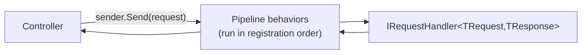

# Adding a new command or query

Part of the [documentation](index.md). For a file-by-file checklist including tests, authorization and the OpenAPI snapshot, see [Adding a new API endpoint, step by step](adding-an-endpoint.md).

MediatR is an in-process [mediator](glossary.md#architectural-patterns): instead of a controller calling a
service directly, it sends a message object and MediatR routes it to exactly one handler. This is
what makes CQRS's "Commands write, Queries read" split easy to enforce — commands and queries are
just different message types, and cross-cutting concerns (logging, validation, transactions) wrap
around all of them uniformly via **[pipeline behaviors](glossary.md#architectural-patterns)**, the MediatR
equivalent of ASP.NET Core middleware.

> [!TIP]
> Deeper, citation-backed research behind MediatR's pipeline mechanics lives in
> [`docs/research/mediatr-research.md`](research/mediatr-research.md) — primary sources
> (MediatR's own repo and release notes), plus a worked sequence diagram tracing
> `CreateProductCommand` through the full pipeline.



Every operation in this repo has five pieces. Using a hypothetical `Ping` query as a minimal,
non-Product example:

**1. Declare what can come back, as a union:**

```csharp
public union PingResult(PongDto, Error) : IValidatable<PingResult>
{
    public static PingResult FromValidationErrors(ValidationErrors errors) =>
        new Error(errors.ToErrorMessage(), Error.ValidationFailureCode);
}
```

**2. Declare the request.** Implement `IQuery<TResponse>` for a read-only request (this example),
`ICommand<TResponse>` for one that mutates state but needs no transaction, or
`ITransactionalCommand<TResponse>` for one `TransactionBehavior` should commit or roll back —
the latter requires the response union to implement `ITransactionOutcome<TResponse>` and
`ICommitFailable<TResponse>` (see [A commit can fail too](case-types.md#a-commit-can-fail-too-icommitfailable)):

```csharp
public sealed record PingQuery(string Message) : IQuery<PingResult>;
```

**3. (Optional) add a [FluentValidation](https://github.com/FluentValidation/FluentValidation)
validator** — picked up automatically by assembly scanning, no manual registration needed.
FluentValidation is this POC's illustrative choice for wiring validation, not a prescription — any
approach that can short-circuit into the response union via `IValidatable<TSelf>` fits the pattern
equally well.

> [!TIP]
> Deeper, citation-backed research on FluentValidation's async/cascade/DI behavior in this
> pipeline lives in
> [`docs/research/fluentvalidation-research.md`](research/fluentvalidation-research.md).

```csharp
public sealed class PingValidator : AbstractValidator<PingQuery>
{
    public PingValidator() => RuleFor(x => x.Message).NotEmpty();
}
```

**4. Write the handler** — return a case type; MediatR/the union's implicit conversion does the
rest:

```csharp
public sealed class PingHandler : IRequestHandler<PingQuery, PingResult>
{
    public Task<PingResult> Handle(PingQuery request, CancellationToken cancellationToken) =>
        Task.FromResult<PingResult>(new PongDto(request.Message));
}
```

**5. Call it from a controller** and `switch` exhaustively on the result:

```csharp
var result = await sender.Send(new PingQuery("hi"), cancellationToken);

return result switch
{
    PongDto pong => Ok(pong),
    Error error => error.ToProblemResult(HttpContext),
};
```

That's it — no DI registration step for the handler or validator; both are found via
`services.AddMediatR(...)` and `services.AddValidatorsFromAssembly(...)` in
[`DependencyInjection.cs`](../src/MediatrUnionPoc.Application/DependencyInjection.cs).

**6. (Optional) audit it.** A command that changes security-relevant state also implements
`IAuditableRequest<TResponse>` (an action name, the caller, a failure policy and a `DescribeAudit`
method) and `AuditBehavior` then records every outcome; see
[Audit stream](audit.md#audit-stream-a-separate-record-of-security-relevant-actions).
