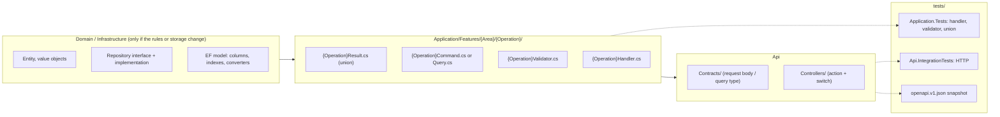
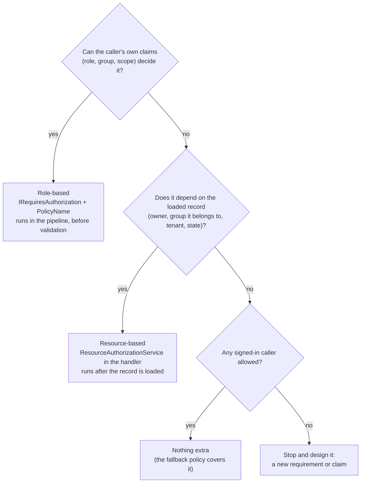

# Adding a new API endpoint, step by step

Part of the [documentation](index.md).

A hands-on checklist for adding one endpoint to a project built the way this one is. It tells you, in
order, which files to add or touch and what decision each one asks of you. Read
[Adding a new command or query](adding-a-command.md) first if you want the five-minute concept
overview; this page is the long version.

> [!NOTE]
> **How to use the "see" links.** Each step links to the real file that already does what the step
> describes. Open it and read it. Do not paste it and rename things: every union, `switch` and
> validator in this repo encodes decisions that belong to *its* operation, and a pasted one carries
> another operation's decisions with it. This guide gives you the questions to answer; the linked
> file shows one worked answer.
>
> The POC's entity is a `Product`. Here it is written `{Entity}`, your operation `{Operation}`, and
> your feature area `{Area}`, because the shape is what transfers to your project, not the names.

## Contents

- [The map](#the-map)
- [Step 0: decide what you are building](#step-0-decide-what-you-are-building)
- [Step 1: (only if needed) the domain and persistence](#step-1-only-if-needed-the-domain-and-persistence)
- [Step 2: the union](#step-2-the-union)
- [Step 3: the command or query](#step-3-the-command-or-query)
- [Step 4: the validator](#step-4-the-validator)
- [Step 5: the handler](#step-5-the-handler)
- [Step 6: authorization](#step-6-authorization)
- [Step 7: the transaction](#step-7-the-transaction)
- [Step 8: audit](#step-8-audit)
- [Step 9: the request contract and the controller action](#step-9-the-request-contract-and-the-controller-action)
- [Step 10: tests](#step-10-tests)
- [Step 11: the contract and the docs](#step-11-the-contract-and-the-docs)
- [Also consider](#also-consider)
- [Common mistakes](#common-mistakes)
- [Final checklist](#final-checklist)

## The map

Everything for one operation lives in **one folder** of the Application project, plus one action in a
controller. Nothing is registered by hand: MediatR and FluentValidation find handlers and validators
by assembly scanning in
[`DependencyInjection.cs`](../src/MediatrUnionPoc.Application/DependencyInjection.cs).



Work inside-out (domain, then application, then HTTP). The compiler tells you what the next step is at
every stage: add a case to the union and the build breaks in every `switch` that has to handle it.

## Step 0: decide what you are building

Answer these before you create a file. Each answer selects a marker interface (the markers live in
[`Common/Abstractions/`](../src/MediatrUnionPoc.Application/Common/Abstractions/); the pipeline they
select is in [Request lifecycle](request-lifecycle.md)).

| Question | If yes | If no |
| --- | --- | --- |
| Does it change state? | Command | Query |
| Does it write to the database? | `ITransactionalCommand<T>` ([Step 7](#step-7-the-transaction)) | `ICommand<T>` or `IQuery<T>` |
| Does who is calling, or who they are in relation to the data, decide whether it is allowed? | [Step 6](#step-6-authorization) | nothing extra |
| Is it security-relevant (who did what, who was refused)? | [Step 8](#step-8-audit) | nothing extra |

The kinds of request, with an existing operation of each kind to read:

| Kind | Marker | Transaction? | See |
| --- | --- | --- | --- |
| Query | `IQuery<T>` | no | [`GetProductByIdQuery`](../src/MediatrUnionPoc.Application/Features/Products/GetById/GetProductByIdQuery.cs) |
| Command, no database write | `ICommand<T>` | no | [`IssueImpersonationTokenCommand`](../src/MediatrUnionPoc.Application/Features/Impersonation/IssueToken/IssueImpersonationTokenCommand.cs) |
| Command that writes | `ITransactionalCommand<T>` | yes | [`CreateProductCommand`](../src/MediatrUnionPoc.Application/Features/Products/Create/CreateProductCommand.cs) |
| Command that writes, gated by the caller's role | `ITransactionalCommand<T>` + `IRequiresAuthorization` | yes | [`DeleteProductCommand`](../src/MediatrUnionPoc.Application/Features/Products/Delete/DeleteProductCommand.cs) |
| Command that writes, gated by the caller's relationship to the data | `ITransactionalCommand<T>`, check in the handler | yes | [`UpdateProductCommand`](../src/MediatrUnionPoc.Application/Features/Products/Update/UpdateProductCommand.cs) |

Also decide the HTTP shape now: verb, route, success status, and every failure status you will
return. Write that table down; it becomes your union's case list in Step 2. The existing per-endpoint
table is in the [HTTP contract](http-contract.md).

## Step 1: (only if needed) the domain and persistence

Skip this if the endpoint only reads or changes what the domain already supports. Otherwise:

**Domain** (`src/MediatrUnionPoc.Domain/`)

- New behavior goes on the entity as a method that guards its own invariants, not in the handler.
  See [`Product`](../src/MediatrUnionPoc.Domain/Product.cs).
- A mutation must advance the entity's version, the concurrency token, the way the existing ones do.
  See [Optimistic concurrency](concurrency.md#optimistic-concurrency-productversion-etag-and-if-match).
- Wrap primitives in a value object rather than passing `string` or `Guid` around. See
  [Vogen value objects](value-objects.md).
- A new query the repository cannot answer yet goes on the repository interface
  ([`IProductRepository`](../src/MediatrUnionPoc.Domain/IProductRepository.cs)). The interface speaks
  in domain terms only; it never exposes `IQueryable` or an EF type.
- Domain references no other project. `ArchitectureTests` fail the build if it does.

**Infrastructure** (`src/MediatrUnionPoc.Infrastructure/`)

- A new repository method needs an implementation in
  [`ProductRepository`](../src/MediatrUnionPoc.Infrastructure/ProductRepository.cs) and a test in
  `tests/MediatrUnionPoc.Infrastructure.IntegrationTests/` against real SQLite.
- A new column, index or constraint is configured in
  [`AppDbContext`](../src/MediatrUnionPoc.Infrastructure/AppDbContext.cs) (required, max length,
  unique index, concurrency token). Every business uniqueness rule needs a unique index as well as an
  up-front check in the handler; the index is what wins a race (see [Step 7](#step-7-the-transaction)).
- A new value object needs a hand-written `ValueConverter` in
  [`ValueConverters.cs`](../src/MediatrUnionPoc.Infrastructure/ValueConverters.cs), so the Domain
  keeps no EF Core reference.
- This POC creates its schema with `EnsureCreated` and has no migrations. **In a project that uses
  migrations, add one for every schema change** and test it against a copy of real data.

## Step 2: the union

Create the folder `src/MediatrUnionPoc.Application/Features/{Area}/{Operation}/`, one folder per
operation. The first file is the **union**, because it is the contract everything else must satisfy.
Name it `{Operation}Result.cs`.

### Choosing the cases

A union lists *exactly* the outcomes this one operation can produce. Start here and delete what cannot
happen:

| Situation | Case type | Usual HTTP status | Notes |
| --- | --- | --- | --- |
| It worked and there is a body | your DTO | 200 / 201 | |
| It worked and there is no body | `Success` | 204 | |
| The thing you were asked about does not exist | `NotFound<TId>` | 404 | `TId` is the entity's id type |
| The input is malformed | `ValidationErrors` | 400 | per-field errors |
| Same, but one field only | `Error` coded `Error.ValidationFailureCode` | 400 | see [Step 4](#step-4-the-validator) |
| A uniqueness rule is broken | `Conflict` | 409 | |
| The caller may not do this | `NotAuthorized` | 403 | needs `IAuthorizable<T>` ([Step 6](#step-6-authorization)) |
| The version the caller sent is stale | `PreconditionFailed` | 412 | |
| Something unexpected | `Error` | 500 unless its code is mapped | |

They live in [`Common/Results/`](../src/MediatrUnionPoc.Application/Common/Results/) and are shared
between unions. [Case types](case-types.md) says what each means. A case type never implies commit or
rollback; the union that declares it decides ([Step 7](#step-7-the-transaction)).

> [!IMPORTANT]
> Declare only cases the handler can produce. The controller `switch` must handle every case, so an
> unused case is dead code in the controller and a false promise in the API contract.

### Do you need a new case type?

Usually not; reuse a shared one. Add a new one only when the *data it carries* differs and no shared
type carries it. A new case type must be a plain immutable record with no commit or rollback meaning,
must get an arm in every controller `switch` that can see it, and, if it should become a problem
response, an extension member in
[`ResultHttpExtensions.cs`](../src/MediatrUnionPoc.Api/Http/ResultHttpExtensions.cs). Never put a
"should commit" flag on it. [Speculative case types](speculative-case-types.md) lists candidates
already thought through.

### Which interfaces the union implements

Each marker you choose in Step 3 demands one or more interfaces on the union:

| Union implements | Because the request is | Defined in | Step |
| --- | --- | --- | --- |
| `IValidatable<T>` | validated (almost always) | [`IValidatable.cs`](../src/MediatrUnionPoc.Application/Common/Abstractions/IValidatable.cs) | [4](#step-4-the-validator) |
| `IAuthorizable<T>` | role-gated, or refuses in the handler | [`IAuthorizable.cs`](../src/MediatrUnionPoc.Application/Common/Abstractions/IAuthorizable.cs) | [6](#step-6-authorization) |
| `ITransactionOutcome<T>` | transactional | [`ITransactionOutcome.cs`](../src/MediatrUnionPoc.Application/Common/Abstractions/ITransactionOutcome.cs) | [7](#step-7-the-transaction) |
| `ICommitFailable<T>` | transactional | [`ICommitFailable.cs`](../src/MediatrUnionPoc.Application/Common/Abstractions/ICommitFailable.cs) | [7](#step-7-the-transaction) |

Until the members exist the file will not compile. That is deliberate: the compiler is your to-do list.

**See:** a transactional, role-gated union, [`DeleteProductResult`](../src/MediatrUnionPoc.Application/Features/Products/Delete/DeleteProductResult.cs);
a transactional create with a conflict case, [`CreateProductResult`](../src/MediatrUnionPoc.Application/Features/Products/Create/CreateProductResult.cs);
a plain query union, [`GetProductByIdResult`](../src/MediatrUnionPoc.Application/Features/Products/GetById/GetProductByIdResult.cs).
The language feature itself is explained in [The C# `union` type](union-type.md).

> [!NOTE]
> Union files are excluded from the CSharpier formatter by the `Features/**/*Result.cs` pattern in
> [`.csharpierignore`](../.csharpierignore) because it cannot parse `union`. Keep the `Result.cs`
> suffix, and keep the `// TODO` header the existing union files carry.

## Step 3: the command or query

Add `{Operation}Command.cs` (or `Query.cs`) beside the union: a `sealed record` implementing the marker
from Step 0 with your union as its response type.

- **Parameters are raw inputs** (`Guid`, `string`, `decimal`), not domain value objects. The validator
  runs before the handler, and a value object's own guard must never be the thing that rejects bad
  input. The handler converts to value objects after validation has passed.
- **Carry the caller (`ClaimsPrincipal Principal`)** only when something needs it: a role check, an
  ownership or membership check, recording who created the row, or the audit event.
- **Carry the expected version** when the caller must prove they saw the current state.
- Every public member needs an XML `<summary>` (`CS1591` fails the build).

**See:** [`CreateProductCommand`](../src/MediatrUnionPoc.Application/Features/Products/Create/CreateProductCommand.cs)
(carries a principal only to record an owner),
[`DeleteProductCommand`](../src/MediatrUnionPoc.Application/Features/Products/Delete/DeleteProductCommand.cs)
(principal, policy and expected version) and
[`GetPagedProductsQuery`](../src/MediatrUnionPoc.Application/Features/Products/GetPaged/GetPagedProductsQuery.cs)
(a query with many optional inputs).

## Step 4: the validator

Validation stops malformed input before the handler runs. It is FluentValidation, found by scanning;
there is nothing to register. Add `{Operation}Validator.cs` beside the command, a public sealed class
deriving from `AbstractValidator<{Operation}Command>`.

- **Validate shape, not state.** "Name is not empty and at most N characters" belongs here. "That name
  is already taken" needs the database and belongs in the handler as a `Conflict`.
- **Share rules that several operations use** as extension members so the limits cannot drift, the way
  [`ProductRuleExtensions`](../src/MediatrUnionPoc.Application/Features/Products/Common/ProductRuleExtensions.cs)
  does for create, update and patch.
- **Tell the union how to represent a validation failure.** `ValidationBehavior` short-circuits without
  running the handler, so it builds *your* union through `IValidatable<T>.FromValidationErrors`. There
  are two designs, and you choose per operation:
  - a real `ValidationErrors` case, so callers get per-field messages (create, update, patch, list);
  - fold it into `Error` coded `Error.ValidationFailureCode`, which the host maps to `400`, when there
    is a single field and a whole extra case is not worth it (get by id, delete).

  Compare [`CreateProductResult.FromValidationErrors`](../src/MediatrUnionPoc.Application/Features/Products/Create/CreateProductResult.cs)
  with [`DeleteProductResult.FromValidationErrors`](../src/MediatrUnionPoc.Application/Features/Products/Delete/DeleteProductResult.cs).
- **Bound everything a caller can make large or expensive**: string lengths, page sizes, list lengths,
  number ranges. A missing upper bound is a denial-of-service and storage problem.

**See:** [`CreateProductValidator`](../src/MediatrUnionPoc.Application/Features/Products/Create/CreateProductValidator.cs)
(field rules), [`GetProductByIdValidator`](../src/MediatrUnionPoc.Application/Features/Products/GetById/GetProductByIdValidator.cs)
(one id), [`GetPagedProductsValidator`](../src/MediatrUnionPoc.Application/Features/Products/GetPaged/GetPagedProductsValidator.cs)
(bounds and an allowlist), and [`ValidationBehavior`](../src/MediatrUnionPoc.Application/Common/Behaviors/ValidationBehavior.cs)
for what runs it.

> [!WARNING]
> The pipeline runs authorization **before** validation. A caller who is refused gets `403` even when
> their input is also invalid; a caller who fails validation never reaches a resource-based check.

## Step 5: the handler

Add `{Operation}Handler.cs`: a class implementing `IRequestHandler<{Operation}Command, {Operation}Result>`.
A handler **returns a case**; it never throws for an expected outcome ([No exceptions](no-exceptions.md)).

- **Return the case directly.** The union's implicit conversion wraps it.
- **Do not save or commit.** `TransactionBehavior` does that after the union's `ShouldCommit` says yes.
  The handler only changes tracked entities and calls the repository's add or remove.
- **Order the checks** from cheapest and least revealing to most: does it exist, is the caller allowed,
  is the version current, would it break a uniqueness rule, then change state. Checking permission
  before revealing details keeps the response from leaking what exists.
- **Convert raw inputs to value objects** here, after validation.
- **Use the injected clock** (`TimeProvider`), never `DateTime.UtcNow`, so tests can fix time.
- **Return a DTO**, not the entity: the entity's shape is the domain's business, the DTO is the API's.
- **Uniqueness:** call the repository's existence check first and return a `Conflict`; the unique index
  is the race backstop that [Step 7](#step-7-the-transaction) translates.
- **Every `Async` method takes `CancellationToken cancellationToken = default`**, except `Handle`,
  whose signature MediatR fixes.

**See:** an add, [`CreateProductHandler`](../src/MediatrUnionPoc.Application/Features/Products/Create/CreateProductHandler.cs);
a read, [`GetProductByIdHandler`](../src/MediatrUnionPoc.Application/Features/Products/GetById/GetProductByIdHandler.cs);
a change with the full check order, [`UpdateProductHandler`](../src/MediatrUnionPoc.Application/Features/Products/Update/UpdateProductHandler.cs);
a remove, [`DeleteProductHandler`](../src/MediatrUnionPoc.Application/Features/Products/Delete/DeleteProductHandler.cs);
and the order traced branch by branch in [Worked example: UpdateProductCommand](worked-example-update.md).

## Step 6: authorization

Skip this only if any signed-in caller may perform the operation. Every endpoint already requires an
authenticated caller (the host's fallback policy). This step is about *which* authenticated callers.

### Two questions decide the mechanism

1. **Can the decision be made from the caller alone?** "Is the caller an administrator?", "does the
   caller hold role *X*?", "is the caller in group *Y*?" are all questions about the caller's claims.
   That is **role-based**, and it runs in the pipeline before the handler.
2. **Does the decision depend on the thing being acted on?** "Does the caller own this record?", "is
   the caller a member of the group that this record belongs to?", "does the caller's role allow *this
   action on this kind of record*?", "is this record in the caller's tenant or region?" all need the
   loaded entity. That is **resource-based**, and it runs in the handler after the load.



What this POC ships is one role-based policy family and one resource-based one; the rest you write with
the same parts:

| Rule you need | Kind | Already in the POC? |
| --- | --- | --- |
| Caller holds one of these roles | role-based | yes: `Administrator` and `Impersonator` policies, both answered by [`AdministratorAuthorizationHandler`](../src/MediatrUnionPoc.Application/Common/Authorization/AdministratorAuthorizationHandler.cs) |
| Caller is in a group that may do this | role-based, if the group arrives as a claim | no: a new requirement and handler, or a role per group |
| Caller owns the record | resource-based | yes: [`OwnerAuthorizationHandler<TResource>`](../src/MediatrUnionPoc.Application/Common/Authorization/OwnerAuthorizationHandler.cs) |
| Caller is in a group that the record belongs to, or holds a role that may act on this kind of record | resource-based | no: a new requirement and handler over a resource that exposes the group |
| Caller is the owner **or** an administrator (either is enough) | resource-based | no, but supported: register more than one handler for the same requirement; any one succeeding is enough |
| Caller must satisfy several rules at once | either | supported: several requirements on one policy must all succeed |

The "either" and "both" rows are native `IAuthorizationService` behavior, described in
[Zero-to-many handlers, and multiple requirements](authorization.md#zero-to-many-handlers-and-multiple-requirements).
How identity and roles reach the Application layer as claims, and which claim types they arrive as, is
in [Where the identity comes from](authorization.md#where-the-identity-comes-from). Read it before you
depend on a group or scope claim: the host maps inbound claims deliberately, and a claim that is not
mapped does not arrive.

### Role-based, in order

1. The command carries `ClaimsPrincipal Principal`, implements `IRequiresAuthorization`
   ([`IRequiresAuthorization.cs`](../src/MediatrUnionPoc.Application/Common/Abstractions/IRequiresAuthorization.cs)),
   and returns from `PolicyName` the name of a registered policy.
2. The union has a `NotAuthorized` case and implements `IAuthorizable<T>`; `FromNotAuthorized` normally
   just returns the case it was given.
3. A transactional union's `ShouldCommit` gets a `NotAuthorized => false` arm (the compiler makes you).
4. The controller passes `User` on the command and maps `NotAuthorized` to `403` ([Step 9](#step-9-the-request-contract-and-the-controller-action)).
5. A rule that no existing policy expresses needs a new named policy registered in
   [`DependencyInjection.cs`](../src/MediatrUnionPoc.Application/DependencyInjection.cs), with its name
   added to [`AuthorizationPolicies`](../src/MediatrUnionPoc.Application/Common/Authorization/AuthorizationPolicies.cs)
   (and role names to [`AuthorizationRoles`](../src/MediatrUnionPoc.Application/Common/Authorization/AuthorizationRoles.cs)).
   `AuthorizationBehavior` does not care which policy a request names, only that it is registered.

**See:** [`DeleteProductCommand`](../src/MediatrUnionPoc.Application/Features/Products/Delete/DeleteProductCommand.cs)
and [`IssueImpersonationTokenCommand`](../src/MediatrUnionPoc.Application/Features/Impersonation/IssueToken/IssueImpersonationTokenCommand.cs)
for the command side, [`AuthorizationBehavior`](../src/MediatrUnionPoc.Application/Common/Behaviors/AuthorizationBehavior.cs)
for what enforces it, and the recipe in
[Configuring role-based authorization for a new command](authorization.md#configuring-role-based-authorization-for-a-new-command).

### Resource-based, in order

1. The command carries `ClaimsPrincipal Principal` but does **not** implement `IRequiresAuthorization`
   (if it did, the pipeline would also run a role check before the handler).
2. The check needs an object the policy can reason about. Either the entity itself, or a small adapter
   that exposes only what the rule needs. This repo adapts a product to
   [`OwnedProductResource`](../src/MediatrUnionPoc.Application/Features/Products/Common/OwnedProductResource.cs),
   which implements [`IOwnedResource`](../src/MediatrUnionPoc.Application/Common/Authorization/IOwnedResource.cs).
   For a group rule the adapter would expose the group the record belongs to, and your handler would
   compare it with the caller's group claims.
3. A rule needs a requirement (usually an `OperationAuthorizationRequirement`, see
   [`AuthorizationOperations`](../src/MediatrUnionPoc.Application/Common/Authorization/AuthorizationOperations.cs)),
   a policy that contains it, and an `IAuthorizationHandler` registered for it, all in
   [`DependencyInjection.cs`](../src/MediatrUnionPoc.Application/DependencyInjection.cs). If your record
   is an owned resource you can reuse the existing owner handler unchanged.
4. In the handler, after loading the record, ask
   [`ResourceAuthorizationService`](../src/MediatrUnionPoc.Application/Common/Authorization/ResourceAuthorizationService.cs).
   It returns `null` when allowed and a `NotAuthorized` case when refused; return the union built with
   `FromNotAuthorized`.
5. If the operation is another owner-gated change to an existing record, the load, the check and the
   version check are already written once as a shared helper: see
   [`ProductChangeExtensions`](../src/MediatrUnionPoc.Application/Features/Products/Common/ProductChangeExtensions.cs)
   and how [`UpdateProductHandler`](../src/MediatrUnionPoc.Application/Features/Products/Update/UpdateProductHandler.cs)
   and [`PatchProductHandler`](../src/MediatrUnionPoc.Application/Features/Products/Patch/PatchProductHandler.cs)
   both use it. Reuse it rather than write the sequence a third time.
6. The union side is the same as role-based: the `NotAuthorized` case, `IAuthorizable<T>`, and
   `NotAuthorized => false` in `ShouldCommit`.

The recipe is in
[Configuring resource-based authorization for a new command](authorization.md#configuring-resource-based-authorization-for-a-new-command).

### How the two behave differently

| | Role-based | Resource-based |
| --- | --- | --- |
| Refused caller, record that does not exist | `403` (the record is never loaded) | `404` (it must be loaded first) |
| Refused caller, invalid input | `403` (authorization runs before validation) | `400` (validation runs first, the check comes later in the handler) |
| Refusal and the transaction | none opened | one opened, then rolled back |
| Reveals whether a record exists | no | yes, to any authenticated caller |

The last row is a design decision, not an accident. If the existence of a record is itself sensitive,
return `NotFound` to a caller who is not allowed to see it instead of `NotAuthorized`, and say so in the
union's XML docs. Both mechanisms can be used on one command, but nothing in the repo does so today, so
write a test that pins the order you intend. Why the check sits at two different points is explained in
[Why two different points in the request lifetime](authorization.md#why-two-different-points-in-the-request-lifetime).

### Reads need this too

A query is not exempt. A list or a get that returns records the caller may not see is a data leak.
Either gate the query (role-based, as above), or apply the rule in the repository query itself so it
never returns what the caller cannot see, and prove that with a test. The listing vocabulary in
[Listing products](listing.md) is where such a filter belongs.

### Anonymous endpoints

An endpoint that must work without a token needs an explicit `[AllowAnonymous]` on its action. That is a
security decision; make it in review, not in passing.

## Step 7: the transaction

Only `ITransactionalCommand<T>` requests are wrapped. Queries and plain `ICommand<T>` requests never are.

[`TransactionBehavior`](../src/MediatrUnionPoc.Application/Common/Behaviors/TransactionBehavior.cs)
opens a transaction, runs the handler, asks **your union** whether to commit, and, if the commit itself
fails, rolls back and asks your union how to classify the failure. That is why two members are required.

### `ShouldCommit`: which cases commit?

An exhaustive `switch` over *your own* cases: the success case commits, every failure does not. Add a
case to the union later and this stops compiling until you classify it. Do not write a catch-all `_`
arm; it defeats the exhaustiveness check that exists to protect you. The compile-time probes under
[`tests/CompileTimeChecks/`](../tests/CompileTimeChecks/README.md) prove exactly this.

### `FromCommitFailure`: what does a failed commit mean here?

A commit can lose a race even though the handler's checks passed. There are two failures, and you map
each to a case of *your* union:

| Commit failure | Meaning | Typical mapping |
| --- | --- | --- |
| `ConcurrencyConflict` | the row changed after it was loaded | `PreconditionFailed` (412) for an existing row; `Error` for a new row, which cannot be stale |
| `UniqueViolation` | a concurrent request took the unique value | `Conflict` (409); `Error` if the operation cannot violate uniqueness |

If your union has no case that can express a failure, add one. Background:
[A commit can fail too](case-types.md#a-commit-can-fail-too-icommitfailable), [Transactions](transactions.md),
and [what commits or rolls back for each message](request-lifecycle.md#commit-vs-rollback-message-by-message).
**See** the two mappings side by side:
[`DeleteProductResult.FromCommitFailure`](../src/MediatrUnionPoc.Application/Features/Products/Delete/DeleteProductResult.cs)
(an existing row) and
[`CreateProductResult.FromCommitFailure`](../src/MediatrUnionPoc.Application/Features/Products/Create/CreateProductResult.cs)
(a new row). The translation from database exceptions into `CommitResult` lives in
[`EfCoreUnitOfWork`](../src/MediatrUnionPoc.Infrastructure/EfCoreUnitOfWork.cs).

### Pitfalls

- **A failure case still opens a transaction.** `NotFound` and `Error` reach the handler, so a
  transaction was opened and is rolled back. Only a validation failure skips it.
- **One commit per request.** The unit of work is one session; the behavior commits once. Do not commit
  inside the handler.
- **Side effects that cannot roll back** (sending an email, calling another service, publishing a
  message) do not belong inside the transaction. See
  [Extending the pattern](extending-search-index.md) for the notification approach and its
  eventual-consistency cost.
- **Do not catch `DbUpdateException`.** The unit of work already translates the two known failures.
- **A change to an existing row needs the caller's version.** Accept `If-Match` at the API
  ([Step 9](#step-9-the-request-contract-and-the-controller-action)), pass it as the expected version,
  and return `PreconditionFailed` when it does not match.

## Step 8: audit

If the operation changes security-relevant state, or refuses someone who tried, record it by
implementing `IAuditableRequest<TResponse>`
([`IAuditableRequest.cs`](../src/MediatrUnionPoc.Application/Common/Abstractions/IAuditableRequest.cs))
on the command. It asks for an action name, the caller, a failure policy, and a `DescribeAudit` method
that is another exhaustive `switch` over your union, so every outcome, including a refusal, is described.

- `BestEffort` cannot fail the request (by then the change has already committed). `FailClosed` refuses
  the request when the audit write fails; use it where the record is a precondition (the POC uses it for
  impersonation).
- **Never** put a token, secret, `Authorization` header or request body in an event.
- Test it with `ReadAuditEvents()` from the integration factory.

**See:** [`CreateProductCommand`](../src/MediatrUnionPoc.Application/Features/Products/Create/CreateProductCommand.cs)
and [`DeleteProductCommand`](../src/MediatrUnionPoc.Application/Features/Products/Delete/DeleteProductCommand.cs)
(`DescribeAudit`), [`ProductAudit`](../src/MediatrUnionPoc.Application/Features/Products/Common/ProductAudit.cs),
[`AuditBehavior`](../src/MediatrUnionPoc.Application/Common/Behaviors/AuditBehavior.cs), and
[Audit stream](audit.md#audit-stream-a-separate-record-of-security-relevant-actions).

## Step 9: the request contract and the controller action

Now the HTTP layer, in `src/MediatrUnionPoc.Api/`.

### 9a. The request type (if there is a body or a query string)

Add a `sealed record` to [`Contracts/ProductContracts.cs`](../src/MediatrUnionPoc.Api/Contracts/ProductContracts.cs)
(or a new contracts file for a new area). Keep it to shape only: every rule belongs in the validator, so
it also applies to callers that do not come through HTTP. **Do not put fields on it that the caller must
not set** (owner, id, version, created-at); the handler assigns those. Otherwise a caller can set them by
adding a member to the body (mass assignment). An operation with only a route id needs no type.

### 9b. The action

Add a method to a controller such as
[`ProductsController`](../src/MediatrUnionPoc.Api/Controllers/ProductsController.cs), or a new controller
for a new area, using the class-level attributes of an existing one. An action does three things and
nothing else: build the command, send it, `switch` on the result.

- **Keep the action's own `switch`.** Never share one across actions: each needs its own so the
  compiler's `CS8509` exhaustiveness check applies to it. When the union gains a case the build breaks
  here until you map it. That is the design working.
- **One line per arm**, using the extension members in
  [`ResultHttpExtensions.cs`](../src/MediatrUnionPoc.Api/Http/ResultHttpExtensions.cs)
  (`error.ToProblemResult(HttpContext)` and its siblings) instead of hand-building problem responses.
- **`[EnableRateLimiting(RateLimitPolicyNames.Writes)]` on every mutating action.** An action naming no
  policy gets the `Reads` policy, and a test walks every endpoint to enforce that each is limited. Only
  an explicit `DisableRateLimiting()` exempts one. See
  [Every endpoint is limited unless it says otherwise](operations.md#every-endpoint-is-limited-unless-it-says-otherwise).
- **Every action is time-boxed by default**; an operation that legitimately runs long must opt out
  explicitly and be cancellable.
- **`[ProducesResponseType]` for every status the action can return**, including `401` and `500`.
  These feed the OpenAPI document ([Step 11](#step-11-the-contract-and-the-docs)).
- **`[ReturnsETag]`** when the response carries an `ETag`.
- **The method name ends in `Async` and takes `CancellationToken cancellationToken = default`.**
  `SuppressAsyncSuffixInActionNames` is `false` on purpose so `nameof(...)` keeps matching in
  `Url.Action`.
- **Generate URLs with the controller's versioned helper** so `Location` and `Link` are always the
  canonical `/api/v1/...` URL. See [API versioning](http-contract.md#api-versioning).
- **A `201` returns `Location`** pointing at the new resource's read endpoint.

**See:** an add with `Location` and `ETag`, `CreateAsync`; a read, `GetByIdAsync`; a listing with paging
headers, `GetPagedAsync`; a role-gated remove with optional `If-Match`, `DeleteAsync`; all in
[`ProductsController`](../src/MediatrUnionPoc.Api/Controllers/ProductsController.cs), whose class-level
XML summary is also the case-to-status table you update in Step 11.

### 9c. Conditional requests (`If-Match`)

A change to an existing record should make the caller prove which version they saw. `PUT` and `PATCH`
require the header (absent `428`, malformed `400`, stale `412`); `DELETE` treats it as optional. Parse it
with [`IfMatchHeader.Parse`](../src/MediatrUnionPoc.Api/Http/IfMatchHeader.cs) **before** sending the
command. The controller's `WithRequiredVersionAsync` is the shared way to do it for the required case.
Details: [Optimistic concurrency](concurrency.md).

### 9d. Mapping an `Error` code to a status

An `Error` becomes `500` unless its code is registered. To make a code answer `404`, `409` and so on,
register it in `HttpMappingOptions.ErrorStatusCodes`
([`HttpMappingOptions.cs`](../src/MediatrUnionPoc.Api/Http/HttpMappingOptions.cs), populated from
[`ResultHttpMappingServiceCollectionExtensions.cs`](../src/MediatrUnionPoc.Api/Http/ResultHttpMappingServiceCollectionExtensions.cs)).
If an outcome is common, prefer a dedicated case type over a special `Error` code.

## Step 10: tests

Write the test first if you can (see [Testing](testing.md)). A finished endpoint has tests at four
levels; each project's `README.md` explains its conventions, and the naming is
`Method_Scenario_ExpectedResult_Test` with Arrange/Act/Assert comments and an XML `<summary>`.

| # | Level | Project | What to prove | See |
| --- | --- | --- | --- | --- |
| 1 | Handler | `Application.Tests/Handlers/` | each case the handler returns; the repository calls; nothing saved directly | [`CreateProductHandlerTests`](../tests/MediatrUnionPoc.Application.Tests/Handlers/CreateProductHandlerTests.cs), [`DeleteProductHandlerTests`](../tests/MediatrUnionPoc.Application.Tests/Handlers/DeleteProductHandlerTests.cs) |
| 2 | Validator | `Application.Tests/Validators/` | every rule, both sides of each boundary, null, empty and whitespace | [`CreateProductValidatorTests`](../tests/MediatrUnionPoc.Application.Tests/Validators/CreateProductValidatorTests.cs) |
| 3 | Union | `Application.Tests/Unions/` | `ShouldCommit` per case, `FromCommitFailure` per failure, `FromValidationErrors` | [`ResultShouldCommitTests`](../tests/MediatrUnionPoc.Application.Tests/Unions/ResultShouldCommitTests.cs), [`FromCommitFailureTests`](../tests/MediatrUnionPoc.Application.Tests/Unions/FromCommitFailureTests.cs), [`FromValidationErrorsTests`](../tests/MediatrUnionPoc.Application.Tests/Unions/FromValidationErrorsTests.cs) |
| 4 | HTTP | `Api.IntegrationTests/` | every status the action can return, the headers, the problem body, the audit event | [`ProductsControllerTests`](../tests/MediatrUnionPoc.Api.IntegrationTests/ProductsControllerTests.cs) |

Also test, when they apply:

- **Authorization, both sides.** The caller who is allowed *and* the callers who are refused: no role,
  the wrong role, a role with the wrong case, the owner and a non-owner, a member of the group and a
  non-member. See [`AuthorizationBehaviorTests`](../tests/MediatrUnionPoc.Application.Tests/Behaviors/AuthorizationBehaviorTests.cs),
  [`OwnerAuthorizationHandlerTests`](../tests/MediatrUnionPoc.Application.Tests/Authorization/OwnerAuthorizationHandlerTests.cs)
  and [`AdministratorAuthorizationHandlerTests`](../tests/MediatrUnionPoc.Application.Tests/Authorization/AdministratorAuthorizationHandlerTests.cs)
  for a handler you add, and [`ProductionAuthorizationPolicyMatrixTests`](../tests/MediatrUnionPoc.Application.Tests/Authorization/ProductionAuthorizationPolicyMatrixTests.cs)
  for the pattern of asserting the real policy set.
- **The rollback.** A failing case must leave nothing behind; check the database, not only the status.
  [`TransactionBehaviorTests`](../tests/MediatrUnionPoc.Application.Tests/Behaviors/TransactionBehaviorTests.cs)
  and [`TransactionBehaviorCommitFailureTests`](../tests/MediatrUnionPoc.Application.Tests/Behaviors/TransactionBehaviorCommitFailureTests.cs)
  show the behavior; your own integration test shows your operation.
- **The race.** Two requests that both pass the up-front check: one must get the `Conflict` or
  `PreconditionFailed` your `FromCommitFailure` maps. [`DuplicateProductNameTests`](../tests/MediatrUnionPoc.Api.IntegrationTests/DuplicateProductNameTests.cs)
  is the end-to-end example.
- **The audit event**, including for a refusal ([`AuditStreamTests`](../tests/MediatrUnionPoc.Api.IntegrationTests/AuditStreamTests.cs)).
- **A persistence change** against real SQLite in `Infrastructure.IntegrationTests`.

How the integration tests are built:

- URLs come from [`ApiRoutes.cs`](../tests/MediatrUnionPoc.Api.IntegrationTests/ApiRoutes.cs); add a
  constant there and never spell a URL in a test.
- [`ProductsApiFactory`](../tests/MediatrUnionPoc.Api.IntegrationTests/ProductsApiFactory.cs) gives each
  test class its own host and its own in-memory SQLite database. Sign in with `client.AsUser("alice", roles)`
  ([`TestIdentityExtensions.cs`](../tests/MediatrUnionPoc.Api.IntegrationTests/TestIdentityExtensions.cs)).
- Rate limits and timeouts default to maximal in the test host; use `factory.WithLimits(...)` and
  `factory.WithTimeouts(...)` when you test them. The host runs in Development, so pin CORS origins by
  post-configuring `ApiCorsOptions`.
- Read logs from `ProductsApiFactory.LogSink` and audit events with `ReadAuditEvents()`.
- Handler tests use NSubstitute for the repository, [`PrincipalMother`](../tests/MediatrUnionPoc.Application.Tests/TestData/PrincipalMother.cs)
  for callers, and [`FixedTimeProvider`](../tests/MediatrUnionPoc.Application.Tests/TestData/FixedTimeProvider.cs)
  for time. Unwrap a union with `((IUnion)result).Value` and assert the concrete case.
- A new *kind* of exhaustive switch may deserve a probe in [`tests/CompileTimeChecks/`](../tests/CompileTimeChecks/README.md);
  read its README before adding one.

```bash
dotnet test --filter "FullyQualifiedName~{Operation}"   # what you touched
dotnet test                                             # everything
```

## Step 11: the contract and the docs

These changes live outside your feature folder, and a test fails if you skip them.

1. **The OpenAPI snapshot.** `OpenApiContractTests` diffs the served `/openapi/v1.json` against
   `tests/MediatrUnionPoc.Api.IntegrationTests/Contracts/openapi.v1.json`. A new endpoint changes it, so
   the test fails until you regenerate the file and commit the diff:

   ```bash
   UPDATE_OPENAPI_SNAPSHOT=1 dotnet test tests/MediatrUnionPoc.Api.IntegrationTests --filter "FullyQualifiedName~OpenApiContractTests"
   ```

   It is refused when `CI` is set. Read the diff: it should contain your endpoint and nothing else. See
   [the OpenAPI check](operations.md#openapi-contract-check-no-accidental-drift).
2. **The HTTP contract page.** Add your endpoint to the per-endpoint status table in
   [`http-contract.md`](http-contract.md) and update the controller's class-level XML summary.
3. **The manual request file.** Add a request to
   [`MediatrUnionPoc.Api.http`](../src/MediatrUnionPoc.Api/MediatrUnionPoc.Api.http) so the next person
   can call it by hand.
4. **Markdown links.** `DocumentationLinkTests` fails on any broken relative link, `#fragment` or
   footnote in any `*.md`, printing `file:line -> target`. Renaming a heading means fixing every link to it.
5. **The READMEs** that list features: [Application](../src/MediatrUnionPoc.Application/README.md) and
   [Api](../src/MediatrUnionPoc.Api/README.md); and [`docs/index.md`](index.md) if you add a page.

## Also consider

Things a first endpoint often leaves out. Most do not apply to every endpoint; decide each on purpose.

| Consider | Why it matters | Where to look |
| --- | --- | --- |
| **A new response header** | A browser hides any non-safelisted header from page scripts unless it is exposed, so a new header a client must read has to be added to the default exposed list, and to the table a test checks | [The exposed-headers contract](operations.md#the-exposed-headers-contract), [`ApiCorsOptions.cs`](../src/MediatrUnionPoc.Api/Cors/ApiCorsOptions.cs) |
| **A new request media type** | `[Consumes]` answers `415` for any other; the OpenAPI document must say so | [`ConsumesMediaTypeTransformer.cs`](../src/MediatrUnionPoc.Api/OpenApi/ConsumesMediaTypeTransformer.cs), [Partial updates](patch.md) |
| **A list endpoint** | Filtering, a sort allowlist, a maximum page size and a deterministic tiebreaker are needed or paging skips and repeats rows. The vocabulary is the domain's, not the database's | [Listing products](listing.md), [`GetPagedProductsHandler`](../src/MediatrUnionPoc.Application/Features/Products/GetPaged/GetPagedProductsHandler.cs) |
| **Bulk operations** | Partial success needs its own outcome; `NotFound` can carry no id | [`NotFound.cs`](../src/MediatrUnionPoc.Application/Common/Results/NotFound.cs) |
| **Retries and duplicates** | A client that retries a `POST` after a timeout creates a second record. This repo has no idempotency-key support; a uniqueness rule is the only protection, so decide whether you need one | [Concurrency](concurrency.md) |
| **Long-running work** | A request that outlives the timeout is answered `504`. Work that cannot finish in time needs a different shape (accept, then poll) that this POC does not implement | [Operations](operations.md) |
| **Side effects after the commit** | Email, search indexes and messages must not run inside the transaction; they need a notification and tolerate eventual consistency | [Extending the pattern](extending-search-index.md) |
| **New configuration** | Every new setting follows the options convention: bound, validated on start, with a source-generated validator; nullable list options because the binder appends to arrays | [Health checks and options](operations.md#health-checks-and-options), `HealthEndpointsOptions` |
| **Logging** | Hot-path messages are `[LoggerMessage]` methods with stable event ids. Never log tokens, `Authorization` headers or bodies | [Logging](logging-and-errors.md#logging) |
| **Error detail** | A problem response's message must not reveal internals, other users' data, or whether a record exists to someone who may not know | [Trace id, exceptions and logging](logging-and-errors.md) |
| **Versioning** | Adding an endpoint to v1 is additive. Changing or removing what a shipped endpoint returns is a breaking change and needs a new version, not an edit | [API versioning](http-contract.md#api-versioning) |
| **Personal or sensitive data** | It must stay out of logs, audit events, error messages and the OpenAPI examples | [Audit stream](audit.md#audit-stream-a-separate-record-of-security-relevant-actions) |
| **Time** | Use the injected `TimeProvider`, and store UTC in a form the database can order | [Listing](listing.md) |
| **Trying it by hand** | Mint a token or use the development identity and call the endpoint through Scalar, the `.http` file or the helper script | [README, getting started](../README.md#getting-started) |

## Common mistakes

| Symptom | Likely cause | Fix |
| --- | --- | --- |
| `CS8509` in the controller | A case was added to the union and not mapped | Add the arm. This is the design working |
| `CS8509` in the union file | A `ShouldCommit`, `FromCommitFailure` or `DescribeAudit` switch is missing a case | Classify it; never add a catch-all |
| The union will not compile: a missing member | A marker needs an interface the union does not implement | Add the interface ([Step 2](#which-interfaces-the-union-implements)) |
| The handler runs but nothing is saved | The command is `ICommand`, not `ITransactionalCommand` | Change the marker and add the union members |
| A failed request left data behind | `ShouldCommit` returns `true` for a failure case | Return `false` |
| `403` where you expected `400` | Authorization runs before validation | Expected; test with an authorized caller |
| `404` where you expected `403` | A resource-based check runs after the load | Expected; decide deliberately whether that leaks existence |
| The validator never runs | It is `internal`, or not in the Application assembly | A public sealed class beside the command |
| `Location` points at the unversioned URL | The URL was built by hand | Use the controller's versioned URL helper |
| The rate-limit walk test fails | A new action names no policy, or exempts itself by accident | Add `[EnableRateLimiting]`; choose `Writes` for a mutation |
| `OpenApiContractTests` fails | The API changed and the snapshot did not | Regenerate ([Step 11](#step-11-the-contract-and-the-docs)) |
| An architecture test fails | Application referenced an ASP.NET or JWT type, or Domain referenced another layer | Move the code down a layer or behind an interface |
| A claim you expected is missing in Application | Inbound claim mapping changed | Leave `MapInboundClaims` `true`; see [Where the identity comes from](authorization.md#where-the-identity-comes-from) |
| `NETSDK1045` | Visual Studio ignored `global.json` | Use the pinned preview SDK |

## Final checklist

Copy this into your pull request description.

- [ ] The union lists only reachable cases, is named `{Operation}Result.cs`, and documents what each case means
- [ ] The union implements every interface its request's markers require
- [ ] The command or query is a `sealed record` with the right marker and raw-typed inputs
- [ ] The validator exists; the `FromValidationErrors` design was chosen deliberately; every input is bounded
- [ ] The handler returns cases, never throws for an expected outcome, never commits, and returns a DTO
- [ ] Authorization is decided (none, role-based, resource-based, or both), refusals are mapped to `403`, and reads are covered
- [ ] `ShouldCommit` and `FromCommitFailure` classify every case and failure, with no catch-all
- [ ] Audit is decided, and `DescribeAudit` written if the operation is auditable
- [ ] Persistence changes have a constraint, a converter and a migration where the project uses them
- [ ] The controller action has its own `switch`, a rate-limit policy, `[ProducesResponseType]` for every status, the `Async` suffix and the token parameter
- [ ] Nothing the caller must not set is on the request type
- [ ] Tests at all four levels, including the refused caller, the rolled-back case and the race
- [ ] `openapi.v1.json` regenerated and its diff reviewed
- [ ] `http-contract.md`, the `.http` file and the READMEs updated; `dotnet test` passes, including the link check
- [ ] `dotnet format whitespace` run

## See also

- [Adding a new command or query](adding-a-command.md): the short conceptual version.
- [Worked example: UpdateProductCommand](worked-example-update.md): one command traced case by case.
- [Request lifecycle](request-lifecycle.md): the pipeline order and what each behavior does.
- [Case types](case-types.md) and the [Glossary](glossary.md): vocabulary.
- [Notes and gotchas](notes-and-gotchas.md): pitfalls collected in one place.
