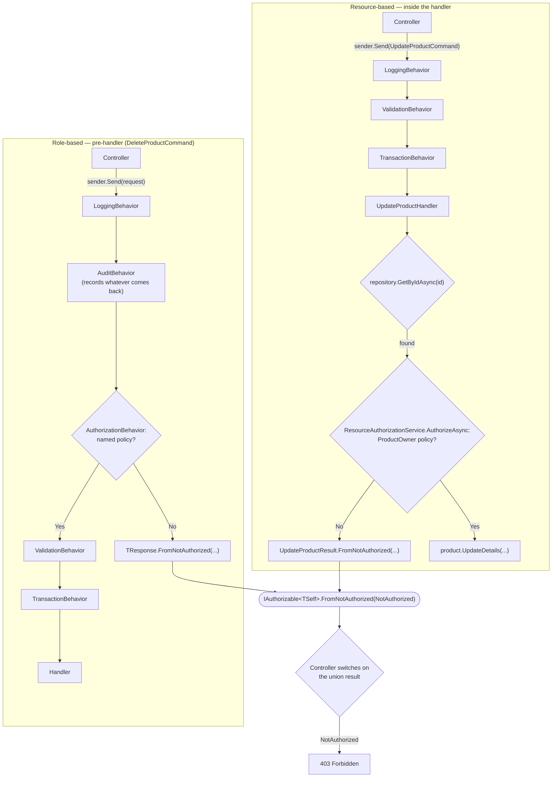

# Authorization

Part of the [documentation](index.md).

**Contents**

- [Authorization](#authorization)
  - [Why two different points in the request lifetime](#why-two-different-points-in-the-request-lifetime)
  - [How the two flows fit together](#how-the-two-flows-fit-together)
  - [Role-based: `IRequiresAuthorization` + `AuthorizationBehavior`](#role-based-irequiresauthorization--authorizationbehavior)
  - [Resource-based: `ResourceAuthorizationService` + `OwnerAuthorizationHandler<TResource>`](#resource-based-resourceauthorizationservice--ownerauthorizationhandlertresource)
  - [Zero-to-many handlers, and multiple requirements](#zero-to-many-handlers-and-multiple-requirements)
  - [Where the identity comes from](#where-the-identity-comes-from)
  - [Configuring role-based authorization for a new command](#configuring-role-based-authorization-for-a-new-command)
  - [Configuring resource-based authorization for a new command](#configuring-resource-based-authorization-for-a-new-command)
  - [Why not `IAuthorizationRequirementData` attributes](#why-not-iauthorizationrequirementdata-attributes)

This POC demonstrates two authorization shapes side by side, both built from **standard ASP.NET
Core authorization primitives** (`IAuthorizationService`, `IAuthorizationRequirement`,
`IAuthorizationHandler`, named policies) and both converging on the same union-based outcome —
`NotAuthorized` as just another case, never an exception:

- **Role/policy-based**, checked *before* a handler runs, by a MediatR pipeline behavior — nothing
  about the request's payload matters, only who's calling. Demoed by `DeleteProductCommand`'s
  `Administrator` policy: only an administrator may delete a product.
- **Resource-based**, checked *inside* a handler, once it has loaded the specific resource being
  acted on. Demoed by `UpdateProductCommand`'s `ProductOwner` policy: only the product's owner may
  update it.

> [!NOTE]
> Both are *example configurations* of a general mechanism, not the only valid way to wire
> authorization and not a prescription that every command needs one of them — a different project
> might gate different operations, use different policies, combine styles differently, or skip
> authorization entirely for commands that don't need it.

## Why two different points in the request lifetime

A role/policy check like "is this caller an administrator?" only needs the caller's
`ClaimsPrincipal` — nothing about the request's payload matters, so it can run generically in a
pipeline behavior before the handler, the same way `ValidationBehavior` runs before the handler.

A resource-based check like "does this caller own *this* product?" can't run that early: there is
no product to check ownership against until a handler has loaded it from the repository. ASP.NET
Core's own resource-based authorization guidance is explicit about this — resource-based checks
are necessarily imperative, called from inside the code that already has the resource in hand,
rather than declared ahead of time the way `[Authorize]` or a pipeline behavior can. This isn't a
gap in this repo's pipeline; it's why `ResourceAuthorizationService` exists as something a handler
calls explicitly instead of something wired into `AddTransient(typeof(IPipelineBehavior<,>), ...)`
alongside the other behaviors.

## How the two flows fit together



Every path calls `IAuthorizationService` under the hood and ends up asking the response union's
`IAuthorizable<TSelf>.FromNotAuthorized(...)` to build the same shared `NotAuthorized` case — only
*where* in the request's lifetime that call happens differs.

## Role-based: `IRequiresAuthorization` + `AuthorizationBehavior`

1. **[`IRequiresAuthorization`](../src/MediatrUnionPoc.Application/Common/Abstractions/IRequiresAuthorization.cs)**
   — a request implements this, exposing `ClaimsPrincipal Principal` and a `string PolicyName` to
   evaluate it against, to opt into `AuthorizationBehavior`. A request that doesn't implement it
   simply doesn't match the behavior's generic constraints and skips this check entirely — the
   same opt-in pattern `ITransactionalCommand` uses for `TransactionBehavior`.
2. **[`IAuthorizable<TSelf>`](../src/MediatrUnionPoc.Application/Common/Abstractions/IAuthorizable.cs)**
   — a response union implements this (`static abstract TSelf FromNotAuthorized(NotAuthorized)`)
   so the behavior can build the union's `NotAuthorized` case generically, the same role
   `IValidatable<TSelf>` plays for `ValidationErrors`. Both authorization patterns here rely
   on this same interface.
3. **[`AuthorizationBehavior<TRequest,TResponse>`](../src/MediatrUnionPoc.Application/Common/Behaviors/AuthorizationBehavior.cs)**
   — calls `IAuthorizationService.AuthorizeAsync(request.Principal, request.PolicyName)` (the
   policy-only, two-argument overload), reading the policy name generically off the request rather
   than hardcoding one. On failure, it short-circuits to `TResponse.FromNotAuthorized(...)`
   without ever calling the handler.
4. **[`AdministratorRequirement`](../src/MediatrUnionPoc.Application/Common/Authorization/AdministratorRequirement.cs)
   and [`AdministratorAuthorizationHandler`](../src/MediatrUnionPoc.Application/Common/Authorization/AdministratorAuthorizationHandler.cs)**
   — a real `IAuthorizationRequirement`/`IAuthorizationHandler<TRequirement>` pair, modeled
   directly on ASP.NET Core's own built-in `RolesAuthorizationRequirement`/`RolesAuthorizationHandler`:
   the requirement carries a set of allowed roles, and the handler succeeds if the caller is in
   *any one* of them (an empty set is automatically satisfied — nothing to challenge against).
5. **Registration**, in [`Application/DependencyInjection.cs`](../src/MediatrUnionPoc.Application/DependencyInjection.cs)'s
   `AddApplication()`:

   ```csharp
   services.AddAuthorizationCore(options =>
       options.AddPolicy(
           AuthorizationPolicies.Administrator,
           policy => policy.Requirements.Add(new AdministratorRequirement(AuthorizationRoles.Administrator))));
   services.AddSingleton<IAuthorizationHandler, AdministratorAuthorizationHandler>();
   ```

   `AddAuthorizationCore` (not `AddAuthorization`) is deliberate: it registers the authorization
   *service and policy evaluation* without pulling in ASP.NET Core's `[Authorize]`
   attribute/middleware machinery, which this POC has no use for — `AuthorizationBehavior` calls
   `IAuthorizationService` directly instead of relying on an HTTP-pipeline gate.

> [!NOTE]
> `DeleteProductCommand` is this pattern's production consumer: it implements
> `IRequiresAuthorization` with `PolicyName => AuthorizationPolicies.Administrator`, so
> `AuthorizationBehavior` rejects a non-administrator before `DeleteProductHandler` ever runs. The
> mechanism is also covered independently of that command by
> [`AuthorizationBehaviorTests`](../tests/MediatrUnionPoc.Application.Tests/Behaviors/AuthorizationBehaviorTests.cs)'s
> `ArbitraryAdminCommand` fixture.

## Resource-based: `ResourceAuthorizationService` + `OwnerAuthorizationHandler<TResource>`

1. **[`IOwnedResource`](../src/MediatrUnionPoc.Application/Common/Authorization/IOwnedResource.cs)**
   — any resource shape exposing `string OwnerId`, independent of the resource's own domain type.
   [`OwnedProductResource`](../src/MediatrUnionPoc.Application/Features/Products/Common/OwnedProductResource.cs)
   adapts an already-loaded `Product` to it — `Product` itself can't implement `IOwnedResource`
   directly, since Domain must not depend on Application.
2. **[`OwnerAuthorizationHandler<TResource>`](../src/MediatrUnionPoc.Application/Common/Authorization/OwnerAuthorizationHandler.cs)**
   — generic over any `IOwnedResource`, registered against the two-generic-parameter
   `AuthorizationHandler<TRequirement, TResource>` form (which receives the loaded resource
   directly), unlike the one-generic-parameter form the role-based handler above uses. It succeeds
   an `OperationAuthorizationRequirement` when the caller's `ClaimTypes.NameIdentifier` claim
   matches the resource's `OwnerId`, ignoring the requirement's `Name` entirely — so the same
   registered handler instance can answer every CRUD-shaped operation for `TResource` without a
   bespoke requirement type per operation.
3. **[`ResourceAuthorizationService`](../src/MediatrUnionPoc.Application/Common/Authorization/ResourceAuthorizationService.cs)**
   — the resource-based counterpart to `AuthorizationBehavior`, callable from inside a handler
   once it has loaded the resource. It calls `IAuthorizationService`'s resource-aware
   three-argument `AuthorizeAsync(principal, resource, policyName)` overload — not the
   policy-only overload `AuthorizationBehavior` uses. It deliberately stops short of building the
   union's `NotAuthorized` case itself (that needs `IAuthorizable<TSelf>` and the concrete union
   type, which only the calling handler knows); it returns a plain `NotAuthorized?` instead, for
   the handler to pass straight to `TResponse.FromNotAuthorized(...)`.
4. **[`UpdateProductHandler`](../src/MediatrUnionPoc.Application/Features/Products/Update/UpdateProductHandler.cs)**
   (and `PatchProductHandler`) — loads the product through the shared
   [`LoadForChangeAsync`](../src/MediatrUnionPoc.Application/Features/Products/Common/ProductChangeExtensions.cs)
   step, which calls
   `resourceAuthorizationService.AuthorizeAsync(principal, OwnedProductResource.FromDomain(product), AuthorizationPolicies.ProductOwner, cancellationToken)`
   after the lookup and before the version check. The handler returns
   `UpdateProductResult.FromNotAuthorized(notAuthorized)` on failure before ever calling
   `product.UpdateDetails(...)`. `UpdateProductCommand` deliberately does **not** implement
   `IRequiresAuthorization` — that pipeline path runs before any resource is loaded, too early for
   an ownership check.
5. **Registration**, in the same `AddApplication()`:

   ```csharp
   options.AddPolicy(
       AuthorizationPolicies.ProductOwner,
       policy => policy.Requirements.Add(AuthorizationOperations.Update));
   services.AddSingleton<IAuthorizationHandler, OwnerAuthorizationHandler<OwnedProductResource>>();
   services.AddScoped<ResourceAuthorizationService>();
   ```

> [!WARNING]
> `OwnerAuthorizationHandler<OwnedProductResource>` is registered as a **singleton** because it
> has no dependency of its own — it only reads claims off the `ClaimsPrincipal` and compares a
> string. That registration is only safe *because* of that. A resource handler that instead needs
> to depend on EF Core (say, to re-check an owner against the database rather than trusting the
> already-loaded resource) must **not** be registered as a singleton — `DbContext` and other
> scoped EF Core services aren't safe to share across requests the way a singleton would; register
> a handler like that scoped or transient instead.

## Zero-to-many handlers, and multiple requirements

None of the policies above are special-cased by this repo — every behavior described here is
native `IAuthorizationService` behavior:

- A policy can hold **multiple requirements**; `AuthorizeAsync` only succeeds if *every*
  requirement succeeds (AND across requirements).
- A single requirement type can have **zero, one, or many registered handlers** (there is no
  1:1 requirement-to-handler constraint); a requirement succeeds if *any one* of its handlers
  calls `context.Succeed(requirement)` (OR across handlers) — the same "any match is enough"
  shape `AdministratorAuthorizationHandler` already applies *within* a single handler across
  multiple allowed roles, just one level up, across handlers.

[`ResourceAuthorizationOrAcrossHandlersTests`](../tests/MediatrUnionPoc.Application.Tests/Authorization/ResourceAuthorizationOrAcrossHandlersTests.cs)
exercises this generically (multiple handlers registered for the same requirement type, only one
of which succeeds) to prove it's real `IAuthorizationService` behavior this repo relies on, not
something reimplemented here.

## Where the identity comes from

The API authenticates callers with **JWT bearer tokens** and, apart from the
[impersonation](impersonation.md#impersonation-acting-as-another-identity) endpoint, issues none itself. The registration is
`AddJwtAuthentication()` (`Api/Authentication/`), with `UseAuthentication()` ahead of
`UseAuthorization()` in `Program.cs`. There is no header-based identity any more: the controller
passes `User` (the token's principal) straight into each command, so the Application layer only ever
sees a `ClaimsPrincipal`, never how it was built.

**Secure by default.** A fallback authorization policy (`RequireAuthenticatedUser`) applies to every
endpoint that does not say otherwise, `GET` included, and to unmatched routes. The anonymous
exceptions are `/health/live`, `/health/ready` (`.AllowAnonymous()`) and, in Development only, the
OpenAPI document and Scalar UI. The middleware's `401` (no or invalid token) and `403` are rendered by
`ProblemDetailsAuthorizationResultHandler` as `application/problem+json` with the `traceId`. The
Application layer's own `Administrator` and `ProductOwner` policies live in the same
`AuthorizationOptions` (ASP.NET's `AddAuthorization` layers the fallback policy on top of the
Application layer's `AddAuthorizationCore`), so one `IAuthorizationService` serves the middleware and
the MediatR pipeline.

**Settings** (`Authentication:Jwt`, `JwtAuthOptions`, validated on start like every options class):

| Setting | Meaning |
| --- | --- |
| `Issuer`, `Audience` | Required. A token's `iss` and `aud` must match (in `appsettings.json`) |
| `SigningKey` | Required, at least 32 characters. HS256 shared secret. Only `appsettings.Development.json` carries one, labelled development-only; any other environment must supply it through user secrets, the `Authentication__Jwt__SigningKey` environment variable or a secret store, and a host without one **refuses to start** |
| `ClockSkewSeconds` | Tolerance for `exp`/`nbf`, 0 to 300, default 30 |

**Claims.** Tokens carry the standard `sub` and `role` claims. The Application layer authorizes
against `ClaimTypes.NameIdentifier` and `ClaimTypes.Role`, and the JWT handler's inbound claim
mapping (`MapInboundClaims`, `true`, which is also the .NET default and is set explicitly) renames
`sub` and `role` to exactly those types, so the two agree with no Application-layer change. Turning
the mapping off would leave `sub`/`role` unmapped and make every caller ownerless and role-less. An
integration test with a real signed token proves both directions (`sub` becomes the owner,
`role: Administrator` passes `DELETE`).

- `sub` becomes the product owner on `POST` and is what `PUT`/`PATCH` compare with it.
- A `role` claim (a string, or an array for several) of `Administrator` satisfies the `Administrator`
  policy on `DELETE`. Role names are case-sensitive.
- A validly signed token **without** `sub` is authenticated but has no identity to own anything: `POST`
  answers `403` (the shared `NotAuthorized` case, no exception) and creates nothing; `PUT`/`PATCH`
  fail the ownership check as before.
- Besides the ordinary key, the bearer scheme accepts tokens signed with the
  [impersonation](impersonation.md#impersonation-acting-as-another-identity) key (while impersonation is enabled);
  those carry `act`, `impersonated` and `imp_reason` claims in addition to `sub` and `role`. A `role`
  of `Support` satisfies only the `Impersonator` policy, not `Administrator`.

**Minting a token for local use.** Any HS256 JWT signed with the configured key, with the right
`iss` and `aud`, works. In Development, `dotnet user-jwts` works too, with no extra configuration:
it writes its own issuer, audiences and signing key under `Authentication:Schemes:Bearer` (user
secrets and `appsettings.Development.json`), the framework's bearer configuration binds that section,
and this API's own key, issuer and audience are *added* to it rather than replacing it, so both kinds
of token validate. Outside Development that section does not exist and only the configured key is
trusted.

```bash
# A token minted with dotnet user-jwts (Development). Its "sub" is the --name.
dotnet user-jwts create --project src/MediatrUnionPoc.Api --name alice
dotnet user-jwts create --project src/MediatrUnionPoc.Api --name root --role Administrator
ALICE=<the printed token>
```

Try both flows against a running instance (`dotnet run --project src/MediatrUnionPoc.Api`, with
`ALICE`, `BOB` and `ADMIN` holding tokens whose `sub` is that person and, for `ADMIN`, `role` is
`Administrator`):

```bash
# Resource-based (UpdateProductCommand, ProductOwner policy)

# Create as alice — she becomes the product's owner (201, ETag: W/"1")
curl -i -X POST http://localhost:5233/api/v1/products \
  -H "Authorization: Bearer $ALICE" -H "Content-Type: application/json" \
  -d '{"name":"Widget","price":9.99}'

# 403 Forbidden — bob didn't create this product
curl -i -X PUT http://localhost:5233/api/v1/products/<id> \
  -H "Authorization: Bearer $BOB" -H 'If-Match: W/"1"' -H "Content-Type: application/json" \
  -d '{"name":"Widget v2","price":12.99}'

# 204 No Content — alice owns this product
curl -i -X PUT http://localhost:5233/api/v1/products/<id> \
  -H "Authorization: Bearer $ALICE" -H 'If-Match: W/"1"' -H "Content-Type: application/json" \
  -d '{"name":"Widget v2","price":12.99}'
```

```bash
# Role-based (DeleteProductCommand, Administrator policy)

# 401 Unauthorized — no token at all
curl -i -X DELETE http://localhost:5233/api/v1/products/<id>

# 403 Forbidden — authenticated, but not an administrator
curl -i -X DELETE http://localhost:5233/api/v1/products/<id> -H "Authorization: Bearer $ALICE"

# 204 No Content — the token carries role Administrator
curl -i -X DELETE http://localhost:5233/api/v1/products/<id> -H "Authorization: Bearer $ADMIN"
```

## Configuring role-based authorization for a new command

To gate another command purely by role, the way `DeleteProductCommand` is gated:

1. Add `ClaimsPrincipal Principal` to the command and implement `IRequiresAuthorization`,
   returning the name of whichever registered policy should gate it from `PolicyName`
   (`AuthorizationPolicies.Administrator` to reuse the existing one).
2. Add `NotAuthorized` to the response union's case list and implement `IAuthorizable<TSelf>`
   (`FromNotAuthorized(NotAuthorized) => notAuthorized;` is usually the whole implementation).
3. If the union also implements `ITransactionOutcome<TSelf>`, add a `NotAuthorized => false` arm
   to its `ShouldCommit` switch — the compiler enforces this, the same way it enforces every other
   case being classified.
4. Have the controller build (or reuse) a `ClaimsPrincipal` and pass it on the command; add a
   `NotAuthorized` arm to the controller's `switch`, mapping it to `403 Forbidden`.

To require a *different* role than `Administrator` for some other operation, register a new named
policy with its own `AdministratorRequirement("SomeOtherRole")` (or a differently-named
role-requirement type, if `Administrator` shouldn't be in its allowed-roles list at all), then
return that policy's name from the new command's `PolicyName` — `AuthorizationBehavior` doesn't
care which policy a request names, only that one is registered under that name. The
requirement/handler pair already supports multiple allowed roles per policy and an
any-one-matches check, so a single policy can also gate on more than one role
(`new AdministratorRequirement("Administrator", "SuperUser")`) without a new handler. The
`Impersonator` policy is exactly that: `AdministratorRequirement("Administrator", "Support")`,
answered by the same `AdministratorAuthorizationHandler`, gating the
[impersonation](impersonation.md#impersonation-acting-as-another-identity) command.

## Configuring resource-based authorization for a new command

To gate another command the way `UpdateProductCommand` is gated (ownership-only):

1. Add `ClaimsPrincipal Principal` to the command, but do **not** implement `IRequiresAuthorization`
   on it — the check happens inside the handler, not the pipeline.
2. Make sure the resource being acted on implements (or is adapted to, the way
   `OwnedProductResource` adapts `Product`) `IOwnedResource`, or define a new resource-marker
   interface if the check isn't ownership-shaped.
3. Register a policy backed by an `OperationAuthorizationRequirement` (or a custom requirement),
   and a handler for it — `OwnerAuthorizationHandler<TResource>` can be reused directly if the
   resource already implements `IOwnedResource`.
4. Inject `ResourceAuthorizationService` into the handler; after loading the resource, call
   `AuthorizeAsync(request.Principal, resource, policyName, cancellationToken)` and return
   `TResponse.FromNotAuthorized(notAuthorized)` when it comes back non-null.
5. Add `NotAuthorized` to the response union's case list and implement `IAuthorizable<TSelf>`, the
   same as the role-based case above — both patterns converge on this same interface.
6. Add a `NotAuthorized` arm to the controller's `switch`, mapping it to `403 Forbidden`.

## Why not `IAuthorizationRequirementData` attributes

.NET 11 widens `IAuthorizationRequirementData`-backed attribute authorization (declaring
requirements via attributes ASP.NET Core discovers automatically) to cover MVC controllers, not
just Minimal APIs — and `ProductsController` is an MVC controller. This repo doesn't use it
because that feature is *declarative*, discovered at the HTTP endpoint layer (an attribute on an
action or controller drives the check before the action body runs). This repo's authorization runs
one layer down, in the Application layer: `AuthorizationBehavior` is a MediatR pipeline behavior
keyed off the request type, and `ResourceAuthorizationService` is called directly from inside a
handler. Neither has an HTTP action to attach a discoverable attribute to — there's no
endpoint-attribute-discovery step in this repo's authorization path for that feature to plug into.
