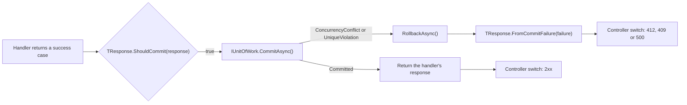

# Case types used here

Part of the [documentation](index.md).

**Contents**

- [Case types used here](#case-types-used-here)
- [Shared case types are meaning-free: TransactionBehavior can't assume what a case means](#shared-case-types-are-meaning-free-transactionbehavior-cant-assume-what-a-case-means)
  - [A commit can fail too: `ICommitFailable`](#a-commit-can-fail-too-icommitfailable)

| Case               | Role    | Meaning                                                         |
| ------------------ | ------- | --------------------------------------------------------------- |
| `Success`          | Shared  | The command completed; no payload to return (used by `DeleteProductResult`) |
| `<Dto>`            | Bespoke | The operation's actual result payload (e.g. `ProductDto`)       |
| `NotFound<TId>`    | Shared  | The requested entity doesn't exist; carries the id that missed  |
| `ValidationErrors` | Shared  | Input failed FluentValidation checks                            |
| `Error`            | Shared  | An unexpected/domain error, with a stable machine-readable code (`Error.ValidationFailureCode` is the one code the Api maps to 400) |
| `Failure`          | Shared  | Business-rule failure(s) that aren't input validation (defined, but no Products union declares it) |
| `NotAuthorized`    | Shared  | The caller isn't allowed to perform this operation              |
| `PreconditionFailed` | Shared | A precondition the caller attached (a stale `If-Match`) no longer holds |
| `Conflict`         | Shared  | The request collides with the current state (e.g. a value that must be unique is taken) |

Every row but `<Dto>` is a **[shared case type](glossary.md#this-repos-own-types)** — the same meaning-free
record reused across unions (see
[Shared case types are meaning-free](#shared-case-types-are-meaning-free-transactionbehavior-cant-assume-what-a-case-means)).
`<Dto>` stands for whatever **[bespoke case type](glossary.md#this-repos-own-types)** carries that operation's
actual payload — `ProductDto` for the Products feature. "Bespoke" here means *not meaning-free* —
a `ProductDto` means exactly one thing, a successfully materialized product — not that it's
confined to a single union: it's the success case of `CreateProductResult` and
`GetProductByIdResult` alike, and appears again wrapped as `PagedResult<ProductDto>` inside
`GetPagedProductsResult`. That's a third, different kind of reuse from a shared case type's —
`ProductDto` is reused because every one of those operations happens to succeed with the same
payload shape, not because its identity is deliberately meaning-free the way `Success` or
`NotFound`'s is.

Each union in this repo declares only the subset of cases that operation can actually produce:

| Union | Cases |
| --- | --- |
| `CreateProductResult` | `ProductDto`, `ValidationErrors`, `Error`, `Conflict` |
| `GetProductByIdResult` | `ProductDto`, `NotFound<ProductId>`, `Error` |
| `GetPagedProductsResult` | `PagedResult<ProductDto>`, `ValidationErrors`, `Error` |
| `UpdateProductResult` | `ProductDto`, `NotFound<ProductId>`, `ValidationErrors`, `Error`, `NotAuthorized`, `PreconditionFailed`, `Conflict` |
| `PatchProductResult` | the same seven as `UpdateProductResult` |
| `DeleteProductResult` | `Success`, `NotFound<ProductId>`, `Error`, `NotAuthorized`, `PreconditionFailed` |

Two smaller unions live outside Application: `CommitResult` and `CommitFailure` in the Domain (see
[A commit can fail too](#a-commit-can-fail-too-icommitfailable)) and `IfMatchHeader` in the Api
(`ProductVersion`, `MissingIfMatch`, `ValidationErrors`), which classifies the `If-Match` request
header before anything is sent to MediatR.

> [!WARNING]
> **Don't design case types as a mirror of HTTP status codes.** A union case describes what
> *happened in the domain* — it's meaning, not transport. `NotFound` doesn't mean "return 404";
> it means "the thing wasn't there," full stop. The mapping to a status code (or a gRPC status, or
> a retry decision, or a log line) belongs entirely to the outermost adapter — here, the
> controller's `switch` — and nowhere else. The same `NotFound` case, consumed by a queue worker
> instead of a controller, might mean "drop the message" or "dead-letter it"; it never means
> "404" in that context, because there is no HTTP response to produce. Keep the case types
> transport-agnostic so the Application layer stays usable from a worker, a CLI, or a gRPC service
> without modification.

# Shared case types are meaning-free: TransactionBehavior can't assume what a case means

`Error`, `NotFound`, `Success`, and the rest of this codebase's shared case types are plain,
meaning-free records. Any union is free to reuse `NotFound` to mean something that should
*commit*, or to introduce its own bespoke case type that should roll back — nothing about a shared
case type's identity says what it means for a given operation's transaction. That rules out
deciding commit-vs-rollback by pattern-matching case types against a fixed list (`response.Value is
Error or Failure or NotAuthorized or ValidationErrors or NotFound`): that's a closed-world
assumption baked into generic code, and it would silently misclassify any case type outside the
list, including one declared after the code that lists them was written.

The decision belongs on the union itself instead, via
[`ITransactionOutcome<TSelf>`](../src/MediatrUnionPoc.Application/Common/Abstractions/ITransactionOutcome.cs):

```csharp
public interface ITransactionOutcome<TSelf> where TSelf : ITransactionOutcome<TSelf>
{
    static abstract bool ShouldCommit(TSelf response);
}
```

Each command's union implements it with a `switch` over **its own** cases:

```csharp
public union UpdateProductResult(
    ProductDto, NotFound<ProductId>, ValidationErrors, Error, NotAuthorized, PreconditionFailed, Conflict)
    : IValidatable<UpdateProductResult>, ITransactionOutcome<UpdateProductResult>,
        IAuthorizable<UpdateProductResult>, ICommitFailable<UpdateProductResult>
{
    public static bool ShouldCommit(UpdateProductResult response) => response switch
    {
        ProductDto => true,
        NotFound<ProductId> => false,
        ValidationErrors => false,
        Error => false,
        NotAuthorized => false,
        PreconditionFailed => false,
        Conflict => false,
    };
}
```

`TransactionBehavior` calls `TResponse.ShouldCommit(response)` and never inspects a case type by
name. Two compiler-enforced guarantees back this, not just convention:

- **Every case, including future ones, must be classified.** `ShouldCommit`'s `switch` is
  exhaustive over that union's own closed case set — exactly like every other union `switch` in
  this codebase. Adding a case to `UpdateProductResult` without updating its `ShouldCommit` fails
  the build with `CS8509`, the same diagnostic
  [`ExhaustivenessTests`](../tests/MediatrUnionPoc.Application.Tests/Unions/ExhaustivenessTests.cs) proves against
  a plain `switch`. Two more scratch projects,
  [`ShouldCommitNonExhaustive`](../tests/CompileTimeChecks/ShouldCommitNonExhaustive) and
  [`ShouldCommitExhaustive`](../tests/CompileTimeChecks/ShouldCommitExhaustive), prove this
  specifically for `ShouldCommit` using a union of entirely made-up case types —
  `Approved`, `Rejected`, `NeedsManualReview` — showing the guarantee holds for arbitrary case
  types, not just the ones any existing union happens to declare.
- **Only commands that need a transaction carry the obligation.** `ITransactionOutcome<TResponse>`
  is required by [`ITransactionalCommand<TResponse>`](../src/MediatrUnionPoc.Application/Common/Abstractions/Messages.cs),
  not by `ICommand<TResponse>` itself — a command with nothing to commit or roll back (one that
  only publishes an event, say) is a plain `ICommand<TResponse>` and never needs to answer the
  question at all. A command that *does* declare `ITransactionalCommand<TResponse>` without its
  response implementing `ShouldCommit` is a compile error at the command declaration, not a
  pipeline behavior that quietly declines to run because a generic constraint wasn't satisfied. See
  [`NonTransactionalCommandTests`](../tests/MediatrUnionPoc.Application.Tests/Behaviors/NonTransactionalCommandTests.cs)
  for both halves of this proved together.

[`TransactionBehaviorTests`](../tests/MediatrUnionPoc.Application.Tests/Behaviors/TransactionBehaviorTests.cs)
proves the general case with an `ArbitraryOutcome` union whose case type (`SomeDevsOwnCaseType`)
shares no name, shape, or relationship with any case type used anywhere else in the codebase — the
behavior rolls back correctly purely by asking the union, never by recognizing the type.

## A commit can fail too: `ICommitFailable`

`ShouldCommit` decides whether to *attempt* a commit. The commit itself can still be refused for an
ordinary, expected reason: another request changed the row first (an optimistic-concurrency
failure), or the write would break a uniqueness constraint (the unique index on a product's normalised name). Those are outcomes, not faults, so
[`IUnitOfWork.CommitAsync`](../src/MediatrUnionPoc.Domain/IUnitOfWork.cs) reports them as a small
closed union instead of throwing:

```csharp
public union CommitResult(Committed, ConcurrencyConflict, UniqueViolation);
public union CommitFailure(ConcurrencyConflict, UniqueViolation);   // the two failing cases
```

What a failure *means* is operation-specific — a stale write on an update is a precondition
failure; the same failure on a brand-new row is impossible, so for a create it can only be an
unexpected error; a uniqueness violation on a create or an update is a conflict. So, exactly as with
`ShouldCommit`, the union answers, through
[`ICommitFailable<TSelf>`](../src/MediatrUnionPoc.Application/Common/Abstractions/ICommitFailable.cs):

```csharp
public interface ICommitFailable<TSelf> where TSelf : ICommitFailable<TSelf>
{
    static abstract TSelf FromCommitFailure(CommitFailure failure);
}

// UpdateProductResult
public static UpdateProductResult FromCommitFailure(CommitFailure failure) => failure switch
{
    ConcurrencyConflict => new PreconditionFailed("The product was changed by another request; reload it and retry."),
    UniqueViolation => ProductConflicts.NameTakenByConcurrentRequest(),   // a Conflict
};
```

Each transactional union answers for itself, and the answers differ:

| Union | `ConcurrencyConflict` becomes | `UniqueViolation` becomes |
| --- | --- | --- |
| `CreateProductResult` | `Error` (`COMMIT_CONCURRENCY_CONFLICT`): a brand-new row cannot have a stale version | `Conflict` |
| `UpdateProductResult` | `PreconditionFailed` | `Conflict` |
| `PatchProductResult` | `PreconditionFailed` | `Conflict` |
| `DeleteProductResult` | `PreconditionFailed` | `Error` (`COMMIT_UNIQUE_VIOLATION`): a delete cannot violate a uniqueness constraint |

The controller then maps those cases like any others (`Conflict` 409, `PreconditionFailed` 412,
`Error` 500):



`TransactionBehavior<TRequest, TResponse>` requires `TResponse : ICommitFailable<TResponse>` in
addition to `ITransactionOutcome<TResponse>`. When `CommitAsync` reports a failure it rolls back
and returns `TResponse.FromCommitFailure(failure)` in place of the handler's success response; the
behavior never sees which case types the union has. Because the `switch` is exhaustive over
`CommitFailure`, every transactional union is forced by the compiler to classify every commit
failure — including one added later. A genuinely unexpected exception (a dropped connection, say)
is still not a `CommitFailure`: it rolls back and is rethrown unchanged.
