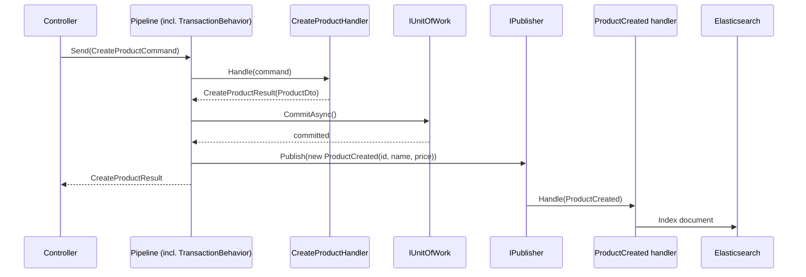

# Extending the pattern: syncing a search index

Part of the [documentation](index.md).

Not implemented in this repo, but a natural extension once every command already reports its
outcome as a union: keeping a search index (Elasticsearch, in this example) in sync with the write
model whenever a product is created, updated, or deleted — without threading Elasticsearch calls
through every handler's own business logic.

**The mechanism**: MediatR is also a **notification** publisher, not just a request/response
mediator — `IPublisher.Publish(new ProductCreated(id))` fans a message out to *every* registered
`INotificationHandler<ProductCreated>`, zero-or-many, none of them able to affect the original
command's own result. That's the right shape here: syncing a search index is a side effect of a
successful write, not part of *deciding* whether the write succeeded, so it shouldn't be able to
turn a `Success` into anything else.

1. **Publish after `TransactionBehavior` commits, not from inside the handler.** A notification
   raised from inside `CreateProductHandler`, before the transaction commits, could fire for a
   write that later rolls back — the search index would then reference a product the database
   never actually kept. Publishing needs to happen only on the `Success` branch, after
   `CommitAsync()`.
2. **Add a `Success`-shaped [domain event](glossary.md#cross-cutting-concepts) per operation** —
   `ProductCreated(ProductId, Name, Price)`, `ProductUpdated(ProductId, Name, Price)`,
   `ProductDeleted(ProductId)` — each just data, no behavior.
3. **A dedicated `INotificationHandler<ProductCreated>` (etc.) owns the Elasticsearch write** —
   indexing a new document, updating an existing one, or deleting one, entirely separate from
   `CreateProductHandler`/`UpdateProductHandler`/`DeleteProductHandler`, which never need to know a
   search index exists at all.

Note the last two arrows happen *after* the controller already has its response — indexing is
fire-and-forget from the caller's point of view, and a slow or even temporarily-failing
Elasticsearch write never adds latency to the product-creation request itself, nor can it change
the `201 Created` the caller already received. That's an intentional trade: the search index
becomes eventually consistent[^eventual-consistency] with the write model rather than immediately
consistent — the right trade for a search index, and the wrong one for, say, an inventory count a
checkout flow depends on.

> [!TIP]
> This same shape generalizes to any side effect that shouldn't block or influence a command's own
> result — an audit log, a cache invalidation, an outbound webhook, an email notification. Add a
> notification, publish it after commit, and let as many independent handlers subscribe as needed.

[^eventual-consistency]: The search index and the write-model database briefly disagree between the
    write committing and the notification handler finishing its Elasticsearch call — typically
    milliseconds, but not zero. See **Eventual consistency** in the
    [Glossary](glossary.md#cross-cutting-concepts) for the general concept this trades against *immediate*
    consistency.
