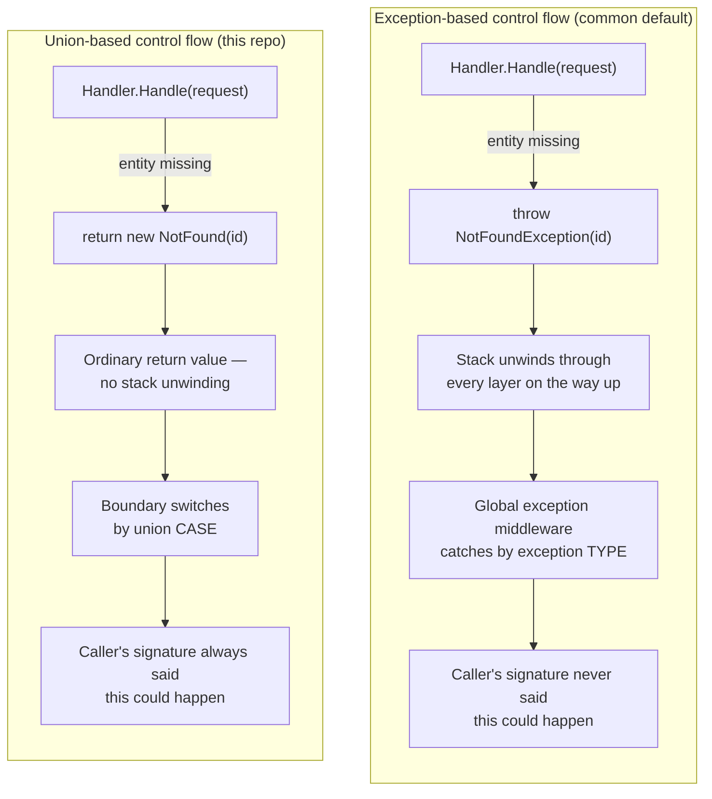

# No exceptions for expected outcomes

Part of the [documentation](index.md).

**Contents**

- [No exceptions for expected outcomes](#no-exceptions-for-expected-outcomes)
  - [Why MediatR codebases reach for exceptions anyway](#why-mediatr-codebases-reach-for-exceptions-anyway)
  - [Why that convenience is a bad trade](#why-that-convenience-is-a-bad-trade)
  - [What this repo does instead](#what-this-repo-does-instead)

A validation failure, a missing entity, an unauthorized caller, a business-rule violation — these
are not bugs, not infrastructure faults, and not exceptional. They are ordinary, anticipated
outputs of a use case, and this codebase treats them that way: every union declares them as cases,
and nothing in the request pipeline throws to signal one.

## Why MediatR codebases reach for exceptions anyway

MediatR's own contract doesn't stop anyone from throwing: `IRequestHandler<TRequest,
TResponse>.Handle` returns `Task<TResponse>`, and nothing about that signature says a not-found or
a validation failure has to be part of `TResponse`. Three things push the ecosystem toward
exceptions as the default anyway:

- **ASP.NET Core ships a global exception-handling story, and no equivalent for anything else.**
  `UseExceptionHandler`/`IExceptionHandler` and problem-details middleware exist specifically to
  turn a thrown exception into an HTTP response in exactly one place, so `throw new
  NotFoundException(id)` inside any handler, anywhere, "just works" without that handler's author
  writing any HTTP-mapping code at all. There is no equivalent one-line convenience for "return a
  typed outcome and let something downstream map it" — that has to be built, which is exactly what
  the `switch` in every controller action in this repo is doing.
- **Before `union`, C# had no built-in way to say "returns exactly one of these N things."** The
  realistic options were a hand-rolled `Result<T>` type, a third-party library (`OneOf`,
  `ErrorOr`, `FluentResults`), or leaving `TResponse` a single DTO and using an exception for
  everything that isn't the happy path. The third option needs zero new types and zero new
  dependencies, which is why it's the default in countless tutorials, project templates, and
  production codebases — not because it's better, but because it requires nothing else to be
  installed.
- **It composes for free across call depth.** A handler three calls deep can `throw`, and nothing
  in between has to know or care — the exception unwinds the stack automatically until something
  catches it. A typed result has to be threaded back up explicitly through every intermediate
  return, which reads as more code to write in the moment it's written, even though it's the code
  that keeps the contract honest.

## Why that convenience is a bad trade

None of the above makes exceptions-as-control-flow *correct* — it explains why it's common, not why
it's a good idea. **`throw` should mean what its name says: something exceptional happened.** The
moment a validation failure or a missing entity becomes a routine, expected outcome of calling an
operation, throwing for it stops being a shortcut and starts being a liability, in ways that get
worse as a codebase grows, not better:

- **It lies about the method's contract.** `Task<ProductDto> GetByIdAsync(ProductId id)` looks
  total — call it with any valid ID, get a `ProductDto` back — but if "not found" throws, the real
  contract is "returns a `ProductDto`, *or* throws one of an unbounded, undocumented set of
  exception types you'll only discover by reading the implementation or hitting one in production."
  A signature that misrepresents what can happen is worse than no signature at all, because it
  invites callers to trust it.
- **The compiler can't backstop it.** Forgetting `if (result is null)` is a mistake tooling can be
  made to catch — nullable reference types, or (better) exhaustive `switch` over a union with no
  null in its case set at all. Forgetting to wrap a call in `try`/`catch` for an exception type you
  didn't know it could throw is a mistake nothing catches — C# has no `throws` clause. The failure
  mode isn't "won't compile"; it's "compiles cleanly, throws unhandled in production."
- **It's measurably, not marginally, slower.** Throwing and catching a .NET exception costs orders
  of magnitude more than an ordinary return — stack-trace capture and stack unwinding are real CLR
  work that happens even when the `catch` is right there waiting. A `NotFound` that happens
  routinely (a stale bookmark, a race against a concurrent delete) shouldn't cost more than the
  `switch` that already exists to route it.
- **It pollutes observability with false signal.** Most hosting and APM setups treat any
  exception — logged or unhandled — as an *error*: it shows up in error-rate dashboards and can
  trip paging, for a stack trace nobody needed to explain a routine 404. Do this enough and a team
  either tunes out real incidents (alert fatigue — precisely the failure mode exceptions exist to
  prevent) or spends real effort teaching its own monitoring to ignore its own "errors," which is a
  worse position than never having generated the noise.
- **It scatters the outcome-to-response mapping instead of concentrating it.** With exceptions,
  "what HTTP status does a missing product produce" lives inside exception-handling middleware,
  switching on exception *type*, disconnected from the operation that threw it. With a union, that
  mapping lives in the one `switch` at the boundary that already has to exist for the happy path —
  there is no second, parallel place for it to drift out of sync with the first.
- **It's trivial to over-catch by accident.** A `catch (Exception)` written to handle one expected
  failure will just as happily catch a `NullReferenceException` from an actual bug, log it
  identically, and move on — nothing about the `catch` clause distinguishes "outcome I was
  expecting" from "bug I wasn't." A union case, by contrast, can only exist because some code
  explicitly constructed it as that case.

## What this repo does instead

- **Exceptions are reserved for the truly exceptional** — a dropped DB connection, a bug, a
  contract violation from a dependency. Anything a handler can *expect* to happen is a union case,
  constructed and returned like any other value.
- **Impossible to "forget to catch."** A thrown `NotFoundException` three layers up is a runtime
  surprise if some caller doesn't wrap it. A `NotFound` case in a union is impossible to silently
  drop — the compiler makes every `switch` look at it.
- **Transactions decide by outcome, not by catching.** [`TransactionBehavior`](../src/MediatrUnionPoc.Application/Common/Behaviors/TransactionBehavior.cs)
  asks the union itself — `ITransactionOutcome<TSelf>.ShouldCommit` — whether to commit, rather
  than inspecting which case type came back. No `catch` block is involved for expected outcomes; a
  `catch` still exists, but only for genuinely unexpected exceptions, and it rolls back and
  rethrows rather than swallowing anything into a result. See
  [Shared case types are meaning-free](case-types.md#shared-case-types-are-meaning-free-transactionbehavior-cant-assume-what-a-case-means)
  for why this isn't a hardcoded list of "which case types mean error," and
  [Transactions: what rollback undoes, and why it matters](transactions.md#transactions-what-rollback-undoes-and-why-it-matters)
  below for what "rollback" actually does.
- **Validator-owned members are deliberately not null-guarded; everything else is.** Every other
  public reference-type parameter in Application, Domain, Infrastructure and Api throws
  `ArgumentNullException` on `null`, but `CreateProductCommand.Name` and `UpdateProductCommand.Name`
  are not guarded, because `CreateProductValidator` / `UpdateProductValidator` own that input rule
  and report a `null` name as a `ValidationErrors` outcome. Over HTTP a `null` name is already
  rejected earlier by MVC model validation (400), so the guard would be redundant there; but a
  guard would make a direct `ISender.Send` caller get a thrown exception instead of the union case.
  Pinned by `ValidationBehaviorTests.Ctor_NullName_DoesNotThrowAndFailsValidation_Test`.
