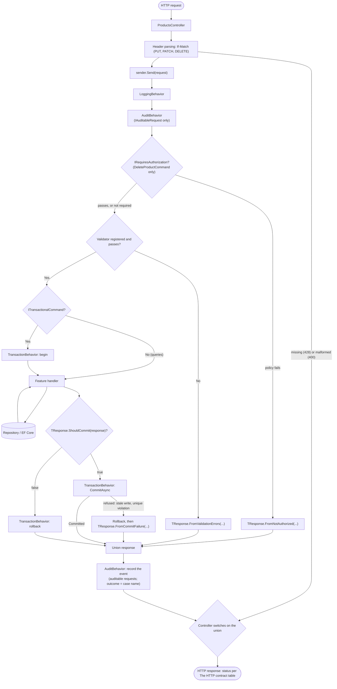
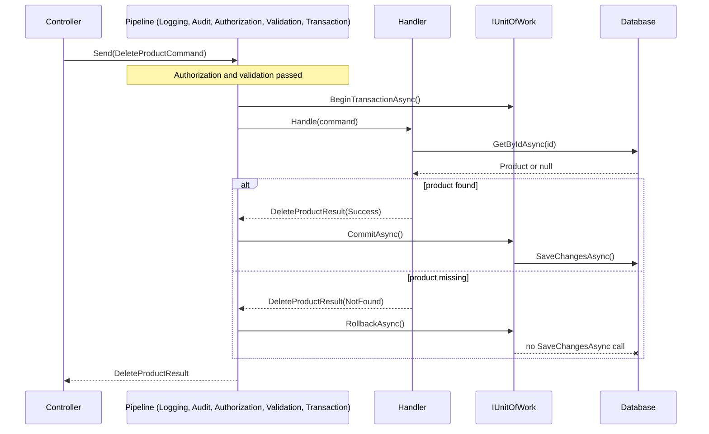

# Request lifecycle

Part of the [documentation](index.md).

Before the controller runs, the request passes the host's middleware, in this order: forwarded headers (only
with trusted proxies), trace id, request logging, exception handler, status-code pages, HTTPS redirection, CORS,
authentication, user log context, impersonation audit, request timeout, rate limiter, authorization. Each is explained where it
is introduced ([CORS](operations.md#cors-letting-a-browser-client-call-the-api),
[Request timeouts](operations.md#request-timeouts-a-deadline-per-request),
[Rate limiting](operations.md#rate-limiting-a-budget-per-caller)); the diagram above starts after them.

Only the last "Controller switches on the union" step is HTTP-aware — everything above it deals
purely in domain outcomes; the status each case becomes is in
[The HTTP contract](http-contract.md#the-http-contract-every-endpoint-and-outcome). The pipeline behaviors run in
this registration order (`Application/DependencyInjection.cs`): `LoggingBehavior`, `AuditBehavior`,
`AuthorizationBehavior`, `ValidationBehavior`, `TransactionBehavior`. `AuditBehavior` sits outside
authorization and validation on purpose, so a request they refuse is still recorded. Which of them a request meets
is decided by its marker interfaces and its response union's interfaces:

| Behavior | Applies to requests that | Needs the response union to implement |
| --- | --- | --- |
| `LoggingBehavior` | every request | nothing |
| `AuditBehavior` | implement `IAuditableRequest<TResponse>` (the four product mutations and the impersonation command) | nothing beyond being a union |
| `AuthorizationBehavior` | implement `IRequiresAuthorization` (`DeleteProductCommand`) | `IAuthorizable<TSelf>` |
| `ValidationBehavior` | have a response union that implements `IValidatable<TSelf>` (all six operations); it does nothing when no validator is registered | `IValidatable<TSelf>` |
| `TransactionBehavior` | implement `ITransactionalCommand<TResponse>` (Create, Update, Patch, Delete) | `ITransactionOutcome<TSelf>` and `ICommitFailable<TSelf>` |

`ICommand<TResponse>` (no transaction assumption) and `IQuery<TResponse>` (read-only) are the other
two request markers; no Products operation uses a bare `ICommand`, but
`NonTransactionalCommandTests` proves such a command never meets `TransactionBehavior`. `PUT` and
`PATCH` are not `IRequiresAuthorization`: their ownership check needs the loaded product, so it runs
inside the handler (see [Authorization](authorization.md#authorization)).

## Commit vs. rollback, message by message

No `catch` block appears anywhere in this flow — the branch is decided entirely by which case type
the handler returned (through `ShouldCommit`). A commit that is itself refused (`CommitAsync` returns
`ConcurrencyConflict` instead of `Committed`) takes the rollback branch too, and the response becomes
`DeleteProductResult.FromCommitFailure(...)`, here a `PreconditionFailed`. The handler's own version
check and the case where `If-Match` names a stale version also produce `PreconditionFailed` before
any commit is attempted, and that case is not committed either.
