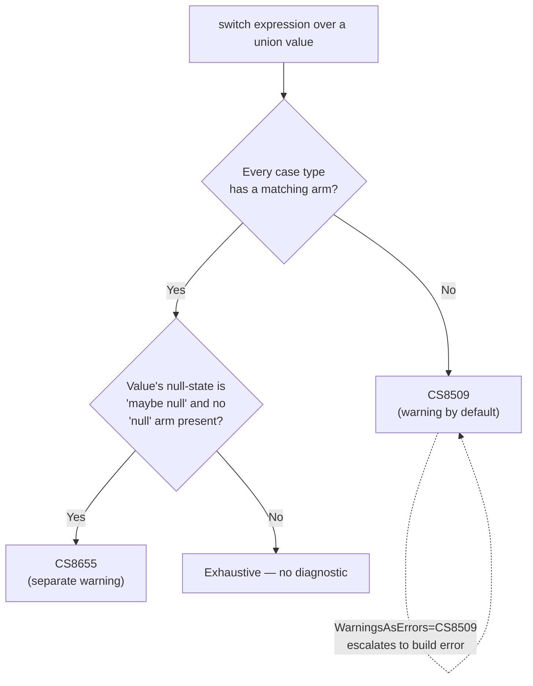

# C# 15 / .NET 11 preview `union` types — research notes

Compiled 2026-09-18 as source material for a Claude Code skill (`csharp-union`). Every claim is
cited inline to its primary source. Secondary sources (blog posts, aggregator search summaries)
are explicitly flagged as such — don't treat them as authoritative over the primary docs/spec.

> [!NOTE]
> **Changelog:** 2026-09-18 — formatting pass (GitHub alert blocks for flagged/secondary/gotcha
> callouts, a Mermaid diagram for §3's exhaustiveness diagnostics). No factual content, citations,
> or Open Questions were changed — see [`mediatr-research.md`](mediatr-research.md),
> [`fluentvalidation-research.md`](fluentvalidation-research.md), and
> [`vogen-research.md`](vogen-research.md), the three companion documents this pass also produced.

**Primary sources used:**

- [Union types — C# reference](https://learn.microsoft.com/en-us/dotnet/csharp/language-reference/builtin-types/union) (Microsoft Learn, language reference — "LR" below)
- [Unions — C# feature specifications (preview)](https://learn.microsoft.com/en-us/dotnet/csharp/language-reference/proposals/csharp-15.0/unions) (Microsoft Learn, mirrors the csharplang spec — "Spec" below)
- [dotnet/csharplang `proposals/unions.md`](https://github.com/dotnet/csharplang/blob/main/proposals/unions.md) — canonical GitHub location of the same spec (content is identical to the Learn mirror above; the working "Open questions" log is the valuable part not repeated in the Learn page)
- [Champion issue #9662](https://github.com/dotnet/csharplang/issues/9662) — LDM tracking issue for the feature (referenced by the spec; not separately fetched)
- [Explore union types in C# 15 — .NET Blog](https://devblogs.microsoft.com/dotnet/csharp-15-union-types/) — official announcement post ("Blog" below)
- [dotnet/roslyn#83666](https://github.com/dotnet/roslyn/issues/83666) — compiler bug tracker, CS8509 misfire on single-case unions (closed/fixed)
- [dotnet/runtime#127299](https://github.com/dotnet/runtime/issues/127299) and [#125449](https://github.com/dotnet/runtime/issues/125449) — System.Text.Json union support proposals (both closed/api-approved)

**Secondary sources (flagged inline wherever used):** [andrewlock.net "DotNet gets union types" (Exploring the .NET 11 preview, Part 2)](https://andrewlock.net/exploring-the-dotnet-11-preview-2-dotnet-gets-union-types/); WebSearch aggregator summaries (used only to locate primary sources, never quoted as fact without independent verification against a primary source above).

---

## 1. Declaration syntax

The shorthand, compiler-generated form (LR, Spec):

```csharp
public union Pet(Cat, Dog, Bird);
```

This is a **union declaration**. Per the Spec's grammar (EBNF-style pseudo-grammar notation, as
used in the csharplang spec repo — not literal ANTLR syntax, hence no syntax highlighting below):

```text
union_declaration
    : attributes? struct_modifier* 'partial'? 'union' identifier type_parameter_list?
      '(' case_types ')'  struct_interfaces? type_parameter_constraints_clause*
      (`{` struct_member_declaration* `}` | ';')
    ;
case_types
    : type (',' type)*
    ;
```

Consequences worth calling out:

- A union declaration can carry `partial`, arbitrary `struct_modifier`s, attributes, type parameters, constraint clauses, and an interface list — syntactically it's a `struct` declaration with `struct` swapped for `union` and a parenthesized case-type list inserted (Spec, "Union declaration syntax" — this generality was explicitly **resolved** after an earlier, more restrictive draft; see "Open questions" below).
- A body is optional: `public union Pet(Cat, Dog, Bird);` (semicolon, no body) is valid, and so is a body with additional members (LR):

```csharp
public union Length(Meters, Feet)
{
    public double TotalMeters => this switch
    {
        Meters m => m.Value,
        Feet f => f.Value * 0.3048,
        _ => throw new InvalidOperationException("The Length has no value."),
    };

    public Length Add(Length other) => new Meters(TotalMeters + other.TotalMeters);
}
```

- Restrictions on the body, **in addition to** normal struct member restrictions (Spec):
  - No instance fields, auto-properties, or field-like events.
  - No explicitly declared public constructor with a single parameter (the compiler generates those as union-creation constructors; hand-writing one would collide).
  - Explicitly declared constructors must delegate via `this(...)` to one of the generated constructors.
  - "It is an error for user-declared members to conflict with generated members" (Spec, "Lowering").

- **Resolved design decision, worth flagging because it contradicts an earlier iteration of the spec**: a union declaration is a plain `struct`, **not** a `record struct`. `record union U(...)` is **not** supported (Spec, "[Resolved] Is union declaration a record?"). If your working assumption is "unions are records," that's wrong per the finalized spec — the LR page also states this directly: "Unlike a `record`, a union doesn't add equality, cloning, or deconstruction behavior."

### Lowering (what `union Pet(Cat, Dog, Bird);` actually becomes)

Per LR/Spec, the declaration lowers to:

```csharp
[Union] public struct Pet : IUnion
{
    public Pet(Cat value) => Value = value;
    public Pet(Dog value) => Value = value;
    public Pet(Bird value) => Value = value;
    public object? Value { get; }
}
```

This is "opinionated" (Spec's own word): always a struct, always a single `object?` reference field, always boxes value-type cases on entry.

---

## 2. What can be a case type

Per LR: "Case types can be any type that converts to `object`, including classes, structs, interfaces, type parameters, nullable types, and other unions."

Per Spec: "The case_types can be any type that converts to `object`, e.g., interfaces, type parameters, nullable types and other unions. It is fine for resulting cases to overlap, and for unions to nest or be null."

Concretely, all of these are valid case-type lists (LR):

```csharp
public union Pet(Cat, Dog, Bird);              // classes/records
public union Option<T>(None, Some<T>);         // generic case type
public union IntOrString(int, string);         // primitives — boxed when stored
```

Value-type case types (e.g. `int`) are boxed when stored in `Value`, because the generated storage is a single `object?` field (LR). This is the single biggest performance caveat of the shorthand declaration form — see §9.

Nullable value types as case types are explicitly supported, with one resolved wrinkle: if the case type is a nullable value type, the corresponding `TryGetValue` out-parameter uses the *underlying* (non-nullable) type, not the nullable type, because "a type pattern cannot use nullable value type as the target type" (Spec, "[Resolved] Nullable value types as Union case types").

A union creation member's single parameter must be **by-value or `in`** — `ref`/`out` are disallowed (Spec, "[Resolved] Ref-ness of constructor's parameter").

---

## 3. Exhaustiveness rules

Core rule (LR/Spec, identical wording in both): "A `switch` expression is exhaustive when it handles all case types of a union... You don't need to include a discard pattern (`_`) or `var` pattern to match any type when the expression is definitely assigned."

```csharp
var name = pet switch
{
    Dog d => d.Name,
    Cat c => c.Name,
    Bird b => b.Name,
    // No discard needed, no warning
};
```

**Diagnostic when non-exhaustive: CS8509** — "The switch expression does not handle all possible values of its input type (it is not exhaustive)." This is confirmed by:
- The Spec's own open-question worked example literally shows the compiler emitting `warning CS8509` text.
- [dotnet/roslyn#83666](https://github.com/dotnet/roslyn/issues/83666), a (now-closed/fixed) compiler bug where CS8509 was *incorrectly* firing on an exhaustive single-case-union switch, using this repro:

  ```csharp
  public union IntUnion(int);

  public static class Repro
  {
      public static object Deconstruct(IntUnion value) => value switch
      {
          int i => i,
      };
  }
  ```

> [!WARNING]
> **Important nuance verified against your own repo, not just docs**: CS8509 is emitted as a
> **warning** by default, not a hard compiler error. Your
> `tests/CompileTimeChecks/NonExhaustive/NonExhaustive.csproj` elevates it to a build error
> deliberately, via:
>
> ```xml
> <PropertyGroup>
>   <TreatWarningsAsErrors>true</TreatWarningsAsErrors>
>   <WarningsAsErrors>CS8509</WarningsAsErrors>
> </PropertyGroup>
> ```
>
> This is a project-local override — the repo's root `Directory.Build.props` sets
> `TreatWarningsAsErrors=false` globally. **A skill on this topic should not claim "CS8509 is a
> compiler error" unconditionally** — it's a warning unless the consuming project (or
> `-warnaserror`) escalates it. If a Claude Code skill wants to assert exhaustiveness is enforced
> at build time, it must call out that `WarningsAsErrors` (or a repo-wide `TreatWarningsAsErrors`)
> is required for that to actually break the build.

> [!NOTE]
> **Exhaustiveness only applies to `switch` *expressions*, not `switch` *statements***. Neither LR
> nor the Spec states this negatively, but every worked example of "exhaustiveness" in both
> sources uses `switch` *expression* syntax (`x switch { ... }`), never a `switch` *statement*
> (`switch (x) { case ... }`). C# switch statements have never required exhaustiveness (this
> predates unions and is general C# behavior, not union-specific) — flagged here as an inference
> from the primary sources' consistent phrasing ("switch expressions... are exhaustive") rather
> than an explicit statement, so verify empirically if load-bearing.

**Null and exhaustiveness interact.** Even a switch that covers every case type will still warn (a different diagnostic, `CS8655`, per the spec's worked example — see below) if the union's `Value` null-state is "maybe null" and no `null` arm is present:

```csharp
Pet pet = GetNullableDog(); // 'pet.Value' is "maybe null"
var value = pet switch
{
    Dog dog => ...,
    Cat cat => ...,
    // Warning: 'null' not handled
};
```

The Spec's worked example for a related open question shows the exact code: `warning CS8655: The switch expression does not handle some null inputs (it is not exhaustive). For example, the pattern 'null' is not covered.` — so **two different diagnostics** are in play depending on whether the missing arm is a case type (CS8509) or `null` (CS8655). Neither Learn page names CS8655 explicitly in prose; this is pulled from the Spec's literal compiler-output quote, so treat it as accurate but under-emphasized in the docs.

The two diagnostics are triggered by independent checks — a switch can pass one and fail the other:



*(Diagram covers the two diagnostics described above; it doesn't introduce any new claim beyond what's cited inline.)*

---

## 4. Pattern matching over union cases

Central rule (LR, Spec): "When you pattern match on a union type, patterns generally apply to the union's `Value` property, not the union value itself" — described as the union being "transparent" to pattern matching.

```csharp
var name = pet switch
{
    Dog d => d.Name,   // pattern 'Dog d' is really matched against pet.Value
    Cat c => c.Name,
    Bird b => b.Name,
};
```

**Three exceptions that do NOT unwrap** (LR): the discard `_` pattern, the `var` pattern, and the `not` pattern all apply to the union value itself, not `.Value`.

```csharp
if (GetPet() is var pet) { /* pet is the Pet? value itself, not its .Value */ }
```

Logical (`and`/`or`) patterns propagate unwrapping *per branch*, not globally — order matters:

```csharp
GetPet() switch
{
    var pet and not null => ...,   // 'var pet' captures Pet?; 'not null' still applies to Pet? (not .Value)
    not null and var value => ..., // 'not null' doesn't unwrap, so the following 'var value' still captures Pet?
}
```

Per-pattern-kind rules, straight from the Spec (this level of detail is **not** in the LR page — only in the Spec):

| Pattern kind | Unwraps to `.Value`? | Notes |
|---|---|---|
| `var` | No | Captures the union itself. |
| Type pattern (`Cat c`) | Yes | `p is Pet` is an **error** — `Pet` isn't itself pattern-compatible with the union's contents; you match against case types, never the union type name itself. |
| Declaration pattern | Yes | Equivalent to `type and var designation`. |
| Property pattern with a type (`Cat { Name: "Fido" }`) | Yes | Without a leading type, matches the union instance's own shape only (rarely useful since unions expose only `Value`). |
| Positional pattern with a type | Yes | Same logic as property pattern. |
| Constant pattern (`is 10`) | Yes | Succeeds "only when the union instance itself is not null and its Value matches" — for class unions this means two null checks are implicitly chained. |
| Discard `_` | No | |
| Relational pattern (`is > 1`) | Yes | |
| List pattern | No | Explicitly does **not** unwrap by default; the Spec notes a resolved workaround via extension members providing `Length`/indexers on `object` (a C# 14 "extension blocks" feature interaction). |
| `not` | No | Applies to the incoming union value, not `.Value` — this is the one most likely to trip people up, per the worked example in §3 above. |
| Logical (`and`/`or`) | Depends on the sub-pattern | Each branch evaluated independently; `and` can change the "input value" seen by the right-hand pattern, `or` cannot. |

**The `is` operator is a type pattern, and is explicitly *not* the same as the runtime `is`-type check for this purpose** — the Spec calls this out as a resolved open question: syntactically `u is int` on a union type "looks very much like a type pattern, but it isn't" when read as `is`-type-operator semantics; the resolution was to make it **behave as a type pattern** (i.e. it *does* unwrap), specifically to avoid the confusing alternative where it wouldn't (Spec, "[Resolved] The is-type operator").

---

## 5. Case type design guidance — equality, naming, attributes

- **No special attribute is required on case types themselves.** The `[Union]` attribute goes on the *union* type (auto-generated for `union` declarations), not on case types. Any ordinary class, record, struct, interface, or primitive can be a case type (§2).
- **Equality**: The LR page is explicit that a union declaration itself does **not** add equality: "Unlike a `record`, a union doesn't add equality, cloning, or deconstruction behavior. A union focuses on 'which case is it?' rather than 'what fields does it have?'" Equality of a union *value* is therefore whatever the boxed `Value`'s equality is (e.g. record value equality if the case type is a record, reference equality if it's a plain class) — the union struct itself gets only the default `object?`-field equality unless you hand-roll more. Neither source gives a naming convention recommendation for case types beyond ordinary C# type-naming conventions; **no explicit Microsoft naming guidance for case types was found in any primary source** (flagged as a documentation gap — see Open Questions).
- Your project's own `Application/Common/Results/CaseTypes.cs` convention (deliberately meaning-free, reused `Success`/`NotFound`/`Error`/etc. case types shared across many unions) is **not** something either primary source discusses or recommends — it's a local design choice, not doc-sanctioned or doc-discouraged.

---

## 6. Nesting

Explicitly supported. Spec: "It is fine for resulting cases to overlap, and for unions to nest or be null." LR gives a concrete generic example that is itself a nested-union pattern (`Option<T>` wrapping `Some<T>` which wraps `T`), though a union directly containing another union as one of its case types is likewise legal per the Spec's blanket statement (case types can be "any type that converts to `object`... and other unions").

No worked example of union-of-unions appears verbatim in either LR or the Spec — the "nest" claim is a one-line statement of support, not demonstrated with code. Treat as documented but thin.

---

## 7. Generics

Both the union type itself and its case types can be generic (LR):

```csharp
public record class None;
public record class Some<T>(T Value);
public union Option<T>(None, Some<T>);
```

```csharp
public union OneOrMore<T>(T, IEnumerable<T>)
{
    public IEnumerable<T> AsEnumerable() => Value switch
    {
        T single => [single],
        IEnumerable<T> multiple => multiple,
        null => []
    };
}
```

The Spec's grammar explicitly includes `type_parameter_list?` and `type_parameter_constraints_clause*` on `union_declaration`, confirming full generic-type-parameter and constraint support at the declaration level, matching ordinary generic struct declarations.

One resolved edge case: **a type parameter is never itself treated as a union type, even when constrained to one** (Spec, "[Resolved] Confirm that a type parameter is never a union type, even when constrained to one"):

```csharp
static bool Test1<T>(T u) where T : C1  // C1 is a union
{
    return u is int; // NOT union matching — ordinary `is`-type check against T
}
```

This matters if you write generic helper code over a `where T : SomeUnion` constraint expecting union-pattern unwrapping — you won't get it.

---

## 8. Interop with other C# features

### Records
A union is generated as a plain `struct`, not a `record struct` (§1). Records are commonly used *as case types* (every LR example uses `record class` case types), but the union declaration itself gets none of records' generated equality/`ToString`/`Deconstruct`/`with`-expression behavior.

### Interfaces / `IUnion`
The compiler-recognized marker interface (LR/Spec):

```csharp
namespace System.Runtime.CompilerServices;

[AttributeUsage(AttributeTargets.Class | AttributeTargets.Struct, AllowMultiple = false)]
public sealed class UnionAttribute : Attribute;

public interface IUnion
{
    object? Value { get; }
}
```

LR states these runtime types ship "beginning with .NET 11 Preview 5."

> [!TIP]
> Secondary source, flagged: a WebSearch-aggregated summary (not independently re-verified against
> a changelog) suggested the attribute/interface were present as early as Preview 4 and that
> Preview 6 "shipped union support types in the box" on 2026-07-14 — **these preview-numbering
> claims conflict slightly across sources and should be spot-checked against your actual installed
> SDK** (`global.json`) rather than trusted from search summaries. The one primary-source statement
> (LR, dated 2026-08-14) says Preview 5.

You can runtime-check any union value generically via `IUnion`:

```csharp
if (value is IUnion { Value: null }) { /* the union's value is null */ }
```

### Static abstract members / "union member providers"
A union-defining type can delegate its creation/access members to a nested `IUnionMembers` interface instead of declaring them directly — useful when you need a private constructor or factory-style creation logic (e.g. `record class` unions) (LR, Spec):

```csharp
public record class Result<T> : Result<T>.IUnionMembers
{
    object? _value;

    public interface IUnionMembers
    {
        static Result<T> Create(T value) => new() { _value = value };
        static Result<T> Create(Exception value) => new() { _value = value };
        object? Value { get; }
    }

    object? IUnionMembers.Value => _value;
}
```

This is functionally a **static abstract interface member** pattern (`static Create(...)` declared on an interface), conceptually related to your repo's own `static abstract bool ShouldCommit(TResponse)` on `ITransactionOutcome<TResponse>` — both lean on C# 11's static-abstract-members-in-interfaces feature, though the union proposal doesn't name that feature explicitly; this is an inference from reading the code sample, not a direct doc statement.

### Pattern matching (`is`, `switch`)
Covered exhaustively in §3–4.

### Null handling
Three distinct null behaviors depending on whether the union is a **struct** or a **class** (LR/Spec — this is one of the most load-bearing, easy-to-get-wrong parts of the whole feature):

- **Struct union**: `null` pattern checks whether `.Value` is null. `default(SomeUnion)` has a null `Value`.
- **Class union**: `null` succeeds when *either* the union reference itself is null *or* its `Value` is null — i.e. `result is null` compiles to `result == null || result.Value == null`.
- **Nullable-wrapped struct union (`Pet?`)**: `null` succeeds when the nullable wrapper has no value *or* the underlying union's `Value` is null.

The Spec flags class-union null-checking as an explicitly debated, only-partially-satisfying design point (Spec, "[Resolved] Checking instance itself for `null`") — quoting its own words: "This part of the design is clearly optimized around the expectation that a union type is a struct," and the resolution taken was to let the `null` pattern cover both cases rather than "disallow classes from being union types" or force `==` for null checks.

> [!WARNING]
> **If a case type in a class union can also independently be `null`, the exhaustiveness
> diagnostic's example arm is literally `null => 3`, and the docs themselves call this "very
> confusing."** Good candidate for a skill's "gotcha" section verbatim.

Nullability *tracking* rules (LR/Spec, identical wording):
- Default null state of `Value` is "maybe null" if any case type's default null state is "maybe null"; otherwise "not null."
- Creating a union from a case type propagates that value's null state to `Value`.
- Using `HasValue`/`TryGetValue` (see non-boxing pattern, §9) narrows `Value`'s null state to "not null" on the true branch, exactly like checking `Value` directly.

### Serialization (System.Text.Json)

> [!CAUTION]
> **Not yet shipped as of the LR page's date (2026-08-14) or the Blog post** — neither primary doc
> source (LR, Spec, Blog) mentions System.Text.Json behavior at all. This gap is corroborated by
> the Blog post explicitly listing serialization as absent ("No Explicit Coverage of Serialization"
> — noted by the fetch tool's own summary of that page, since the article itself simply never
> raises the topic).

The actual design work is tracked as **GitHub proposals**, not yet-published documentation:
- [dotnet/runtime#125449](https://github.com/dotnet/runtime/issues/125449) — umbrella issue for STJ support of unions/closed hierarchies/closed enums. Its body carries a note disclaiming: "This proposal was drafted with the help of an AI agent. Please review for accuracy" — **treat this issue's content as lower-confidence than a normal maintainer-authored proposal**, even though the repo maintainers evidently accepted and closed it as api-approved.
- [dotnet/runtime#127299](https://github.com/dotnet/runtime/issues/127299) — union-specific sub-issue, **state: CLOSED, label: api-approved** (i.e. the API shape was approved in API review; closed issues in dotnet/runtime commonly mean "implemented," but this research did not independently confirm the feature is live in a specific preview build — verify against your installed SDK before asserting it works). Key design points from its body, quoted directly:
  - **No discriminator/envelope on the wire.** Unions serialize *transparently* — the case value is written using its own JSON contract, no `$type` field:
    ```csharp
    union Result(int, string);
    JsonSerializer.Serialize<Result>(new Result(42));      // 42
    JsonSerializer.Serialize<Result>(new Result("hello")); // "hello"
    ```
    This is explicitly contrasted with `[JsonPolymorphic]`/`[JsonDerivedType]`'s `$type`-tagged approach, with the stated rationale: "Unions don't have a natural discriminator: any case can be picked by the union's constructors, and two distinct case constructors can produce equal values."
  - **Deserialization uses "first-token dispatch"** — the converter inspects the first JSON token's kind (`Number`, `String`, `True`/`False`, `StartObject`, `StartArray`, `Null`) and picks the unique compatible case type. This means **ambiguous unions (two case types compatible with the same token kind, e.g. two different `record class` case types that both serialize as JSON objects) need a "case classifier abstraction"** described in the same issue for structural disambiguation — not fully quoted here, follow the issue for details if this scenario applies.

> [!CAUTION]
> Given this is unshipped/unverified in this research pass, **a skill should not assert concrete
> STJ union behavior as fact** without the author re-checking against the actual installed preview
> SDK's behavior.

---

## 9. Known limitations, gotchas, and preview/tooling caveats

- **Boxing.** The shorthand `union` declaration always stores `Value` as a single `object?` field — every value-type case type is boxed on entry (LR, explicit: "When a case type is a value type (like `int`), the value is boxed when stored in the union's `Value` property"). The escape hatch is hand-rolling a custom union type with the **non-boxing access pattern** (`HasValue` + `TryGetValue(out T value)` per case type), which lets the compiler generate strongly-typed, non-boxing pattern-match code (LR, Spec, full worked `IntOrBool` example in both). This is real, but manual — the shorthand `union(...)` syntax has no opt-in flag to request non-boxing storage.
- **CS8509 is a warning, not an error, by default.** See §3 — don't let a skill assert unconditional compile-time enforcement without noting the `WarningsAsErrors` requirement.
- **CS8509 had a real compiler bug misfiring on exhaustive single-case unions** ([roslyn#83666](https://github.com/dotnet/roslyn/issues/83666)), now fixed/closed. Worth noting as "if you hit this on an old preview build, upgrade" rather than a permanent gotcha.
- **`switch` exhaustiveness and null-exhaustiveness are two different diagnostics** (CS8509 vs. the less-publicized CS8655) — see §3.
- **List patterns do not unwrap by default** and previously failed outright against `object`-typed union `Value` fields; the Spec's resolution is that C# 14 "extension blocks" can retrofit `Length`/indexer members onto `object` to make list patterns work — this is a fairly obscure workaround, not something to expect out of the box (Spec, "[Resolved] List pattern").
- **`IUnionMembers`/non-boxing members are independently optional** — declaring `TryGetValue` without `HasValue` (or vice versa) is fine; the compiler falls back to `Value`-based checks for whichever pattern kind lacks a specialized member (LR, "Each member is independently optional").
- **Class-based unions have confusing null semantics**, explicitly acknowledged as an unresolved-feeling compromise by the spec authors themselves (§8, quoted verbatim above).
- **Deriving from a class-based union is dangerous and semantically murky** — a derived class automatically "inherits" `IUnion` and becomes a union itself whose case types come from *its own* constructors, which can silently break exhaustiveness in the base type's switches (Spec, "[Resolved] Deriving from a `Union` class," worked example included). No airtight guardrail was adopted; the resolution notes remain open-ended about exactly which classes qualify as "the" union type in an inheritance chain.
- **Runtime types (`UnionAttribute`, `IUnion`) only started shipping in the BCL partway through the preview cycle** (LR says Preview 5; see caveat about conflicting secondary-source preview numbers in §8). On earlier previews you had to declare these types yourself locally — this matches your repo's own README/CLAUDE.md framing of the feature as still-moving preview surface.
- **Analyzer/tooling gaps**:
  - Your own repo's `.editorconfig` disables **SA1649** with the stated rationale that "it crashes outright on any file containing a `union` declaration." This is a first-hand/local finding from your own project, not corroborated by a public StyleCopAnalyzers GitHub issue found during this research (a targeted search for `union`-specific SA1649 crashes turned up only unrelated `record`/`record struct` SA1649 crash reports from years prior). **Flag this in the skill as empirically observed in this repo, not as a documented-upstream StyleCop issue** — if useful, file/link an upstream issue rather than assuming one exists.
  - > [!TIP]
    > Secondary source, flagged: IDE support is uneven per the andrewlock.net post — Visual Studio
    > Preview and VS Code C# DevKit Insiders have partial support; JetBrains Rider support was
    > "still pending" as of that post's date. Not independently verified against a primary source —
    > treat as anecdotal/time-sensitive.
- **Union conversions are not "real" implicit conversions** — they don't participate in user-defined implicit conversion chains or other union conversions, and an existing user-defined `implicit`/`explicit` operator on the same source type always takes priority over the union conversion (Spec, "Union conversions," with worked `S1`/`S2` examples for implicit vs. explicit operator precedence).
- **No lifted (`Nullable<T>` → union) conversions**, resolved deliberately: `int?` doesn't implicitly convert to a union with `int` as a case type, because it's ambiguous whether lifting should produce a union with a null `Value` or a null `Nullable<Union>` (Spec, "[Resolved] Lifted conversions").
- **Concurrency**: the Spec ends with an explicitly unresolved question about whether the compiler should generate defensive `this`-copies to guard against a union struct being reassigned mid-method by another thread when a function member dereferences `this` more than once — called out as an open design question, not a settled behavior. Don't assume any particular thread-safety guarantee.

---

## 10. Explicit best practices / anti-patterns from Microsoft's own text

The LR page's "Declare a union when..." section is the closest thing to explicit usage guidance found in any primary source:

> Declare a union when a value must be exactly one of a fixed set of types and you want the compiler to enforce that every possibility is handled. Common scenarios include:
> - **Result-or-error returns**: A method returns either a success value or an error value, and the caller must handle both. A union like `union Result(Success, Error)` makes the set of outcomes explicit.
> - **Message or command dispatching**: A system processes a closed set of message types. A union ensures new message types produce compile-time warnings at every `switch` that doesn't handle them yet.
> - **Replacing marker interfaces or abstract base classes**: If you use an interface or abstract class solely to group types for pattern matching, a union gives you exhaustiveness checking without requiring inheritance or shared members.

This maps almost exactly onto your repo's own MediatR/CQRS-response use case — worth quoting directly in the skill as Microsoft's own stated first-class scenario for the feature.

The LR page also gives explicit **contrast guidance vs. adjacent constructs**, useful as anti-pattern framing (i.e., "don't reach for a union when you actually want X"):

> A union differs from other type declarations in important ways:
> - Unlike a `class` or `struct`, a union doesn't define new data members. Instead, it composes existing types into a closed set of alternatives.
> - Unlike an `interface`, a union is closed — you define the complete list of case types in the declaration, and the compiler uses that list for exhaustiveness checks.
> - Unlike a `record`, a union doesn't add equality, cloning, or deconstruction behavior. A union focuses on "which case is it?" rather than "what fields does it have?"

No primary source states an explicit anti-pattern like "don't do X" beyond this contrastive framing — there is no Microsoft-published "top 5 mistakes" or equivalent list for unions found in this research pass.

---

## 11. Conceptual comparison to other languages' unions

> [!CAUTION]
> **Caveat up front: none of the primary sources (LR, Spec, Blog) draw this comparison
> explicitly.** Everything in this section is this researcher's own synthesis from reading the
> mechanics described in §1–9, not a quoted or cited claim from Microsoft. Treat this section as
> analysis, not sourced fact, and verify independently before putting firm comparative claims in
> the skill.

- **F# discriminated unions / Rust `enum`**: those are *tagged* unions — each case is a distinct, language-level "arm" with a runtime discriminant baked in by the compiler, and cases are typically not usable as standalone types outside the union. C# unions are explicitly **not** discriminated/tagged in that sense — the Spec says so directly: "The proposed unions in C# are unions of *types* and not 'discriminated' or 'tagged'. 'Discriminated unions' can be expressed in terms of 'type unions' by using fresh type declarations as case types." I.e., C# gets DU-like ergonomics only if *you* declare fresh record types per case (as your repo's `CaseTypes.cs` effectively does) — the union mechanism itself is a closed set of existing types, not a tagged sum type with synthesized tags.
- **TypeScript `A | B`**: closer in spirit (a union *of types*, not of tags), but C#'s union is a **nominal, declared type** (`union Pet(Cat, Dog, Bird)` is itself a named type you can pass around), whereas TypeScript unions are structural and have no separate identity beyond the `|` combinator at the use site. The Spec's "Motivation" section alludes to a rejected "pure union" design alternative using a type-level combinator (`A|B|C`) that would have been more TypeScript-like, in favor of the current named-declaration approach — see the linked [`union-proposals-overview.md`](https://github.com/dotnet/csharplang/blob/main/meetings/working-groups/discriminated-unions/union-proposals-overview.md) (found via WebSearch, not independently fetched in full during this pass — flagged as unread primary source, see Open Questions).
- **Rust's compile-time exhaustiveness** is a hard compiler error unconditionally; C#'s equivalent (CS8509) is, by contrast, a **warning by default** that a project must explicitly escalate (§3) — a real, material difference in default strictness, not just a syntax difference.
- **Runtime representation**: F# DU cases and Rust enum variants are typically stored inline/unboxed in an optimized tagged representation chosen by the compiler; the C# shorthand union declaration always boxes value-type cases into a single `object?` field (§9) unless you hand-write the non-boxing access pattern yourself. This is a real performance-relevant divergence, not just cosmetic.

---

## Open questions / where documentation is thin or still in flux

1. **Exact preview number when `UnionAttribute`/`IUnion` landed in the BCL** — LR (dated 2026-08-14) says Preview 5; a WebSearch aggregator summary claimed Preview 4 (types present) and Preview 6 (shipped "in the box," dated 2026-07-14, which is chronologically *before* Preview 5 per the other claim — the two secondary claims are internally inconsistent). **Verify against your actual installed SDK via `dotnet --info` / `global.json` rather than trusting either.**
2. **System.Text.Json union support is not yet documented in any primary Learn/Blog page** — only tracked via closed-but-unverified-as-shipped GitHub API proposals (#125449, #127299), one of which is explicitly AI-drafted per its own disclaimer. Don't write skill content asserting concrete STJ union JSON shape without hands-on verification against the installed preview SDK.
3. **No Microsoft-published case-type naming convention** was found (§5) — unclear if this is deliberate ("case types are just types, name them however") or simply undocumented.
4. **Switch *statement* (non-expression) exhaustiveness behavior is never directly addressed** in either LR or Spec — inferred, not confirmed, that it behaves like ordinary C# switch statements (no exhaustiveness enforcement). No code sample in either source uses `switch` statement syntax over a union.
5. **SA1649 crashing on `union` declarations** is asserted in your repo's own `.editorconfig` but no corroborating public StyleCopAnalyzers issue was located during this research — could be a not-yet-filed issue, a preview-SDK-specific interaction, or something specific to your analyzer version. Worth filing upstream if not already tracked.
6. **The rejected "pure union" (`A|B|C` combinator) design alternative** is referenced by the Spec's Motivation section and appears to have its own overview doc (`union-proposals-overview.md` in csharplang's meetings/working-groups folder) that was **not** fetched in full during this research pass — if the skill wants deeper "why C# didn't do it the TypeScript way" material, that page is the next one to read.
7. **Union-of-unions (direct nesting) has no worked code example** anywhere in the primary sources — supported per a one-line statement, but unverified in practice during this research pass.
8. **Thread-safety of union struct field access** is an explicitly open, unresolved design question per the Spec's closing section — do not present any concurrency guarantee as settled.
9. Everything in this feature is preview-only, gated behind `<LangVersion>preview</LangVersion>` and a preview SDK per `global.json` — by definition, **any of the above could still change before final release**, including exhaustiveness diagnostics, null-checking semantics for class unions, and the STJ wire format. This document reflects the state of the docs/spec/issues as read on 2026-09-18.
