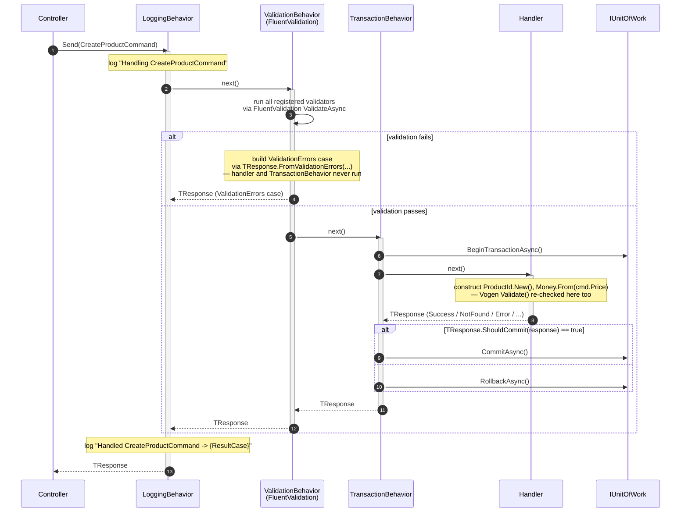

# MediatR — research notes

Compiled 2026-09-18 as source material for engineers working on this repo's pipeline
(`LoggingBehavior` → `ValidationBehavior` → `TransactionBehavior`, wired in
`Application/DependencyInjection.cs`). Every claim is cited inline to its primary source.
Secondary sources (blog posts, aggregator search summaries) are explicitly flagged as such — don't
treat them as authoritative over the primary docs/repo/source below. This document follows the same
citation discipline as `docs/research/csharp-union-type-research.md` — read that one first if you
haven't; the conventions (inline citation tags, flagged secondary sources, an "Open questions"
close) are identical here.

This repo pins **MediatR 14.2.0** in `Directory.Packages.props`. For how MediatR's pipeline
behaviors compose with this repo's FluentValidation and Vogen usage, see
[`fluentvalidation-research.md`](fluentvalidation-research.md) and
[`vogen-research.md`](vogen-research.md) — this document also includes a worked sequence diagram
(§3) tracing a `CreateProductCommand` through the full pipeline.

**Primary sources used:**

- [LuckyPennySoftware/MediatR](https://github.com/LuckyPennySoftware/MediatR) — canonical repo (the
  project moved from `jbogard/MediatR` to `LuckyPennySoftware/MediatR` as part of its 2025
  commercial relaunch; `github.com/jbogard/MediatR` now redirects here) — README ("MR-Readme" below)
- [MediatR `IPipelineBehavior.cs` source](https://github.com/jbogard/MediatR/blob/master/src/MediatR/IPipelineBehavior.cs) — the actual interface + its XML doc comments ("MR-Source" below)
- [LuckyPennySoftware/MediatR Wiki](https://github.com/LuckyPennySoftware/MediatR/wiki) ("MR-Wiki" below)
- [MediatR NuGet package page](https://www.nuget.org/packages/mediatr/) — version/release confirmation ("MR-NuGet" below)
- [dotnet/jbogard/MediatR issue #399, "Pipeline behaviors execution order / constrained behaviors"](https://github.com/jbogard/MediatR/issues/399) — repo issue tracker discussion of registration-order-to-execution-order semantics; **flagged as an issue-tracker discussion, not authored documentation** ("MR-Issue399" below)
- This repo's own source: `Application/Common/Behaviors/{Logging,Validation,Transaction}Behavior.cs`,
  `Application/DependencyInjection.cs`, `Application/Features/Products/Create/*.cs` ("Repo" below)

**Secondary sources (flagged inline wherever used):** WebSearch aggregator summaries (used only to
locate primary sources or corroborate a claim already grounded in a primary source above — never
quoted as fact on their own); [startdebugging.net "MediatR vs plain service classes in 2026"](https://startdebugging.net/2026/05/mediatr-vs-plain-service-classes-in-2026/) (community commentary on the licensing change, referenced once, flagged where used).

---

## 1. Core abstractions

### `IRequest<TResponse>` / `IRequestHandler<TRequest,TResponse>`

MediatR is described in its own README as a "Simple mediator implementation in .NET" providing
in-process messaging for "request/response, commands, queries, notifications and events,
synchronous and async" with no external dependencies (MR-Readme). A request implements
`IRequest<TResponse>`; exactly one `IRequestHandler<TRequest,TResponse>` implementation is
registered per closed request type and resolved via DI scanning (MR-Readme). This repo's commands
and queries follow this directly — e.g. `CreateProductCommand : ITransactionalCommand<CreateProductResult>`,
where `ITransactionalCommand<TResponse> : ICommand<TResponse> : IRequest<TResponse>` (Repo,
`Application/Common/Abstractions/Messages.cs`, `Features/Products/Create/CreateProductCommand.cs`).

### `IPipelineBehavior<TRequest,TResponse>`

Quoted directly from the interface's own XML doc comments in source (MR-Source):

```csharp
/// <summary>
/// Pipeline behavior to surround the inner handler.
/// Implementations add additional behavior and await the next delegate.
/// </summary>
public interface IPipelineBehavior<in TRequest, TResponse> where TRequest : notnull
{
    /// <summary>
    /// Pipeline handler. Perform any additional behavior and await the <paramref name="next"/> delegate as necessary
    /// </summary>
    Task<TResponse> Handle(TRequest request, RequestHandlerDelegate<TResponse> next, CancellationToken cancellationToken);
}
```

`RequestHandlerDelegate<TResponse>` is documented as "an async continuation for the next task to
execute in the pipeline" (MR-Source):

```csharp
public delegate Task<TResponse> RequestHandlerDelegate<TResponse>(CancellationToken t = default);
```

This is the exact shape this repo's three behaviors implement (Repo — see §3 for the worked example
against this repo's own pipeline).

### Execution order relative to DI registration

Behaviors are resolved as `IEnumerable<IPipelineBehavior<TRequest, TResponse>>` and execute in
**registration order, first-registered outermost** — the first-registered behavior's code runs
before it calls `next(...)`, and its code after `await next(...)` runs last, i.e. a decorator/onion
wrapping model. This exact ordering behavior is not spelled out in prose anywhere in the official
README or docs site content fetched for this research; the most concrete primary-ish confirmation
found is the repo's own issue tracker thread
[#399, "Pipeline behaviors execution order / constrained behaviors"](https://github.com/jbogard/MediatR/issues/399)
(MR-Issue399) — **flagged as an issue discussion, not authored documentation**, though it is
maintainer-adjacent repo content, not a random blog. This repo's own `DependencyInjection.cs`
comment states the same ordering as a design intent, not an independently-verified doc claim:
"Order matters: log the whole pipeline, then validate, then (for commands) manage the transaction"
(Repo). Treat the "first-registered = outermost" rule as well-established community/practitioner
knowledge corroborated by an issue-tracker thread, not as a documented guarantee quoted verbatim
from an official source — see Open Questions.

### `ISender` / `IPublisher` / `IMediator`

MediatR's DI registration ("`AddMediatR`") registers three service interfaces as transient:
`IMediator`, `ISender`, and `IPublisher` (MR-Wiki, quoted: "This method registers the known
MediatR types: IMediator as transient, ISender as transient, IPublisher as transient"). `ISender`
exposes only the request/response `Send` surface, `IPublisher` exposes only `Publish`, and
`IMediator` combines both — the wiki content fetched did not further differentiate *when* to prefer
the narrower interfaces over `IMediator`; this is a documentation gap (see Open Questions).

### Notification publishing strategies

Starting with MediatR 12, publish behavior for `INotification`/`INotificationHandler<T>` is
pluggable via `INotificationPublisher`, with two built-in implementations (MR-Wiki, via search
summary corroborated by the `Publisher.cs` sample file in the MediatR repo's own
`samples/MediatR.Examples.PublishStrategies` directory):

- **`ForeachAwaitPublisher`** — the default; awaits each notification handler in turn, sequentially,
  and fails as soon as one handler throws.
- **`TaskWhenAllPublisher`** — starts all handlers concurrently via `Task.WhenAll` (not `Task.Run`)
  and runs every handler regardless of one throwing.

A custom publisher is wired in at registration time via `cfg.NotificationPublisher = new
MyCustomPublisher();` (registered as a singleton) or `cfg.NotificationPublisherType` (MR-Wiki). This
repo doesn't currently use `INotification`/notifications at all (Repo) — everything flows through
the request/response `IRequest<TResponse>` pipeline — so this section is background for future use,
not a description of anything currently wired up.

### DI registration / assembly scanning

`AddMediatR(cfg => cfg.RegisterServicesFromAssembly(assembly))` scans the given assembly for
`IRequestHandler`, `INotificationHandler`, and `IStreamRequestHandler` implementations and registers
them, alongside any pipeline behaviors, pre/post-processors, and open generic implementations added
via `cfg.AddBehavior<>()`, `cfg.AddStreamBehavior<>()`, `cfg.AddRequestPreProcessor<>()`,
`cfg.AddRequestPostProcessor<>()` (MR-Readme). This repo calls this exact pattern once, scanning its
own `Application` assembly, and separately registers its three custom behaviors directly against the
open `IPipelineBehavior<,>` generic via
`services.AddTransient(typeof(IPipelineBehavior<,>), typeof(LoggingBehavior<,>))` and so on (Repo,
`Application/DependencyInjection.cs`) — i.e. the repo bypasses `cfg.AddBehavior<>()` in favor of
registering behaviors directly against the DI container's open-generic registration, which is
functionally equivalent but a different call site than the README's own example.

---

## 2. Licensing (version-14-specific)

> [!IMPORTANT]
> This is the single most load-bearing version-specific fact about using MediatR 14.x, and it is
> easy to miss if you've used an older MediatR version before. Read this section even if you skip
> the rest of §1.

MediatR moved from an Apache-2.0 open-source license to a **dual commercial/OSS licensing model**
starting with v13.0.0, under the new maintaining organization **Lucky Penny Software** (MR-Readme,
corroborated by the repo's own rename from `jbogard/MediatR` to `LuckyPennySoftware/MediatR`, and by
search-located release notes for v13.0.0 stating "Moving from Apache license to dual commercial/OSS
license" and "Requiring license key"). MediatR 14.2.0 — this repo's pinned version — retains and
refines that model (MR-NuGet confirms 14.2.0 as current at time of writing).

Concretely, as of v14.x:

- **A license key is required to register MediatR via `AddMediatR`**, set either programmatically
  (`cfg.LicenseKey = "<key>"`, or the static `Mediator.LicenseKey`) or auto-discovered from the
  environment variables `MEDIATR_LICENSE_KEY` or `LUCKYPENNY_LICENSE_KEY` (MR-Readme).
- **Registration/keys are free for smaller users** — organizations and individuals under a gross
  annual revenue threshold, and that have not raised more than a capital threshold from outside
  investment, qualify for a free "Community License"; **this repo did not independently verify the
  exact dollar figures against Lucky Penny Software's own pricing page** (a `WebFetch` of
  `mediatr.io/pricing` 404'd during this research pass — see Open Questions) — the figures reported
  by a WebSearch aggregator summary (secondary, unverified against the primary pricing page) were
  "$5,000,000 USD in annual gross revenue" and "$10,000,000 USD" in outside capital raised. **Do not
  treat those two dollar figures as confirmed against Lucky Penny's own page** — re-check
  `mediatr.io/pricing` directly before quoting them anywhere load-bearing (e.g. a compliance
  decision).
- Even community-tier users are expected to register for a (free) key, described as being "for
  auditing purposes" per the same unverified secondary summary.
- **Client-side/WASM apps are explicitly exempted**: "The license key does not need to be set on
  client applications (such as Blazor WASM)" (MR-Readme, quoted verbatim).
- This repo (an API-hosted POC, not a client app) would need a license key to run `AddMediatR`
  against a real Lucky Penny Software license gate in production use, though **this research did not
  verify whether the free/community tier's key is optional or effectively unenforced for local
  development/CI** — flagged as unverified, see Open Questions. Nothing in this repo's own
  `Directory.Packages.props`, `DependencyInjection.cs`, or `.editorconfig` references a
  `LicenseKey`/`MEDIATR_LICENSE_KEY` configuration (Repo) — if this repo is meant to build/run in CI
  or by other engineers without a Lucky Penny account, that's worth flagging as a real gap, not just
  a research one.

> [!NOTE]
> Earlier MediatR versions (pre-13) never had this concept — anyone recalling MediatR from tutorials
> or repos written before mid-2025 (jbogard/MediatR era) should not assume version 14's DI
> registration "just works" the same way. The `AddMediatR` call shape
> (`RegisterServicesFromAssembly`) is unchanged from pre-license versions; only the licensing gate is
> new.

---

## 3. How MediatR's pipeline composes with this repo's validation and transaction handling



**MediatR's `IPipelineBehavior<TRequest,TResponse>` chain is the *only* piece with an official
contract for "wrap the handler, decide whether to call `next()`"** (§1, MR-Source). Nothing in
MediatR's own docs is FluentValidation- or Vogen-specific — MediatR has no idea what runs inside a
behavior. FluentValidation runs entirely inside one behavior (`ValidationBehavior<TRequest,
TResponse>`) as a community convention MediatR itself doesn't prescribe — see
[`fluentvalidation-research.md`](fluentvalidation-research.md) §2 for that side of the seam. The
commit/rollback decision (`TransactionBehavior`) is purely a MediatR + this-repo concern —
`ITransactionOutcome<TResponse>.ShouldCommit` (Repo) is unrelated to either FluentValidation's or
Vogen's own abstractions.

---

## Open questions / where documentation is thin

1. **Exact MediatR license revenue/capital thresholds are unverified against the primary pricing
   page.** `mediatr.io/pricing` returned HTTP 404 when fetched directly during this research pass;
   the $5M-revenue / $10M-capital figures reported here come from a WebSearch aggregator summary,
   not a directly quoted primary source. Re-fetch `mediatr.io/pricing` (or the current canonical
   pricing URL — it may have moved) before treating those numbers as authoritative for any
   compliance-relevant decision.
2. **Whether this repo needs a MediatR license key to build/run in CI or locally** was not
   determined. No `LicenseKey`/`MEDIATR_LICENSE_KEY` configuration exists anywhere in the repo as
   read for this research. If `dotnet build`/`dotnet test` currently succeeds without one, that
   likely means either (a) the license gate only triggers at `AddMediatR` runtime, not compile time,
   and/or (b) unlicensed/community use is tolerated without a key being actively set — neither was
   confirmed against a primary source.
3. **"First-registered behavior = outermost" execution order** is treated in this document as
   established (§1), but the only source located that states it explicitly is a GitHub issue
   discussion (#399), not README/wiki prose. No primary *documentation* page (as opposed to an issue
   thread) was found that states this ordering rule in so many words.
4. **`ISender` vs `IPublisher` vs `IMediator` usage guidance** — the wiki content fetched confirms
   all three are registered but doesn't explain when application code should prefer the narrower
   interfaces (`ISender`/`IPublisher`) over the combined `IMediator`. This repo's own controller
   usage was not re-checked against this specific question during this research pass.
5. This document reflects the state of MediatR's docs/repo/issue-tracker content as fetched on
   2026-09-18, against the exact version pinned in this repo (MediatR 14.2.0). The project ships
   frequent releases; re-verify against the pinned version in `Directory.Packages.props` before
   trusting a claim here against a newer install.
