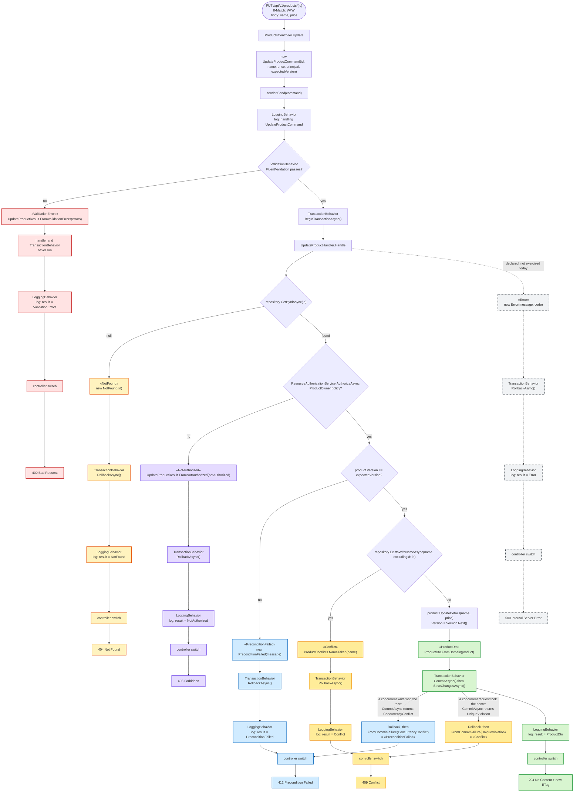

# Worked example: `UpdateProductCommand`, case by case

Part of the [documentation](index.md).

The diagrams above show the pipeline shape in the abstract. This one traces a single, concrete
request — `PUT /api/v1/products/{id}` — all the way through, branching at every point where a
different case of [`UpdateProductResult`](../src/MediatrUnionPoc.Application/Features/Products/Update/UpdateProductResult.cs)
(`union(ProductDto, NotFound<ProductId>, ValidationErrors, Error, NotAuthorized, PreconditionFailed, Conflict)`)
could come back. Each terminal branch is tagged with the case type it produces («ProductDto», «NotFound»,
«ValidationErrors», «Error», «NotAuthorized», «PreconditionFailed», «Conflict») and color-coded so
the same case is easy to follow from where it's created to the HTTP status it becomes. (`PATCH`
follows the same path with the same seven cases, and answers `200` with the product instead of `204`.)

Six of the seven cases are actually reachable from
[`UpdateProductHandler`](../src/MediatrUnionPoc.Application/Features/Products/Update/UpdateProductHandler.cs)
as written today, including the resource-based `ProductOwner` check described in
[Authorization](authorization.md#authorization) above. `«Error»` is included because the union *declares* it as a
possible outcome — reserved for a future unexpected-failure path — even though nothing in the
current handler produces it; the diagram marks that branch as dashed for exactly this reason. A
missing or malformed `If-Match` never reaches this diagram: the controller answers `428` or `400`
before sending the command.

Reading the diagram:

- **Green («ProductDto»)** is the only path where `TransactionBehavior` commits — everything else
  rolls back or never opens a transaction at all.
- **Blue («PreconditionFailed»)** has two sources that end in the same case: the handler's
  up-front version check (most stale writes never reach the database), and the commit-time
  `ConcurrencyConflict` when two requests both passed that check and one lost the race — the union's
  `FromCommitFailure` maps both to the one outcome the caller can act on. See
  [Optimistic concurrency](concurrency.md#optimistic-concurrency-productversion-etag-and-if-match).
- **Orange («Conflict»)** likewise has two sources ending in one case: the handler's up-front name
  check, and the commit-time `UniqueViolation` when two requests both passed that check. See
  [Duplicate product names](concurrency.md#duplicate-product-names).
- **Red («ValidationErrors»)** short-circuits *before* `TransactionBehavior` even runs — no
  transaction is opened for input that never should have reached the handler.
- **Yellow («NotFound»)**, **purple («NotAuthorized»)**, and **dashed grey («Error»)** all reach
  the handler, open a transaction, and get rolled back — the difference between them is only which
  case type the handler chose to return, not any `try`/`catch` structure.
- **Purple («NotAuthorized»)** is the one branch that depends on a second lookup beyond the
  entity's existence — the caller's identity has to match the product's owner, not just the
  product having to exist — which is why it's checked only after `Lookup` already succeeded, the
  same ordering [Authorization](authorization.md#authorization) describes for resource-based checks generally.
- Every branch still passes back through `LoggingBehavior` on the way out, so every outcome —
  success or not — gets logged exactly once, symmetrically.
